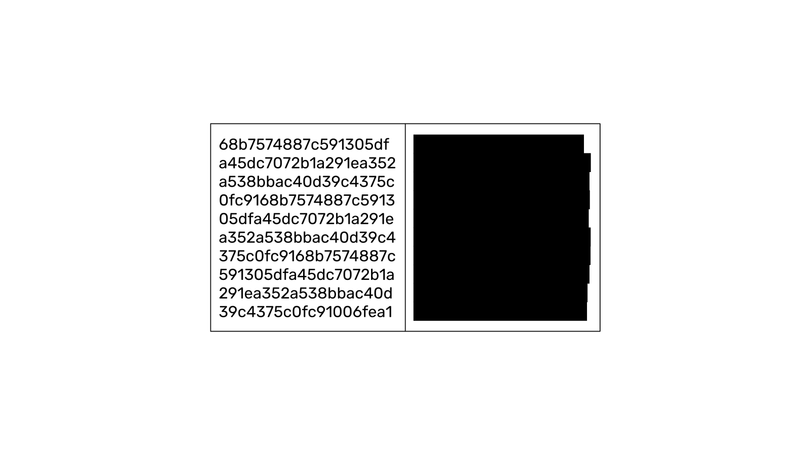
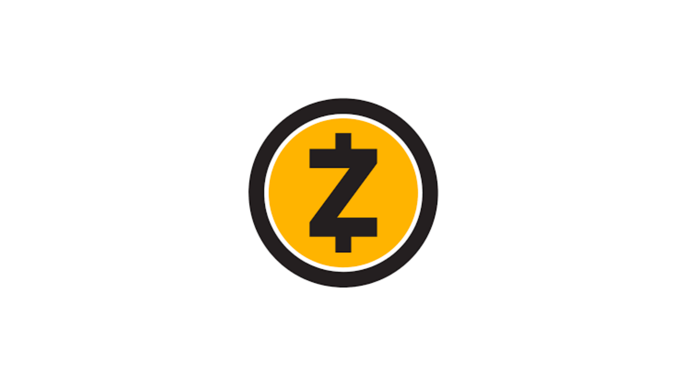
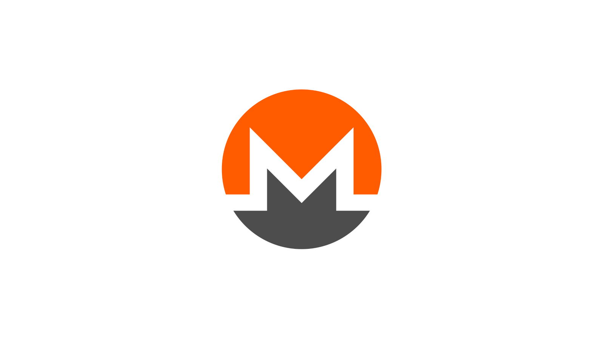

---
**You can listen to or watch this video here:**

<iframe width="560" height="315" src="https://www.youtube.com/embed/sdpE3g55lOk" title="YouTube video player" frameborder="0" allow="accelerometer; autoplay; clipboard-write; encrypted-media; gyroscope; picture-in-picture; web-share" allowfullscreen></iframe>

---

In the previous class of the Ethereum Classic (ETC) course we explained what are stablecoins, algorithmic stablecoins in particular, how they work, and their risks. 

In this class, privacy coins will be explained starting with defining the default privacy level in standard blockchains, the main methods that are used by privacy coins for achieving deeper privacy, and the risks associated with using privacy coins.

In the next two classes we will cover these other topics:

- Class 29: What Are Decentralized Finance (DeFi) Coins?
- Class 30: What Are File Storage Coins?

## Default Privacy in Standard Blockchains

Blockchains such as Ethereum Classic (ETC) and Bitcoin (BTC) are very transparent in the sense that all transactions, smart contracts, balances, and even the code of the software clients are public information, so anyone may audit them and check if everything is working as designed. 

Privacy in these systems is given by the fact that users control their addresses just by holding the addresses' secret private keys so that the corresponding public addresses are not tied to their identities, persons, or entities. For this reason, so long as users are diligent in keeping their movements on the blockchain private and unassociated with their identity, then a certain level of privacy is possible.

Nevertheless, thanks to advancements in data science, the capture of information from a variety of sources, and the triangulation of economic transactions, outside observers are finding it easier and easier to figure out who owns what within these public transparent systems.

## What Are Privacy Coins?

In the above context, and in order to enhance the security of individual users, privacy coins have made the tradeoff of reducing the transparency of their systems in order to increase the secrecy of transactions, addresses, and balances.

Privacy coins use different methods to encrypt or hide sender addresses, amounts, and receiver addresses of transactions on their blockchains.

There are several coins that have been launched to enhance privacy, some of which are frequently used and have a lot of transaction activity. 

The segment as a whole has reached a significant market capitalization. 

## Privacy Methods: Zero Knowledge

If there are two parties handling secret information and one sends the information to the other in a way that stays hidden, the receiver could modify or not the data even without knowing it, and then show it to the sender, asking them if the data was modified. Because the sender does know the information, they can easily answer the question correctly still without revealing the contents to the receiver.

After a large number of tries, if the sender perfectly answers all the questions, then it is astronomically likely that the information is true, even if the receiver does not know what is its content. This is the basis of “zero knowledge proofs”.

Zcash is the cryptocurrency that has implemented this method to create a privacy blockchain. It is the second largest privacy coin in the industry with a market capitalization of $405 million at the time of this writing. 

On Zcash, users may opt to send private or transparent transactions.

## Privacy Methods: Combined Techniques

The largest privacy coin in the industry, with a market capitalization of $2.48 billion, is called Monero and uses three different privacy technologies at the same time:

**Stealth addresses:** This technology hides the receiver of money in the network by creating “stealth addresses” for each receiver and for each transaction. 

**Ring signatures:** This type of signature mixes the signatures of several senders in each transaction so it is impossible to know who is the sender.

**Ring Confidential Transactions:** This component of the transaction uses cryptography to hide the amounts sent in each transfer of coins in the system.

These three technologies combined provide a large degree of privacy to users. On Monero, all transactions are hidden by default and all use the three methods mentioned above.

## Other Privacy Methods

There are several other privacy techniques in the industry, such as mixers and Mimblewimble. 

The industry has over 70 networks offering privacy using the techniques mentioned in this post and combinations thereof.

The combined market capitalization of this segment of the industry is $5.3 billion at the time of this writing.

In the image in this section you may see the top ten privacy coins on CoinMarketCap.

## Risks of Privacy Coins

A general risk for these coins, that is usually pointed out, is that the transparency of the traditional blockchains makes them easy to audit and reveal bugs or flaws that can subsequently be fixed, but if privacy coins hide all or part of the information, then it is impossible to audit their design, function, monetary supply, and other key metrics.

A risk for individual users, is that these blockchains offer privacy at the blockchain layer, but counterparties may still reveal to competitors, authorities, or any other third parties the data of their dealings.

For the reasons above, there is a conventional wisdom being formed in the industry that privacy should be a feature built on higher layers of the technology stack rather than at the base blockchain layer.

---

**Thank you for reading this article!**

To learn more about ETC please go to: https://ethereumclassic.org
