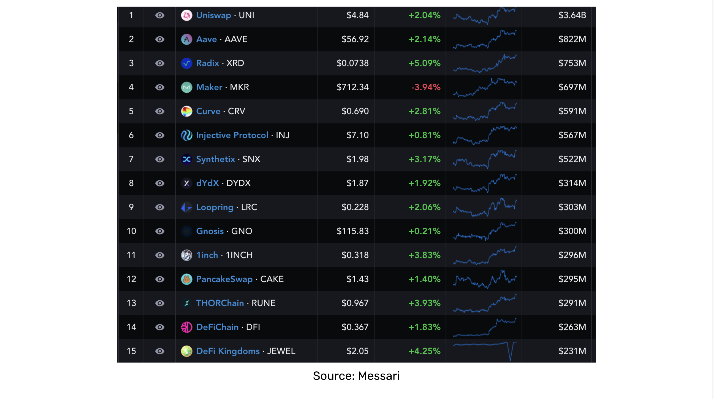

---
**You can listen to or watch this video here:**

<iframe width="560" height="315" src="https://www.youtube.com/embed/x3YzWOhs1uE" title="YouTube video player" frameborder="0" allow="accelerometer; autoplay; clipboard-write; encrypted-media; gyroscope; picture-in-picture; web-share" allowfullscreen></iframe>

---

In the previous class of the Ethereum Classic (ETC) course we explained what are privacy coins, starting with what is the default privacy level in standard blockchains, what are the main methods used by privacy coins for achieving deeper privacy, and what are the risks of privacy coins. 

In this class we will explain what are decentralized finance (DeFi) coins, starting with what is DeFi, what are DeFi coins themselves, the categories of DeFi tokens, examples of DeFi tokens, what is the segment’s market capitalization, and what are the risks of DeFi tokens.

In the next class #30, we will cover what are file storage coins

## What Is DeFi?

Traditional financial services such as banks, brokers, insurance companies, mutual fund companies, credit cards, and payment systems are centralized because they hold our money and are the central counterparties of our financial contracts, such as deposits, loans, insurance, and investment management. These types of services may be called “CeFi” for “centralized finance”.

“DeFi” stands for “decentralized finance” and are represented by software programmes inside programmable blockchains such as Ethereum Classic (ETC). 

These software programmes are created to replace all functions of finance; from banking, to insurance, to trading, to investing; and as they are inside ETC, they are decentralized and trust minimized. 

The idea of DeFi is to achieve a level to decentralization where there is no group, special interest, or trusted third party that may tamper or restrict access to users’ money or financial products.

## What Are DeFi Coins?

As developers have been building many kinds of protocols that mimic financial services but in an autonomous way inside blockchains such as ETC, they found ways to finance their work, decide how to coordinate and upgrade their systems, and make other kinds of technical decisions with regards to the underlying financial products.

The main method that is used to conduct all these kinds of processes is to issue tokens that are linked to the various DeFi decentralized applications (dapps). These tokens are bought by the public to finance the developer teams, and holders may receive several benefits. 

Many times the tokens earn an interest or dividend, or “passive income” as it has been referred to, as the underlying applications charge fees to users. Another benefit is that token holders may vote on protocol upgrades proposed by the developer teams. In other cases, in protocols that need financial parameter decisions, such as algorithmic stablecoins, users may vote on margin levels and other product safety policies. 

## DeFi Token Categories

There are two main categories of DeFi tokens:

**Dapp DAO tokens:** These are ERC-20 tokens issued by a decentralized autonomous organization (DAO), so that they may have more functions other than just transferable and fungible units of value. When a dapp is linked to a DAO, holders of the tokens may earn interest, vote through the DAO to govern the protocol, or make decisions on parameters of the underlying DeFi services.

**Dapp tokens:** These are ERC-20 tokens issued without any connection to a DAO, so they are just plain ERC-20 tokens that serve as units of value that are transferable. However, these may receive interest or dividends, or may have special features such as new issuance or burn schedules.

DeFi dapps such as decentralized exchanges (DEXs), complex algorithmic stablecoins, and even staking pools have used either dapp DAO tokens or plain dapp tokens to finance their development, decide upgrades, or set product parameters. 

## DeFi Token Examples

We present below four DeFi token examples that have used dapp DAOs or plain dapp tokens:

**Uniswap:** Uniswap (UNI) is the largest DeFi dapp DAO token in the market valued at $2.8 billion at the time of this writing. It is used to make decisions as to upgrades of the DEX platform, to provide liquidity to liquidity pools, and it receives dividends from fees that are charged to users.

**Maker DAO:** Maker DAO (MKR) has a market capitalization of $697 million at the time of this writing and is the token that is used to govern and manage the risk of the algorithmic stablecoin Dai. The Maker DAO token is used to vote on protocol upgrades, it receives dividends from fees charged to Dai users, and is used to decide safety parameters of the crypto assets that back Dai, such as margin levels and what crypto assets are acceptable as collateral.

**Lido DAO:** Lido DAO (LDO) has a market capitalization of $1.69 billion at the time of this writing. It serves as the governance token for the Lido staking pool that operates on Ethereum and other proof of stake blockchains. LDO holders vote on pool upgrades, board adjustments, and receive dividends from the protocol. It also has economic value as users may stake it on the Lido platform to receive rewards and use it to pay for fees.

**Hebe:** HEBE is a plain token that was issued by HebeBlock, the team that built and deployed the HebeSwap DEX on ETC and other dapps. As it is a plain token, it is used to finance the HebeBlock team, to provide liquidity in the DEX, and it receives an interest from fees charged to users. However, it does not have voting capabilities yet, but the HebeBlock team have plans to migrate HEBE to a full DAO token so users may vote on upgrades and other important issues on their platform. 

## DeFi Coins Market Capitalization

In the image in this section we show the top fifteen DeFi tokens by market capitalization from the [Messari](https://messari.io/screener/defi-assets-7EE8EDB1) research service.

The platform tracks 165 DeFi tokens.

The total market capitalization of this list is around $15 billion at the time of this writing.

## Risks of DeFi Tokens

There are three main risks of DeFi tokens are as follows:

**Fraud:** One of the issues that has plagued the DeFi industry, as many hackers and dishonest developers have done, is that they promise the launch of a DeFi protocol, especially in alternative chains such as Binance Smart Chain, Cardano, or Avalanche, they receive the funding from the public, but then they shut down and disappear stealing the money, creating what is commonly called a “rug pull”. 

**Centralization:** As these dapps are deployed on trust minimized blockchains such as ETC, they give the impression of security and decentralization, but when they are “governed” by a set of investors that vote through the DeFi tokens, then these systems may be prone to centralization overtime. Another risk vector is that the protocols themselves may have centralization features such as ID filters and KYC rules embedded in them, even if they are inside blockchains.

**Classification as securities:** As regulators around the world grapple with fraud, market volatility, and consumer losses, especially during bear markets, they are increasing their pressure to regulate and control DeFi protocols and their tokens. One of the risks of this is that they may be classified as securities, which would significantly reduce their scope as to where they trade, what entities may broker them, how they have to be registered and distributed, who may buy them, and in which jurisdictions. All these measures may cause the tokens to plummet in value as their markets get restricted by bureaucracy.

---

**Thank you for reading this article!**

To learn more about ETC please go to: https://ethereumclassic.org
