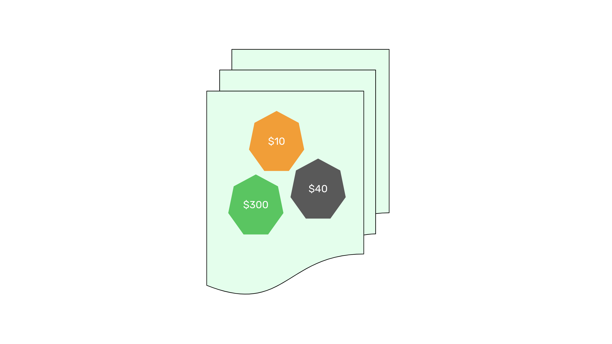
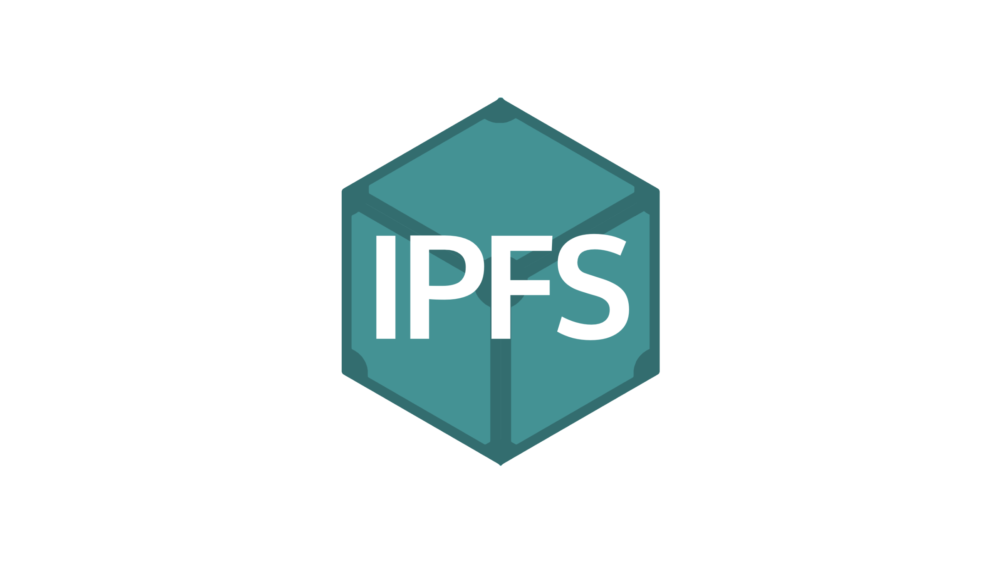
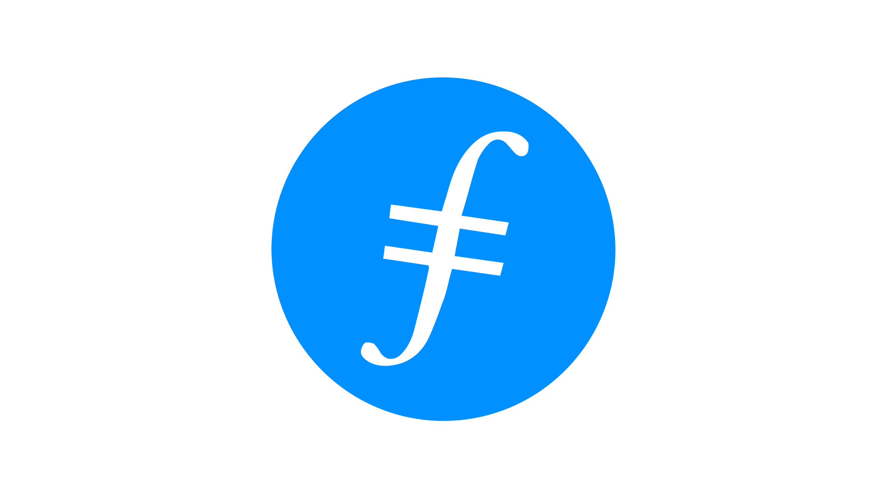
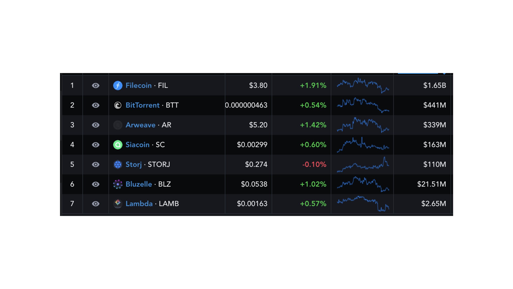

---
**You can listen to or watch this video here:**

<iframe width="560" height="315" src="https://www.youtube.com/embed/Xk3Uw1AM1M0" title="YouTube video player" frameborder="0" allow="accelerometer; autoplay; clipboard-write; encrypted-media; gyroscope; picture-in-picture; web-share" allowfullscreen></iframe>

---

In the previous class of the Ethereum Classic (ETC) course we explained what are decentralized finance (DeFi) coins, starting with what is DeFi, what are DeFi coins themselves, the categories of DeFi tokens, examples of DeFi tokens, what is the segment’s market capitalization, and what are the risks of DeFi tokens.

In this class we will explain what are file storage coins, starting with what are file storage networks, then what is the IPFS network and protocol, what are file storage coins themselves, examples of file storage coins, what is the sector’s market capitalization, what are the uses of file storage coins for the web3, and what are the risks of file storage coins.

This is the last class of this segment of the course that explains the different categories of coins in the blockchain industry.

## What Are File Storage Networks?

As we have learned in this course, the blockchain industry has several types of networks which focus on different solutions and niches. For example, we have learned about simple networks with native cryptocurrencies, accounts, and balances; programmable cryptocurrencies, which host smart contracts; and others such as ERC-20 tokens, stablecoins, privacy coins, and DeFi coins.

File storage networks are another big segment in the market. These systems are usually a combination of a network of peers that provide disk space to store files for users, and a blockchain with a ledger that serves as a payments system for the different functions in their corresponding networks.

In essence, these technologies seek to disintermediate the big centralized global cloud services such as AWS, Google Cloud, Microsoft Azure, IBM Cloud, etc.

## What Is IPFS?

IPFS is a peer-to-peer content addressed network and protocol where content units, which are stored in many nodes, have unique addresses, instead of addresses belonging to whole websites as in the traditional internet. For example, instead of “HTTP” addresses for entire websites, content unit addresses have “IPFS” addresses plus a hash, so each image, video, and file has its own address on the internet. 

The way this decentralized protocol hosts files is by breaking them down into chunks, and each chunk may be stored in different machines in the network. Yes, each chunk has its own address!

Routing to find content chunks and then putting them together as the original file is done through a distributed hash table (DHT) that participating nodes in the system update frequently.

The protocol is like an opt-in system, so not all of participating nodes have the obligation to upload, download, and share content. If users run the IPFS software in their computers, they may upload content, and when they retrieve content they may or may not opt to be file storage services for those content units. However, many do.

## What Are File Storage Coins?

As mentioned before, file storage blockchains are usually a combination of a network of peers that provides storage space through a file sharing protocol as IPFS, and a blockchain with a ledger that serves as a payments system to compensate these providers.

Therefore, the file storage cryptocurrency itself is hosted on the blockchain side of the system. In some file storage networks the coin is used to pay each time a file is stored in the network. In others it is used to pay each time a file is downloaded.

The economic value of file storage coins is that they are demanded by users to pay for decentralized file storage services. The idea is that with a cryptocurrency and payment mechanism, storage providers will be more incentivized to hold files and service the network efficiently. 

The typical players in these systems are users, who store and retrieve files, storage providers, who provide their disk space to the network, and retrieval providers, who search and make popular files available more widely.

## Examples of File Storage Coins: Filecoin

Filecoin is a blockchain that uses the IPFS protocol for file storage and has a ledger with the “FIL” coin that is used to pay for providers. It has three main types of users: Content users and uploaders, storage providers, and retrieval providers.

Storage providers are IPFS protocol nodes, but they actually get paid in FIL by users to store their files. IPFS and Filecoin are two different networks that use the IPFS protocol (IPFS just happens to have the same name because it was started by the same founder who started Filecoin).

Storage providers must inform with a certain frequency to the peer-to-peer network of the integrity of the data they store as a proof of storage. Content users are the ones who use the network to store their data. Retrieval providers are like brokers that get paid to be in touch with users and retrieve from storage providers the most popular content units to deliver them faster to users.

In essence Filecoin is like a marketplace where data storage around the world is put for sale and the protocol acts as the pricing and payment system where users compensate storage and retrieval providers for their content to be stored and delivered efficiently. 

Storage providers gain reputation the more they prove they can do their job correctly.

The current market capitalization of FIL at the time of this writing is $1.70 billion.

## Examples of File Storage Coins: Bittorrent

BitTorrent is a pioneering file sharing protocol and network that started in the early 2000s. It was acquired by the TRON Foundation in 2018 to integrate the “BTT” token to its ecosystem with the goal of creating a decentralized file sharing system for web3 and streaming services.

It is similar to Filecoin in that it is a content addressed network, and content units are broken up in chunks and stored in many peers in the system. BTT is the token that is used in this case. 

Users pay storage providers so that their files may be downloaded faster. 

A “torrent” is a group of chunks of data that, together, compose a single content unit, these are the ones that are distributed and stored in the network. 

“Seeding” is the act of holding data and sharing it for the rest of the network. Basically, when users download data, such as movies or other files, they automatically turn into seeds of those files.

A “swarm” is a group of machines that hold chunks of a single content unit, and when they are uploading the chunks, they act like a swarm that collectively provides the data. 

BTT is actually a TRC-20 token that is booked in the TRON blockchain, so Bittorrent does not actually have an independent distributed ledger with accounts and balances, but uses TRON.

The current market capitalization of BTT at the time of this writing is $444 million.

## Market Capitalization of the File Storage Segment

At the time of this writing the market capitalization of the file storage segment in the blockchain industry is $2.14 billion, according to Messari.

Link: 

https://messari.io/screener/file-storage-A75CCE80

Filecoin and BitTorrent are the largest and most well known coins in the sector.

## Uses for Web3

As we will see in the next 8 classes of the Ethereum Classic course, the blockchain industry will be divided in layers and many components will exist in each layer. These layers will be organized by security vs scalability degrees where the most secure but less scalable proof of work coins will constitute the base layer, and the rest of the more scalable but less secure systems, including proof of stake, will exist on top of the security layer.

In the future, users will not interact with single blockchains as today when using dapps or executing transactions. Transactions will cross multiple chains, so user facing wallets and dapps will use the best services from each one.

In this context, dapps will need decentralized websites to serve their users because any central point of failure in the value chain would defeat the whole purpose of trust minimization.

## As today’s websites host their backend code, images, videos, text files, and data in centralized servers, in the future these same components will be hosted in decentralized networks, thus enabling decentralized websites, or what is called the “web3”.

Some of these networks will be smart contract blockchains for the backend code; others will be file storage coins for the images, videos, and text files; and others will be specialized database storage chains.

The combination of all these components, plus the many more types of blockchains that exist, will create for the end user the full experience of the web as we know it today, but much more secure. 

Web3 is a term that comes after the static web1 of the 90s, and the social media centered web2 of the 2000s.

## Risks of File Storage Coins

However, even though file storage networks and coins use decentralized ledgers and peer-to-peer protocols to manage large amounts of data, this does not mean that they are completely decentralized.

The file storage protocols side of these networks are just peer-to-peer file systems where the files are not actually stored in all the nodes, but just those who want to store them as they expect to get paid for serving them. 

On the other hand, the decentralized ledgers that hold the accounts and balances of the file storage coins and conduct the payments for file storage providers are all proof of stake or proof of authority systems. These are much less secure that proof of work networks.

Although file storage systems are a huge leap forward in trust minimization, they still need to improve to serve the future web3 in a truly decentralized way.

---

**Thank you for reading this article!**

To learn more about ETC please go to: https://ethereumclassic.org
