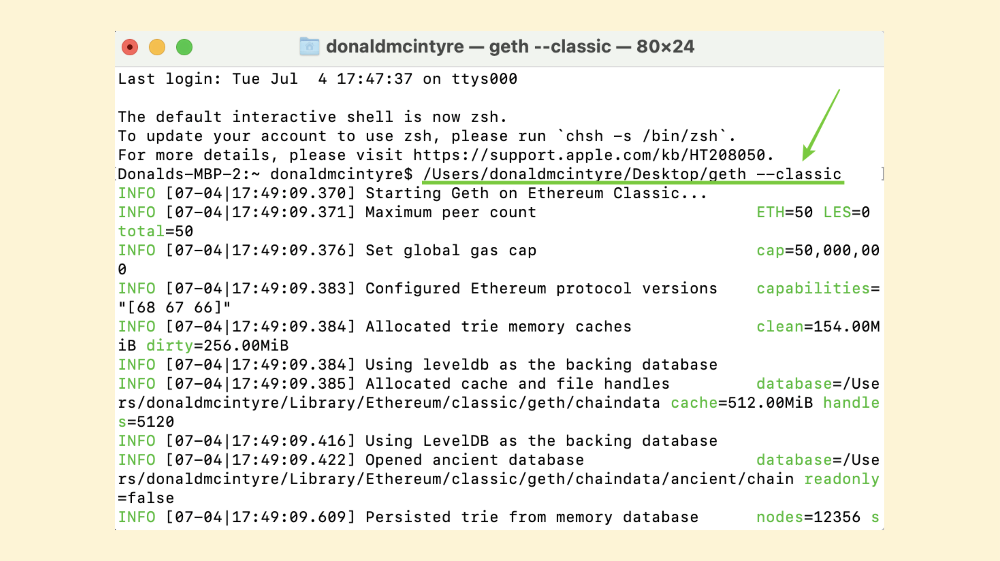

---
**You can listen to or watch this video here:**

<iframe width="560" height="315" src="https://www.youtube.com/embed/JMuTgV-cWJM" title="YouTube video player" frameborder="0" allow="accelerometer; autoplay; clipboard-write; encrypted-media; gyroscope; picture-in-picture; web-share" allowfullscreen></iframe>

---

This is the sixth part of a series that will explain how to contribute to Ethereum Classic (ETC) in a variety of ways. 

The videos and posts in the series will contain the title “How to Contribute to ETC:” with the following topic extensions: 

1. The Improvement Proposal Process (ECIP)
2. The Community Website
3. Community Tweets
4. Community Volunteering
5. Mining
6. Operating a Node
7. Donating Money
8. Building a Dapp

## How Does ETC Work? (Mining and Verifying Nodes)

ETC, as a permissionless proof of work blockchain, is a network of computers around the world. As such, it receives transactions from users constantly. When nodes in the system receive transactions, they re-send them to the rest of the network. In a matter of milliseconds, these transactions get fully replicated in all participating nodes.

A subgroup of the machines in the network are what are called “miners”. Miners receive these transactions, accumulate them in batches and seal them with a cryptographic stamp, or hash, that requires a lot of computational work to create.

Therefore, miners are block producers, which is one of the two types of nodes in the network. When miners produce blocks, they send them to the rest of the network for verification.

The rest of the network are node operators who verify that all the transactions inside a block are correct and that the miners did the work required by the protocol. 

Therefore, node operators are verifiers which is the other type of node in the network. 

## Full Replication and Global Redundancy in ETC

Full replication of transactions and blocks, as described in the previous section, is important because it is one of the two fundamental security mechanisms of a blockchain as Ethereum Classic.

Full replication guarantees absolute redundancy, meaning that all nodes in the system have an identical and complete copy of the blockchain database, which contains the accounts, cryptocurrency balances, and smart contracts of the network.

Redundancy guarantees what the internet itself guarantees, which is that no matter what happens in the world, even a nuclear war, ETC will still be working as long as there are some live operating nodes with a full copy of the ledger with the transactions, smart contracts, and activity of the chain.

That this replication is global is important because the more ETC nodes are distributed across nations, ethnicities, and cultures the more resistant the social layer of the system is to arbitrary change. Therefore, the property and agreements in the blockchain enjoy stronger integrity.

## The Importance of Operating a Node in ETC

The first reason that operating a node contributes to ETC is that the more nodes, the stronger ETC becomes. This is because of the reasons explained above: More nodes means more verification of miners’ work; more nodes means more redundancy of the database; and more nodes may also mean more diversity in terms of regions and cultures.

However, running a node is not only a systemwide benefit, but it has the most benefits at the individual level as well. Self verification of transactions and blocks means reducing dependency on others to know one’s accounts and balances, and interacting with the network and its decentralized applications, or dapps.

The most centralized setup for owning or participating in ETC is using an exchange to buy the coins and hold them there. In this setup, not only are the coins in the possession of a third party, but access to the network is also mediated by it.

Using a non-custodial wallet is good, but if the wallet connects to a cloud node service to query one’s accounts and balances, to send transactions, and to interact with dapps, then it is not secure either because there is always the risk that those nodes may become corrupted or abuse their trusted position.

Using a non-custodial wallet and operating a node to interact with ETC is the best setup for sealing the security completely by maximally reducing one’s dependency on trusted third parties.

An Ethereum Classic ecosystem team called ETCMC who provides a plug-and-play hardware node product recently stated the following on social media:

*“Why running your own #EthereumClassic node is one of the best ways to contribute to #ETC*

*1. Decentralization:*

*Running your own node contributes to the decentralization of the ETC network. By participating in the network as a node operator, you help distribute the responsibility of maintaining and validating the blockchain. This enhances the network's resilience and reduces the reliance on centralized infrastructure.*

*2. Data Integrity:* 

*When you run your own node, you independently verify the transactions and smart contracts on the ETC blockchain. You have direct access to the entire blockchain history and can validate transactions without relying on external sources. This ensures the integrity and trustworthiness of the data you interact with.*

*3. Privacy and Security:*

*By running your own node, you have better control over your data and transactions. You don't have to rely on third-party nodes or trust their infrastructure. Running a node enables you to keep your transactions private and secure by not exposing sensitive data to external services.*

*4. Development and Testing:*

*If you are a developer or building applications on top of the ETC blockchain, running your own node gives you a local environment for development and testing. You can experiment with smart contracts, interact with the blockchain, and debug your applications without relying on external nodes or services.*

*5. Network Participation:*

*Running your own ETC node allows you to actively participate in the Ethereum Classic network. By running a node, you contribute to the network's overall security, reliability, and decentralization. You become part of the network infrastructure, helping to validate transactions, propagate blocks, and maintain the integrity of the blockchain. Running your own node also allows you to have direct access to the Ethereum Classic network, enabling you to interact with smart contracts, explore the blockchain's history, and build applications that leverage the ETC ecosystem.*

Souce: https://twitter.com/ETCMC777/status/1674582793769156612

## Operating a Node: Core-Geth

One way of operating a node is by download the Ethereum Classic software client, which is called Core-Geth.

To Download Core-Geth, please go to:

https://github.com/etclabscore/core-geth/releases

Once you download it, you must go to the command line of your machine (below I am showing the example on my Mac) and type the following command to start Core-Geth pointing to Ethereum Classic:

'''
/Users/donaldmcintyre/Desktop/geth --classic
'''

Because Core-Geth is a downstream client to Geth, which is the Ethereum client, then it starts pointing to Ethereum by default. This is why ETC node operators must add the '''--classic''' string to run their nodes.

## Operating a Node: DappNode

If operating a node from your regular computer is too much strain on it or if you prefer not to use the command line, then it may be a good idea to buy a separate hardware node to do the task.

One option is to buy the DappNode device, which ETC core developers update regularly with the Core-Geth client so DappNode users may run ETC nodes as well.

We wrote two posts describing DappNode and how to use it:

“How to Run an Ethereum Classic Node Using DappNode”

https://ethereumclassic.org/blog/2023-04-26-how-run-an-ethereum-classic-node-using-dappnode

“DappNode Unboxing: Running ETC Nodes From Home or Office”

https://ethereumclassic.org/blog/2023-06-06-dappnode-unboxing-running-etc-nodes-from-home-or-office

## Operating a Node: ETCMC

As mentioned before, there is an ETC ecosystem team called ETCMC that has produced another hardware node that is dedicated to the network. It is a plug-and-play device, and we will write a guide covering it very soon.

To learn more about this product, please go here:

https://www.etcmc.org/etcmc-etc-node 

*Disclaimer: We have no interest nor commercial relationship with any of the brands and products mentioned in this post. We just describe them and post links to their informational material for your convenience.*

---

**Thank you for reading this article!**

To learn more about ETC please go to: https://ethereumclassic.org
