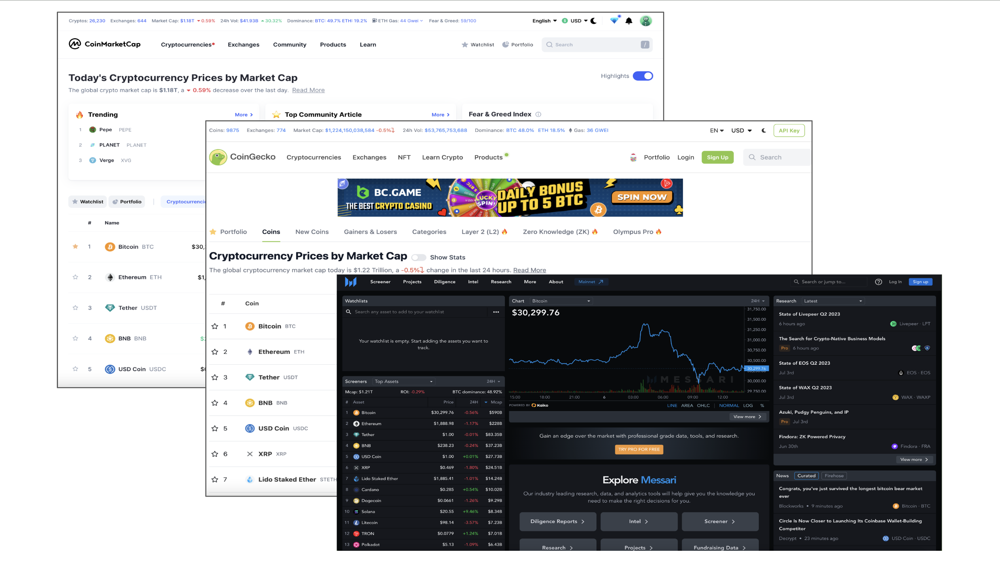
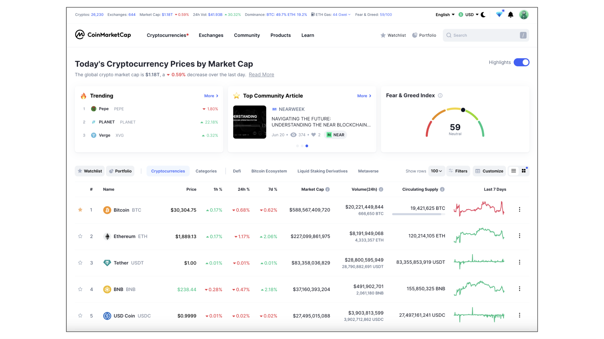
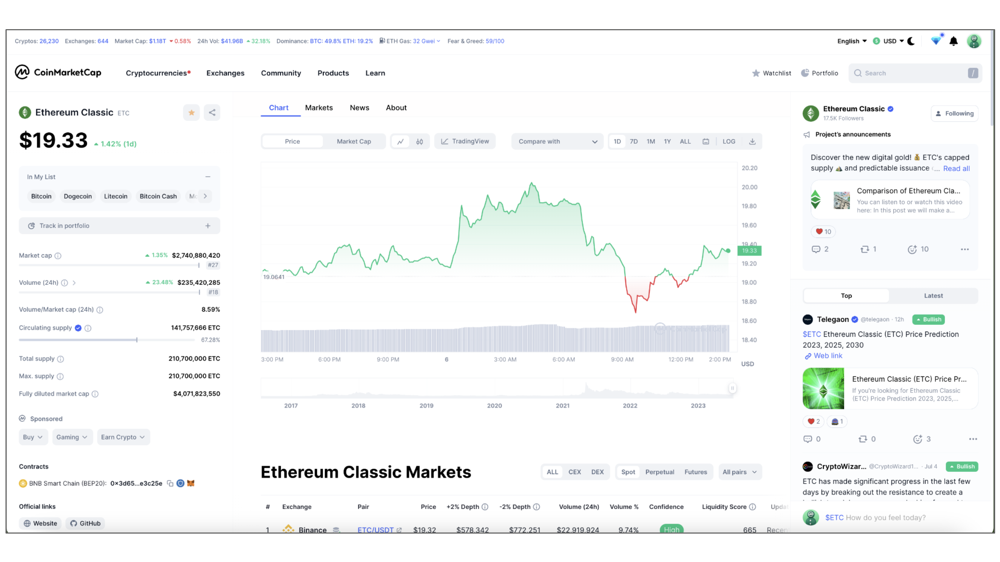
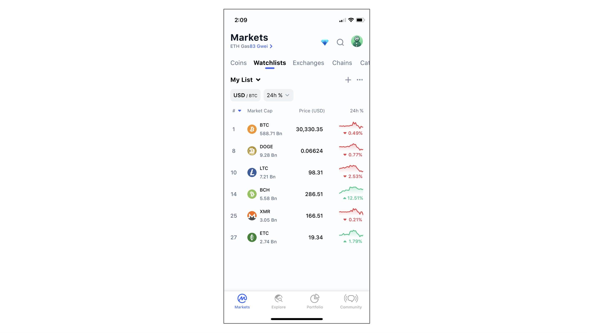
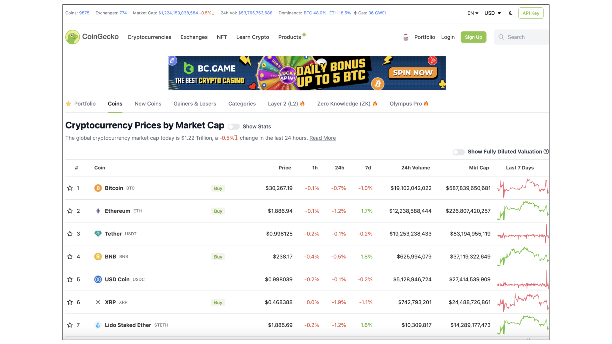
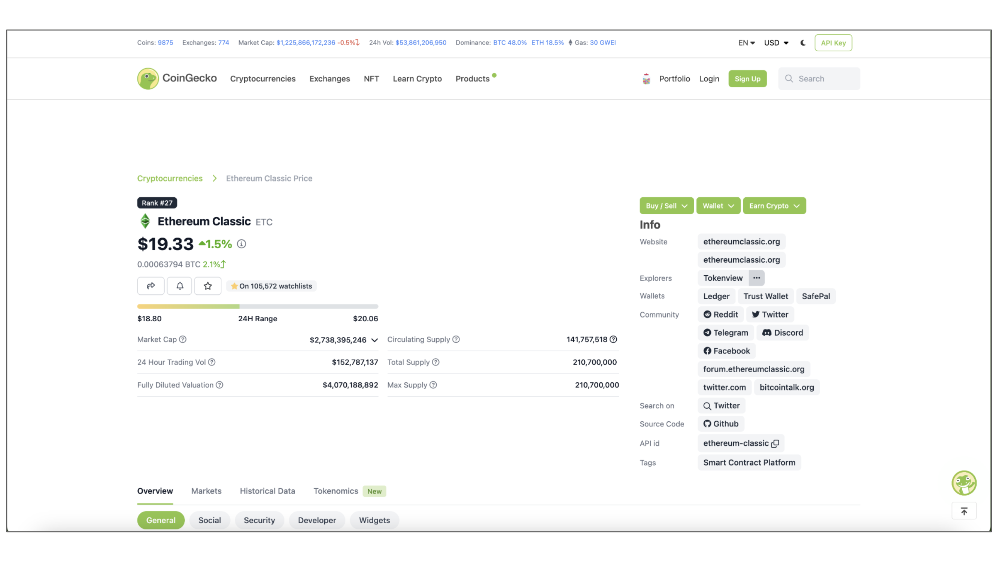
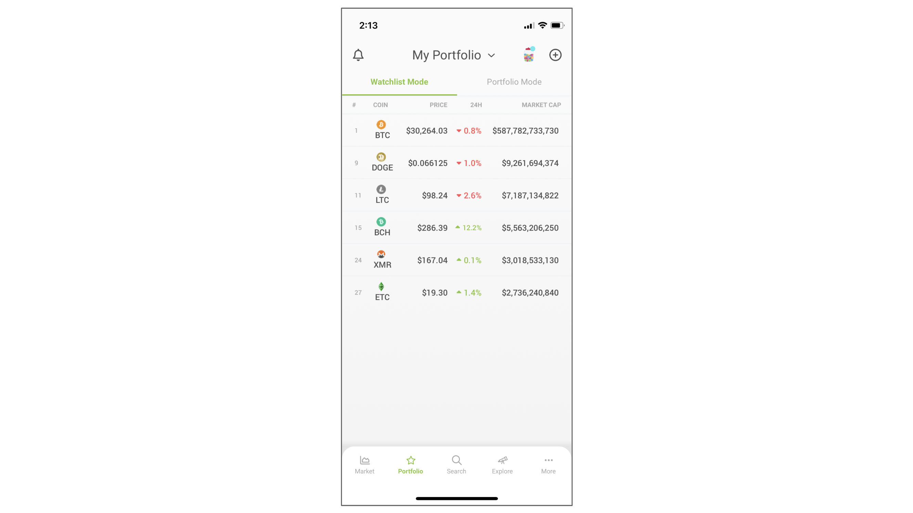
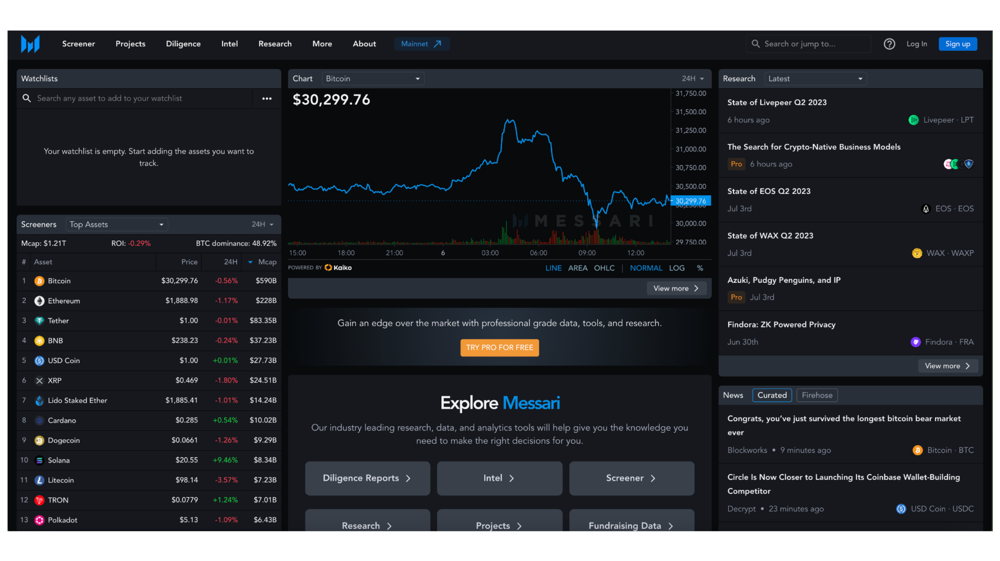
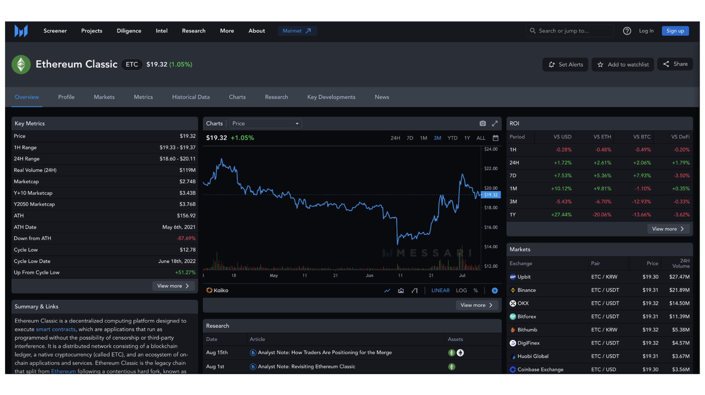

---
**You can listen to or watch this video here:**

<iframe width="560" height="315" src="https://www.youtube.com/embed/tJDw5yaMNNo" title="YouTube video player" frameborder="0" allow="accelerometer; autoplay; clipboard-write; encrypted-media; gyroscope; picture-in-picture; web-share" allowfullscreen></iframe>

---

In this course we have learned about the history of the Cypherpunks, the group that started the research and movement that would lead to Bitcoin, the different components and terminology of the blockchain industry, we have related everything to Ethereum Classic (ETC) and how it works. In the next three classes we are going to show the basic steps for procuring market information and getting into using crypto in general and ETC in particular.

In this class 31, we will teach where to find cryptocurrency lists and prices by describing the quotation services CoinMarketCap, CoinGecko, and Messari. 

In the next two classes will talk about:

32. What Are Block Explorers?
33. What Are Centralized and Decentralized Exchanges?

## CoinMarketCap

With more than 80 million visits per month at the time of this writing, CoinMarketCap is the most used cryptocurrency list in the industry. In it, users may find the ranking of all cryptocurrencies and tokens, which is a crude, unfiltered list of any kind of token listed by market capitalization.

The link to CoinMarketCap is: [coinmarketcap.com](https://coinmarketcap.com)

Among the data that the site provides are the market capitalization per coin or token, the total capitalization of the whole industry, the Bitcoin dominance as a share of the rest of the market, and trade volume per coin and token, amongst many other statistics.

CoinMarketCap also has filters and categories, so users may view lists by groupings such as “Bitcoin Ecosystem”, “Privacy” coins, “Smart Contract” coins, etc.

When you click on any of the coins or tokens, a page with the data of the specific crypto asset is displayed.

### The Ethereum Classic Profile on CoinMarketCap

For example, if we click on “Ethereum Classic” we go to the profile page of ETC. In it, we may find useful information and statistics such as a price chart that may be displayed for intraday, weekly, monthly, yearly price information, or all of its history. It also has sections for key statistics such as supply, volume, market capitalization, and price performance.

On the news and information side it has a list of all the exchanges where ETC trades, a section that shows the latest news from the ethereumclassic.org website, and a sidebar with news items from the rest of the blogosphere.

At the bottom of the central column it features an “About Ethereum Classic” section with a FAQ that responds to questions such as “what makes Ethereum Classic unique?”, “how is Ethereum Classic different from Ethereum?”, “how is Ethereum Classic mined?”, and “where can you buy Ethereum Classic?”.

### CoinMarketCap Mobile App

CoinMarketCap also has a mobile app with practically all the functions of the website.

A cool feature of both the website and the mobile app is that users may register and create their own watchlists to filter the clutter that the large lists of coins create. 

It is always good not to see in the same list and ranking a stablecoin and a proof of work smart contracts chain as ETC, for example, they are not even comparable!

In my iOS CoinMarketCap app, as may be seen in the image in this section, I listed the top proof of work blockchains in the world. 

The list includes the coin symbols, their latest price, market capitalization, a small intraday chart, and their rank in the CoinMarketCap global list.

## CoinGecko

With more than 30 million visits per month at the time of this writing, CoinGecko is the second largest cryptocurrency list in the industry. In it, users may also find the ranking of all cryptocurrencies and tokens, very similar to that of CoinMarketCap.

The link to CoinGecko is: [coingecko.com](https://coingecko.com)

Among the data that the site provides are the market capitalization per coin or token, the total capitalization of the whole industry, the Bitcoin and Ethereum dominances as a share of the rest of the market, and trade volume per crypto asset, amongst many other statistics.

CoinGecko has filters and categories as well, so users may view lists by groupings such as “New Coins”, “Gainers & Losers”, “Layer 1”, “Stablecoins”, etc.

When you click on any of the coins or tokens, a profile page with the data of the specific crypto asset is displayed.

### The Ethereum Classic Profile on CoinGecko

When we click on “Ethereum Classic” we go to the page of ETC. In it, we may find useful information and statistics such as the price chart that may be displayed for the last 24 hours, 7 days, 30 days, 90 days, 180 days, 1 year, or all history. 

It also has a useful section on the right sidebar with links to key ETC destinations such as the community website, the social media profiles, the community Discord, and the ETC GitHub repository. 

At the bottom of the ETC page, CoinGecko features a section with the latest news from around the web and the list of exchanges where ETC may be traded.

### CoinGecko Mobile App

CoinGecko also has a mobile app with practically all the functions of the website.

It has the feature that users may register and create their own portfolios, as well. 

In my iOS CoinGecko app, as may be seen in the image in this section, I also listed the top proof of work blockchains in the world as I did with my CoinMarketCap app. 

The tokens in the list include the symbols, their latest price, the 24 hour change, the market capitalization, and their rank in the CoinGecko global list.

## Messari has around 700 thousand visits per month, but it is a much more advanced research product than CoinMarketCap or CoinGecko.

The link to Messari is: [messari.io](https://messari.io)

Messari has a layer of its service that is free, and, for more advanced information and reports, users must pay a fee.

The home page is already different that the common crypto lists because it has the coin list on the left column, but it also displays sections for research, curated news, and access to their premium products.

To get more indepth and consistent information about crypto assets, Messari is a much better resource. It also has much better filters in what they call screeners.

Their premium products include diligence reports, intel, screeners, research, projects, and fundraising data. 

### The Ethereum Classic Profile on Messari

When you click on the “Ethereum Classic” crypto asset on the Messari list, you go to the profile page of ETC.

Messari has one of the most researched and accurate descriptions of ETC in the market. 

The profile features useful sections such as key metrics, charts, ROI analysis, the exchanges where ETC trades, research reports, and a curated news box.

One of the cool characteristics of Messari is that they have what they call the “real volume” metric, which is calculated by adding the trading volume of ETC in what they view as trusted exchanges that don’t artificially inflate their volumes just to trick traders into opening accounts with them.

Messari does not have a mobile app, so it is used only through the web.

---

**Thank you for reading this article!**

To learn more about ETC please go to: https://ethereumclassic.org
