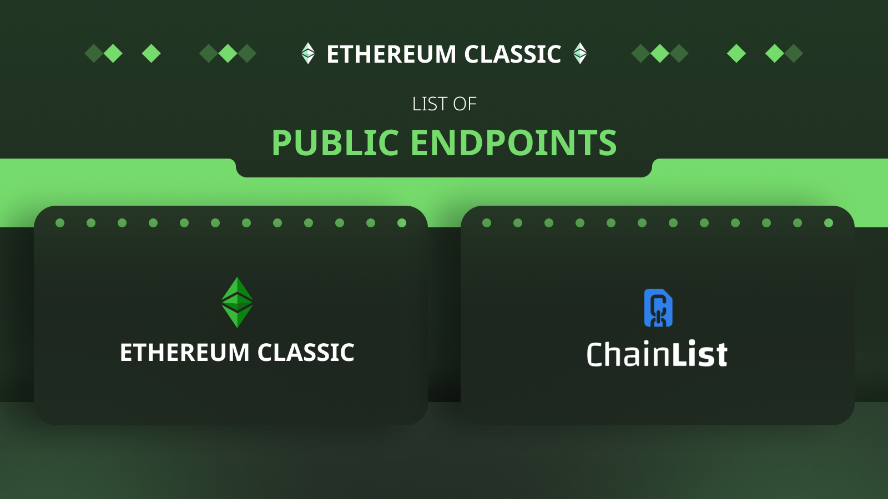

---
**You can listen to or watch this video here:**

<iframe width="560" height="315" src="https://www.youtube.com/embed/X0VzUhJCmvQ" title="YouTube video player" frameborder="0" allow="accelerometer; autoplay; clipboard-write; encrypted-media; gyroscope; picture-in-picture; web-share" allowfullscreen></iframe>

---

IMPORTANT NOTICE: ON JULY 24 2023 THE ETC COOPERATIVE CHANGED THE RPC URL FOR THE ETHEREUM CLASSIC MAINNET FROM ETHERCLUSTER TO RIVET. ADDITIONALLY, THEY HAVE ALSO MOVED THE ETHERCLUSTER MORDOR TESTNET ENDPOINT TO A NEW ONE. PLEASE MIGRATE YOUR ENDPOINTS TO THE FOLLOWING URLs:

ETC mainnet: https://etc.rivet.link

Mordor testnet: https://rpc.mordor.etccooperative.org

Following is the link to the ETC Cooperative’s announcement: https://etccooperative.org/posts/2023-06-24-important-announcement-migrate-the-etc-and-mordor-rpc-endpoints-by-july-24-2023-en 

In this post we will explain what are public RPC endpoints for use by wallets, mining pools, solo miners, dapps, developer teams, or other kinds of endpoint users, what are the endpoints for the Ethereum Classic (ETC) mainnet and the Mordor testnet, and where to find the lists of endpoints from different providers.

## What Are RPC Public Endpoints?

Every time wallets, mining pools, solo miners, dapps, developer teams, or other kinds of endpoint users need to send transactions or smart contracts to ETC they need to send them to network nodes that receive the data and then re-transmit them to the rest of the network. Nodes are also used to query the blockchain to check accounts and balances.

Some people or organizations run their own nodes so they use those, which is the most secure setup. 

However, others prefer to focus on their own business and have third parties provide the service of node operation. 

For this, there are public node services, which work more or less like cloud services, that run ETC nodes and provide Remote Procedure Call (RPC) endpoints, which are URL addresses that accept transactions or queries from the public.

Endpoint users use these services to send their transactions and smart contacts or query blockchains instead of running their own ETC nodes. This is a less secure setup.

## Endpoints for Ethereum Classic Mainnet and Mordor Testnet

As said above, when wallets, mining pools, solo miners, dapps, developer teams, or other kinds of endpoint users need to send transactions, smart contracts, or query the Ethereum Classic blockchain or the Mordor testnet, which is a parallel network to run tests, they either use their own nodes of those networks or they may use public endpoints provided by third parties.

The most popular public endpoints for ETC or Mordor are:

ETC mainnet: https://etc.rivet.link

Mordor testnet: https://rpc.mordor.etccooperative.org

However, there are more options and these are published in various lists on the internet.

## List on the Ethereum Classic Community Website

To see more options of all the RPC endpoints that you may use to connect to the ETC blockchain or the Mordor testnet, you may go to the Ethereum Classic community website at the following link:

https://ethereumclassic.org/network/endpoints

The list contains the list of all or at least all known public RPC endpoints for both networks, their providers, and their URLs.

This list is updated frequently and widely used in the Ethereum Classic ecosystem.

## List on Chainlist

Chainlist is a service that aggregates RPC endpoints for many blockchains. To see their RPC endpoints list to connect to ETC, you may go to the following link:

https://chainlist.org/chain/61

The list contains the list of the ETC mainnet public RPC endpoint URLs that teams and interested parties have added.

This list is also updated frequently and widely used.

Chainlist has a separate page for the Mordor testnet and its link is the following:

https://chainlist.org/chain/63

---

**Thank you for reading this article!**

To learn more about ETC please go to: https://ethereumclassic.org
