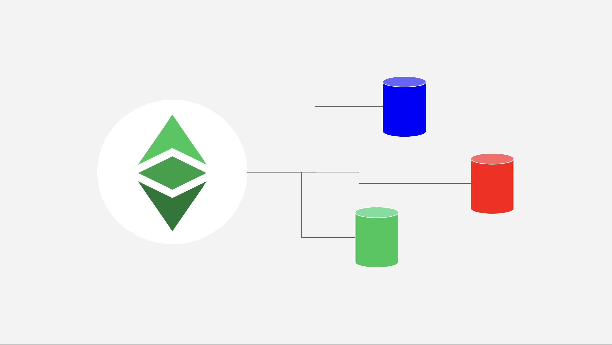

---
**您可以由此收听或观看本期内容:**

<iframe width="560" height="315" src="https://www.youtube.com/embed/X0VzUhJCmvQ" title="YouTube video player" frameborder="0" allow="accelerometer; autoplay; clipboard-write; encrypted-media; gyroscope; picture-in-picture; web-share" allowfullscreen></iframe>

---

**重要通知：于2023年7月24日，ETC合作社将以太经典主网的RPC URL从“ETHERCLUSTER”更改为“RIVET”。另外，他们还将以太经典Mordor测试网络的端点迁移到新的地址。请将您的端点迁移到以下URL：**

ETC主网：https://etc.rivet.link

Mordor测试网络：https://rpc.mordor.etccooperative.org

以下是ETC合作社公告的链接：https://etccooperative.org/posts/2023-06-24-important-announcement-migrate-the-etc-and-mordor-rpc-endpoints-by-july-24-2023-en

在本文中，我们将解释公共RPC端点是什么，供钱包、挖矿池、独立矿工、去中心化应用（DApps）、开发团队或其他端点用户使用，以及以太经典（ETC）主网和Mordor测试网络的端点位置，并指出可以从不同提供者处找到端点列表。

## 什么是RPC公共端点？

每当钱包、挖矿池、独立矿工、DApps、开发团队或其他端点用户需要将交易或智能合约发送到ETC，他们需要将其发送到接收数据并将其重新传输到网络其他部分的网络节点。节点还用于查询区块链以检查账户和余额。

一些人或组织运行自己的节点，因此使用自己的节点是最安全的设置。

然而，其他人更喜欢专注于自己的业务，并由第三方提供节点操作服务。

为此，有公共节点服务，它们与云服务的工作方式类似，运行ETC节点并提供远程过程调用（RPC）端点，这些端点是接受公共交易或查询的URL地址。

端点用户使用这些服务来发送他们的交易和智能合约或查询区块链，而不是运行自己的ETC节点。这是一种较不安全的设置。

## 以太经典主网和Mordor测试网络的端点

如上所述，当钱包、挖矿池、独立矿工、DApps、开发团队或其他端点用户需要发送交易、智能合约或查询以太经典区块链或Mordor测试网络（这是一个用于运行测试的并行网络）时，他们可以使用自己所属网络的节点，或者使用由第三方提供的公共端点。

以太经典或Mordor最受欢迎的公共端点是：

ETC主网：https://etc.rivet.link

Mordor测试网络：https://rpc.mordor.etccooperative.org

然而，还有更多选项，这些选项在互联网上的各种列表中都有发布。

## 以太经典社区网站上的列表

要查看更多连接到以太经典区块链或Mordor测试网络的RPC端点选项，您可以访问以太经典社区网站上的以下链接：

https://ethereumclassic.org/network/endpoints

该列表包含了所有或至少所有已知的公共RPC端点列表，包括它们的提供者和URL。

该列表经常更新，并在以太经典生态系统中广泛使用。

## Chainlist上的列表

Chainlist是一个汇总了许多区块链的RPC端点的服务。要查看连接到以太经典的RPC端点列表，您可以访问以下链接：

https://chainlist.org/chain/61

该列表包含了团队和相关方添加的以太经典主网公共RPC端点URL的列表。

该列表也经常更新并广泛使用。

Chainlist还有一个专门页面用于Mordor测试网络，其链接如下：

https://chainlist.org/chain/63

---

**感谢您阅读本期文章！**

了解更多有关ETC，欢迎访问: https://ethereumclassic.org
