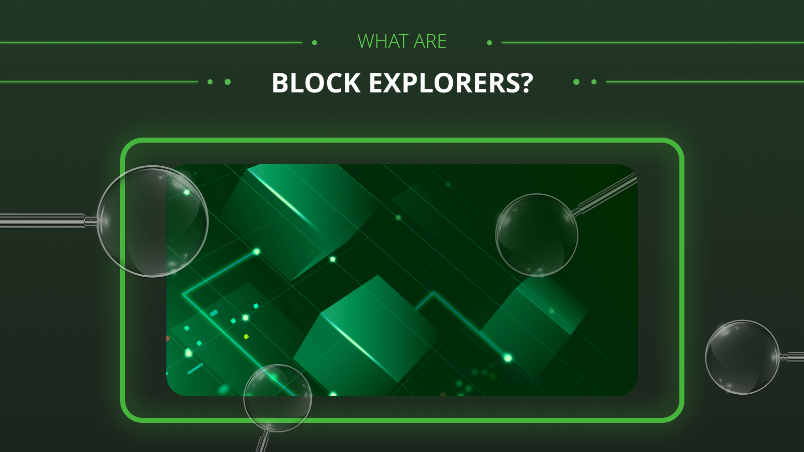
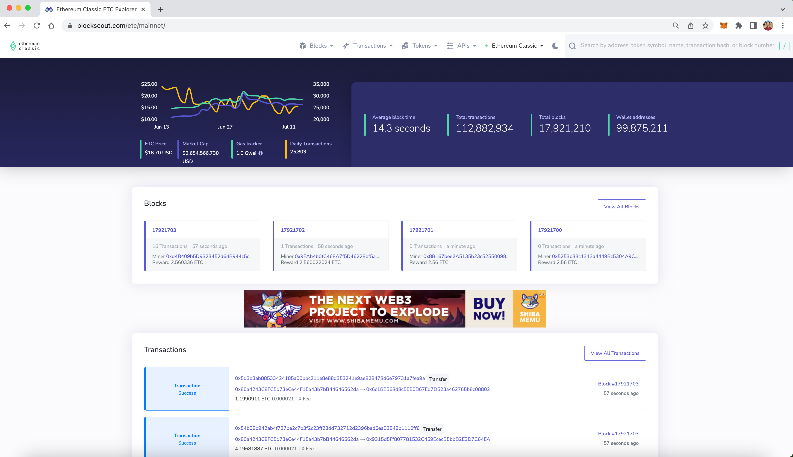
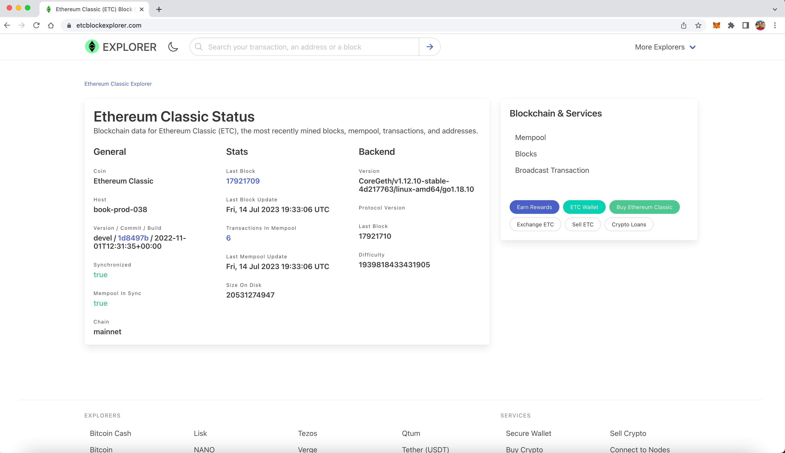
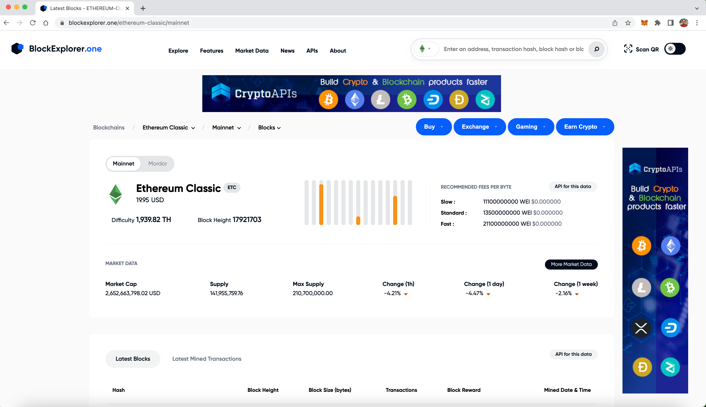
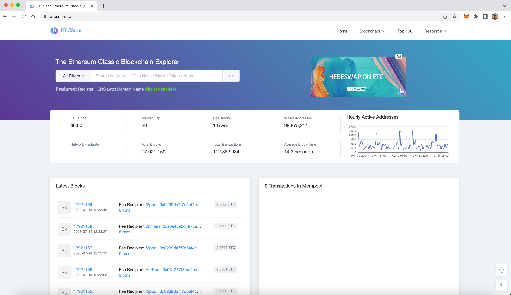
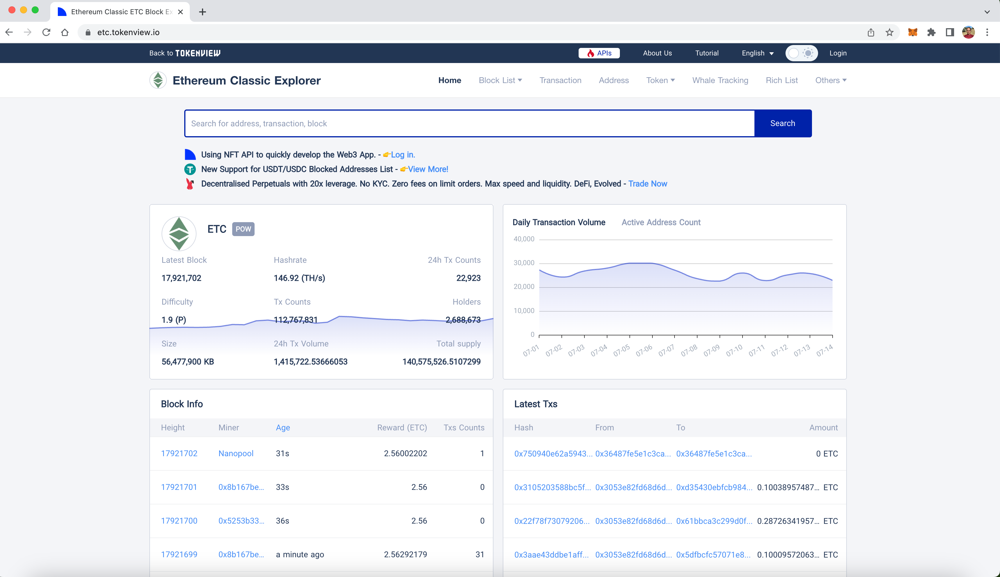

---
**您可以由此收听或观看本期内容:**

<iframe width="560" height="315" src="https://www.youtube.com/embed/mxG9fDqOZ6Y" title="YouTube video player" frameborder="0" allow="accelerometer; autoplay; clipboard-write; encrypted-media; gyroscope; picture-in-picture; web-share" allowfullscreen></iframe>

---

在上一节课（第31课）中，我们介绍了CoinMarketCap、CoinGecko和Messari等行情服务，从而了解到了在哪里可以找到加密货币列表和价格。

在本课中，我们将学习区块链行业相对于银行业带来的透明性范式转变，以及以太坊经典（ETC）这样的区块链中数据是如何存在的，什么是区块浏览器，并描述一些支持ETC的区块浏览器。

在下一节课（第33课）中，我们将解释什么是中心化和去中心化交易所。

## 透明性的范式变革

当我们使用信用卡、移动应用进行支付，或使用银行转账系统（如电汇或其他结算系统）时，我们通常会发起支付，然后必须经过数小时或数天的时间，才能完成整个过程并将资金从发起账户转移到目标账户。

从终端用户的角度，甚至对于流程中的内部人员而言，这些资金流动的状态都是不透明的。整个系统对所有人都是一个黑盒子。只有在资金从一个账户中扣除，并在较长时间后存入另一个账户时，交易各方才能看到支付的情况。

而区块链行业通过完全透明的方式彻底改变了这一点。当任何人向像ETC这样的区块链发送交易时，所有交易的整个生命周期对于运行节点或使用特殊网站的任何人来说都是可见的。这些特殊网站会索引所有这些数据，并为任何人免费提供搜索和审计的功能。

在区块链行业，交易结算的最长时间是十分钟，这是比特币网络处理区块的时间。而在ETC中，这个时间是每13秒一次。

有趣的是，不仅转账更快、全球化且透明，而且用户可以在上述特殊网站上不断监控他们的交易，这些网站可以看作是所有交易活动的第三方见证。

## 以太坊经典（ETC）和其他区块链中的数据是如何存在的？

当任何交易被发送到像以太坊经典（ETC）这样的区块链时，它会被节点接收并立即转发到整个网络中。每个节点都有所有交易的完整副本，因此每个人都可以实时了解所有转账的状态，即使它们尚未包含在区块中。这个阶段交易所处的状态或位置被称为内存池（mempool）。

然后，经过正确签名、具有正确余额并符合协议规则的交易最终将由矿工纳入一个区块中。

当矿工创建新的交易区块时，他们将这些区块发送到整个网络，以进行完全复制，就像对个别交易所做的那样。

当网络中的所有节点接收到新的区块时，它们将其添加到所谓的区块链，也就是所有区块、交易和系统数据的最终状态。

如上所述，区块链作为一个数据库在系统的所有节点中进行了复制，因此任何运行节点的用户都可以获取历史信息以及网络中正在发生的情况。

## 什么是区块浏览器？

区块浏览器是之前提到的特殊网站，它们运行各种区块链（包括ETC），对其数据库中的信息进行索引，并根据需求向公众展示这些信息。

这是金融世界中的一种新的透明度水平，不仅因为信息是可获取的，而且普通用户可以使用这些第三方服务来跟踪和审计区块链。

这些网站上的数据可以按照区块、交易或地址进行组织，并经常具有更多的统计数据和图表，有助于分析网络中的活动情况。

以下是几个支持ETC的热门区块浏览器及其主要标识的区块链：

Blockscout.com -> 以太坊经典（ETC）
Blockchain.com -> 比特币（BTC）
Etherscan.io -> 以太坊（ETH）

接下来的章节中，我们将描述几个支持以太坊经典的区块浏览器。

## Blockscout

Blockscout是最受欢迎的以太坊经典（ETC）区块浏览器，由ETC合作社维护。您可以通过以下链接使用Blockscout查看ETC的信息：

https://blockscout.com/etc/mainnet

Blockscout允许用户通过地址、交易、区块或代币符号来搜索ETC区块链。

**地址：** 用户可以输入他们想要查询的地址，然后查看该地址的余额、持有的代币、总交易次数、代币转账次数、总使用的Gas量以及最近一次更新余额的区块。

**交易:** 用户可以输入交易ID，然后查看交易的状态、所在区块号、时间戳、资金从哪个地址转出，转入哪个地址，交易的价值、手续费和Gas价格。

**区块:**  用户可以输入区块号，然后查看该区块的时间戳、包含的交易数量、挖矿该区块的矿工、区块大小（以字节为单位）、区块的加密戳或哈希值、上一个区块的哈希值（父哈希）、挖矿难度、链上截至该区块的总难度、Gas使用量、Gas限制、用于创建区块哈希的随机数（Nonce）以及矿工奖励。

**代币符号:** 用户可以通过代币符号搜索代币。例如，要查看HebeSwap代币，他们可以输入HEBE，并会显示其概要页面和统计数据。对于WETC，这是在去中心化应用中使用的以太坊经典包装代币，也是一样的操作方式。

## EtcBlockExplorer

EtcBlockExplorer由创建Guarda钱包的团队维护。您可以通过以下链接使用EtcBlockExplorer查看ETC的信息：

https://etcblockexplorer.com

EtcBlockExplorer允许用户通过地址、交易或区块来搜索ETC区块链，并且还有一个显示内存池（mempool）的部分。

**地址:** 用户可以输入他们想要查询的地址，然后查看该地址的余额、交易历史、非合约交易和代币余额（如果有的话）。

**交易:** 用户可以输入交易ID，然后查看该交易所在的区块、价值、交易手续费、时间戳、交易的原始代码和确认数。

**区块:** 用户可以输入区块号，然后查看该区块的戳或哈希值、交易数量、时间戳、字节数、Nonce（随机数）和难度。

**内存池:** 通过在首页点击“Mempool”链接，用户可以查看ETC待处理交易的内存池。

## BlockExplorer.one

BlockExplorer.one由一家同名公司维护。您可以通过以下链接使用BlockExplorer.one查看ETC的信息：

https://blockexplorer.one/ethereum-classic/mainnet

BlockExplorer.one允许用户通过地址、交易或区块来搜索ETC区块链，并且还提供了一个Ethereum Classic的市场数据列表和页面。

**地址：** 用户可以输入他们想要查询的地址，然后查看该地址的余额、总接收金额、总发送金额、地址中的交易和代币余额（如果有）。

**交易：** 用户可以输入交易ID，然后查看交易金额、交易所在区块号、手续费、确认数以及交易的日期和时间。

**区块：** 用户可以输入区块号，然后查看接收时间、总交易数、确认数、难度、奖励、区块哈希、Gas限制和Gas使用量。

**市场数据：** 通过在ETC页面点击“More Market Data”链接，用户可以进入代币列表行情服务，并点击“ETC”可以查看其市场数据页面。

## EtcScan

EtcScan由创建HebeSwap去中心化交易所的团队维护。您可以通过以下链接使用EtcScan查看ETC的信息：

https://etcscan.cc

EtcScan允许用户通过地址、交易、区块、代币或ETC域名来搜索ETC区块链。

**地址：** 用户可以输入地址，然后查看该地址的余额、代币和交易。他们还可以通过点击“Submit info”链接来输入地址的名字标签。

**交易：** 通过输入交易ID，用户可以查看交易的状态、所在区块、确认数、时间戳、“发件人”和“收件人”地址、交易价值、手续费和Gas价格。

**区块：** 用户可以输入区块号，然后查看该区块的哈希值、时间戳、确认数、矿工、交易数、区块奖励、总难度、区块大小、Gas使用量、Gas限制、Nonce、下一个区块哈希和上一个区块哈希。

**代币：** 用户可以通过代币符号搜索代币。

**ETC域名：** ETC中有一个域名系统，由同一团队创建，称为“Hens”。用户可以在EtcScan上输入他们的ETC域名，例如“domain.etc”，然后查看该账户的数据。

## TokenView

TokenView由Tokenview团队维护。您可以通过以下链接使用TokenView查看ETC的信息：

https://etc.tokenview.io

TokenView允许用户通过地址、交易或区块来搜索ETC区块链。它还有两个部分，“Whale Tracking”（鲸鱼追踪）和“Rich List”（富豪榜），用于跟踪大额ETC交易和地址。

**地址：** 用户可以输入他们想要查询的地址，然后查看该地址的余额、代币余额和交易列表。用户登录后，还可以为地址添加标签。

**交易：** 用户可以输入交易ID，然后查看交易的状态、所在区块号、时间、交易的“发件人”和“收件人”地址、金额、手续费、Gas使用量、Gas限制等其他数据点。

**区块：** 用户可以输入区块号，然后查看该区块的时间、字节数、手续费、交易数量、Gas使用量、Gas限制、挖矿难度和总难度、区块奖励、确认数、上一个区块哈希和下一个区块哈希、矿工、Nonce等其他数据点。

---

**感谢您阅读本期文章!**

了解更多有关ETC，欢迎访问: https://ethereumclassic.org
