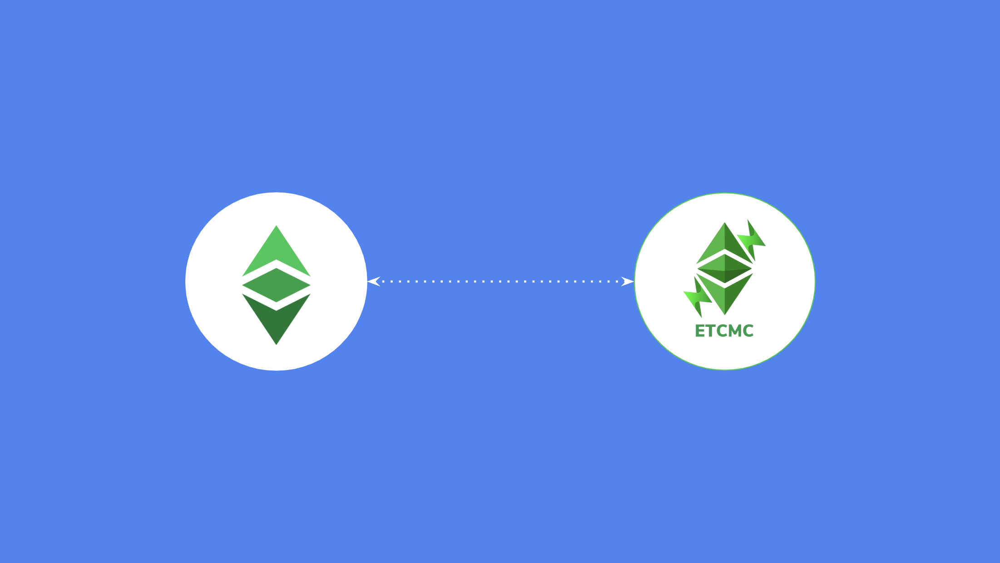
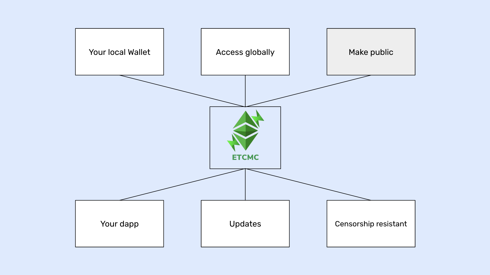

---
**You can listen to or watch this video here:**

<iframe width="560" height="315" src="https://www.youtube.com/embed/yqyrDG5nlkE" title="YouTube video player" frameborder="0" allow="accelerometer; autoplay; clipboard-write; encrypted-media; gyroscope; picture-in-picture; web-share" allowfullscreen></iframe>

---

## What Is a Blockchain Node?

Blockchains are peer-to-peer networks of computers where each node is a machine running a software client that enables it to communicate with other nodes. 

All new transaction data is transmitted to all participating machines and is replicated in all of them. Consensus on which is the latest state of the database, also known as the blockchain, is reached through a consensus mechanism, which may usually be a proof of work or proof of stake algorithm.

Because the security paradigm of blockchains is to replicate the same identical database in as many machines as possible, so there may be as much redundancy and self verification as possible, without the need to trust third parties, then the more nodes in as many diverse regions, cultures, and parts of the world as possible, the better.

A blockchain node is one of these participating machines running the software client that contains the protocol to be able to be a member of the network.

## Benefits of Running a Node

As blockchains have miner nodes and verifying nodes, to run more verifying nodes also increases the security of the network.

Running a node provides higher security to users and dapp developers as well. It is also very important for exchanges, investors, institutions, and general blockchain services.

Running a node is a way to access the blockchain directly, thus more securely, to query accounts, balances, and dapps, and to send transactions.

By accessing the network directly, rather than through trusted third parties, end users, developer teams, and all other economic node operators gain the highest degree of security possible because they may query the chain and send transactions without risk of fraud.

As long as there is an internet connection, in a proof of work blockchain as Ethereum Classic (ETC) running a node provides the highest degree of censorship resistance and permissionlessness when interacting with the system.

**The ETCMC team recently stated the following on social media:**

“Why running your own #EthereumClassic node is one of the best ways to contribute to #ETC

1. Decentralization: 

Running your own node contributes to the decentralization of the ETC network. By participating in the network as a node operator, you help distribute the responsibility of maintaining and validating the blockchain. This enhances the network's resilience and reduces the reliance on centralized infrastructure.

2. Data Integrity: 

When you run your own node, you independently verify the transactions and smart contracts on the ETC blockchain. You have direct access to the entire blockchain history and can validate transactions without relying on external sources. This ensures the integrity and trustworthiness of the data you interact with.

3. Privacy and Security: 

By running your own node, you have better control over your data and transactions. You don't have to rely on third-party nodes or trust their infrastructure. Running a node enables you to keep your transactions private and secure by not exposing sensitive data to external services.

4. Development and Testing:

If you are a developer or building applications on top of the ETC blockchain, running your own node gives you a local environment for development and testing. You can experiment with smart contracts, interact with the blockchain, and debug your applications without relying on external nodes or services.

5. Network Participation: 

Running your own ETC node allows you to actively participate in the Ethereum Classic network. By running a node, you contribute to the network's overall security, reliability, and decentralization. You become part of the network infrastructure, helping to validate transactions, propagate blocks, and maintain the integrity of the blockchain. Running your own node also allows you to have direct access to the Ethereum Classic network, enabling you to interact with smart contracts, explore the blockchain's history, and build applications that leverage the ETC ecosystem."

Souce: https://twitter.com/ETCMC777/status/1674582793769156612

## What Is ETCMC?

Because running nodes is relatively costly due to the size of the blockchain (an ETC full node size is currently around 80 GB), it is difficult to run them on regular computers, much less on machines that are meant for daily use.

To solve this problem, there are companies that have developed very practical specialized devices that are only dedicated to running blockchain nodes.

[ETCMC](https://etcmc.org) is one such company with its product [Ethereum Classic Plug and Play Node](https://www.etcmc.org/etcmc-etc-node), which is a device that connects to the local WiFi network at home or office, and from there users may set up their ETC nodes, either for the mainnet or the Mordor testnet.

## Use Cases of ETCMC With Ethereum Classic

As said before, running your own node has higher security guarantees than using trusted third parties, gives higher control to users and teams, and it is faster than using remote cloud node services.

Some of the use cases for running an ETC node on ETCMC are the following:

**Your local wallet:** Instead of using third parties, users may have their non-custodial wallet in their local machines connect to the blockchain through their own direct nodes.

**Access globally:** ETCMC may be setup to provide access through VPN connection to its owners even if they are away, anywhere in the world.

**Make public:** This is a feature planned for the future. The node will be set up as a public endpoint, providing access to the blockchain to the public.

**Your dapp:** Dapp developer teams may use their ETCMC ETC node to provide access to the chain for their dapps so they don’t have to depend on the large centralized cloud node providers.

**Updates:** ETCMC and the Ethereum Classic client may be updated from the user interface so no upgrades, bug fixes, or hard forks are missed.

**Censorship resistant:** By running a full node, the level of security achieved is the highest possible.

## Stay Tuned!

In part II of this series, we will do an interview with ETCMC founder Seth Mccormack where we will talk about the following topics:

- What is your background?
- Please describe the ETCMC product
- Once you buy it, how do you set it up?
- What is the ETCMC DAO?
- What is the ETCPOW token?
- How many ETCMC nodes are running right now in the ETC network?

---

**Thank you for reading this article!**

To learn more about ETC please go to: https://ethereumclassic.org
