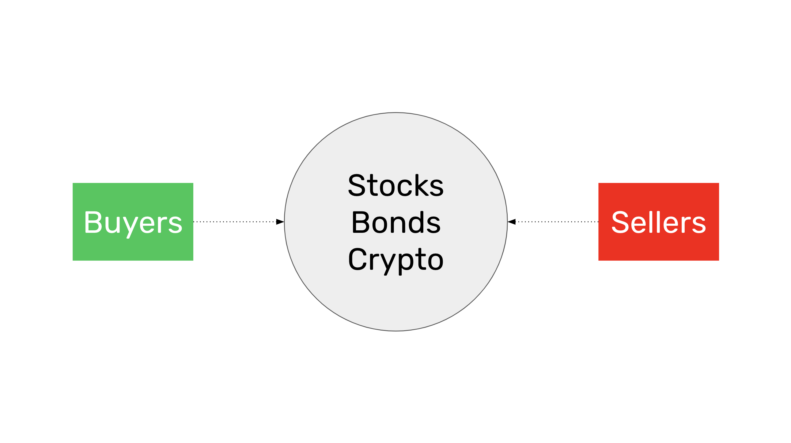
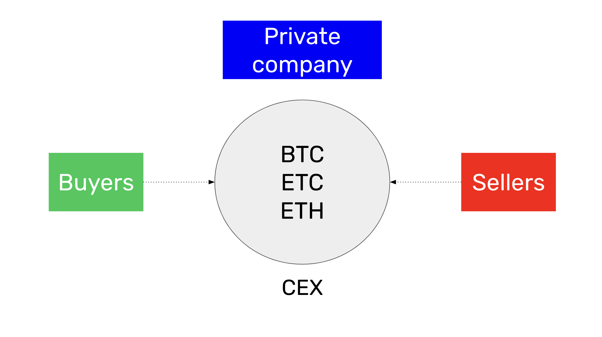
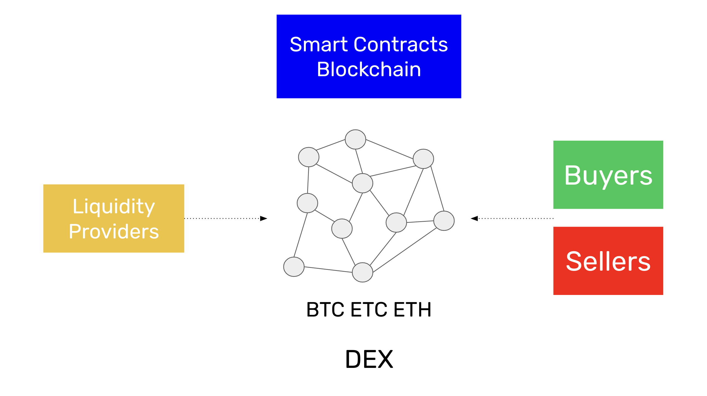
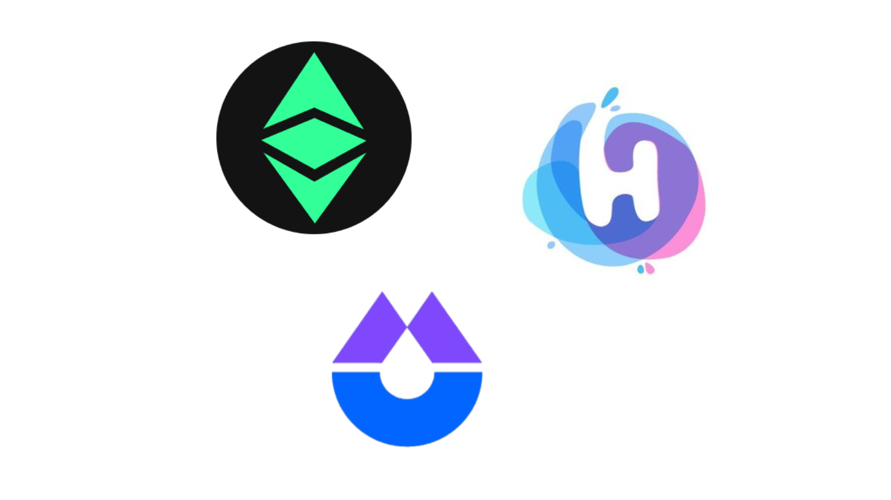

---
**You can listen to or watch this interview here:**

<iframe width="560" height="315" src="https://www.youtube.com/embed/yZBrIVkgJd4?si=T0G6DWG2Dx2OUnmm" title="YouTube video player" frameborder="0" allow="accelerometer; autoplay; clipboard-write; encrypted-media; gyroscope; picture-in-picture; web-share" allowfullscreen></iframe>

---

In the previous classes, 31 and 32, we saw where to find cryptocurrency lists and prices and what are block explorers. 

In this class, 33, we will explain what are centralized and decentralized exchanges to actually buy and sell cryptocurrencies. 

We will describe what are exchanges in the first place, then what are centralized exchanges (CEXs), what are decentralized exchanges (DEXs), how DEXs work, and which are the various and up-and-coming DEXs in Ethereum Classic (ETC). 

In the next class, 34, we will explore the future of the cryptocurrency industry and how it may evolve.

## What Is an Exchange?

An exchange is a physical or virtual location in which buyers and sellers meet to buy and sell goods or financial assets.

The function of the exchange is to provide a common place with strict rules so that traders and investors may negotiate and match their orders.

A common place may be a hall in a building in the case of physical exchanges, or a website on the internet in the case virtual exchanges. Strict rules means that there are enforced parameters that traders must follow to enter and settle orders, and everyone must follow the ethical standards.

In financial exchanges, buyers and sellers negotiate and trade financial assets such as stocks, bonds, or cryptocurrencies.

As the trades are executed between the parties, the corresponding prices are usually published on quotation services and web pages so the public may be aware of the value of the various assets.

## What Is a Centralized Exchange (CEX)?

A centralized exchange is a physical or virtual location that serves as a meeting point for trading assets, with a strict set of rules, that is owned by a company, an industry group, a non-profit organization, or a government.

For example a CEX that focuses on cryptocurrencies may be a company such as [Coinbase](https://coinbase.com) that provides its servers over the internet for its customers to open accounts, send money, and start exchanging BTC, ETC, ETH, and other tokens.

Centralized exchanges must follow regulations, so they may be very restrictive, demanding customers to present evidence of identity and residence, performing background checks, and asking what is the source of their funds.

Another risk of CEXs is that they may go bankrupt and customers may lose their deposits and assets.

## What Is a Decentralized Exchange (DEX)?

A decentralized exchange is a virtual location that exists inside a smart contracts blockchain. It is decentralized because the software programs that power these exchanges are replicated in all participating computers of the blockchain globally.

Because blockchains are decentralized, immutable, and censorship resistant, and users may have their addresses, also known as accounts, in them with no restrictions, then it is not necessary to prove identity or residence, pass through background checks, or report on source of funds.

Because DEXs are not owned by anyone, but are just smart contracts on the blockchain, then there is no risk of bankruptcy as the deposits are linked to their respective addresses.

Another important advantage of DEXs is that transactions are executed and paid in the same action, there is no separation between trade and settlement.

## How do Decentralized Exchanges Work?

Rather than working with databases that match bids and offers, decentralized exchanges work with what are called liquidity pools. The participants in liquidity pools are liquidity providers (LPs) and traders.

If the trading pair ETC/BTC is enabled in a DEX, then LPs can send, for example, an aggregate of 2,000 ETC and 100 BTC to the pool. This proportion has an implied price of 0.05 BTC for each ETC.

When traders see this, they may send either ETC or BTC to the liquidity pool to exchange coins. For example, a trader could send 1 BTC to the liquidity pool and would get back 20 ETC to his address. This would leave the liquidity pool with 1,980 ETC and 101 BTC, thus changing the implied price to 0.051 BTC per ETC.

When other traders see these changes, they may want to arbitrage and, for example, exchange 20 ETC for 1 BTC and return the price back lower to 0.05.

Traders pay a commission for each transaction and LPs receive passive income from the liquidity pool for their service.

## Decentralized Exchanges in Ethereum Classic

As a smart contracts platform, ETC has two decentralized exchanges currently in operation, [ETCswap](https://etcswap.org) and [HebeSwap](https://hebeswap.com).

There is another project called iZUMi who is building a third exchange that will work on ETC called [iZiSwap](https://izumi-finance.online/trade/swap).

As Ethereum Classic is the largest proof of work and smart contracts blockchain in the world, and proof of stake blockchains as Ethereum and Cardano are centralized, this kind of exchange infrastructure will be in great demand in the times to come as the world will increasingly need trust minimized exchange alternatives to trade globally.

---

**Thank you for reading this article!**

To learn more about ETC please go to: https://ethereumclassic.org
