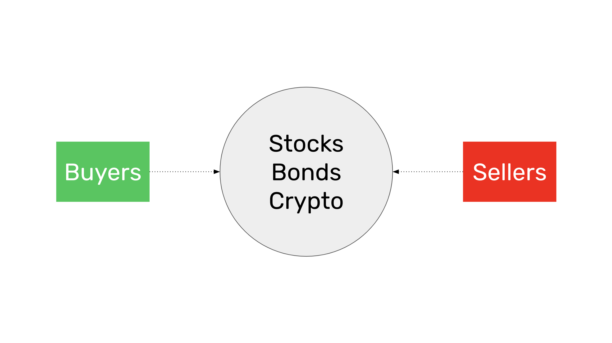
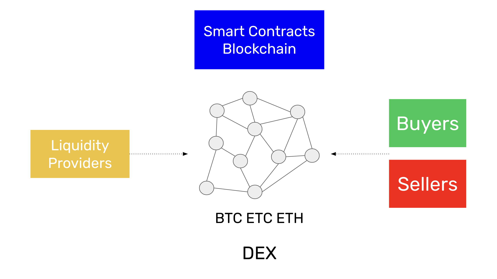
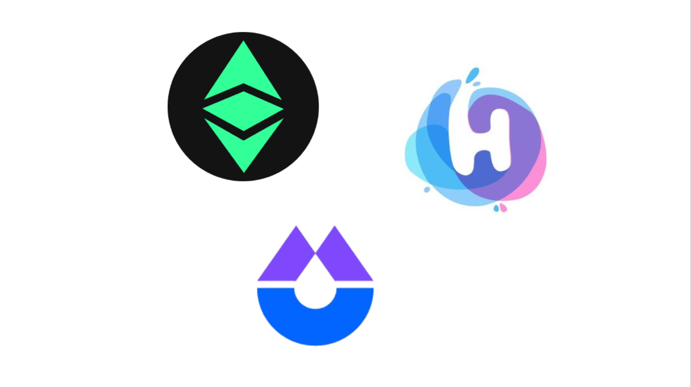

---
**有次收听本期内容:**

<iframe width="560" height="315" src="https://www.youtube.com/embed/yZBrIVkgJd4?si=T0G6DWG2Dx2OUnmm" title="YouTube video player" frameborder="0" allow="accelerometer; autoplay; clipboard-write; encrypted-media; gyroscope; picture-in-picture; web-share" allowfullscreen></iframe>

---

在之前的第31和32课中，我们了解到了如何找到加密货币列表和价格，以及什么是区块链浏览器。

在本第33课中，我们将解释什么是中心化和去中心化交易所，以实际购买和出售加密货币。

首先，我们将描述交易所是什么，然后介绍中心化交易所（CEXs）和去中心化交易所（DEXs），以及DEXs的工作原理，以及以太经典（ETC）中各种新兴的DEXs。

在下一课中，第34课，我们将探讨加密货币行业的未来以及它可能的发展方向。

## 什么是交易所

交易所是买家和卖家相遇以购买和销售商品或金融资产的物理或虚拟地点。

交易所的功能是提供一个共同的地方，设有严格的规则，以便交易员和投资者可以进行协商并匹配他们的订单。

共同的地方可以是物理交易所的情况下的建筑物中的大厅，也可以是虚拟交易所的情况下的互联网上的网站。严格的规则意味着有强制执行的参数，交易员必须遵循这些参数以进入和结算订单，每个人都必须遵守道德标准。

在金融交易所中，买家和卖家协商和交易金融资产，如股票、债券或加密货币。

随着交易在各方之间执行，相应的价格通常会在报价服务和网页上发布，以便公众可以了解各种资产的价值。

## 什么是中心化交易所(CEX)?

中心化交易所是由公司、行业组织、非营利组织或政府拥有的、具有一套严格规则的物理或虚拟场所，用作交易资产的集合点。

例如，专注于加密货币的中心化交易所（CEX）可能是像[Coinbase](https://coinbase.com)这样的公司，它通过互联网提供服务器，供客户开设账户、发送资金并开始交易比特币（BTC）、以太经典（ETC）、以太坊（ETH）和其他代币。

中心化交易所必须遵守监管规定，因此它们可能非常严格，要求客户提供身份和居住地的证明，进行背景检查，并询问其资金来源。

中心化交易所的另一个风险是它们可能破产，导致客户失去存款和资产。

## 什么是去中心化交易所(DEX)?

去中心化交易所是存在于智能合约区块链内部的虚拟场所。它是去中心化的，因为支持这些交易所的软件程序在全球范围内的区块链的所有参与计算机中都有复制。

因为区块链是去中心化的、不可变的、抗审查的，用户可以在其中拥有他们的地址，也被称为账户，没有任何限制，所以不需要证明身份或居住地、经过背景检查或报告资金来源。

由于DEXs没有任何所有者，而只是区块链上的智能合约，因此不存在破产的风险，因为存款与它们各自的地址相关联。

DEXs的另一个重要优势是交易和支付在同一操作中执行，没有交易和结算之间的分离。

## 去中心化交易所是如何工作的？

与使用数据库匹配买卖订单的中心化交易所不同，去中心化交易所使用所谓的流动性池。流动性池的参与者是流动性提供者（LPs）和交易员。

如果在DEX中启用了交易对ETC/BTC，那么LPs可以将，例如，总共2,000 ETC和100 BTC发送到流动性池。这个比例对应的隐含价格是每个ETC 0.05 BTC。

当交易员看到这一点时，他们可以向流动性池发送ETC或BTC来进行币种交换。例如，交易员可以向流动性池发送1 BTC，然后从流动性池获得20 ETC。这将使流动性池剩下1,980 ETC和101 BTC，从而将隐含价格改变为每个ETC 0.051 BTC。

当其他交易员看到这些变化时，他们可能希望进行套汇，例如，交换20 ETC以获得1 BTC，并将价格降低到0.05。

交易员每笔交易支付佣金，而LPs则因为提供流动性池服务而获得被动收入

## 在去中心化交易所中的以太经典

作为一个智能合约平台，ETC目前有两个运营中的去中心化交易所，分别是[ETCswap](https://etcswap.org)和[HebeSwap](https://hebeswap.com)。

还有另一个名为iZUMi的项目正在建设第三个可以在ETC上运行的交易所，名为[iZiSwap](https://izumi-finance.online/trade/swap)。

由于以太经典是全球最大的工作证明和智能合约区块链，而以太坊和卡尔达诺等权益证明区块链是中心化的，因此在未来，这种交易所基础设施将会越来越受欢迎，因为世界将越来越需要无需信任的全球交易替代方案。

---

**感谢您阅读本期文章!**

了解更多有关ETC，欢迎访问: https://ethereumclassic.org
