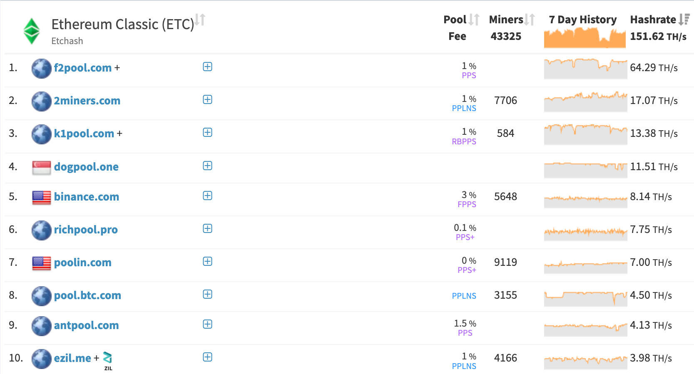
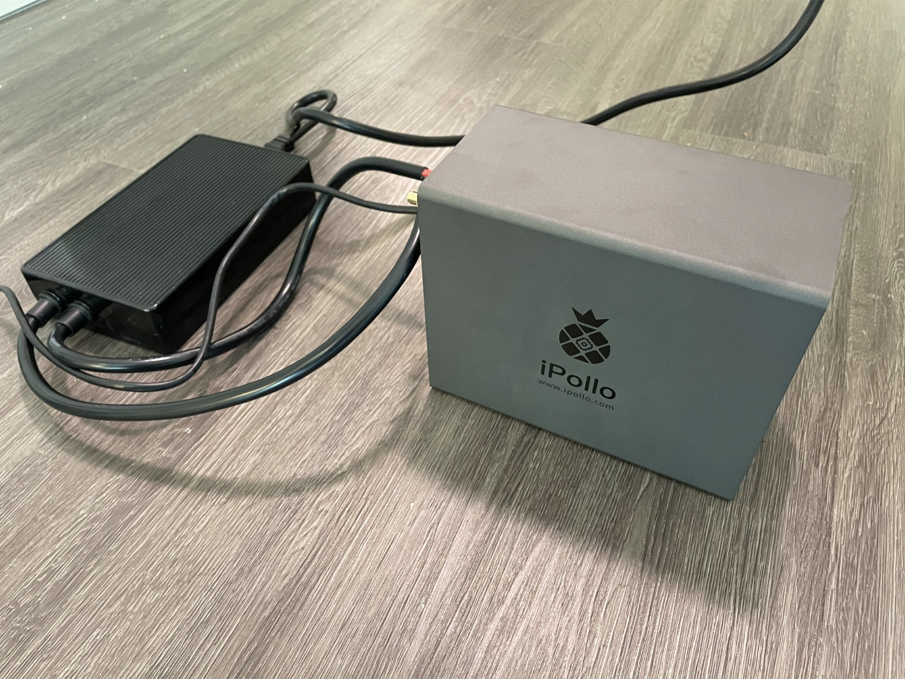
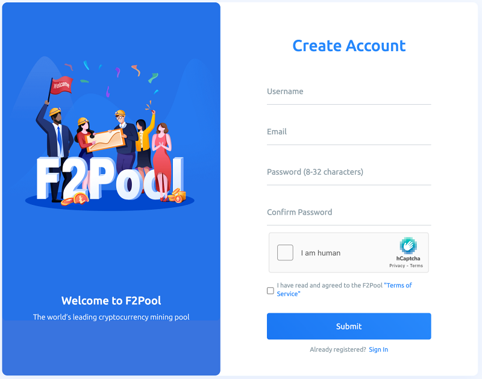
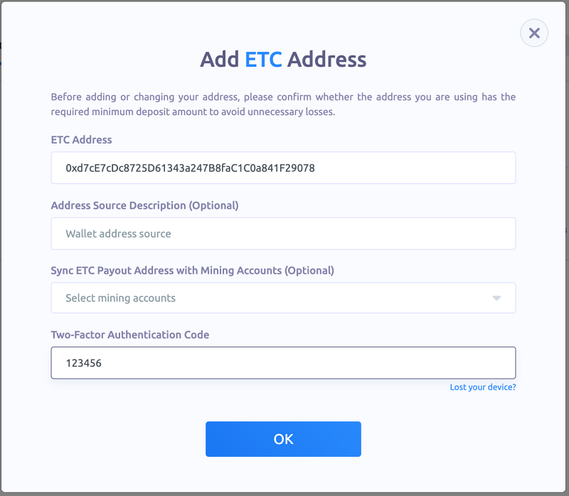
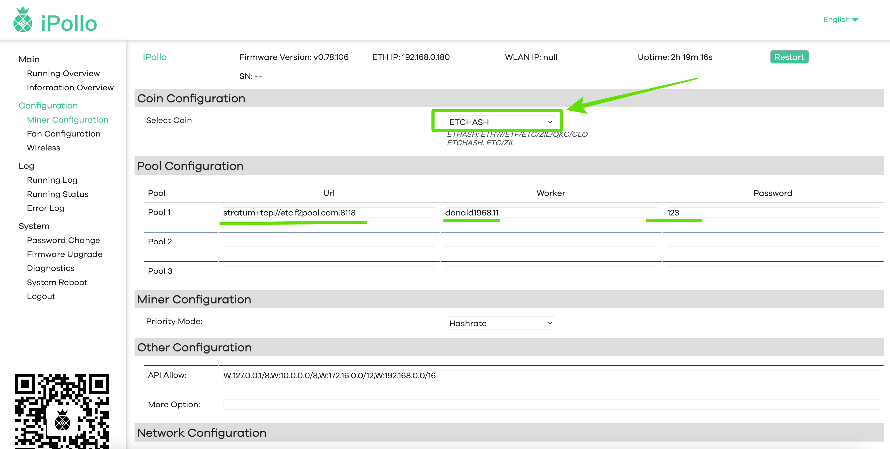
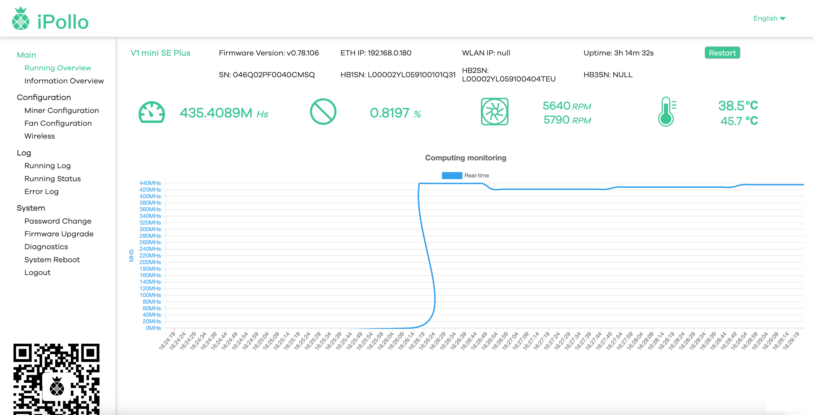
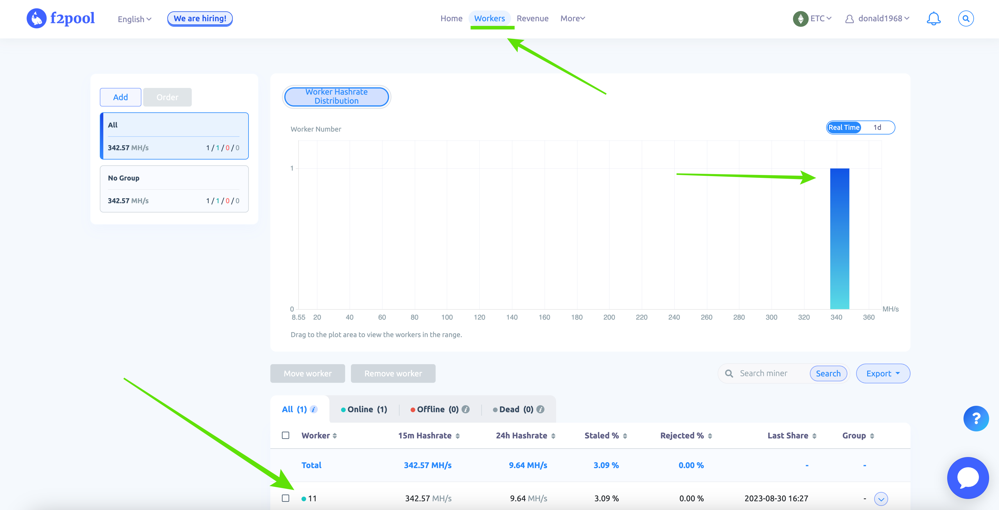
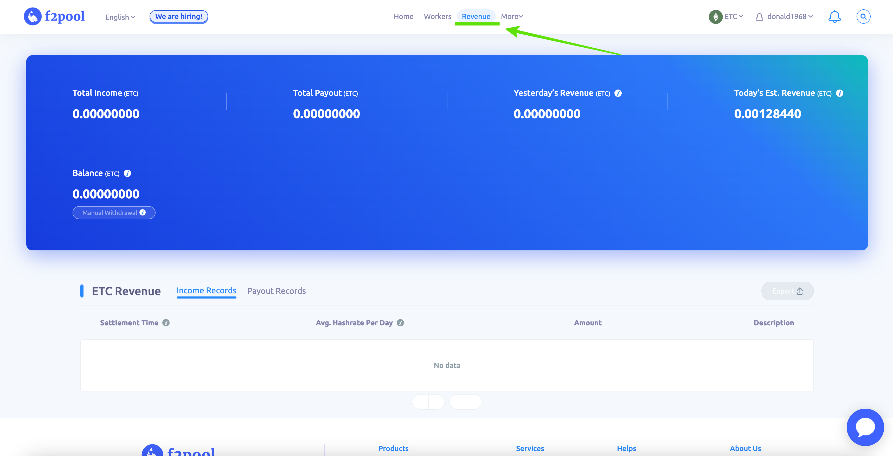

---
**You can listen to or watch this interview here:**

<iframe width="560" height="315" src="https://www.youtube.com/embed/EBRL33Kfgi8?si=1-TUPyyKR00TqGH-" title="YouTube video player" frameborder="0" allow="accelerometer; autoplay; clipboard-write; encrypted-media; gyroscope; picture-in-picture; web-share" allowfullscreen></iframe>

---

F2Pool is the largest mining pool in Ethereum Classic (ETC) and the third largest in Bitcoin (BTC). 

As such, we find it necessary to produce this guide to explain how to start mining ETC through this pool.

In this post, we will explain how to get started with the first steps, how to start mining ETC by configuring your miner to point it to F2Pool, and how to check your mining statistics.

## 1. Make Sure You Have the Right Mining Gear

We have been using ASIC miners to create these guides to mine ETC. ASICs are the most competitive gear to stay ahead in this highly competitive market.

The three mining hardware brands we cover for now are Bitmain’s [Antminer](https://shop.bitmain.com/product/detail?pid=00020230318213033303FiTP3CK3062C), [iPollo](https://ipollo.com/products/ipollo-v1-mini-classic-plus-wifi-version), and soon we will produce guides for [Jasminer](http://jasminer.com) ETC miners.

For this guide we decided to use the iPollo V1 Mini SE Plus.

This machine uses the ETCHash mining algorithm, has a mining hashrate capacity of 280 MH/s, and you can connect to it over WiFi to configure it.

In the following sections we will explain how to set up your iPollo to mine through F2Pool.

## 2. Get an ETC Account

To start mining through F2Pool you will need an ETC address so they may send you your reanings.

F2Pool pays miners everyday provided they have a 0.1 ETC balance or more.

The wallets you may use that [we have covered](https://ethereumclassic.org/blog/2023-07-12-list-of-wallets-that-support-ethereum-classic) which support ETC are:

- MetaMask 
- Trust Wallet 
- Ledger Nano S 
- MyCrypto
- MyEtherWallet
- Exodus

For this guide we decided to use our MetaMask wallet and use our address there.

## 3. Open an Account on F2Pool

The next step is to open an account on F2Pool.

For this go to: 

https://f2pool.com/user/signup

The process to create an account does not require that you verify your address or identification, but it is very strict in terms of security.

We had to enter our email, then verify it, then opened the account and had to receive more verification codes by email. We also had to enter our cell phone number and verify more things through it. And, finally, they also required that we establish 2 factor authentication.

## 4. Add Your ETC Address to F2Pool

Once your account is opened, you need to add your ETC address to your F2Pool profile so they pay you, as we said before.

For this, first select ETC as the coin you are mining by selecting it from the coins dropdown menu on the top right of the screen.

After this, click on your user name and then select “Account Settings”.

In the next screen you will see your user name and on the right a link to “Payout Settings”. Click there.

In the next screen, click on “+ Add ETC Address” and add your address there. 

Then press “OK”.

## 5. Add F2Pool Settings to Your Miner and Start Mining

Now that you have your F2Pool account created and ready, the next step is to configure your miner to start mining ETC through this pool.

The [data](https://f2pool.io/mining/guides/how-to-mine-ethereum-classic/) that you need is the following:

**Pool URL:** stratum+tcp://etc.f2pool.com:8118

**User and worker:** accountName.workerName

**Password:** Your choice

To configure our iPollo, we went to the “Configuration” tab on the left hand menu of the iPollo interface and we selected “ETCHASH” as the mining algorithm.

Then, we entered the Pool URL, the Worker, and a Password that we made up which is “123”. 

Our worker is “donald1968.11” because “donald1968” is our account ID on F2Pool and “11” is just an arbitrary number we used to identify this machine.

To start mining press “Save & Apply” below.

## 6. Check Your Mining Statistics

Now that your F2Pool account and your ASIC miner are configured and connected, and mining has started, you will need to wait a few minutes for them to communicate and synchronize and for the work to be transferred from your miner to the pool.

When some time has passed, you will notice on your miner dashboard that the hashrate directed to F2Pool will increase and the work will start to be transferred to the pool.

For example, in our case, you may see in the image that the hashrate dedicated to F2Pool is more than 435 MH/s (we don’t know why this product produces such consistent high hashrate if it is specified to produce 280 MH/s as per the manufacturer’s specifications).

If you go to your account on F2Pool again, you should see your ETC dashboard, and if you click on the “worker” tab, the work should be reflected in the hashrate chart, and the worker should be identified below.

If you click on the “Revenue” tab, then you will see you financial statistics with the “Total Income”, “Total Payout”, “Yesterday’s Revenue”, and “Today’s Estimated Revenue” metrics.

As time passes by you will see your earnings here and you will be able to withdraw your ETC balances whenever you wish as long as you have a minimum available to withdraw of 0.1 ETC.

–--

We wish you a happy ETC mining!

---

**Thank you for reading this article!**

To learn more about ETC please go to: https://ethereumclassic.org
