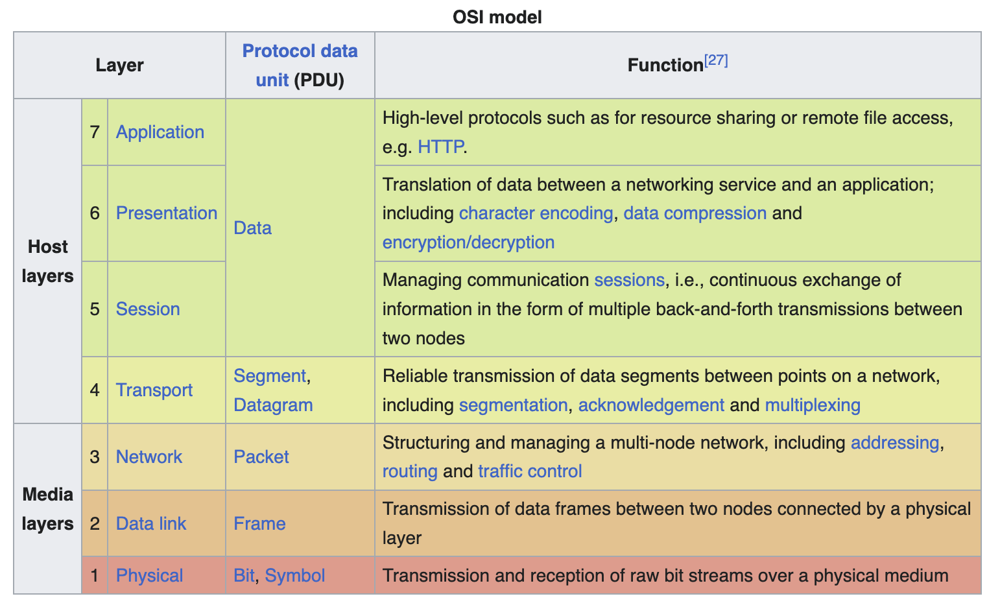
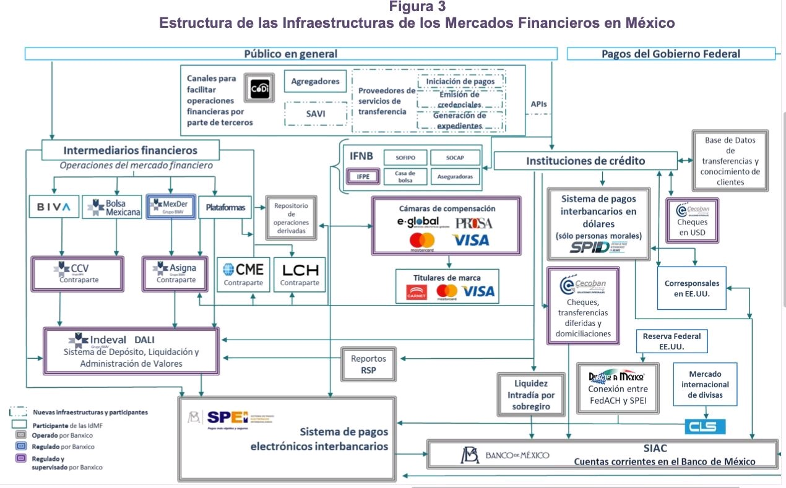
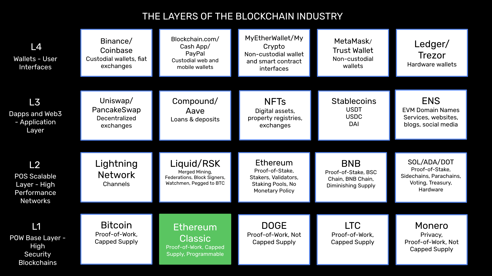
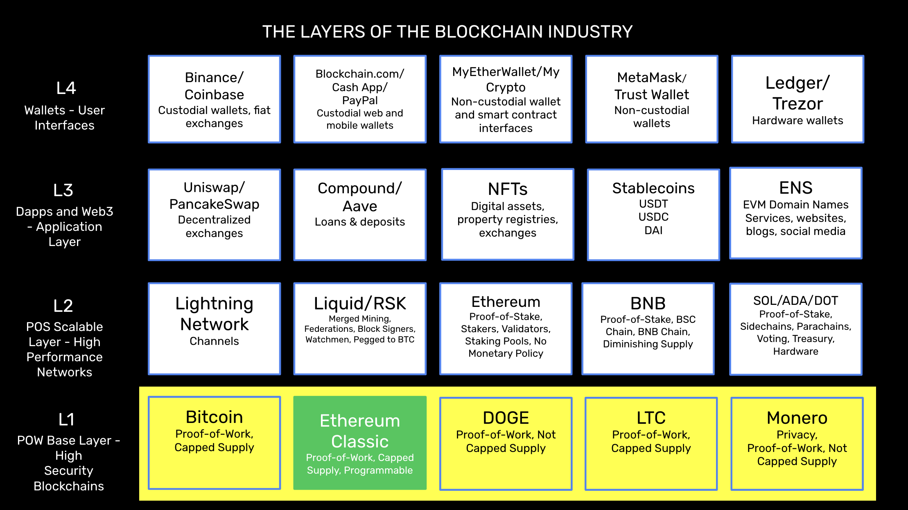
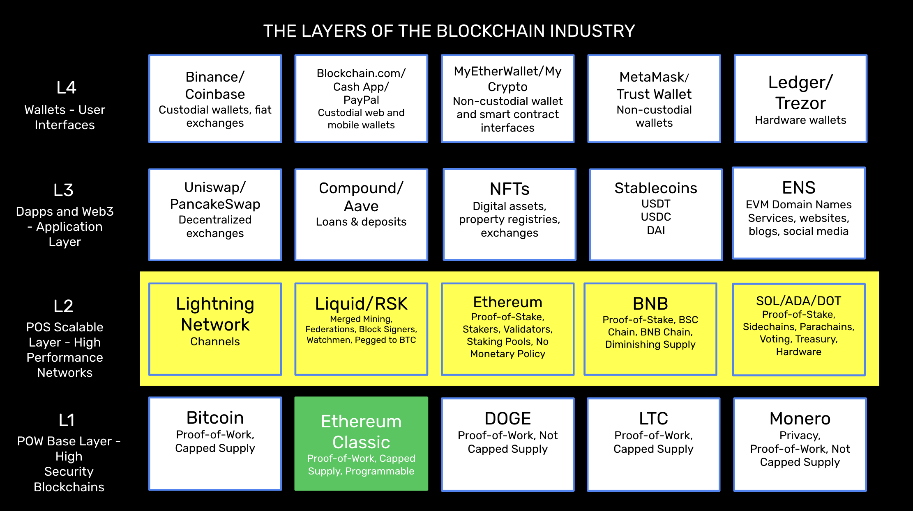
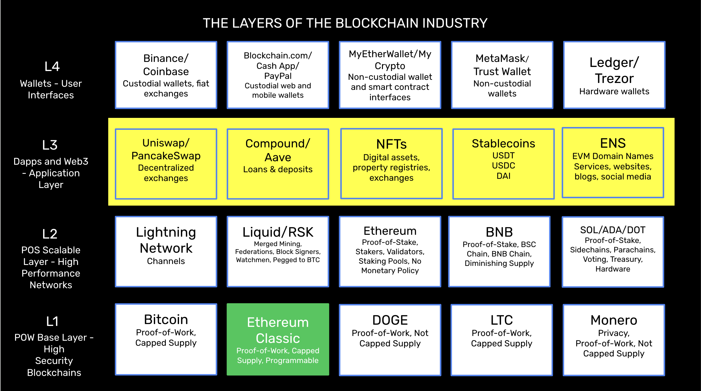
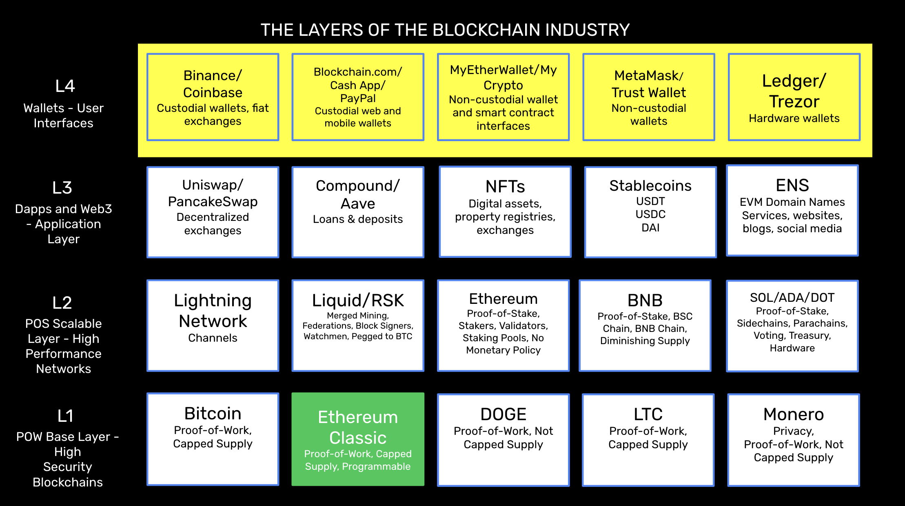

---
**You can listen to or watch this interview here:**

<iframe width="560" height="315" src="https://www.youtube.com/embed/5n0xckraF4k?si=er2C-RspM04GPy4b" title="YouTube video player" frameborder="0" allow="accelerometer; autoplay; clipboard-write; encrypted-media; gyroscope; picture-in-picture; web-share" allowfullscreen></iframe>

---

## The Internet Is Layered

In general, technology is always built in layers and components. 

For example, the internet itself is not one single product that we call “the internet” that moves information from one point to the other.

As seen in the image in this section, the Open Systems Interconnection (OSI) model is the conceptual framework used for thinking about and layering the internet.

In the same way, computing systems, other kinds of networks, and even entire industries are usually formed of layers and components.

Each of these layers and components may be protocols in themselves or parts of larger protocols.

## Banking Is Layered

For its financial use cases, a good analogy for the blockchain industry is how the banking industry is divided in layers and components.

In the image in this section you may see an example of the Mexican banking industry. All the components together form what we may call “banking”, but the whole system is divided in layers and components.

A banking system in a country like America, Mexico, or any other starts with a central bank at the base layer; then a system of banking institutions; then payments and transfers systems, such as checking, credit cards, wire systems, and fintech; and, at the top, the applications and user interfaces through the web, mobile apps, or physical branches.

The way they work together is that users generate transactions through the interfaces; then these are processed en masse by the transfer and payments systems; which then send them to the banking institutions, who net them out and allocate the balances to the corresponding accounts; and, finally, the banking institutions settle large netted balances between themselves through the central bank at the base layer.

## The Blockchain Industry Will Be Layered

In the same way as the internet and banking, the blockchain industry will be divided in layers and components.

Because the blockchain industry is about decentralized protocols and systems, then the layers will very likely be organized by security levels.

The systems at the base layer will be the working horses and secure networks, such as proof of work blockchains, and the higher layers will be the more scalable and performing systems, such as proof of stake networks, and scaling technologies.

On top of these will be the decentralized applications and web3 layers, and, at the top, the end user interfaces.

As described for the banking industry, users will generate transactions en masse through the wallets and interfaces; then these will be processed by the web3 and decentralized applications; then they will be netted and allocated into accounts by the proof of stake systems and scaling solutions; and, finally, the large netted transactions will be settled at the base proof of work blockchains.

Ethereum Classic (ETC) promises to be a core backend blockchain due to its proof of work consensus mechanism, and status as programmable digital gold. 

## Proof of Work (POW) Will Be the Base Layer (L1)

One interesting thing about blockchain design dynamics is that proof of work is highly secure but unscalable and proof of stake and other scaling technologies are less secure but highly scalable.

This presents a complementation because proof of work blockchains such as Bitcoin, Ethereum Classic, Doge, Litecoin, and Monero may be used as the base layer of the industry, and proof of stake systems such as Ethereum, BNB, Solana, Cardano, and Polkadot may be used as the second layer. By doing this, the base layer would gain scalability and the second layer would gain security.

In this scenario, it is very likely that there will be 3 or 4 very large proof of work blockchains and the rest will be insignificant. Because blockchains are like operating systems, it is very likely that the top chain will have more or less a 50% market share, and that system will very likely be Bitcoin. Then a system such as ETC will have a 25% share because it is like Bitcoin but programmable, and then another two chains such as Litecoin and Monero may also prevail with smaller market shares. 

## Proof of Stake (POS) and Scaling Solutions Will be the Second Layer (L2)

Standalone proof of stake networks by themselves are very similar to traditional systems. They are prone to centralization and it is trivial to arbitrarily modify ledgers, account balances, and property systems in them because they lack the cryptographic work that is needed to stamp or hash transactions to protect them.

What proof of stake does have is that they are fully replicated ledgers, they may be scaled through scaling technologies such as channels and rollups, and they may anchor their states to the proof of work base layer.

Once networks such as Ethereum, BNB, Solana, Cardano, Polkadot, and the others anchor their states on proof of work blockchains such as Bitcoin and Ethereum Classic, then their own states will become much more stable and secure.

Scaling and programming technologies such as Lightning Network, Liquid, RSK, and rollups may also be connected to the base layer blockchains directly.

## Decentralized Applications (Dapps) and Web3 Will Be the Third Layer (L3)

Once the base layer and layer 2 are consolidated as explained above, then decentralized applications (dapps) and web3 applications will have a technology platform on which to connect that will offer both security and scalability.

Dapps and web3 applications will connect to many components in the base layer and layer 2, using the best service from each protocol. This means they will work on multiple components, rather than on single blockchains as it is today.

Examples of these systems that work on single blockchains today but will be open to multiple components are dapps such as Uniswap, PancakeSwap, Compound, Aave, NFTs, stablecoins, and decentralized domain name services amongst others.

Web 3 will work like websites today, but the backend code will reside on programmable blockchains, the databases will be stored on data storage blockchains, and the images may be like NFTs stored in file systems such as IPFS.

## Wallets and User Interfaces Will be the Fourth Layer (L4)

Above all the stack will be the end user interfaces such as wallets, browser extensions, browsers, etc.

Wallets today already have browsers inside, and many brands already operate with many blockchains and coins.

There will be services for every type of user and every taste. 

Systems such as Binance and Coinbase will provide centralized services and exchange; custodial wallets such as Blockchain.com and CashApp will provide centralized payments rails; non-custodial wallet and smart contract interfaces such as MyEtherWallet and MyCrypto will provide access without asking for or touching the private keys; non-custodial wallets and browser extensions such as MetaMask and Trust Wallet will serve as apps holding users’ private keys and to connect to dapps and web3; and the hardware wallets such as ledger and Trezor will provide the highest level of security by separating the private keys from the internet completely.

---

**Thank you for reading this article!**

To learn more about ETC please go to: https://ethereumclassic.org
