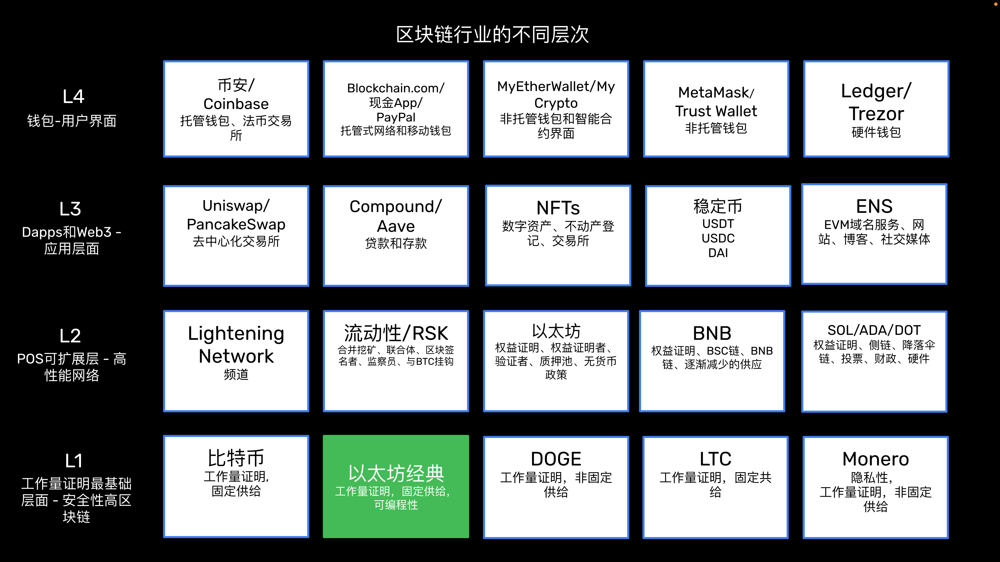
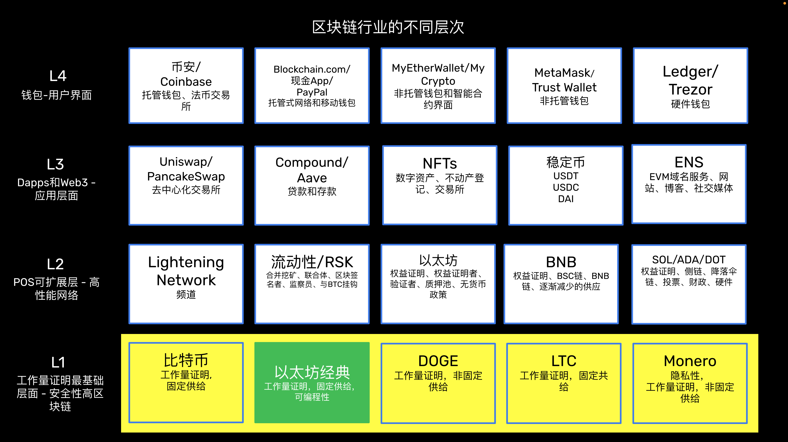
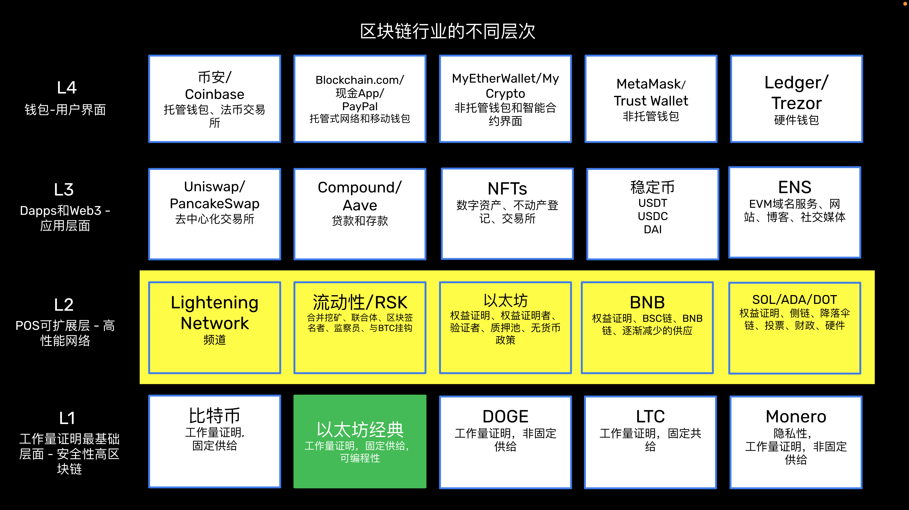
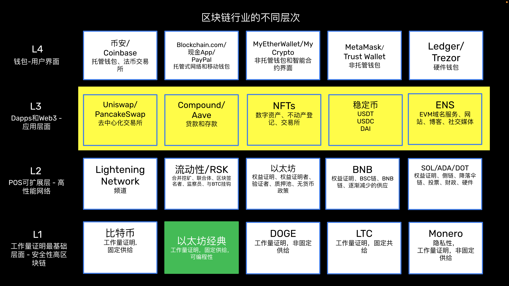
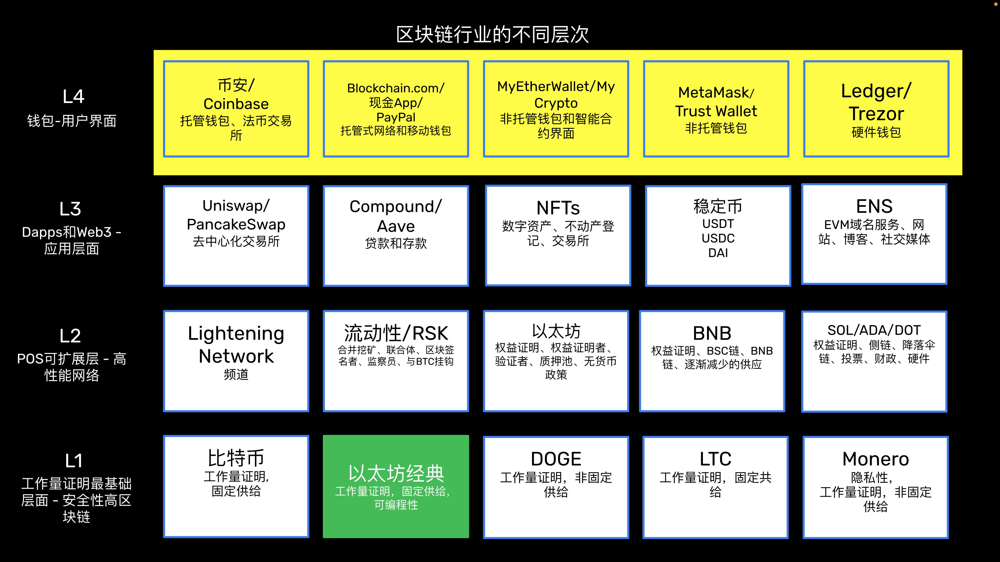

---
**由此收听或观看本期访谈:**

<iframe width="560" height="315" src="https://www.youtube.com/embed/5n0xckraF4k?si=er2C-RspM04GPy4b" title="YouTube video player" frameborder="0" allow="accelerometer; autoplay; clipboard-write; encrypted-media; gyroscope; picture-in-picture; web-share" allowfullscreen></iframe>

---

## 互联网是分层的

一般来说，技术总是以分层和组件的方式构建的。

例如，互联网本身不是我们所称的“互联网”的一个单一产品，用于将信息从一点传输到另一点。

正如在本节的图像中所示，开放系统互连（OSI）模型是用于思考和分层互联网的概念框架。

同样，计算系统、其他类型的网络甚至整个行业通常都由不同的层次和组件组成。

这些层次和组件中的每一个都可以是自己的协议或更大协议的一部分。

## 银行业也是分层的

对于其金融用途来说，区块链行业的一个很好的类比是银行业如何分为不同的层次和组件。

在本节的图像中，您可以看到墨西哥银行业的一个例子。所有这些组件共同构成了我们可以称之为“银行业”的东西，但整个系统被分为各种层次和组件。

像美国、墨西哥或其他国家的银行体系都是从底层的中央银行开始；然后是一系列银行机构；接着是支付和转账系统，如支票、信用卡、电汇系统和金融科技；最后是通过网络、移动应用或实体分支的应用程序和用户界面。

它们共同运作的方式是用户通过界面生成交易；然后这些交易被批量处理的转账和支付系统处理；然后将它们发送给银行机构，由银行机构进行净结算并将余额分配给相应的账户；最后，银行机构通过底层的中央银行结算大额净结算余额。

## 区块链行业将会分层

与互联网和银行业一样，区块链行业也将被分成不同的层次和组件。

因为区块链行业涉及到去中心化的协议和系统，所以这些层次很可能会根据安全级别进行组织。

底层的系统将是运作稳定且安全的网络，例如工作量证明区块链，而更高层次将是更具可扩展性和性能的系统，例如权益证明网络和扩展技术。

在这些层次之上将是去中心化的应用程序和Web3层，最上层将是最终用户界面。

与银行业类似，用户将通过钱包和界面大规模生成交易；然后这些交易将由Web3和去中心化应用程序处理；然后它们将通过权益证明系统和扩展解决方案进行净结算和分配到账户中；最后，大规模净交易将在基本的工作量证明区块链上结算。

以太经典（ETC）由于其工作量证明共识机制和可编程数字黄金的地位，承诺成为核心的后端区块链。

## 工作量证明（POW）将成为最基层（L1）

关于区块链设计动态的一个有趣之处在于，工作量证明具有很高的安全性但不可扩展，而权益证明和其他扩展技术具有较低的安全性但可扩展性强。

这呈现出一种互补性，因为比特币、以太经典、狗狗币、莱特币和门罗等工作量证明区块链可以作为行业的底层，而以太坊、币安币、Solana、卡尔达诺和Polkadot等权益证明系统可以作为第二层。通过这样做，底层将获得可扩展性，而第二层将获得安全性。

在这种情况下，很可能会有3或4个非常大的工作量证明区块链，其余的将变得不重要。因为区块链就像操作系统一样，所以最顶层的链很可能占据50%的市场份额，而这个系统很可能是比特币。然后，像ETC这样的系统将占据25%的份额，因为它类似于比特币但可编程，然后其他两个链，如莱特币和门罗，也可能以较小的市场份额脱颖而出。

## 权益证明（POS）和扩展解决方案将成为第二层（L2）

独立的权益证明网络本身与传统系统非常相似。它们容易集中化，并且可以随意修改账本、账户余额和财产系统，因为它们缺乏保护交易所需的密码工作。

但权益证明具有的是它们是完全复制的账本，它们可以通过通道和Rollup等扩展技术进行扩展，并且它们可以将它们的状态锚定到工作量证明的最基层。

一旦像以太坊、币安币、Solana、卡尔达诺、Polkadot和其他区块链网络将它们的状态锚定到比特币和以太经典等工作量证明区块链上，那么它们自己的状态将变得更加稳定和安全。

扩展和编程技术，如闪电网络、Liquid、RSK和Rollup，也可以直接连接到最基层区块链。

## 去中心化应用程序（Dapps）和Web3将成为第三层（L3）

一旦基础层和第二层按照上述解释得以巩固，那么去中心化应用程序（Dapps）和Web3应用程序将拥有一个技术平台，该平台将同时提供安全性和可扩展性。

Dapps和Web3应用程序将连接到基础层和第二层的许多组件，利用每个协议的最佳服务。这意味着它们将在多个组件上运行，而不是像今天一样仅在单一区块链上运行。

今天在单一区块链上运行但将对多个组件开放的示例包括Uniswap、PancakeSwap、Compound、Aave、NFT、稳定币和去中心化域名服务等Dapps。

Web 3将像今天的网站一样工作，但后端代码将驻留在可编程区块链上，数据库将存储在数据存储区块链上，而图像可能会像存储在IPFS等文件系统中的NFT一样。

## 钱包和用户界面将成为第四层（L4）

在整个堆栈的顶部将是最终用户界面，如钱包、浏览器扩展、浏览器等。

现在的钱包已经内置了浏览器，许多品牌已经在许多区块链和代币上运营。

将会有适用于每种类型用户和口味的服务。

诸如币安和Coinbase等系统将提供集中化的服务和交易；托管钱包，如Blockchain.com和CashApp，将提供集中化的支付通道；非托管钱包和智能合约界面，如MyEtherWallet和MyCrypto，将提供无需索取或触碰私钥即可访问的功能；非托管钱包和浏览器扩展，如MetaMask和Trust Wallet，将作为保存用户私钥并连接到Dapps和Web3的应用程序；硬件钱包，如Ledger和Trezor，将通过完全将私钥与互联网隔离来提供最高级别的安全性。

---

**感谢您阅读本期文章!**

了解更多有关ETC，欢迎访问: https://ethereumclassic.org
