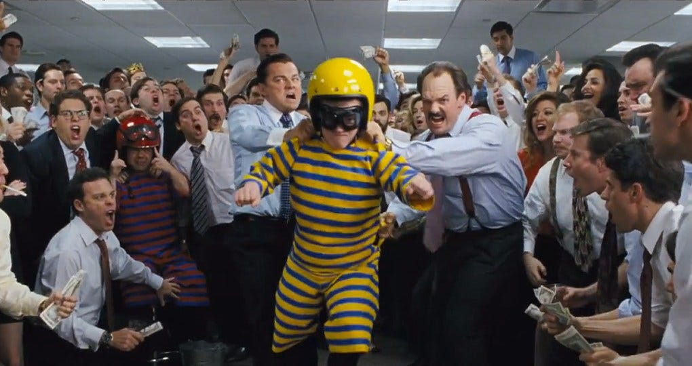

The following article was originally published on May 21 2019 by an author who wishes to remain anonymous.

---

Applying Proof of Work (PoW) to digital currency is an amazing innovation that was first actualized by Satoshi Nakamoto and builds on ideas from Wei Dai, Nick Szabo, Adam Back, and many others.

Unfortunately the importance of this innovation is exceeded only by woeful misunderstanding of how PoW works. This article seeks to clarify how they happen, when they negatively affect payment recipients  **(they rarely do)**, deterring double spends, and whether re-orgs are a Good Thing™.

This is the first of many articles on this topic, with future ones taking a deeper look at some of the ideas proposed below. If you have any thoughts, comments, or feedback please feel free to reach out.

## What Is A Re-Org?

A re-org is simply what happens when your node is aware of Chain A, but then sees a bigger Chain B and switches to it. This happens on occasion and most of the time it is a non-issue. However, Chain B might have parts of its transaction history that don’t match Chain A and this can,  **under certain conditions**, cause issues for those receiving transactions on a blockchain.

## What Happens to Transactions in Chain A?

Most transactions from Chain A will be placed by miners onto Chain B, they’ll get the fees from the transactions, and most users won’t even notice that their transaction “moved” from the shorter Chain A to the longer Chain B.

Most importantly is that Chain A and B will share the overwhelming majority of the same history, so if you have Chain A and Chain B split at 10 AM today and you received coins last night then your coins are entirely unaffected.

Typically only a small bit of the tip of the chain can be re-org’d off, with it becoming cost prohibitive to remove parts of the chain that are even a couple days old.

## When Is A Re-Org Bad?

This depends on who you are, re-orgs will affect HODL’rs, Exchanges/Payment Processors, and Miners in different ways.

Firstly, re-orgs without double spends are occasional and uneventful things. Here’s a  [partially complete list](http://web.archive.org/web/20190529192405/https://www.blockchain.com/btc/orphaned-blocks)  of them on Bitcoin.

Re-orgs are only bad when someone creates a double spend to defraud someone they’ve sent a payment to. Creating a double spend is akin to writing a bad check for a large amount of money, receiving the goods, and letting the check bounce.

When a double spend is created through a re-org it largely affects recipients of a transaction. There may be some collateral issues with old transactions being pushed out of the chain but these are often remined, and unless your exchange is actively trying to steal from you they’ll rebroadcast your missing transaction.

## How Does a Double Spend (or Re-org) Affect You?

**HODL’rs**: A double spend is almost never bad for you, the longer your coins are in your wallet the more work that is piled on top of it and the less likely it is you’d ever be double spent. On Bitcoin ~1,900 BTC ($11 million) of new work is added to the chain  **every single day**. After 3 months it’s going to cost  **over a billion dollars**  for someone to double spend you. Much better than the FDIC insurance on your bank account in my non-fiduciary opinion.

**Exchanges/Payment Processors**: Double spends are the worst for you and you’re the primary target of them, but I probably don’t need to tell you this. What you should be aware of is that there are many ways to mitigate double spends without immediately resorting to nuclear options (though they are still options).

**Miners**: Are largely unaffected by double spends themselves but can be negatively impacted by the re-org used to achieve the double spend. In this case they lose  [block rewards](http://web.archive.org/web/20190529192405/https://bitcoin.org/en/glossary/block-reward)  (block subsidy +  [transaction fees](http://web.archive.org/web/20190529192405/https://bitcoin.org/en/glossary/transaction-fee)).

## How May an Exchange Deter Double Spends?**

1.  **Wait Longer**: Exchanges can simply wait longer before confirming transactions, by waiting more blocks they increase the initial cost of a double spend attack, the higher the initial cost the more money an attacker needs to spend in order to achieve a successful attack. Risking 2 BTC ($11,600) to get away with 200 BTC ($1,160,000) is a low-risk theft. Risking 1,000 BTC ($5,800,000) to get away with 200 BTC is much higher risk.

Cost of re-orgs varies substantially between chains. To get an idea of confirmation equivalents between chains check out  [howmanyconfs.com](http://web.archive.org/web/20190529192405/https://howmanyconfs.com/)  which normalizes all chains to ~6 Bitcoin blocks and read their  [GitHub README](http://web.archive.org/web/20190529192405/https://github.com/lukechilds/howmanyconfs.com#how-are-these-values-calculated)  which has a substantial amount of information and thoughts on this topic.

Important to note is that you  **do not need to harm UX/usability of your exchange; you can improve it while simultaneously becoming more secure.**  You can take the approach that many exchanges do when handling cash deposits. Credit them almost immediately, allow trading, and wait an appropriate amount of time/confirmations before allowing withdrawals.

2.  **Account for Transaction Value**: A 2 BTC transaction is not equivalent to a 1,000 BTC transaction. The amount of confirmations you decide to wait should be proportional to the underlying value of the transaction. A simple, but by no means complete, metric is to wait until total block rewards exceed transaction value for the payments you’ve received in a given block. For example, if you receive 100 total BTC in block 575,000 on Bitcoin then you will want to wait at least 8 blocks (100/13.25) before confirming that 100 BTC. 13.25 is currently the average total block reward for successfully mining a block on Bitcoin and only used for example purposes. This particular method of deterrence warrants more investigation and may benefit from an additional “safety multiplier”. Game theorists please DM me on Twitter.

3.  **Be Mindful of Hardware Sets; especially GPUs**: Presently there are two hardware sets that mine Cryptocurrencies, ASICs dedicated to a specific hashing algorithm, and GPUs. This means that the Dagger-Hashimoto PoW algorithm on the Ethereum network is presently the majority for the GPU hardware type. All other GPU-mined chains, regardless of their PoW algorithm, are minority chains as switching costs between algorithms are trivial.

Currently market inefficiencies create the perception that GPU-mined algorithms are distinct from each other. However this is only due to open market places (ie. Nice Hash, Genesis Mining) selling hashrate at the algorithm and chain level rather than the general GPU level. You can observe the ease of switching between GPU-mined algorithms by taking a look at auto-switching mining pools (ex. MiningPoolHub) which allow miners to automatically switch their hashrate between networks and GPU-mined algorithms. It is inadvisable to rely exclusively on market inefficiencies to prevent exploitation of minority GPU-mined blockchains.

## Are Re-orgs a Good Thing™?

Re-orgs are simply a vital component of PoW/Nakamoto Consensus, they are not in and of themselves good or bad. Re-orgs are necessary and irremovable from Nakamoto consensus because they remove trusted middlemen so that someone receiving a blockchain only needs to verify that it’s the longest one they’re aware of.

In exchange for re-orgs we get PoW blockchains that are expensive to disrupt, and make long term censorship and DoS attacks impossible because they require sustained spending and consumption of finite resources.

## **In Summary**

PoW is an incredible experiment in game theory and financial motivations the likes of which we have not seen before. If you’re interested in this industry then you should take at least some effort to understand the innovation that is PoW, learn its limitations, its unexplored dimensions, and enjoy watching this all play out. Ultimately PoW is the only consensus algorithm that we have which allows for a maximally decentralized, permissionless, and censorship-resistant network which naturally resists concentration of power. PoW doesn’t solve technological issues, it solves human issues.

You can read more on these topics, and similar ones at:  [nakamotoinstitute.org](http://web.archive.org/web/20190529192405/https://nakamotoinstitute.org/),  [the cryptography mailing list archives](http://web.archive.org/web/20190529192405/http://www.metzdowd.com/pipermail/cryptography/2009-January/), and  [the libbitcoin wiki](http://web.archive.org/web/20190529192405/https://github.com/libbitcoin/libbitcoin-system/wiki).

---

**Thank you for reading this article!**

To learn more about ETC please go to: https://ethereumclassic.org
