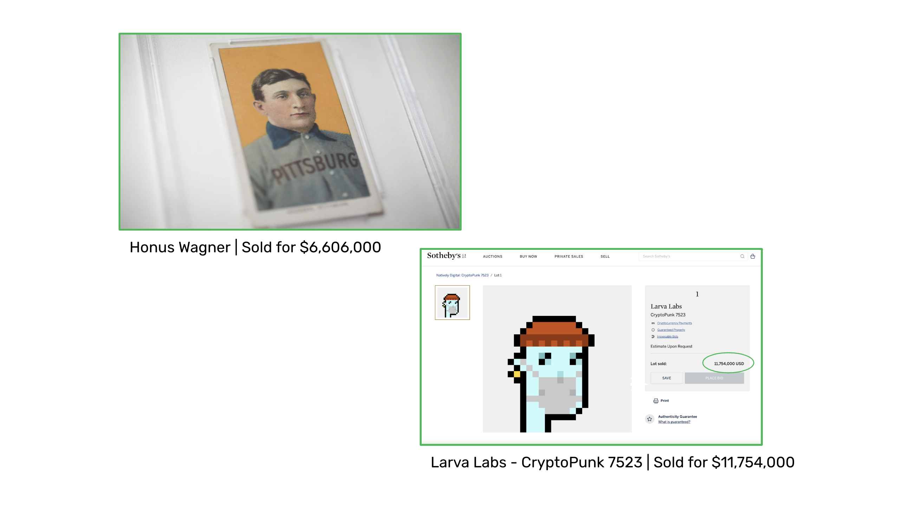
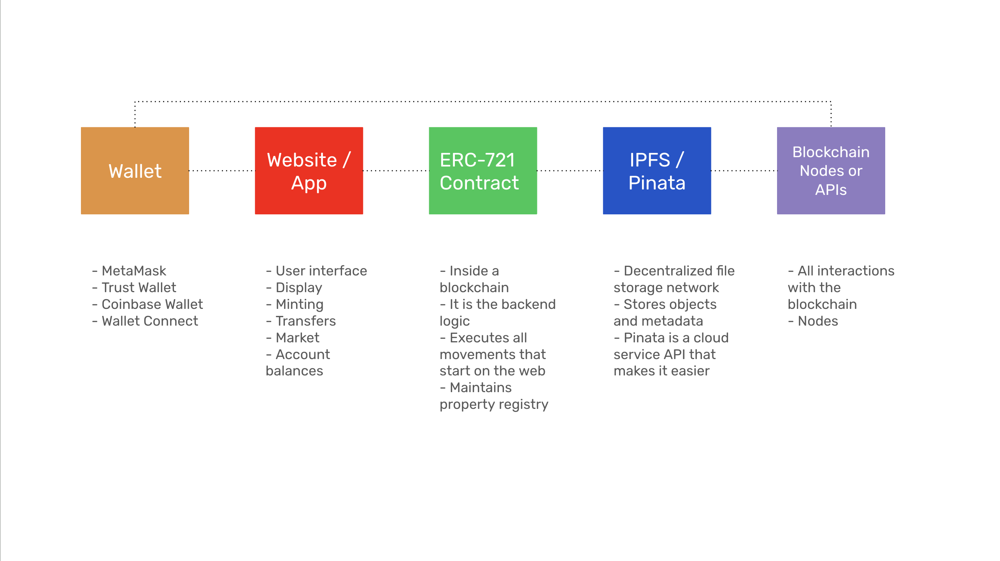
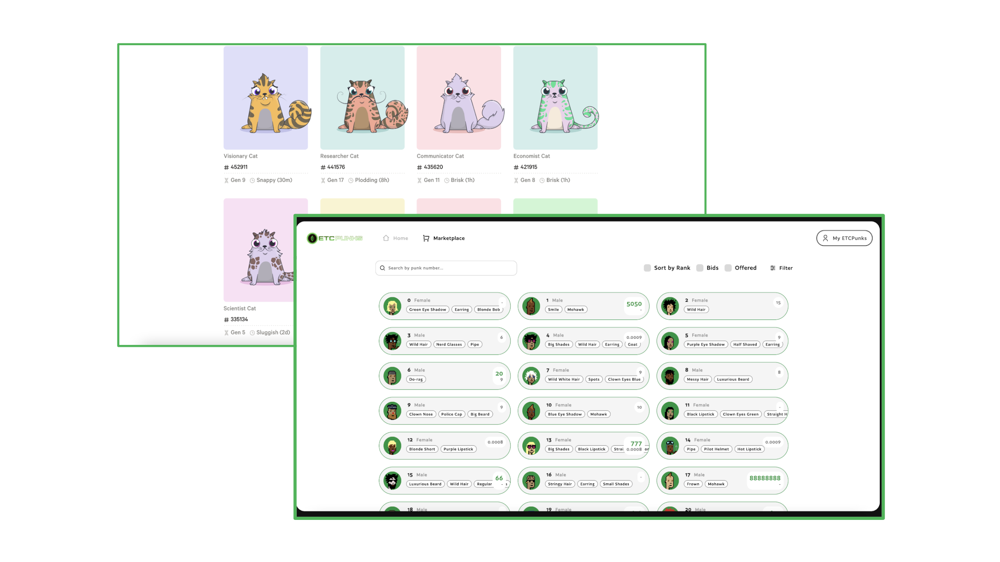
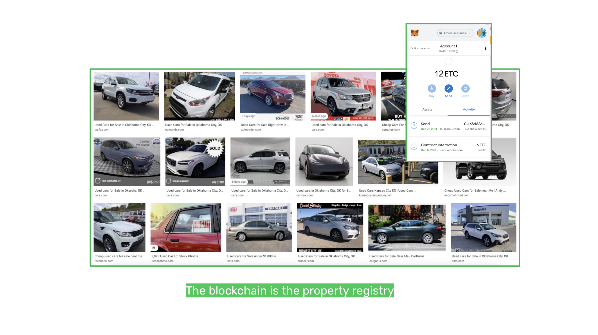
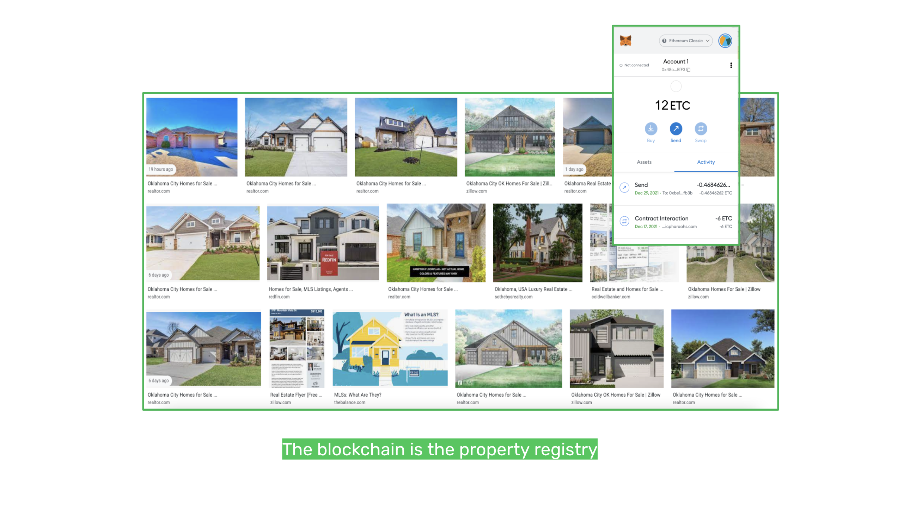

---
**You can listen to or watch this interview here:**

<iframe width="560" height="315" src="https://www.youtube.com/embed/DG2Y8tST2-Q?si=NiU5sb5YOVX73caj" title="YouTube video player" frameborder="0" allow="accelerometer; autoplay; clipboard-write; encrypted-media; gyroscope; picture-in-picture; web-share" allowfullscreen></iframe>

---

One of the major technologies that have caught the attention and been used by the public on the blockchain industry have been NFTs. 

The term “NFT” stands for non-fungible token.

In this class, 35, we will explain NFTs in the following sections. 

The topics that we will cover are:

What Are Non-Fungible Tokens (NFTs)?
Examples of Collectable NFTs
How NFTs Are Built
The ERC-721 Smart Contract
Famous NFTs
Cars Will Be NFTs and Bought and Sold on the Blockchain
Real Estate Will Be NFTs and Bought and Sold on the Blockchain

## What Are Non-Fungible Tokens (NFTs)?

Non-fungible tokens are smart contracts on a programmable blockchain. The standard used is called the ERC-721. Instead of being ERC-20 standard fungible units, they are non-fungible or unique objects on a blockchain.

NFTs may be associated with physical or digital objects, such as cars or real estate, through metadata.

The important features of this kind of non-fungible objects are that they are transferable, they can be bought and sold, and the blockchain serves as the property registry.

NFTs may serve many use cases. The most well known are digital collectibles, but they could also be associated to other unique things such as intellectual property (music, movies, etc.), movable property (cars, trucks, boats, airplanes, etc.), real estate (homes, apartments, land, farms, etc.), other kinds of registrable goods, cash flows (discounted invoices, promissory notes, etc.), contracts, containers, pallets, and other goods and objects in the supply chain in general.

## Examples of Collectable NFTs

Just like in the real world there exists baseball card collecting, NFTs have enabled the collection of digital cards or images, which sometimes have been called “digital art”.

This is because NFT smart contracts may convert digital images into unique digital objects on the blockchain that are transferable. This uniqueness has attracted collectors who have invested millions in buying these objects.

An example of a highly valued real life collectible is the [Honus Wagner baseball card](https://www.mlb.com/news/rare-t206-honus-wagner-baseball-card-sold-for-7-25-million) that was sold for $7.25 million dollars on August 3 2022.

In the case of NFTs, the image of the Larva Labs [CryptoPunk number 7523](https://www.cnbc.com/2021/06/10/covid-alien-cryptopunk-nft-sells-for-11point7-million-in-sothebys-auction.html) was sold for $11.75 million dollars on June 10 2021.

## How NFTs Are Built

NFTs work by associating crypto wallets such as MetaMask to websites or apps. The websites or apps serve as user interfaces, to display the NFTs, for the primary sales or minting, to do transfers, to buy and sell them in the secondary market, and to check account balances.

The ERC-721 smart contracts are inside a programmable blockchain such as Ethereum Classic (ETC). The smart contract is the backend logic of the system, it executes all movements that originate from the web or app, and maintains the property registry of the NFTs.

The digital objects and metadata of NFTs may be stored in decentralized file storage networks such as IPFS. To manage the creation and stock of NFTs on these networks interfaces like Pinata provide tools and services that make it easier.

Finally, for the system to interact with the underlying blockchain it needs to connect to that blockchain’s nodes who receive and process the transactions.

## The ERC-721 Smart Contract

As explained in class 25 of this course, on programmable blockchains developers may deploy ERC-20 tokens that are fungible tokens which may be used to pay for things, vote on DAOs, or as product or corporate fidelity points, amongst many other use cases.

For unique objects that are not fungible, but that represent things in cyberspace or the real world, the ERC-721 token format was created.

The ERC-721 smart contract holds the metadata of objects inside a blockchain. It is the back end logic of an NFT system which executes all transactions that start on the web or from NFT apps.

The ERC-721 smart contract uses the blockchain’s account system to maintain the property registry of all NFTs.

## Famous NFTs

NFTs were invented in 2017 and the first product to launch was Crytpokitties.

At the time, [Cryptokitties](https://www.cryptokitties.co/) caused excitement and furor as users rushed to buy their NFTs and the transaction count on Ethereum skyrocketed, causing GAS fees to skyrocket as well.

On the Ethereum Classic blockchain one of the first and most popular NFT projects is [ETCPunks](https://etcpunks.com/) which sold 10,000 NFTs at 2 ETC a piece.

## Cars Will Be NFTs and Bought and Sold on the Blockchain

Because NFTs may represent any digital or physical object as long as there is unique metadata to associate to it, then movable objects such as cars will likely be registered, transferred, and traded on programmable blockchains such as ETC.

And, because ETC is composable, very complex transactions will be enabled with smart contracts. 

For example, an individual will be able to go to a website, see the car he wants to buy, check car loans and rates, and execute the purchase in one single transaction that would pay for the car, take the car loan, and also transfer full ownership to him. If he were to default on his payments, then the smart contract would proceed to deactivate the car and transfer ownership to the lender.

Car renting could also be done using cars represented as NFTs on the blockchains. As long as the driver has paid for the rent, then the car will be active and the insurance will provide coverage.

## Real Estate Will Be NFTs and Bought and Sold on the Blockchain

In the same way that cars may be registered on programmable blockchains, real estate property registries may also be transferred to these systems enabling complex transactions, while making them more reliable, secure, composable, and instant.

For example, a house could be listed on Ethereum Classic and the buyer could make the down payment, take a mortgage loan, and purchase the home in one transaction. The property title and the mortgage contract would be closed instantly in the same transaction, and everything could be settled and paid in 13 seconds.

And, similar to the car loan and property rights, if the owner were to default on his payments to the mortgage lender, then smart contracts could be coded with the rules of engagement of the jurisdictions in question and proceed to foreclosure or other legal steps.

The same kind of conditions could be programmed when renting homes, staying at hotel rooms, AirBnBs, and other uses of real estate properties.

---

**Thank you for reading this article!**

To learn more about ETC please go to: https://ethereumclassic.org
