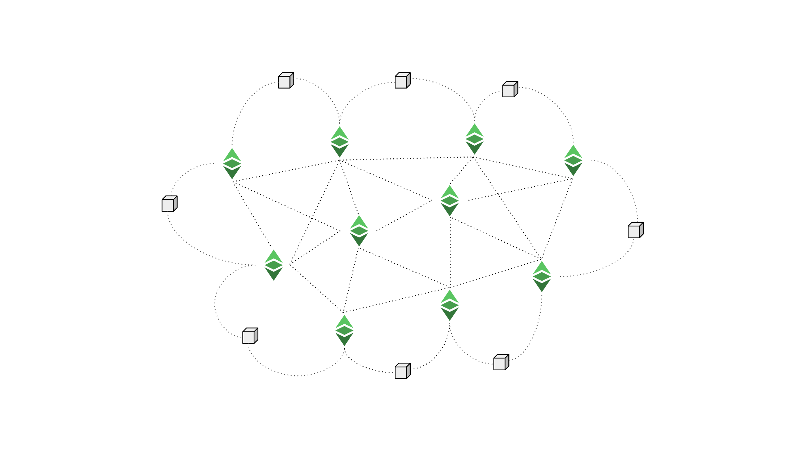

---
**You can listen to or watch this video here:**

<iframe width="560" height="315" src="https://www.youtube.com/embed/q7Imiz1AfFs?si=SdywKUXF1pTOhGqe" title="YouTube video player" frameborder="0" allow="accelerometer; autoplay; clipboard-write; encrypted-media; gyroscope; picture-in-picture; web-share" allowfullscreen></iframe>

---

Scalability means to process more transactions per unit of time. 

Bitcoin processes from 7 to 14 transactions per second, Ethereum Classic (ETC) can process from 7 to 17 transactions per second, but Visa processes 24,000 transactions per second.

This gap of Proof of Work (POW) blockchains with respect to the large traditional payment systems has made a lot of people worry about the lack of scalability in these networks and blame the POW consensus algorithm for it.

Many people think that POW is unscalable because it requires a lot of work, therefore it must process less transactions. 

However, POW is not the cause. The inefficiency is caused by the rule of full replication of the database in all nodes globally, which requires smaller and slower blocks. Proof of Stake and Proof of Authority networks that require full replication have exactly the same inefficiency.

## What Is Proof of Work Based Nakamoto Consensus?

The way nodes in POW blockchains such as Bitcoin and ETC reach consensus every 10 minutes or 13 seconds respectively is by using the Proof of Work Based Nakamoto Consensus mechanism.

The way it works is that the blockchain constantly receives transactions from users; when nodes receive these transactions, they immediately retransmit them to the rest of the nodes so they are fully replicated across the network. When miners receive these transactions, they build blocks using POW and they immediately send them back to the rest of the network for verification. When the nodes verify the blocks, they add them to the chain and pay the rewards to miners. 

This economic model has been working in Bitcoin with a 99%+ uptime since 2009, in ETC since 2014, and in Litecoin since 2011. 

It is a secure and complete method that just works.

## What Is Full Replication?

As mentioned in the previous section, both transactions and blocks are fully retransmitted to all participating nodes in the system. This is done so that all can keep and maintain an identical copy of the whole database.

This full replication of the database is the key security strategy of the blockchain model. The idea is to have all the accounts, balances, and smart contracts replicated in as many computers around the world as possible so they may be as decentralized as possible, and impossible to take down by man or natural events.

However, full replication of databases; let alone ledgers with accounts, balances, and smart contracts; in a totally decentralized way was not possible before, making the systems insecure and dependent on trusted third parties.

The solution to accomplish full replication globally in a totally decentralized way was the Proof of Work algorithm, which is a component of the Nakamoto Consensus design.

## What Is Proof of Work?

POW is the method for participants to make sure that they have a fully replicated copy of the database, all at the same time, in a decentralized and permissionless way.

The way it works is that a subgroup of the nodes of a POW blockchain as ETC, called miners, gather transactions in batches, add to them a time stamp, the hash of the previous block, and a random iterating number called a nonce, and create a new cryptographic hash or stamp for the new block. After this, they immediately check if the hash hit a specific target that the protocol determined. If it didn’t hit the target, then the miners change the random iterating number and try again. If they didn’t hit the target again, then they try again, and again, and again, until one of the miners hits the target and wins the round. 

They may do this trillions of times per second, and this is what uses so much electricity, and is referred to as “proof of work”, because only by working so much is that, statistically, one of the miners will hit the target within the block time.

## How Does Full Replication (And Not POW) Restrict Scalability?

The first thing to understand is that POW can process any size of block at any frequency. It is because of restrictions in retransmission and replication, not POW, that blocks must be small and less frequent.

Below we list several reasons why blocks must be small and less frequent in fully replicated networks, therefore produce less transactions per second:

**1. Bloating:** If blocks were larger and faster, then the database would grow larger very quickly and that would put pressure on node operators who have to keep up with sufficient computational storage to maintain the nodes. This would reduce the number of nodes in the chain and increase centralization. It would also go against a major principle in the industry which is to “run your own node” as people would prefer to use third party nodes rather than their own.

**2. Technical:** Related to bloating and centralization, the technical reasons why larger and faster blocks would be disadvantageous are that they would require higher bandwidth, thus limiting the areas in the world that could process the data; they would require more powerful CPUs for validating the blocks, limiting the reach to operators with more capacity; and the initial blockchain download time (IBD) for new entrants or re-entrants would be very long, creating an additional barrier to participating in the system.

**3. Miner economics:** As the monetary policy in Bitcoin and ETC is decreasing and capped, miners will depend on fee revenues in the future. If blocks were larger and faster, then transaction fees would be lower. With scarce block space and low frequency, then fees will be higher thus financing the security that miners provide to these networks with their hashing power.

**4. Block propagation:** If blocks were larger, block propagation would be slower. This would benefit the larger miners and eliminate the smaller miners from the network, and would make mining centralized.

Larger miners would benefit with slower propagation because, when miners find new blocks, they immediately start building the next one as the one they found gets propagated. The slower the propagation would be, the more time miners would have to gain an advantage over their competitors. 

As the bigger miners find more blocks than their competition, then they would have this slow block propagation advantage more frequently and make more money, therefore pushing out of business the smaller miners.

## Scalability Must Be Sought Through Higher Layers

Due to the threats of centralization, bloating, and the inability to run your own node pointed out in the previous section, it is important to keep blocks in POW networks smaller and slower.

The best way to gain more scalability is to accomplish it as most technologies do, which is to build layers on top of the less scalable but more secure components.

This means to create higher layer systems, such as channels, rollups, and Proof of Stake networks, that may process enormous numbers of transactions; to have them net out the transactions, and to settle the larger amounts on the base layer POW systems.

In this way, the base layer would provide the security and the higher layers would provide the scalability, making the whole stack much safer and practical.

Users in the world who wish higher security will have to pay higher fees. Users who prefer faster and cheaper transactions will be able to use the higher layers.

---

**Thank you for reading this article!**

To learn more about ETC please go to: https://ethereumclassic.org
