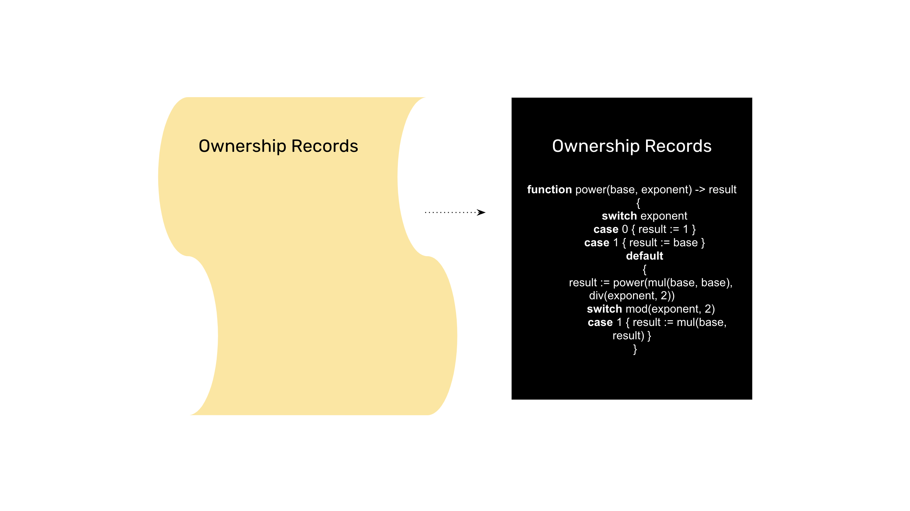
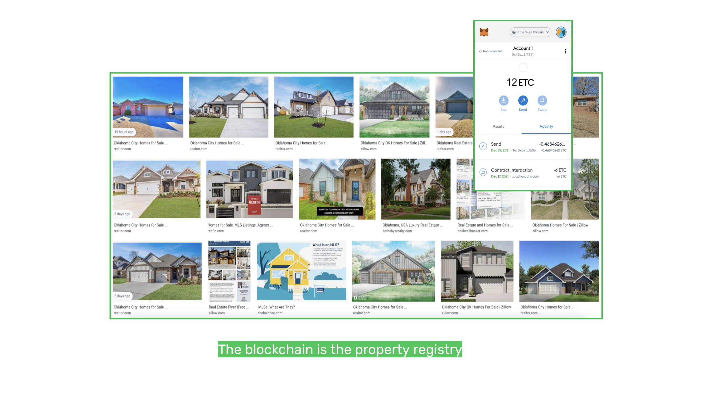
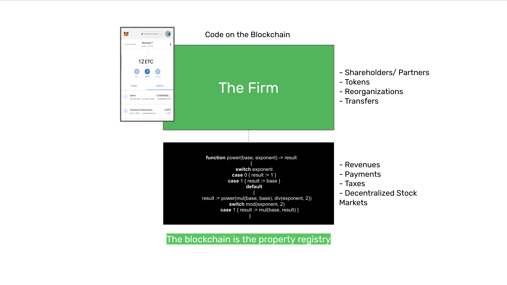
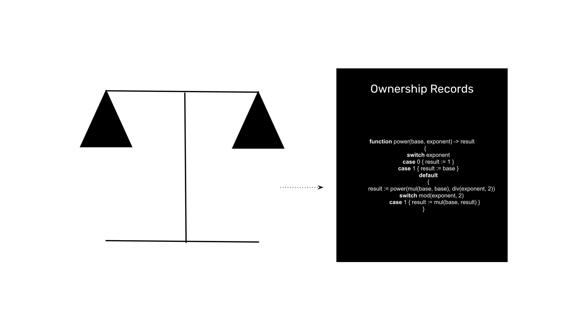

---
**You can listen to or watch this interview here:**

<iframe width="560" height="315" src="https://www.youtube.com/embed/srxeVLmK6TU?si=wOOxcJJFLcmqKOjd" title="YouTube video player" frameborder="0" allow="accelerometer; autoplay; clipboard-write; encrypted-media; gyroscope; picture-in-picture; web-share" allowfullscreen></iframe>

---

In our previous class, 35, we explained what are non-fungible tokens (NFTs) and how they may be used not only for digital images or art, but also to represent all sorts of registrable objects. 

As long as digital or real world objects have unique metadata to associate to them; such as address, manufacturer, brand, serial numbers, etc; then, they may be connected to NFTs and held and transferred inside programmable blockchains, such as Ethereum Classic (ETC).

In this class, 36, we will explore how both NFTs and ERC-20 tokens; which are fungible tokens, as explained in class 25; together with the blockchain’s account system, may be used to recreate ownership records and property registries on these networks.

## Cars Will Be NFTs and Bought and Sold on the Blockchain

As said above, because NFTs may represent any digital or physical object as long as there is unique metadata to associate to them, then movable objects, such as cars, will likely be registered, transferred, and traded on programmable blockchains, such as ETC.

And, because ETC is composable, very complex transactions will be enabled with smart contracts. 

For example, an individual will be able to go to a website, see the car he wants to buy, check car loans and rates, and execute the purchase in one single transaction that would pay for the car, take the car loan, and also transfer full ownership to him. If he were to default on his payments, then the smart contract would proceed to deactivate the car and transfer ownership to the lender.

Car renting could also be done using cars represented as NFTs on the blockchains. As long as the driver has paid for the rent, then the car will be active and the insurance will provide coverage.

## Real Estate Will Be NFTs and Bought and Sold on the Blockchain

In the same way that cars may be registered on programmable blockchains, real estate property registries may also be transferred to these systems enabling complex transactions, while making them more reliable, secure, composable, and instant.

For example, a house could be listed on Ethereum Classic and the buyer could make the down payment, take a mortgage loan, and purchase the home in one transaction. The property title and the mortgage contract would be closed instantly in the same transaction, and everything could be settled and paid in 13 seconds.

And, similar to the car loan and property rights, if the owner were to default on his payments to the mortgage lender, then smart contracts could be coded with the rules of engagement of the jurisdictions in question and proceed to foreclosure or other legal steps.

The same kind of conditions could be programmed when renting homes, staying at hotel rooms, AirBnBs, and other uses of real estate properties.

## Corporations, Partnerships, and Nonprofits Will Be ERC-20 Tokens and Booked on Blockchains

As the firm is a registrable object, then all kinds of legal personhood, such as corporations, partnerships, and nonprofits, will be registered on blockchains such as ETC.

The protocol’s account system will be used as the addresses that owners will use to control their shares; and ERC-20 smart contracts will be the legally recognized entities themselves, which will have all the corporate rules integrated into them.

Shareholders or partners will control their percentages in these firms through their tokens, they will vote on corporate decisions, implement reorganizations, and execute transfers, mergers and acquisitions through these decentralized programs.

The ERC-20 token smart contracts will receive the corporate revenues and make payments to all constituents, including dividends, salaries, accounts payable, and taxes.

In the case of for profit organizations, their shares will trade on decentralized exchanges inside ETC, which were explained on class 33 of this course.

## Relationship Between the Law and Property on the Blockchain

It is important to differentiate between law and blockchain.

The blockchain only enforces possession and control of objects, it is not a legal instrument in itself. It is more or less like driving a car because you have the keys; that you have control over it does not necessarily mean that you own it, it could also mean that you rented it or even stole it.

Ownership and property are legal abstractions that are enforced outside of the blockchain. The blockchain is the physical aid where the property may be booked and enforced.

Additionally, that transactions and transfers occur on the blockchain does not change that people will not have disputes about the ownership of things. A person may have 1,000 ETC in their account because they inherited them, but a sibling may be suing because they think they correspond to them.

Disputes will continue to be resolved through legal systems.

However, it is very likely that blockchains will eventually be officially recognized as property registries, and all registrable property and legal contracts governing them will, indeed, be booked in them.

---

**Thank you for reading this article!**

To learn more about ETC please go to: https://ethereumclassic.org
