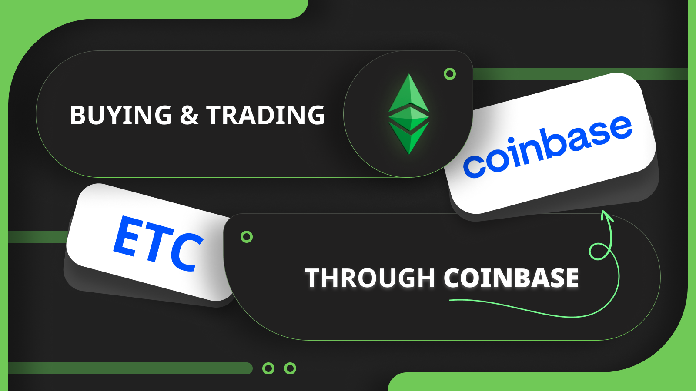
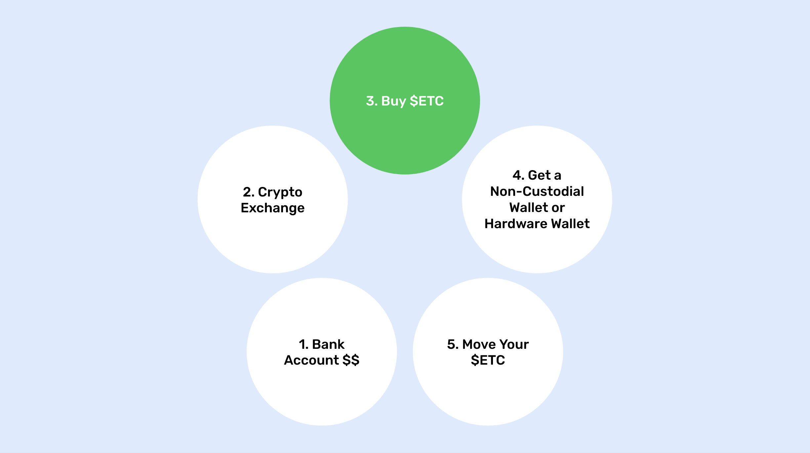
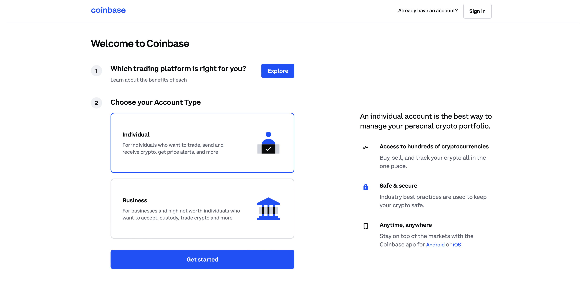
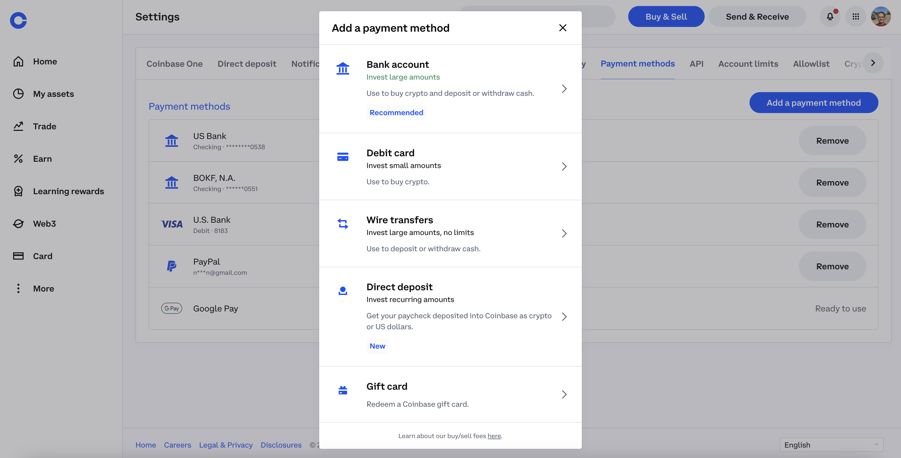
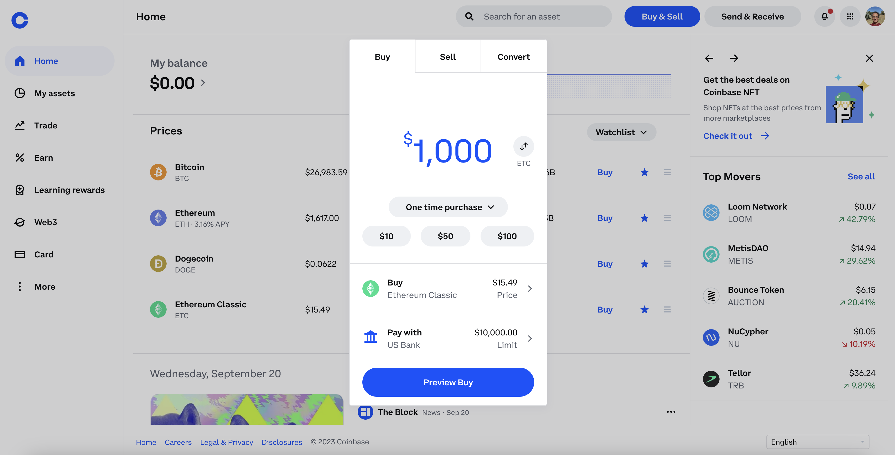
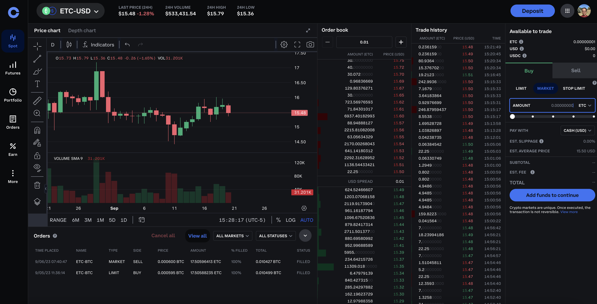
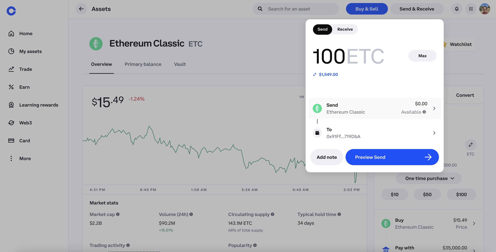
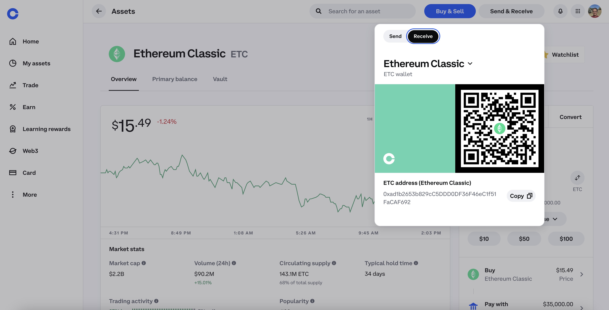
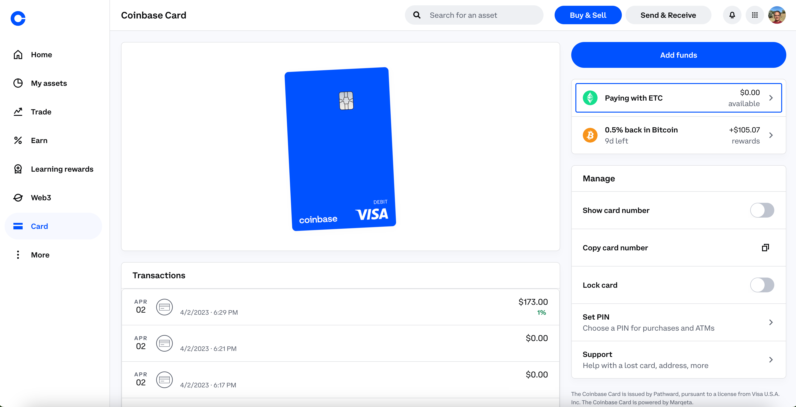

---
**You can listen to or watch this interview here:**

<iframe width="560" height="315" src="https://www.youtube.com/embed/YpmOSvWV4w4?si=CZ_w8HeEZ7zqPw6h" title="YouTube video player" frameborder="0" allow="accelerometer; autoplay; clipboard-write; encrypted-media; gyroscope; picture-in-picture; web-share" allowfullscreen></iframe>

---

## What Is Coinbase?

Coinbase is a centralized cryptocurrency exchange.

A centralized cryptocurrency exchange (CEX) is a virtual location on the internet that serves as a meeting point for trading crypto assets such as Bitcoin (BTC) and Ethereum Classic (ETC).

Coinbase provides its servers over the internet for its customers to open accounts, send money, and start exchanging BTC, ETC, Ethereum (ETH), and other tokens.

CEXs must follow regulations, so they may be very restrictive, demanding customers to present evidence of identity and residence, performing background checks, and asking what is the source of their funds.

Among the risks of centralized exchanges is that they may go bankrupt and customers may lose their deposits and assets.

Coinbase in particular is one of the largest cryptocurrency exchanges in the world, it started operations in the United States in 2012, and now has a vast international presence.

## Moving Your ETC to Non-Custodial Wallets

Although you may be using a centralized cryptocurrency exchange for buying and trading in Ethereum Classic, the best way to manage your ETC is to buy them in the centralized exchanges but then moving them to non-custodial wallets that you control.

The steps are as follows:

1. You start with your cash in your bank account
2. You move your cash to the crypto exchange
3. You buy ETC at the crypto exchange
4. You get a non-custodial wallet or hardware wallet
5. You move all your ETC to your non-custodial wallet

The above method is the most secure method because you end up with your ETC on the blockchain directly, under your own control with your private keys, rather than at the centralized exchange, under their control.

In other words, it is more trust minimized.

## Opening a Coinbase Account

The first step to create your account on Coinbase will be to select the type of user you are, individual or business (in this post we will refer to individual users), and then proceed to the following stages.

As an individual, you need to enter your email and select a strong password. Then Coinbase will ask you to verify your email. Coinbase will also ask you for your cell phone number and ask you to verify it as well.

The next step is to add your personal information, which will include your full name, your address, and a government ID.

Coinbase uses identity verification in order to comply with Know Your Customer (KYC) laws. This means you will need to get an identity document, such as drivers license or passport, take photos of it and submit them to Coinbase through your computer or your Coinbase phone app.

## Connecting a Bank Account and Depositing Money

After creating your account on Coinbase, you will be prompted to connect a bank account to your Coinbase profile. This is to move fiat money to your Coinbase account and then be able to buy ETC.

The payment methods available to connect in the United States are bank accounts, debit cards (no credit cards yet), wire transfers, direct deposits, and gift cards. 

As may be seen in the background of the image in this section, we have our bank accounts, a debit card, and our PayPal account connected to Coinbase. This means that Coinbase also accepts PayPal to receive and send funds.

## The Two Ways of Buying ETC on Coinbase

Once you are all set with an account and transferred fiat money to your Coinbase account, you will be ready to buy ETC.

There are two ways of buying ETC, the first one is the more rudimentary, which is to click on the “Buy & Sell” button on the top right of the Coinbase website or on your app. This method is just to buy and leave your ETC in your account, or to transfer them to your non-custodial wallet.

The second way is to use “Coinbase Advanced”, which is a professional trading platform for traders or large volume customers.

In both cases the commissions vary according to your accumulated trading volume. But, they hover around 0.6% for medium and small trades.

Once you buy your ETC, they will be credited to your account and stay there until you move them or sell them again.

## Sending ETC

When you buy ETC on Coinbase they will become available to withdraw after a few days so you will be able to send them to your non-custodial wallet or other destinations.

It may take a few days because your cash from the bank actually takes several days to move from your bank to Coinbase. However, if you live in a jurisdiction that has instant bank transfers or other fast money transfer systems, you may have your purchased ETC available for withdrawal sooner.

The way to send your ETC to your non-custodial wallet or to any other destination is by clicking on the “Send & Receive” button on the top right of the website or on your app.

When the box opens, then you can put the ETC address of your non-custodial wallet, or you can send to any other address, or an email, or phone number.

Sending by email or phone number is for transferring to other Coinbase customers, or for sending ETC to someone who does not have an account on Coinbase yet. In this case, they will receive a notification to open an account.

## Receiving ETC

To receive ETC, you click on the same “Send & Receive” button mentioned in the previous section.

When the box opens, you need to click on the “Receive” tab, so an address to receive ETC will be displayed together with its corresponding QR code that you may show to others to scan it.

When receiving ETC, you will see your new balance within 13 to 39 seconds, but it will not be available for trading or withdrawal for 3,000 confirmation, which is around 11 hours. Confirmation times vary per exchange and per coin.

## Using the Coinbase Visa Debit Card With ETC

A cool feature on Coinbase is that you can apply for their Visa debit card that has a cashback rate of 1% to 4%.

This cashback is not credited in your local currency, but in crypto. You may choose in which coin you wish to receive your cashback on the “Card” page on your Coinbase account.

As may be seen in the image in this section, we selected to pay our purchases in ETC and receive our cashback in BTC because Coinbase does not have ETC listed as a cashback coin yet.

The way it works is that the Visa card is a debit card and actually pays merchants in your local fiat money. What they do is that they sell some ETC to cover your purchases each time you buy something.

This is a convenient way to have your money in ETC, but at the same time use it for your daily expenses.

## Who Uses Coinbase for Buying and Selling ETC?

**Investors:** ETC is an excellent long term investment alternative. This has attracted many investors who use exchanges such as Coinbase to transfer their fiat money to exchange it for Ethereum Classic. However, these ETC buyers should think of moving their holdings to non-custodial wallets as explained before, so their assets may be more secure.

**Miners:** A segment that uses exchanges frequently to trade ETC are miners. Ethereum Classic miners earn an average of 17,000 ETC per day, but they have to pay for their operations, which include payroll, data center costs, and electricity costs. For this they usually liquidate some of their daily earnings on exchanges such as Coinbase to transform them into cash to pay for their bills.

**Speculators:** Trading volumes on ETC are relatively high globally and much of this is by speculators who trade daily on exchanges such as Coinbase. These participants are beneficial to the ecosystem as they provide liquidity to all other buyers and sellers.

**Merchants:** Although still small, the use of ETC for buying a selling things in the broader economy is growing. Merchants who let their customers purchase items with ETC will use centralized exchanges as Coinbase to liquidate their holdings for paying for their business expenses.

---

**Thank you for reading this article!**

To learn more about ETC please go to: https://ethereumclassic.org
