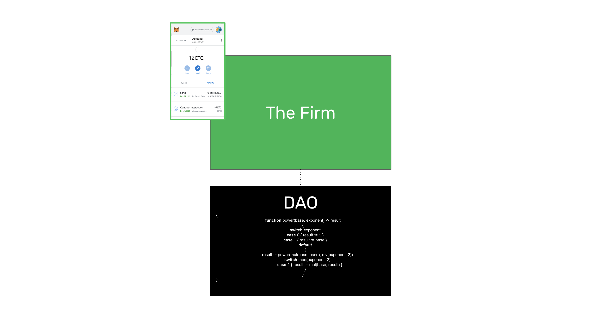
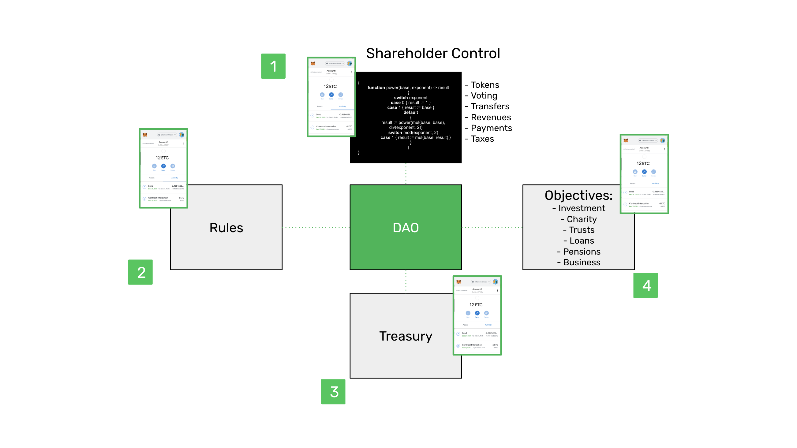
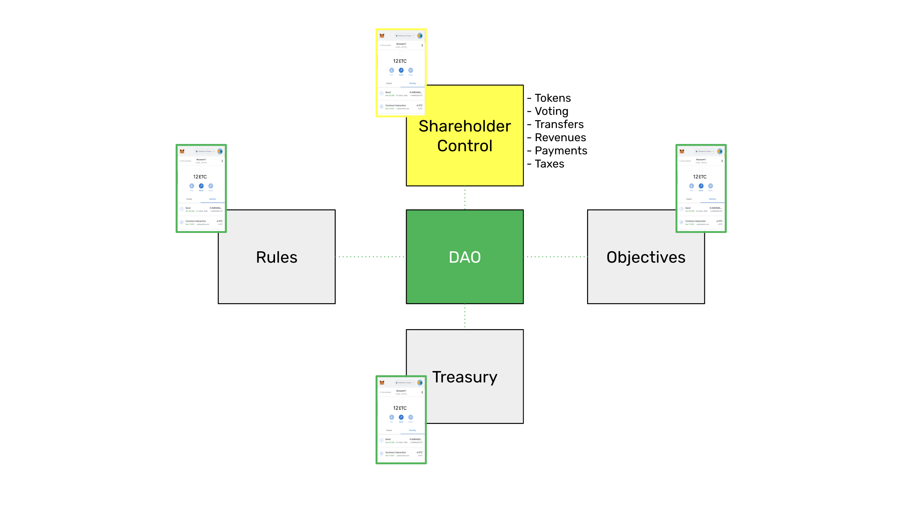
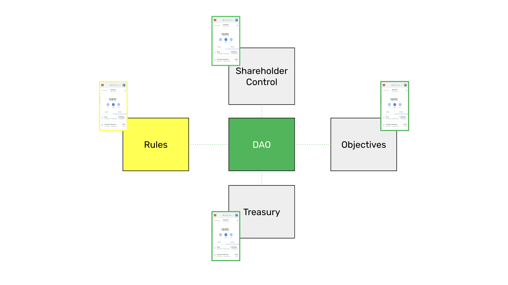
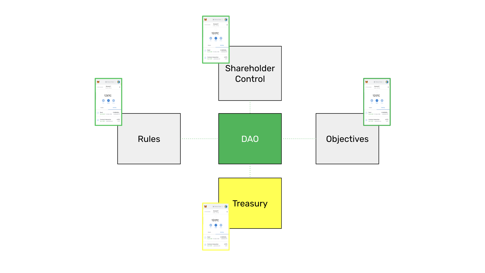
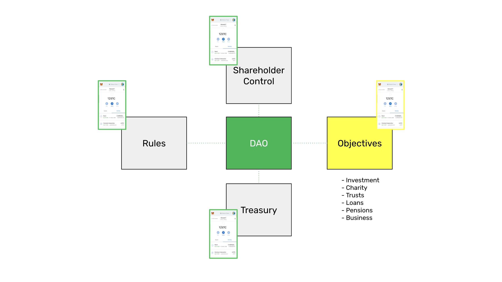

---
**You can listen to or watch this interview here:**

<iframe width="560" height="315" src="https://www.youtube.com/embed/zwr33NBOeH0?si=ZhUufFhbHp5Bdmuo" title="YouTube video player" frameborder="0" allow="accelerometer; autoplay; clipboard-write; encrypted-media; gyroscope; picture-in-picture; web-share" allowfullscreen></iframe>

---

In the previous class, 36, we explained how ownership records and property registries will likely work on blockchains such as Ethereum Classic (ETC).

As legal persons such as corporations, partnerships, and nonprofits are registrable objects that exist outside of blockchains, we explained how these could be transported to programmable blockchains with the aid of ERC-20 tokens.

In this class, 37, we will expand on how individuals or groups will create and manage these kinds of organizations on blockchains that will be defined as decentralized autonomous organizations or DAOs.

## What Is the Firm?

In economics we could say that there are different types of economic agents, the most basic of which are the individual and the firm.

The firm is basically a group of individuals who decide to form an organization to pursue a certain goal, which may be for profit or nonprofit.

In the broader economy, activity is divided between the market and firms. Firms, are organizations that individuals form because it would be too costly to procure the services of the group, with its division of labour and specialization, in the free market on a daily basis. It is more efficient to establish stable contracts where the work is continuous and agreed upon once, rather than to search, hire, and train the same resources all over again more frequently.

In modern times, the firm has acquired legal personhood.

## How Do Firms Exist in the Real World?

A firm or legal person may be an individual or a group that is recognized as a person for legal purposes such as for entering into contracts, hiring employees, buying and selling, getting permits and licenses, or to support a cause or a set of beneficiaries.

Although there are more variations, legal persons usually exist today in many jurisdictions as corporations, partnerships, or nonprofits. These classifications determine the legal and fiscal status of these organizations such as the extent of their liability; how ownership, control, and shares are distributed; and what tax treatment they will get.

In any of the cases, these organizations consist of coordinating the work of people, under a certain set of rules, to manage treasuries or cash flows.

## What Are DAOs?

The acronym “DAO” stands for “decentralized autonomous organization”. The term “autonomous” is a misnomer as these entities depend on the instructions of their token holders to perform actions, but it refers more to the fact that their code is immutable once deployed on the blockchain.

Technically, DAOs are smart contracts on blockchains such as Ethereum Classic that use the native account system of ETC, and add the functionality of ERC-20 tokens to distribute ownership, control, and shares of the persons who participate in the organization.

When they eventually become recognized legally, DAOs will act as legal persons and have shares (or tokens), shareholders, partners, revenues, and payments, and they will follow regulations and pay taxes.

Just like their traditional counterparts, their tokens will be transferable and tradeable in markets such as decentralized exchanges, and mergers and acquisitions will be possible as well.

## How Will DAOs Fulfill the Role of the Firm?

As said before, DAOs are smart contracts inside blockchains such as ETC. 

As organizations that respond to human groups, a way to describe them could be divided in four parts:

1. Shareholder control

2. Rules

3. Treasury

4. Objectives

### 1. Shareholder Control

Shareholder control is the facet of DAOs that concerns all its governance aspects.

Just as traditional legal persons and organizations have ownership shares, voting, transfers, revenues, expenses, and tax liabilities, DAOs will have ownership tokens, voting through these tokens, token transfers, revenues, expenses, and even tax liabilities.

DAO smart contracts will execute transactions sent by their token holders through their crypto wallets and implement every instruction, as traditional corporations do.

DAOs will provide an unprecedented level of transparency never seen before, and their records will be orders of magnitude more secure than when stored in traditional systems.

### 2. Rules

In traditional legal persons, the bylaws are the sets of rules that govern things like the location and jurisdiction of their offices, processing and approving the budget, things concerning shareholders’ and directors’ meetings, voting rights, and powers and duties of directors and management.

In DAOs all these rules will be coded in their smart contracts and token holders and authorized management will executed their rights and obligations by using their crypto wallets and sending transactions to the decentralized autonomous organization.

### 3. Treasury

One of the most important roles of blockchains is securing wealth and treasure.

DAOs will hold the treasuries of corporations, partnerships, and nonprofits. They will receive the revenues, pay all expenses, pay dividends, and execute these transactions in a composable and automated way.

Composability will enable that when income is received, then proportional payments will automatically be sent to all constituents of the organization, such as providers, employees, and token holders.

This will enable what may be called “continuous cash flows” or “continuous treasuries”, which is the continuous receipt of revenues and continuous payment of contracts, wages, and dividends rather than at set weekly, monthly, quarterly, or annual periods, as it is today.

### 4. Objectives

As corporations, partnerships, and nonprofits work today in traditional systems, DAOs will also have specific goals, work in specific industries or economic sectors, and will have either for or nonprofit objectives.

DAOs will be formed by people or groups for investment purposes, charity, trusts, to provide funding for loans, for pensions funds, and for business in general.

## DAOs and the Law

It is important to note that corporate personhood is a legal abstraction that will only exist in traditional legal systems, therefore will not be replaced per se. 

The law between people will not be dissolved or replaced by blockchain systems. The law will adapt to blockchain systems. The fact that people are associated through DAOs does not exempt them from their legal and fiscal obligations.

Raw DAOs are considered partnerships with no limited liability, they are not exempt from legal and tax liability, and DAO tokens can be considered securities.

Smart contract code is just “the law” inside a blockchain, this is what is meant in ETC by “code is law”.

However, all legal entities will very likely be booked on blockchains such as Ethereum Classic, eventually.

---

**Thank you for reading this article!**

To learn more about ETC please go to: https://ethereumclassic.org
