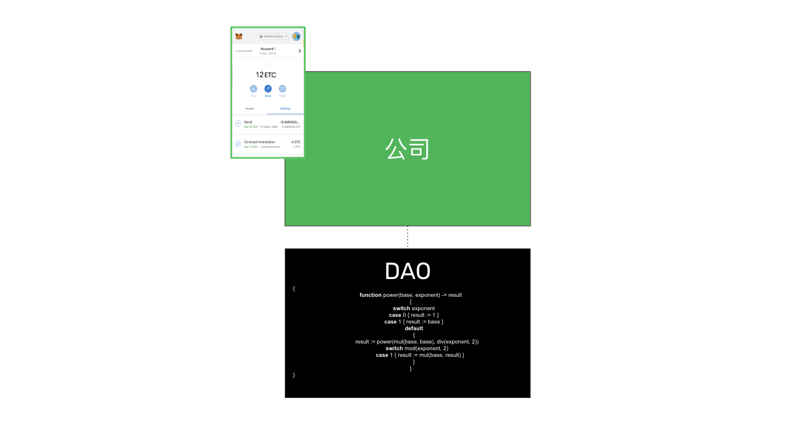
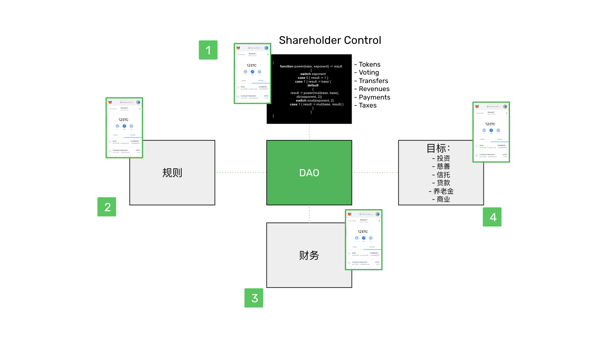
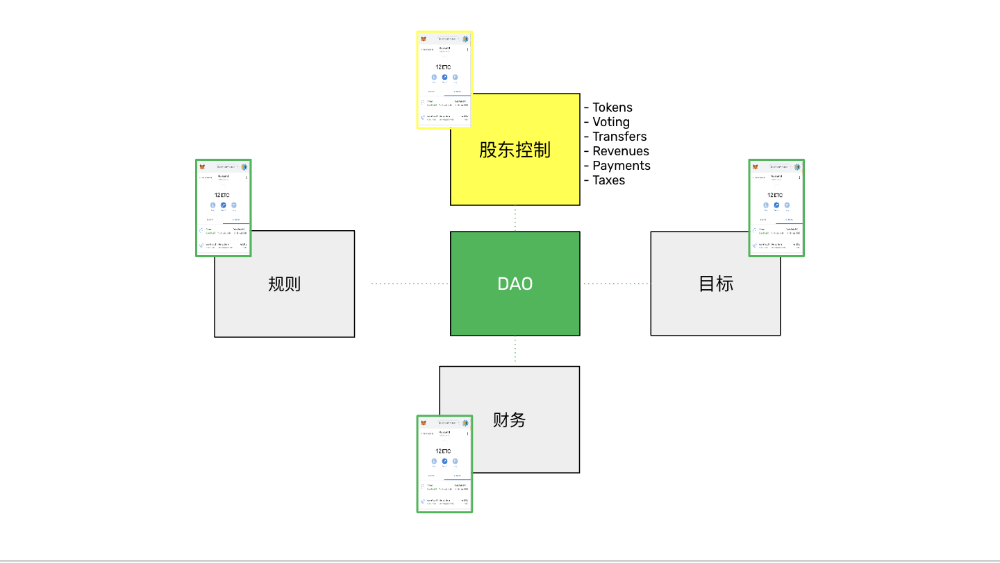
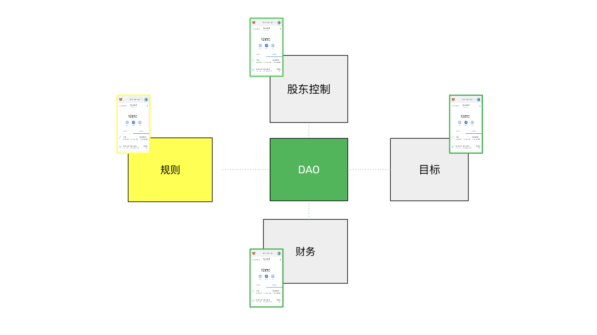
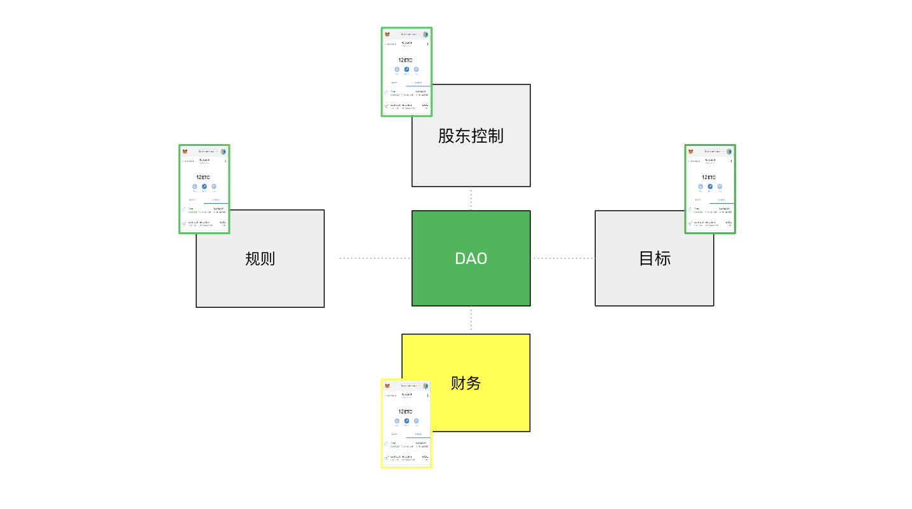
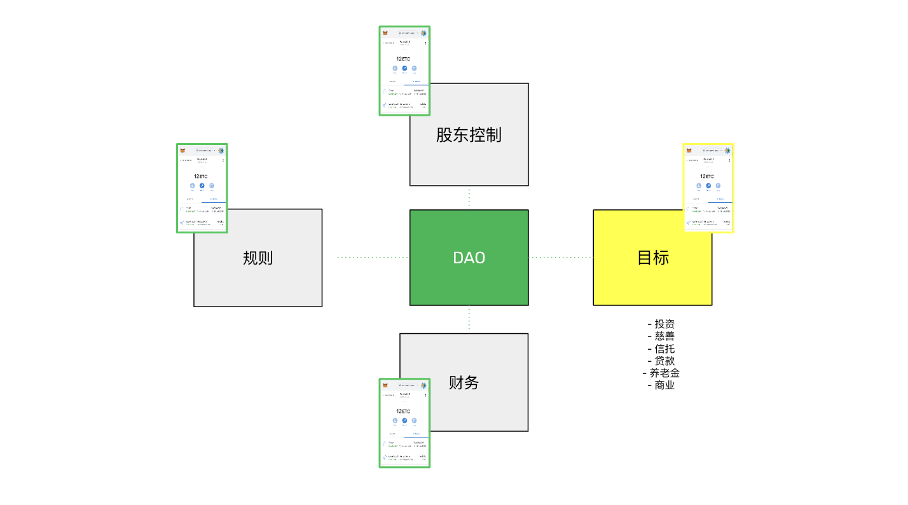

---
**您可以在这里收听或观看这个访谈:**

<iframe width="560" height="315" src="https://www.youtube.com/embed/zwr33NBOeH0?si=ZhUufFhbHp5Bdmuo" title="YouTube video player" frameborder="0" allow="accelerometer; autoplay; clipboard-write; encrypted-media; gyroscope; picture-in-picture; web-share" allowfullscreen></iframe>

---

在之前的第36课中，我们解释了在以太坊经典（ETC）等区块链上所有权记录和财产登记可能是如何工作的。

由于法人实体，如公司、合伙企业和非营利组织是存在于区块链之外的可注册对象，我们解释了如何借助ERC-20代币的帮助将它们转移到可编程区块链上。

在本课程的第37课中，我们将深入探讨个人或团体如何在被定义为去中心化自治组织或DAO的区块链上创建和管理这些类型的组织。

## 什么是公司？

在经济学中，我们可以说有不同类型的经济主体，其中最基本的是个人和公司。

公司基本上是一群决定组成一个组织来追求某种目标（可以是盈利或非盈利的）的个人。

在更广泛的经济中，活动分为市场和公司。公司是个人组成的组织，因为在自由市场上，每天都购买该组的服务，具有劳动分工和专业化，因此形成这些组织将更加高效。建立稳定的合同，工作连续进行并且只需一次协议达成，比经常寻找、雇佣和培训相同资源更为高效。

在现代，公司已获得法律主体地位。

## 现实世界中公司如何存在？

公司或法人可以是个人或一群被视为法律上的人的个人或团体，例如用于签订合同、雇佣员工、买卖、获取许可和执照，或支持某一事业或一组受益人。

尽管还有更多的变种，但在许多司法管辖区中，法人通常以公司、合伙企业或非营利组织的形式存在。这些分类决定了这些组织的法律和财务地位，例如它们的责任范围、所有权、控制权和股份的分配方式，以及它们将获得的税收待遇。

在所有这些情况下，这些组织的工作包括协调人们的工作，在一定的规则下管理财政或现金流。

## 什么是DAOs？

缩写“DAO”代表“去中心化自治组织”。尽管术语“自治”是一个错误的称谓，因为这些实体依赖于其代币持有人的指示来执行操作，但它更多地指的是它们的代码一旦部署在区块链上就无法更改。

从技术上讲，DAOs是基于诸如以太坊经典（ETC）之类的区块链上的智能合约，它们使用ETC的本地账户系统，并添加了ERC-20代币的功能，以分配参与组织的个人的所有权、控制和股份。

当它们最终在法律上被承认时，DAOs将作为法律主体，拥有股份（或代币）、股东、合作伙伴、收入和付款，并遵循法规并支付税款。

与传统对应物一样，它们的代币将可以在去中心化交易所等市场上转让和交易，同时合并和收购也将成为可能。

## DAOs将如何履行公司的角色？

如前所述，DAOs是存在于以太坊经典等区块链上的智能合约。

作为响应人类群体的组织，可以将它们描述为以下四个部分：

1. 股东控制

2. 规则

3. 财政

4. 目标

### 1. 股东控制

股东控制涉及DAO的所有治理方面。

正如传统法人和组织拥有所有权股份、投票、股份转让、收入、支出和税务责任一样，DAOs将拥有所有权代币、通过这些代币进行投票、代币转让、收入、支出，甚至税务责任。

DAO智能合约将执行由其代币持有人通过他们的加密钱包发送的交易，并实施每一项指令，就像传统公司一样。

DAOs将提供前所未有的透明度水平，其记录将比存储在传统系统中安全得多。

### 2. 规则

在传统法人中，公司章程是管理诸如办事处的位置和管辖权、处理和批准预算、关于股东和董事会会议、投票权以及董事和管理层权力和职责等事项的规则集。

在DAOs中，所有这些规则将编码在它们的智能合约中，代币持有人和授权管理人员将使用他们的加密钱包，并向去中心化自治组织发送交易来执行他们的权利和义务。

### 3. 财政

区块链的最重要作用之一是保护财富和宝藏。

DAOs将持有公司、合伙企业和非营利组织的财政。它们将收到收入，支付所有支出，支付股息，并以可组合和自动化的方式执行这些交易。

可组合性将使得当收入收到时，相应的付款将自动发送给组织的所有成员，如供应商、员工和代币持有人。

这将实现所谓的“连续现金流”或“连续财政”，即持续收入和持续支付合同、工资和股息，而不是像今天一样在固定的每周、每月、每季度或每年时段内进行。

### 4. 目标

正如今天的公司、合伙企业和非营利组织在传统系统中工作一样，DAOs也将有具体的目标，工作在特定的行业或经济部门，并且将有盈利或非盈利的目标。

DAOs将由个人或团体为投资、慈善事业、信托、提供贷款融资、养老金基金以及一般业务目的而组成。

## DAOs与法律

需要注意的是，法人地位是一种法律抽象概念，仅存在于传统法律体系中，因此不会被本质上替代。

人与人之间的法律将不会因为区块链系统而消失或被替代。法律将适应区块链系统。与DAOs相关的事实并不免除它们的法律和财务义务。

原始的DAOs被视为没有有限责任的合伙企业，它们不免于法律和税务责任，DAO代币可以被视为证券。

智能合约代码只是区块链内部的“法律”，这是以太坊经典（ETC）中所指的“代码即法律”。

然而，所有法律实体很可能最终会被记录在以太坊经典等区块链上。

---

**感谢您阅读本期文章!**

了解更多有关ETC，欢迎访问: https://ethereumclassic.org
