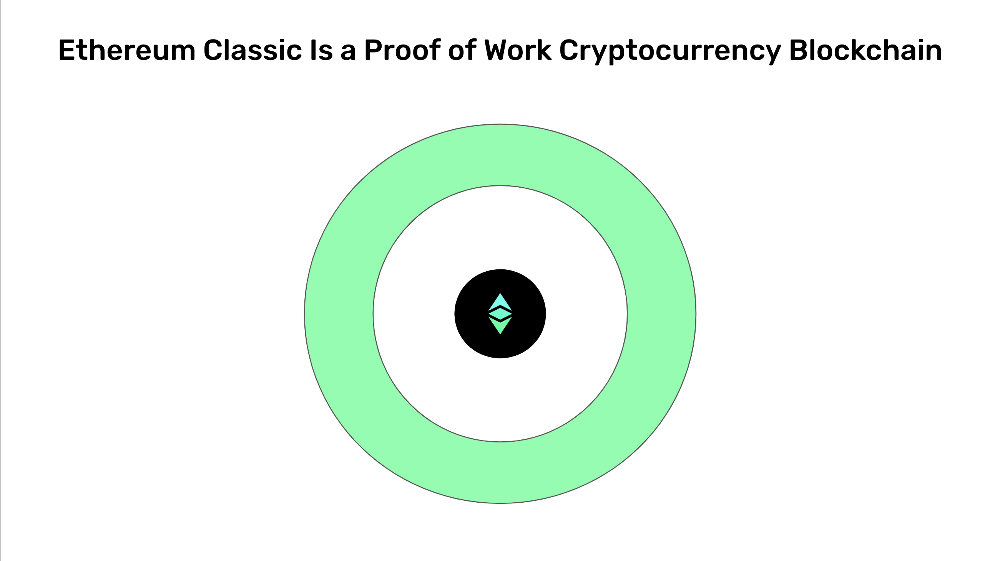

---
**You can listen to or watch this interview here:**

<iframe width="560" height="315" src="https://www.youtube.com/embed/hh6qsIeXaYI?si=1MEQgIgTgU7dbR88" title="YouTube video player" frameborder="0" allow="accelerometer; autoplay; clipboard-write; encrypted-media; gyroscope; picture-in-picture; web-share" allowfullscreen></iframe>

---

The Ethereum Classic cryptocurrency, ETC, exists inside the ETC blockchain, which is a proof of work network. In this post we will explain what is a cryptocurrency, a blockchain, a consensus mechanism, proof of work, and why proof of work is superior to other consensus mechanisms in the industry.

This is part one of a four part series that will explain what is Ethereum Classic from four angles. The titles of this series will be:

1. Ethereum Classic Is a Proof of Work Cryptocurrency Blockchain

2. Ethereum Classic Has a Supply Cap Like Bitcoin

3. Ethereum Classic Is a Smart Contracts Cryptocurrency Blockchain

4. Ethereum Classic Is Property Rights on a Global Scale

## What Is a Cryptocurrency?

When a group of computer scientists in the 90’s called Cypherpunks started to search for ways to create and implement a form of money native to the internet, they imagined systems that would imitate gold, but digitally.

Although the components existed, it was very difficult to close all the loopholes to recreate this digital gold they were seeking. 

However, they did imagine a design where a new unit of value would be issued in exchange for computational work that some computers in a network would do. This gave rise to Bitcoin (BTC) in 2009 and then Ethereum Classic (ETC) in 2015.

When a unit of value or token is issued in exchange for computational work in a network, it is called a cryptocurrency. The prefix “crypto” refers to the fact that these networks use cryptography as part of their critical components and to generate the computational work.

## What Is a Blockchain?

The networks in which these cryptocurrencies exist are called blockchains.

The term “blockchain” derives from the phrase “chain of blocks” because the way these system process transactions involves receiving them, packaging them into batches, sealing the batches with a cryptographic stamp, and then adding them as a new block to the database, forming a chain of blocks.

BTC adds a new block of transactions every 10 minutes and ETC does it every 13 seconds.

In the cryptocurrency industry the terms “cryptocurrency” or “blockchain” are used interchangeably to refer to them. For example, Ethereum Classic may be called “ETC” or a “cryptocurrency” or a “blockchain”.

The way all computers globally reach consensus every 10 minutes or 13 seconds in these networks is by means of a consensus mechanism.

## What Is a Consensus Mechanism?

All participating machines hold a copy of the same exact blockchain, or database, on a global scale.

A consensus mechanism is a series of steps that computers in blockchains must go through to know which is the latest block in the system so they can all have the same exact copy of the chain of blocks.

This full replication of the database in all nodes is the central security feature of blockchains. The idea is that because the accounts and balances of the cryptocurrency are replicated in as many machines as possible worldwide, that it will be practically impossible to corrupt them or to take them down by man or natural events.

The main invention of the blockchain industry is the proof of work based consensus mechanism called “Nakamoto Consensus” in honor of its creator, Satoshi Nakamoto. 

Nakamoto Consensus is important because it is the method in proof of work blockchains used to have all computers in the system synchronized globally.

## What Is Proof of Work?

One of the components of the Nakamoto Consensus mechanism is what is called “proof of work”.

As said before, when a subgroup of the computers in a blockchain network, also known as “miners”, do a lot of work to seal a new batch or block of transactions, using a cryptographic stamp, they send the block to the rest of the network for verification and inclusion in the chain.

The revolutionary discovery by Satoshi Nakamoto when he created Bitcoin was that the information of the proof of work stamp itself was sufficient for all the machines in the network to know which was the correct block in every round in a totally decentralized way and permissionlessly, without the need to consult with any authority of central administrator.

This feature gave blockchains that use proof of work the unique quality of being censorship resistant with the highest level of security known to man.

## Why Is a Proof of Work Cryptocurrency Blockchain Superior?

Despite the revolutionary invention by Satoshi Nakamoto explained above, there are many “blockchains” in the industry that actually use other less secure consensus mechanisms.

To save energy, “proof of stake” is one of these methods that uses “stakers” rather than miners. Instead of doing a lot of computational work to seal blocks, stakers just make a monetary deposit on the blockchain and gain the right to produce blocks. This method is significantly less secure because it is prone to centralization as nodes don’t have an objective method to know which is the correct block in every round.

To guarantee participation of trusted entities, “proof of authority” is yet another method used in several cryptocurrencies. This method simply designates trusted entities such as companies, foundations, or banks to run nodes that accept new transactions and verify them for the rest of the system. Proof of authority is centralized by design, therefore the least secure of the systems described in this post.

As said before, proof of work is the most secure and decentralized consensus mechanism in a computer network known to man because it guarantees the access and participation in the blockchain by any node globally, regardless of their country, race, religion, language, or politics, without any censorship or permission.

---

**Thank you for reading this article!**

To learn more about ETC please go to: https://ethereumclassic.org
