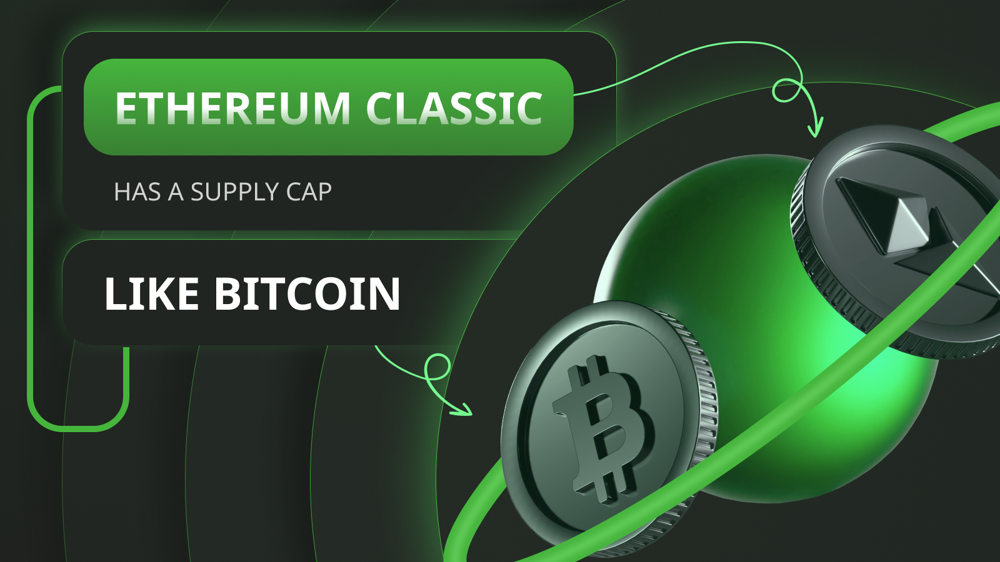

---
**You can listen to or watch this video here:**

<iframe width="560" height="315" src="https://www.youtube.com/embed/_0pMfKwCH7Y?si=Pkl0tq_DCgVmc03C" title="YouTube video player" frameborder="0" allow="accelerometer; autoplay; clipboard-write; encrypted-media; gyroscope; picture-in-picture; web-share" allowfullscreen></iframe>

---

The Ethereum Classic cryptocurrency, ETC, has a supply cap like Bitcoin (BTC) because it has a very similar monetary policy. Both ETC and BTC have the same fundamental assumptions and may be considered “digital gold”.

This is part two of a four part series that will explain what is Ethereum Classic from four angles. The titles of this series will be:

1. Ethereum Classic Is a Proof of Work Cryptocurrency Blockchain

2. Ethereum Classic Has a Supply Cap Like Bitcoin

3. Ethereum Classic Is a Smart Contracts Cryptocurrency Blockchain

4. Ethereum Classic Is Property Rights on a Global Scale

## What Is a Cryptocurrency?

When a group of computer scientists in the 90’s called Cypherpunks started to search for ways to create and implement a form of money native to the internet, they imagined systems that would imitate gold, but digitally.

Although the components existed, it was very difficult to close all the loopholes to recreate this digital gold they were seeking. 

However, they did imagine a design where a new unit of value would be issued in exchange for computational work that some computers in a network would do. This gave rise to Bitcoin (BTC) in 2009 and then Ethereum Classic (ETC) in 2015.

When a unit of value or token is issued in exchange for computational work in a network, it is called a cryptocurrency. Cryptocurrencies that are created only after a lot of computational work has been done may be considered digital gold because they seek to mimic the economics and scarcity of gold in the real world.

## What Is Hard Money?

Money is just another product in the free market, but to be adopted as a medium of exchange, unit of account, and store of value it needs to be divisible, fungible, portable, easily transferred, and scarce. 

This last quality of money, scarcity, is what defines its utility as a store of value, and scarcity can also be defined as hardness.

Thus, hard money is that which is very scarce. This is why gold had been such a good form of money for thousands of years, only to be replaced by fiat currency in the last century.

Fiat money is not very hard because the cost of creating it is very low. This has led many governments to print enormous amounts of their currencies. 

An example is the US dollar, which had a stock of $754 billion in 2003 and 20 years later it has inflated to more than $8 trillion.

## Bit Gold as an Analogy of Gold

So, the challenge was to create a native form of money that could not only be a good medium of exchange and unit of account, but that could also have the properties of gold as a good store of value.

The brilliant idea to create scarcity in cyberspace was to make computers work a lot, processing enormous amounts of computing cycles, to produce a cryptographic stamp that would serve as a proof that the work was done.

These proofs of work, could then be stored in a ledger and transferred between people who wanted to buy and sell things or just keep them as a store of value, similar to how gold works in the real world.

This is at the heart of blockchains and cryptocurrencies such as Bitcoin and ETC. These networks have computers called miners that produce these proofs, also called Bit Gold, and they are paid in the cryptocurrencies for their work.

## Bit Gold vs Fiat Community Tokens

Note that in the previous section, we explained that miners produce Bit Gold, but that the Bit Gold is not actually the money in those networks.

Because it was a difficult engineering task to produce and make the raw Bit Gold the currency, then the systems were designed to create what could be called “fiat community tokens” which are issued and paid to miners each time they produce the proofs of work.

In Bitcoin the coin is called BTC and is currently paying miners 6.25 new units of these coins each time a miner creates a proof of work, which happens every ten minutes.

In Ethereum Classic the coin is called ETC and is currently paying miners 2.56 new units of these coins each time a miner creates a proof of work, which happens every 13 seconds.

These coins may be called “fiat community tokens” because they were programmed on the blockchains by developers rather than being the proofs of work themselves.

## How Are Bitcoin and ETC Supplies Capped?

However, even if these coins were programmed manually rather than created with real work, spending a lot of electricity in computing cycles, they can still be called “digital gold” because of two reasons:

1. The coins are created only after a lot of work was done by the miners and they present the proofs of their work. These proofs have to be verified by the rest of the network before the miners get paid in newly issued coins.

2. Both Bitcoin and ETC have monetary policies programmed in their protocols that effectively establish a cap in the total production of coins that will ever exist in each of them.

In the case of Bitcoin the payment to miners is discounted by 50% every four years which establishes a total issuance in its history of 21,000,000 coins.

In the case of ETC the payment to miners is discounted by 20% every two years which establishes a total issuance in its history of 210,700,000 coins.

## ETC Is Hard Money

As seen above, ETC has a very similar monetary policy as Bitcoin, and both cryptocurrencies have supply caps for the whole of their histories.

That the coins are created only after a lot of work has been done is similar to gold in the real world because it recreates its physical scarcity but on the internet.

The combination of proof of work and ETC’s fixed monetary policy, that establishes a supply cap of 210,700,000 coins, makes ETC hard money.

---

**Thank you for reading this article!**

To learn more about ETC please go to: https://ethereumclassic.org
