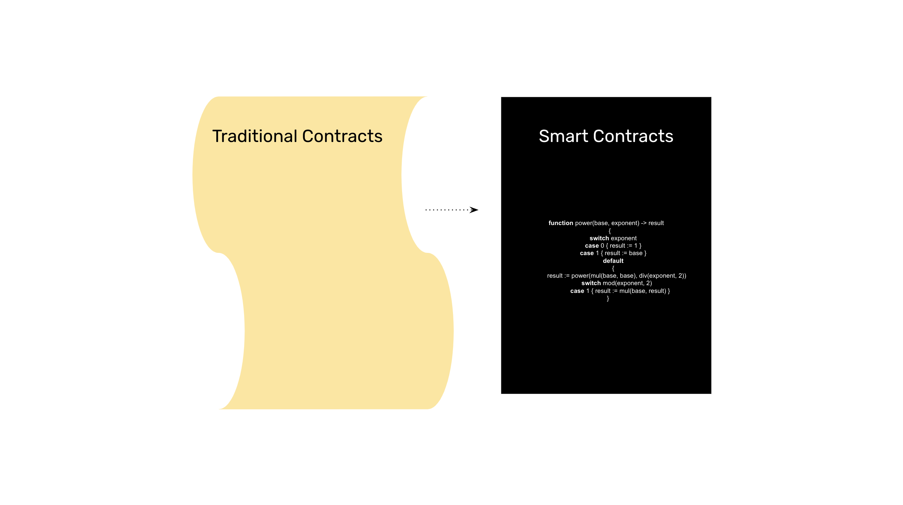
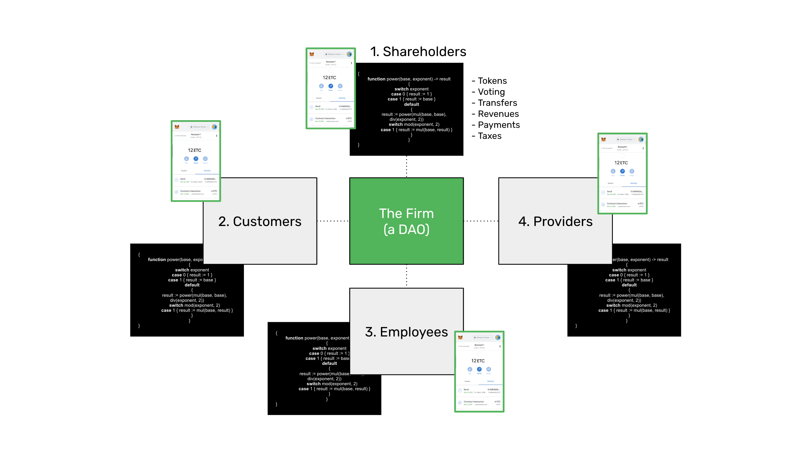
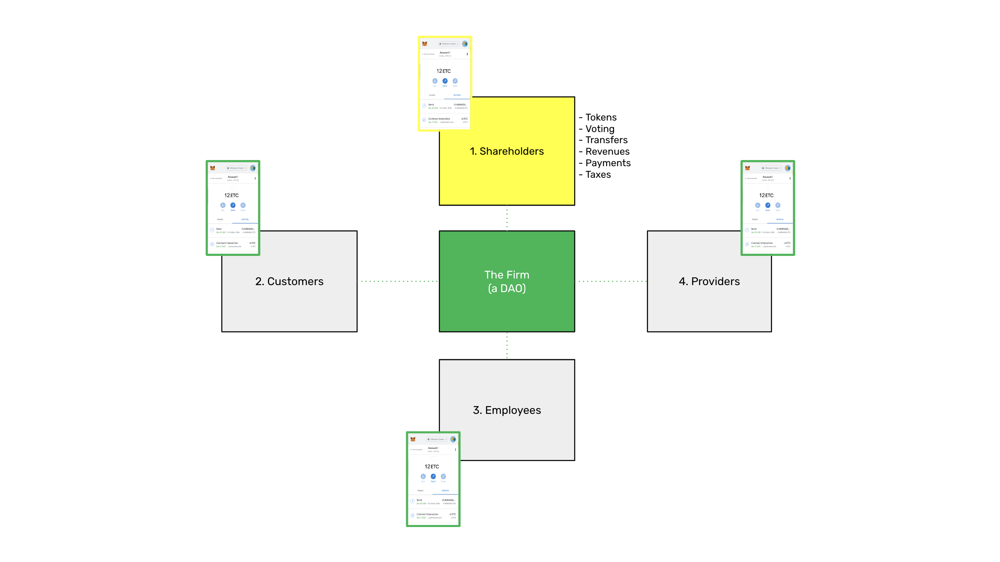
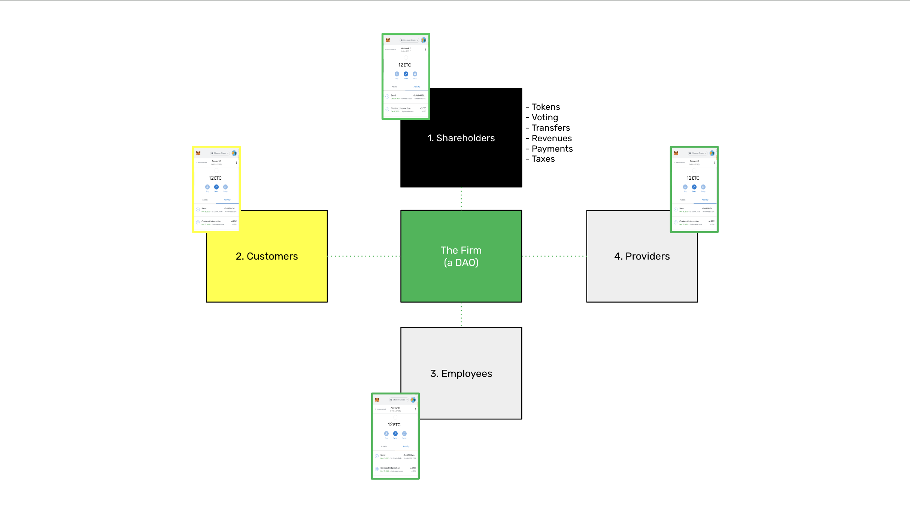
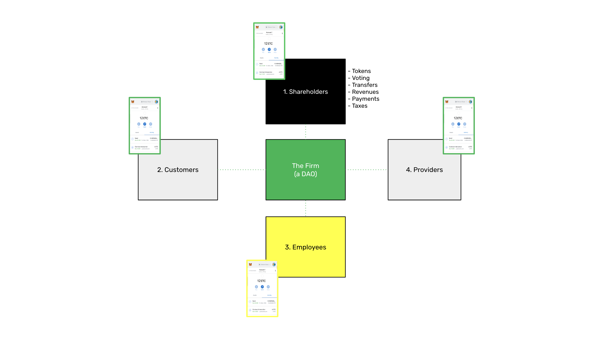
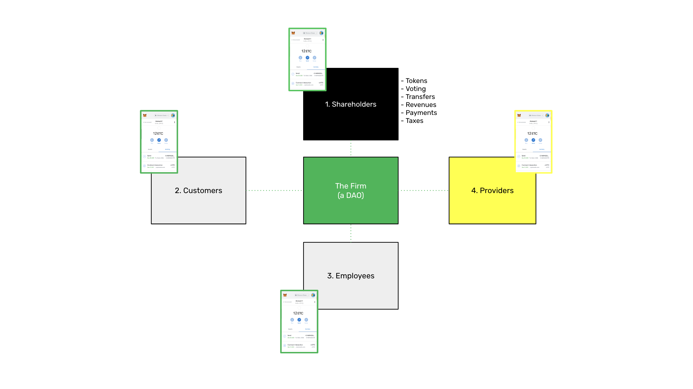

---
**You can listen to or watch this interview here:**

<iframe width="560" height="315" src="https://www.youtube.com/embed/8T_fHNsm_nM?si=89S4yVfgmc1ZyWR6" title="YouTube video player" frameborder="0" allow="accelerometer; autoplay; clipboard-write; encrypted-media; gyroscope; picture-in-picture; web-share" allowfullscreen></iframe>

---

In the previous class, 37, we explained how the firm will be booked and managed on Blockchains such as Ethereum Classic (ETC).

As legal persons such as corporations, partnerships, and nonprofits are registrable objects that exist outside of blockchains, we explained how these could be transported to a programmable blockchain so things like shareholder control, corporate rules, treasuries, and organizational objectives could be managed when they become legally recognized.

In this class, 38, the last class of this course, we will explain how contracts and agreements between individuals and businesses will exist on the blockchain.

## The Firm Is a Network of Contracts

As said in the previous class, DAOs will be firms inside programmable blockchains such as ETC. These entities will establish agreements with their normal constituents, and these agreements will be smart contracts on the blockchain.

A way to describe smart contracts between constituents and the firm could be divided in four parts:

1. Shareholders

2. Customers

3. Employees

4. Providers

### 1. Shareholder Contracts

The shareholder contracts will be implicit in DAOs’ smart contract rules, which will be the equivalent of the bylaws of the organizations.

These rules will include the issuance of tokens, who are the owners of the tokens as represented by their public keys, the tokens voting rights, the tokens economic rights, and how token transfers will be made, including mergers and acquisitions.

The firm is basically a network of contracts, so all relationships between the organization and shareholders, and the organization and its other constituents will be mediated by smart contracts.

It is important to note that all these legal relationships will be implemented as smart contracts, but that smart contracts do not replace formal law.

People will still resolve disputes in the traditional courts.

### 2. Customer Contracts

Depending on the type of business, the agreements between the customers and the firm will be smart contracts on the blockchain.

For example, a cellular company could have customers agree to the service conditions, and customers could sign the agreements on the blockchain with their private keys using a non-custodial wallet.

As long as the customer pays for the service, then the line will work as usual, but if the customer stops paying, then the service could be interrupted.

All these rules and interactions would happen inside the blockchain, including activation, payments, changes in service conditions, deactivation, etc.

### 3. Employee Contracts

Employment relationships are also agreements. 

When companies hire employees, both parties could sign smart contracts on the blockchain agreeing to the terms and conditions of their relationships.

The employees will get paid on the blockchain and the smart contacts will track and implement payments, attendance, vacations, bonuses, retirement, and all other rights, obligations, and benefits of the employees.

When employees quit or are dismissed, then the smart contracts will be deactivated and employee privileges and access to the firm’s resources will be discontinued.

### 4. Provider Contracts

Relationships between the firm’s providers and contractors will also be smart contracts on the blockchain.

For example, if the firm enters into a contract to buy materials for 12 months with a provider, then the terms of the agreement will be programmed into a smart contract and as the deliveries are received, the payments will be released to the provider.

In the same way, when firms hire contractors, the terms of their agreements will be programmed on smart contracts. 

For example, a contractor that is hired to organize a large event, will take many months to produce it while the smart contract will be paying stipulated amounts at certain time intervals. When the event happens, then a final payment could be made to the contractor and the agreement would expire.

## Other Types of Contracts

**Securities:** Just as firms may have smart contracts mediating their relationships with customers, employees, and providers, securities, which are another type of agreement, will be smart contracts on blockchains. For example, firms will be able to issue preferred stock, bonds, and other kinds of financing instruments through these types of programs.

**Insurance:** Insurance policies will be smart contracts on blockchains as well. The terms and conditions of insurance will be programmed into the smart contracts; the policy payments will be made on the blockchain; and when there are claims, the adjuster reports will be sent to the smart contracts which will pay the claims according to the results.

**Trusts:** Individuals and firms will be able to form trusts with smart contracts on blockchains such as ETC. These trusts will serve the normal purposes of traditional trusts, such as managing the estate of individuals or receiving and administering funds and endowments to pay for the needs of beneficiaries or causes.

---

**Thank you for reading this article!**

To learn more about ETC please go to: https://ethereumclassic.org
