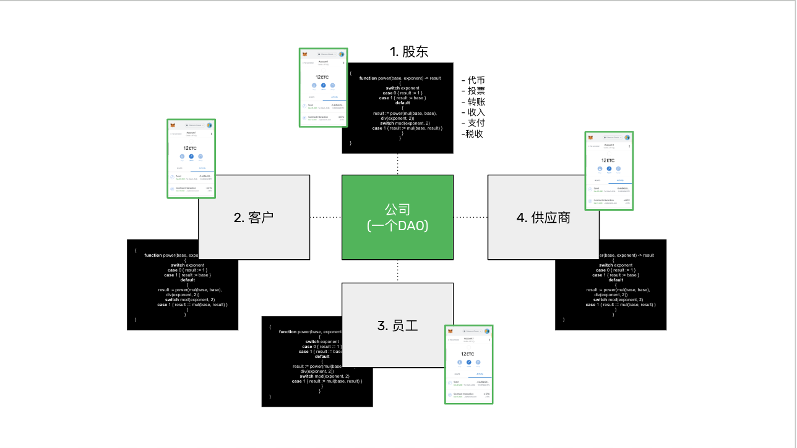
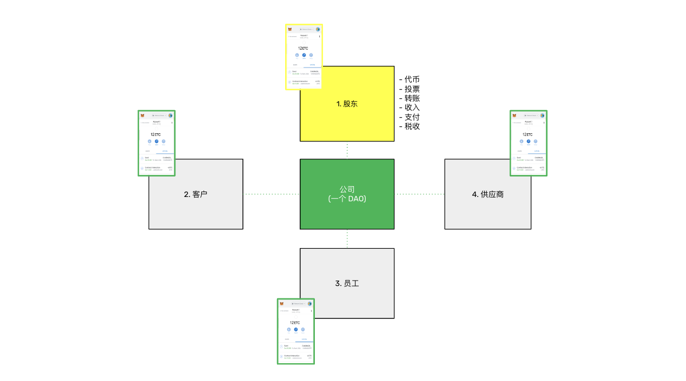
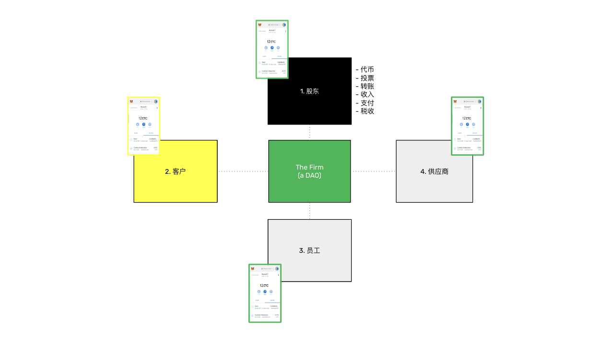
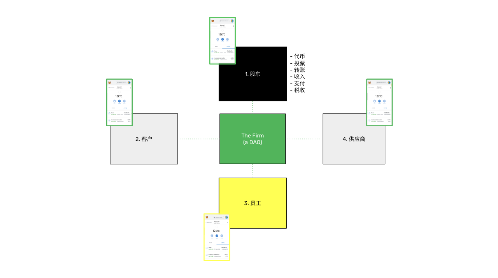
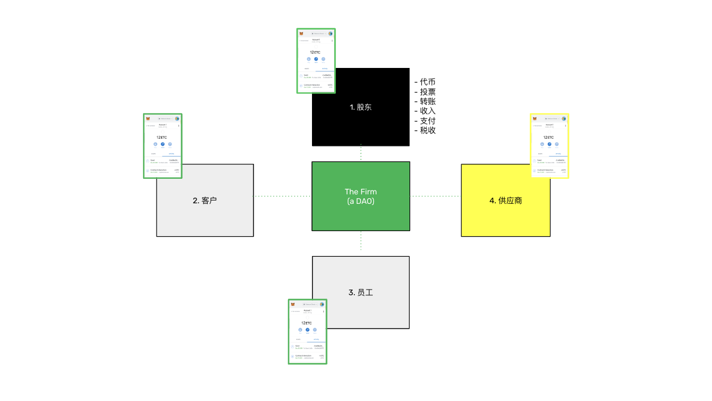

---
**您可以由此收听或观看本期内容:**

<iframe width="560" height="315" src="https://www.youtube.com/embed/8T_fHNsm_nM?si=89S4yVfgmc1ZyWR6" title="YouTube video player" frameborder="0" allow="accelerometer; autoplay; clipboard-write; encrypted-media; gyroscope; picture-in-picture; web-share" allowfullscreen></iframe>

---

在上一节课中，第37节，我们解释了如何在以太经典（ETC）等可编程区块链上进行公司的登记和管理。

由于法人，如公司、合伙企业和非营利组织是存在于区块链之外的可注册对象，因此我们解释了如何将它们转移到可编程区块链上，以便在它们被法律认可时，可以管理股东控制、公司规则、资金管理和组织目标等方面。

在本节课程中，第38节，这门课程的最后一节，我们将解释如何在区块链上存在个人和企业之间的合同和协议。

## 公司是一组合同网络

如前所述，在可编程区块链，如ETC中，DAO将成为公司。这些实体将与其正常的成员建立协议，这些协议将成为区块链上的智能合同。

描述成员与公司之间的智能合同的一种方式可以分为四个部分：

1. 股东

2. 客户

3. 员工

4. 供应商

### 1. 股东合同

股东合同将被隐含在DAO的智能合同规则中，这相当于组织的公司章程。

这些规则将包括代币的发行，代币所有者（由他们的公钥表示）是谁，代币的投票权，代币的经济权利，以及如何进行代币转移，包括并购。

公司基本上是一组合同网络，因此组织与股东以及组织与其其他成员之间的所有关系都将由智能合同进行调节。

重要的是要注意，所有这些法律关系将被实现为智能合同，但智能合同不会取代正式法律。人们仍然会在传统法院解决争议。

### 2. 客户合同

根据业务类型的不同，客户与公司之间的协议将成为区块链上的智能合同。

例如，一个移动电话公司可以要求客户同意服务条件，客户可以使用非托管钱包，使用其私钥在区块链上签署协议。

只要客户支付服务费，电话线将正常工作，但如果客户停止付款，服务可能会中断。

所有这些规则和互动都将在区块链内部进行，包括激活、付款、服务条件的更改、停用等等。

### 3. 员工合同

雇佣关系也是一种协议。

当公司雇佣员工时，双方可以在区块链上签署智能合同，同意他们的关系的条款和条件。

员工将在区块链上获得报酬，智能合同将跟踪和实施付款、考勤、休假、奖金、退休和员工的所有其他权利、义务和福利。

当员工辞职或被解雇时，智能合同将被停用，员工的特权和对公司资源的访问将被中止。

### 4. 供应商合同

公司与供应商和承包商之间的关系也将成为区块链上的智能合同。

例如，如果公司与供应商签订了购买12个月材料的合同，那么协议的条款将被编程成智能合同，随着交货的到来，支付将释放给供应商。

同样，当公司雇佣承包商时，他们的协议条款将编程在智能合同中。

例如，负责组织大型活动的承包商将需要几个月来准备，智能合同将在特定的时间间隔内支付规定金额。当活动发生时，最后一笔款项可能会支付给承包商，并且协议

将到期。

## 其他类型的合同

**证券**：就像公司可能通过这些程序发行首选股、债券和其他类型的融资工具来调解与客户、员工和供应商的关系一样，证券也将成为区块链上的智能合同。例如，公司将能够通过这些计划发行首选股、债券和其他种类的融资工具。

**保险**：保险政策也将成为区块链上的智能合同。保险的条款和条件将被编程到智能合同中；保单支付将在区块链上进行；当存在索赔时，理赔员的报告将被发送到智能合同，根据结果支付理赔。

**信托**：个人和公司将能够通过区块链，如ETC上的智能合同，建立信托。这些信托将履行传统信托的正常职能，例如管理个人财产或接收和管理资金和捐赠以支付受益人或事业的需求。

---

**感谢您阅读本期文章!**

了解更多有关ETC，欢迎访问: https://ethereumclassic.org
