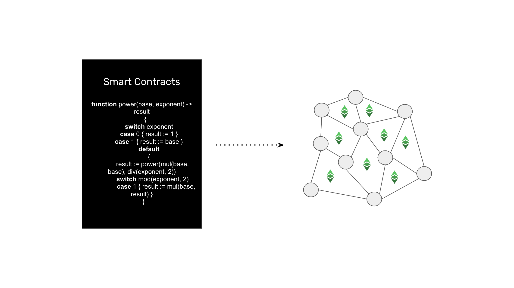

---
**You can listen to or watch this interview here:**

<iframe width="560" height="315" src="https://www.youtube.com/embed/tLWxxj9QDS0?si=bySQFbumRi0IjOE3" title="YouTube video player" frameborder="0" allow="accelerometer; autoplay; clipboard-write; encrypted-media; gyroscope; picture-in-picture; web-share" allowfullscreen></iframe>

---

Ethereum Classic (ETC) exists because Bitcoin (BTC) could not host smart contracts. Satoshi Nakamoto [had envisioned](https://bitcointalk.org/index.php?topic=195.msg1611#msg1611) smart contracts for BTC, but they were not possible because of its design. This is why Vitalik Buterin created ETC, which is the original Ethereum, with certain adaptations to host decentralized software programs.

This is part three of a four part series that will explain what is Ethereum Classic from four angles. The titles of this series will be:

1. Ethereum Classic Is a Proof of Work Cryptocurrency Blockchain

2. Ethereum Classic Has a Supply Cap Like Bitcoin

3. Ethereum Classic Is a Smart Contracts Cryptocurrency Blockchain

4. Ethereum Classic Is Property Rights on a Global Scale

## What Is a Cryptocurrency?

When a group of computer scientists in the 90’s called Cypherpunks started to search for ways to create and implement a form of money native to the internet, they imagined systems that would imitate gold, but digitally.

Although the components existed, it was very difficult to close all the loopholes to recreate this digital gold they were seeking. 

However, they did imagine a design where a new unit of value would be issued in exchange for computational work that some computers in a network would do. This gave rise to Bitcoin in 2009 and then Ethereum Classic in 2015.

When a unit of value or token is issued in exchange for computational work in a network, it is called a cryptocurrency. The prefix “crypto” refers to the fact that these networks use cryptography as part of their critical components and to generate the computational work.

## What Is a Blockchain?

A blockchain is not the cryptocurrency itself. It is a network of computers around the world that holds a database, called a blockchain, with the user accounts, balances of the cryptocurrency, and the smart contracts in the case of ETC.

Blockchains are not like traditional networks or corporate systems. They are decentralized because every single computer participating in the system holds the same exact copy of the whole database, or blockchain.

The point of blockchains is to be as secure as possible, and this is accomplished by minimizing the influence of trusted third parties as much as possible.

The goal of the method of replicating the database with the entire ledger and smart contracts is to make it very difficult for man or nature to tamper with the system or to destroy it.

The global redundancy is so widespread that it is very difficult to take a blockchain down, even in the case of a nuclear war!

## What Are Smart Contracts?

The first blockchain is Bitcoin and is very simple. It just holds a ledger with accounts and balances, and users can move coins from account to account. That’s it.

As said before, because of this simplicity, and because software programmes could not be added to Bitcoin due to its design, then ETC was created with some adaptations.

The main adaptation is that an additional space was added to the ledger so it could include software programs. 

The brilliant idea behind this design is that when developers send these software programs to the network, they are replicated across all computers globally, making them decentralized.

These decentralized software programs are called “smart contracts”.

## Why Is ETC a Programmable Cryptocurrency?

Because the ETC ledger hosts user accounts, cryptocurrency balances, and smart contracts, unlike Bitcoin, the cryptocurrency is now programmable.

Programmability of the cryptocurrency means that decentralized applications, also called dapps, may be hosted inside ETC.

Examples of decentralized applications may be:

- NFTs
- Stablecoins
- Decentralized exchanges
- ERC-20 tokens
- Lending services
- Yield apps
- Insurance apps
- Crowdfunding apps
- Property registries
- Wills and trusts
- etc.

## Why Is it Important That ETC is a Proof of Work Blockchain?

Aside that ETC is a programmable cryptocurrency blockchain it is very important that its consensus mechanism is proof of work (PoW). 

Proof of work is the most secure and decentralized consensus mechanism for all participating machines to be on the same page. 

It is the method that all computers in the network use to be in lockstep and totally synchronized every 13 seconds with the same exact state of the ledger, which contains the user accounts, balances, and smart contracts.

Only with PoW nodes can join and leave the blockchain permissionlessly. This makes the system truly censorship resistant, and trust minimized, which is the whole point of the industry.

## Advantages of Smart Contracts and Proof of Work in ETC 

The advantages of the combination of smart contracts and proof of work in ETC are:

**Truly decentralized applications:** Many pseudo-blockchains (which are usually proof of stake) claim they host dapps, but the truth is that dapps can only exist in truly decentralized smart contracts blockchains. The advantage of ETC is that it can host secure dapps on its platform because they are effectively decentralized.

**Trust minimization:** As these dapps are hosted inside ETC’s highly secure environment, they are much more secure and trust minimized than even Bitcoin applications. In BTC, applications must exist outside its highly secure system. This means they have to necessarily be less secure as they need unsafe connections and methods to make the cryptocurrency programmable.

**Composability:** Because both the money and the dapps are inside ETC, then complex composable transactions are possible. When systems are separated, they can’t execute these transactions because they don’t have sufficient information to verify and confirm all the parts. In ETC, this is possible, thus it enables a host of interesting potential use cases.

---

**Thank you for reading this article!**

To learn more about ETC please go to: https://ethereumclassic.org
