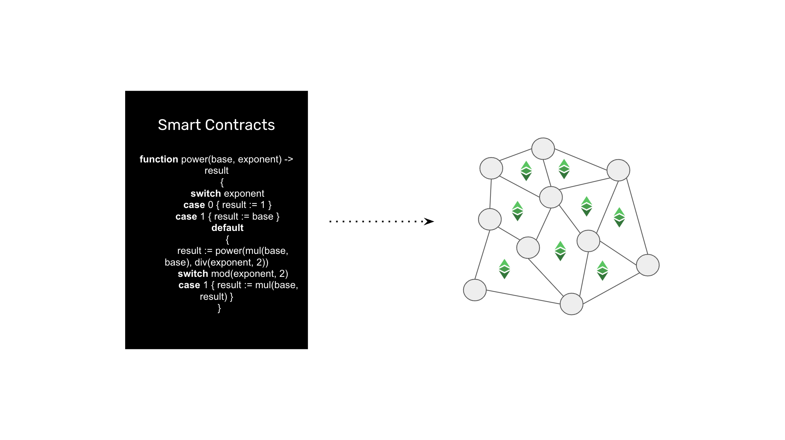

---
**由此观看或收听此次访谈:**

<iframe width="560" height="315" src="https://www.youtube.com/embed/tLWxxj9QDS0?si=bySQFbumRi0IjOE3" title="YouTube video player" frameborder="0" allow="accelerometer; autoplay; clipboard-write; encrypted-media; gyroscope; picture-in-picture; web-share" allowfullscreen></iframe>

---

以太坊经典（ETC）的存在是因为比特币（BTC）无法支持智能合约。Satoshi Nakamoto曾[设想](https://bitcointalk.org/index.php?topic=195.msg1611#msg1611)过为BTC创建智能合约，但由于其设计的限制，这是不可能的。这就是为什么Vitalik Buterin创建了ETC，这是最初的以太坊，经过一些调整以托管分散式软件程序。

这是一个四部分系列的第三部分，将从四个角度解释什么是以太坊经典。本系列的标题将是：

1. 以太坊经典是一种工作证明加密货币区块链
2. 以太坊经典像比特币一样有供应上限
3. 以太坊经典是一种智能合约加密货币区块链
4. 以太坊经典是全球范围内的财产权

## 什么是加密货币？

20世纪90年代，一群名为Cypherpunks的计算机科学家开始寻找创建和实施一种适用于互联网的货币形式的方法，他们想象出一种模仿黄金但以数字形式存在的系统。

尽管相关组件已经存在，但很难关闭所有漏洞以重新创建他们所寻求的数字黄金。然而，他们构想了一种设计，其中一个新的价值单位将以交换某些网络中的计算工作而发行。这为比特币（2009年）和随后的以太坊经典（2015年）奠定了基础。

当一个价值单位或代币以网络中的计算工作为代价而发行时，它被称为加密货币。前缀“crypto”指的是这些网络在其关键组件和生成计算工作的过程中使用了密码学。

## 什么是区块链？

区块链并不是加密货币本身，它是全球范围内的计算机网络，其中包含一个称为区块链的数据库，其中包括用户账户、加密货币余额和以太坊经典中的智能合约。

区块链与传统网络或公司系统不同。它们是分散的，因为系统中的每台计算机都持有完全相同的整个数据库，或称为区块链的副本。

区块链的目的是尽可能安全，这是通过尽量减少受信任的第三方的影响来实现的。

通过将整个账本和智能合约的数据库进行复制的方法的目标是使人类或自然界很难篡改系统或销毁它。

全球冗余性如此广泛，以至于即使在核战争的情况下，也很难摧毁区块链！

## 什么是智能合约？

第一个区块链是比特币，非常简单。它只包含了一个账户和余额的账本，用户可以将代币从一个账户转移到另一个账户。就是这样。

正如前面所说，由于这种简单性，以及由于由于其设计的限制，不能向比特币添加软件程序，因此创建了以太坊经典，并进行了一些适应性调整。

主要的适应性调整是在账本上增加了额外的空间，以便包括软件程序。

这一设计背后的精妙思想是，当开发人员将这些软件程序发送到网络时，它们会在全球所有计算机上复制，使它们分散化。

这些分散的软件程序被称为“智能合约”。

## 为什么ETC是可编程加密货币？

因为ETC账本托管用户账户、加密货币余额和智能合约，与比特币不同，因此这种加密货币现在是可编程的。

加密货币的可编程性意味着分散应用（也称为dapps）可以托管在ETC内部。

分散应用的示例可能包括：

- NFTs
- 稳定币
- 分散交易所
- ERC-20代币
- 借贷服务
- 收益应用
- 保险应用
- 众筹应用
- 财产登记
- 遗嘱和信托
- 等等。

## 为什么ETC是工作证明区块链至关重要？

除了ETC是可编程的加密货币区块链外，它的共识机制是工作证明（PoW）至关重要。

工作证明是为了使所有参与的计算机保持一致而使用的最安全和分散的共识机制。

这是网络中的所有计算机用来每13秒与账本的完全相同状态完全同步的方法，其中包括用户账户、余额和智能合约。

只有使用PoW的节点才能自由加入和退出区块链。这使得系统真正抗审查，并最小化信任，这正是该行业的核心。

## ETC中智能合约和工作证明的优势

智能合约和工作证明的结合在ETC中的优势包括：

**真正的分散应用：** 许多伪区块链（通常是股权证明）声称它们托管dapps，但事

实是dapps只能存在于真正分散的智能合同区块链中。ETC的优势在于它可以在其平台上托管安全的dapps，因为它们实际上是分散的。

**最小化信任：** 由于这些dapps托管在ETC的高度安全环境中，它们比比特币应用程序甚至更安全和最小化信任。在BTC中，应用程序必须存在于其高度安全的系统之外。这意味着它们必须更不安全，因为它们需要不安全的连接和方法来使加密货币可编程化。

**可组合性：** 因为货币和dapps都在ETC内部，所以复杂的可组合交易是可能的。当系统分开时，它们无法执行这些交易，因为它们没有足够的信息来验证和确认所有部分。在ETC中，这是可能的，因此它使一系列有趣的潜在用例成为可能。

---

**感谢您阅读本期文章!**

了解更多有关ETC: https://ethereumclassic.org
