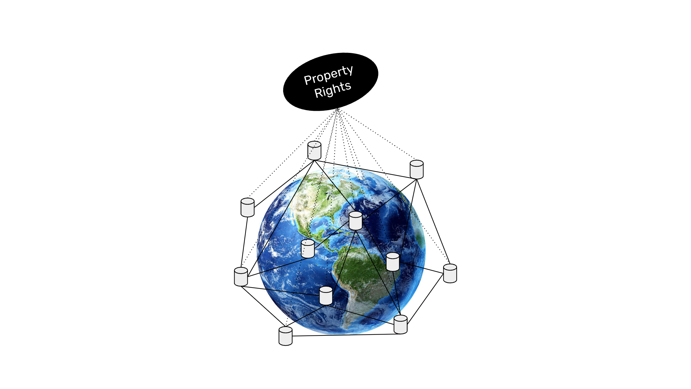

---
**You can listen to or watch this interview here:**

<iframe width="560" height="315" src="https://www.youtube.com/embed/iS7iu8qiBpA?si=fhtX7KCjRWAourqz" title="YouTube video player" frameborder="0" allow="accelerometer; autoplay; clipboard-write; encrypted-media; gyroscope; picture-in-picture; web-share" allowfullscreen></iframe>

---

Because of its replicated ledger, the account system, and that it can host all sorts of assets, Ethereum Classic (ETC) is not only a cryptocurrency, but a technology that enables property titles and registries to exist inside its highly secure and neutral system. This enables property rights on a global scale that cross all borders.

This is part four of a four part series that will explain what is Ethereum Classic from four angles. The titles of this series will be:

1. Ethereum Classic Is a Proof of Work Cryptocurrency Blockchain

2. Ethereum Classic Has a Supply Cap Like Bitcoin

3. Ethereum Classic Is a Smart Contracts Cryptocurrency Blockchain

4. Ethereum Classic Is Property Rights on a Global Scale

## Property Rights as a Concept

In nature there are no rights, much less property, only forceful control. An example may be when lions mark and defend their territory.

Control of an object is the product of possession of such object and may be related to property, but it may also mean it is only possessed and controlled but not owned.

Possession is to have the object in our domain. However, to possess an object does not mean to have property or control. For example I may have a car in my driveway, but I don’t have the keys and it may be there because it was stolen.

Property is a creation of man through law. Property formalizes the concepts above of territory, control, possession, and domain. If we have an object in our domain, we have possession, we may have control, and we may have legal property to it.

Ownership is the legal relationship between a person or firm with an object.

All these things may be enabled by smart contracts on a blockchain such as Ethereum Classic.

## How Are Property Registries Today?

Once physical or informational objects are recognized as property they may be registered in books and ledgers that represent title and ownership of such objects.

In the cases of registrable objects such as real estate, vehicles, intellectual property, patents, and others, their corresponding registry books and ledgers are usually kept and maintained by municipal, state, provincial, or national governments.

Originally, they were physical books with special ledger designs that registered the names of the owners, the objects’ specific data, the previous owner, dates of purchase, etc.

Now these same registries are usually held in computer systems as databases with the same information as their paper counterparts described above. 

## The ETC Account System as a Property Registry

ETC may be a much more secure property registry technology as its ledger is fully replicated across many computers around the world, it is completely decentralized, and it is a proof of work blockchain, which makes it practically impossible to tamper with by man or nature.

At its heart, ETC contains an account system, where each public address is only controlled by a private key, and this private key is only controlled by whoever possesses it. This base infrastructure makes ETC optimal to hold property registries when they become recognized legally in various parts of the world.

Standards such as ERC-20 tokens and NFTs (ERC-721 tokens) further enhance ETC as a property system as they may be used to represent shares of firms, voting rights, and even physical objects in the real world.

As Ethereum Classic is programmable, it enables all of the above, but it may also provide additional benefits such as markets where these objects may be traded, trusts and wills to manage the transfer of assets given specific conditions, and the ability to perform complex transactions, all with very fast settlements and very low risks.

## Types of Property Possible on ETC

Given the attributes explained above, ETC may host several types of property that may be available seamlessly on a global scale. These property categories may include:

**The ETC Coin:** The ETC coin itself is the first asset that is possessed, held, and controlled using the Ethereum Classic blockchain. It is also widely legally recognized as property, and this implies recognizing the underlying ledger as a property registry.

**Fungible Tokens:** Fungible tokens enabled by ERC-20 smart contracts are another form of property in ETC that may be programmable with rules ranging from voting to financial rights. 

**Non-Fungible Tokens:** Non-fungible tokens enabled by ERC-721 smart contracts started as GIFs and JPEGs but their potential may expand to representing all kinds of property in digital and physical form.

**Real Estate:** An example of real world assets that may be represented as NFTs and bought and sold inside ETC are real estate properties. Homes, apartments, land, and other real estate will likely be booked and traded in the system, and complex transactions and rules including mortgages and liens will be integrated seamlessly. 

**Movable Property:** Just as real estate, movable property such as cars, motorcycles, and trucks may be hosted on ETC as NFTs, and traded in markets as well a be managed with complex transactions involving loans, or renting, or leasing.

**Firms:** Firms such as corporations, partnerships, and nonprofits may be represented inside ETC by means of ERC-20 tokens and decentralized organizations (DAOs). These DAOs may issue shares, have voting rights, and integrate all corporate governance and bylaws typical of traditional legal persons.

**Securities:** As said above, company shares may exist inside ETC instead of traditional depository and clearing services. Also, the issuance and administration of debt securities may be possible as well as derivatives and futures contracts.

**Trusts:** Trusts are possible in ETC by means of smart contacts. Grantors may establish programmable trusts and fund them with property on ETC to be managed by trustees who may provide their services and charge for them.

## The Relationship of Law and Property on ETC

It is important to differentiate between the law and the ETC blockchain.

Ethereum Classic only enforces possession and control of objects, it is not a legal instrument in itself. Similar to the example given before, it is more or less like driving a car because you have the keys; that you have possession and control over it does not necessarily mean that you own it.

Property and ownership are legal abstractions that are enforced outside of the blockchain. ETC is the physical aid where the property may be booked and enforced.

Additionally, that transactions and transfers occur on the blockchain does not change that people will not have disputes about the ownership of things. Disputes will continue to be resolved through legal systems.

However, it is very likely that Ethereum Classic will eventually be officially recognized as property registry technology in general, and all registrable assets and legal contracts governing these properties will exist in ETC.

---

**Thank you for reading this article!**

To learn more about ETC please go to: https://ethereumclassic.org
