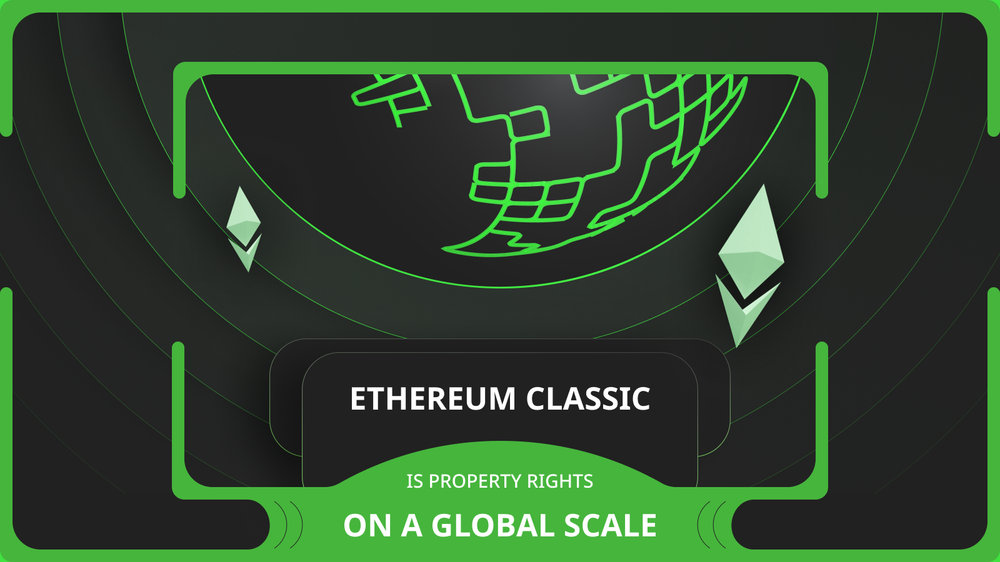
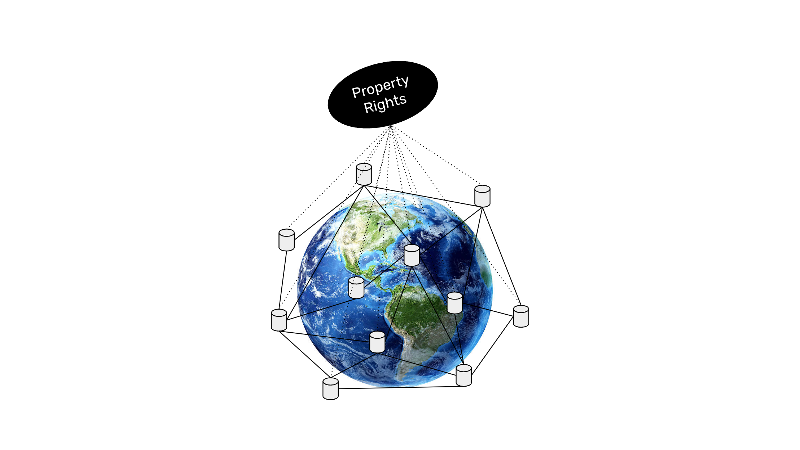

---
**由此收听或观看此次访谈:**

<iframe width="560" height="315" src="https://www.youtube.com/embed/iS7iu8qiBpA?si=fhtX7KCjRWAourqz" title="YouTube video player" frameborder="0" allow="accelerometer; autoplay; clipboard-write; encrypted-media; gyroscope; picture-in-picture; web-share" allowfullscreen></iframe>

---

由于其复制的账本、账户系统以及它可以托管各种资产，以太坊经典（ETC）不仅仅是一种加密货币，而且是一种技术，可以使财产权和登记存在于其高度安全和中立的系统内。这使得跨越所有边界的全球范围内的财产权成为可能。

这是一个四部分系列的第四部分，将从四个角度解释以太坊经典是什么。本系列的标题将是：

1. 以太坊经典是一种工作证明加密货币区块链
2. 以太坊经典像比特币一样有供应上限
3. 以太坊经典是一种智能合约加密货币区块链
4. 以太坊经典是全球范围内的财产权

## 财产权的概念

在自然界中，没有权利，更不用说财产了，只有强制控制。一个例子可能是狮子标记并保卫他们的领土。

对物体的控制是拥有该物体并可能与财产相关，但也可能仅意味着拥有和控制，而不拥有。

拥有是将物体置于我们的支配范围内。然而，拥有物体并不意味着拥有财产或控制权。例如，我可以在车道上有一辆汽车，但我没有钥匙，它可能在那里是因为被盗。

财产是通过法律由人类创造的。财产形式化了上述领土、控制、拥有和支配的概念。如果我们在我们的领域内拥有一个物体，我们就拥有它，我们可能拥有控制权，我们可能对它拥有合法财产权。

所有这些都可以由以太坊经典等区块链上的智能合同启用。

## 当今的财产登记

一旦将物理或信息对象识别为财产，它们可以在代表这些对象的所有权和所有权的书籍和账本中进行注册。

对于可注册的物体，如房地产、车辆、知识产权、专利等，它们相应的登记簿和账本通常由市政、州政、省政或国家政府保管和维护。

最初，它们是具有特殊账本设计的实体书籍，记录了所有者的名称、对象的具体数据、前一位所有者、购买日期等信息。

现在，这些相同的登记簿通常保存在计算机系统中，作为与上述纸质副本相同信息的数据库。

## 以太坊经典的账户系统作为财产登记

以太坊经典可能是一种更安全的财产登记技术，因为它的账本完全复制在世界各地的许多计算机上，它完全分散化，而且是一种工作证明区块链，这使得它几乎不可能被人为或自然干扰。

在其核心，ETC包含一个账户系统，其中每个公共地址只能由私钥控制，而这个私钥只能由持有者控制。这个基础设施使ETC成为在世界各地的各个地方被合法承认后拥有财产登记的最佳选择。

像ERC-20代币和NFTs（ERC-721代币）这样的标准进一步增强了ETC作为财产系统的功能，因为它们可以用来代表公司股份、投票权，甚至现实世界中的物体。

由于以太坊经典是可编程的，它可以实现以上所有功能，但它还可以提供额外的好处，比如可以在其中交易这些物体的市场，可以用信托和遗嘱来管理在特定条件下的资产转移，以及可以执行复杂的交易，而且结算非常快速，风险非常低。

鉴于上面解释的属性，ETC可能可以托管多种类型的财产，这些财产可以在全球范围内无缝获得。这些财产类别可能包括：

**ETC代币：** ETC代币本身是使用以太坊经典区块链拥有、持有和控制的第一资产。它也被广泛法律承认为财产，这意味着承认底层账本作为财产登记。

**可替代代币：** 由ERC-20智能合同启用的可替代代币是ETC中的另一种财产形式，可以根据投票和金融权利等各种规则进行编程。

**不可替代代币：** 由ERC-721智能合同启用的不可替代代币最初是GIF和JPEG，但它们的潜力可能扩展到代表数字和实物形式的所有种类的财产。

**房地产：** 作为NFT代表并在ETC内购买和销售的现实世界资产的一个示例是房地产属性。房屋、公寓、土地和其他房地产可能会在系统中预订和交易，包括按揭和留置权在内的复杂交易和规则将无缝整合。

**动产：** 与房地产一样，动产，如汽车、摩托车和卡车，也可以作为NFT代币托管在ETC上，并在市场上交易，还可以通过涉及贷款、租赁或租赁的复杂交易进行管理。

**公司：** 公司，如公司、合伙企业和非营利组织，可以通过ERC-20代币和分散组织（DAOs）在ETC内部表示。这些DAO可以发行股份，拥有投票权，并集成所有传统法律主体通常具有的公司治理和章程。

**证券：** 如前所述，公司股份可以存在于ETC中，而不是传统的存管和结算服务。此外，债券的发行和管理也是可能的，以及衍生品和期货合同。

**信托：** 通过智能合同，ETC中可以实现信托。授予者可以建立可编程信托，并用ETC上的财产资助信托，由受托人管理，受托人可以提供其服务并为其收费。

## 法律与ETC上的财产的关系

重要的是要区分法律和ETC区块链之间的区别。

以太坊经典只强制执行对物体的拥有和控制，它本身不是法律工具。与前面给出的例子类似，这更或多是像因为你有钥匙而驾驶一辆汽车；你拥有和控制它不一定意味着你拥有它。

财产和所有权是在区块链之外强制执行的法律抽象。ETC是财产可能被预订和执行的物理辅助。

此外，交易和转让发生在区块链上并不会改变人们对物品所有权的争议。争议将继续通过法律体系解决。

然而，很可能以太坊经典最终会被正式承认为通用财产登记技术，所有可登记的资产和管理这些财产的法律合同都将存在于ETC中。

---

**感谢您阅读本期文章!**

了解更多有关ETC: https://ethereumclassic.org
