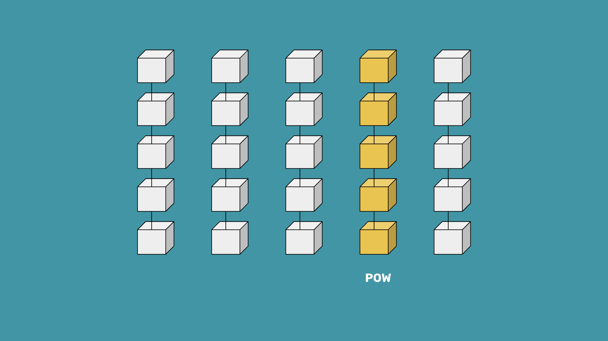

---
**You can listen to or watch this interview here:**

<iframe width="560" height="315" src="https://www.youtube.com/embed/4SxRr3IFDZo?si=-X-Icy-ecgqZLKoh" title="YouTube video player" frameborder="0" allow="accelerometer; autoplay; clipboard-write; encrypted-media; gyroscope; picture-in-picture; web-share" allowfullscreen></iframe>

---

Everybody talks about blockchains and crypto, but very few know about decentralization.

The real invention of the blockchain industry is not “money” or “Bitcoin” or “blockchain”.

The revolutionary invention is the proof of work (POW) based Nakamoto Consensus. 

Nakamoto Consensus uses the POW as a focal point for all the machines connected to the network to be on the same page every 10 minutes, in the case of Bitcoin (BTC), and every 13 seconds, in the case of Ethereum Classic (ETC).

The fact that this focal point exists is the key to decentralization because every node in the system can join, exit, and join again whenever they wish, without the need of checking with anyone or anything else other than the information of the proof of work itself.

This has enormous benefits for humanity.

## What Does Proof of Work Do?

But, before explaining the benefits of POW it is worth learning how it works.

A POW blockchain such as ETC is constantly receiving new transactions. When any machine in the network receives a new transaction they immediately retransmit it to the rest of the network for full replication. This means that all computers in the system have a copy of each transaction.

A subgroup of the machines in the network called miners get batches of these transaction and seal them with a cryptographic stamp called a hash. This hash is what consumes so much work and power to create, hence “proof of work”. 

When any of the miners creates the cryptographic hash first, it sends the new block of transactions, which includes the stamp, to the rest of the network for full replication. When the rest of the network verifies the transactions and the hash of the block, they add it as the last block in the chain and pay the miner a set number of coins for their work.

## What Are the Advantages of Proof of Work?

The method described above has several advantages that keep the network decentralized. Decentralization is important because it reduces the influence of trusted third parties who can tamper with the blockchain.

The first advantage is that so much work was put into creating the block that, when the rest of the nodes in the network receive it, they know it is the correct one just by verifying the stamp. If imposters or attackers were sending them alternative blocks they would discard them because only blocks with the work done would be accepted.

The second advantage is that when new nodes want to join the network, it is very easy to check which is the legitimate blockchain just by verifying all the work done in the chain of blocks since genesis. By doing this, any machine can actually join, leave, or join again without even consulting with any third party. This is the key to permissionlessness and censorship resistance!

The other advantage of POW is that to create the coins, a lot of work has to be done. This is similar to how gold works in the real world, thus making the coins scarce.

## Proof of Work Is Good for the Climate!

POW mining is now the single most sustainably powered global industry in the world. Over 56% of the energy it uses comes from renewable sources. 

Because of the same reasons, carbon emissions in POW are trending lower.

Additionally, as methane gas is 84 times more warming than CO2, and because POW mining is very mobile, and may be turned on and off due to market conditions, POW miners are using the methane that is stranded from oil wells to power their computers, thus transforming the methane into CO2 which actually makes it carbon negative!

## Proof of Work Provides Power to Poor Areas

As said above, because POW mining is very mobile, and may be turned on and off due to market conditions, it usually seeks cheap sources of energy that may be remote and stranded. 

This provides financing to these sources and makes them flourish in poor areas. 

For example, in Africa there are small hydropower generators popping up in remote regions, providing electricity for the first time in these areas, because POW miners use these sources first, providing the bulk of the demand, thus making them economically viable to distribute to other consumers locally.

## Proof of Work Is Property Rights on a Global Scale

Property and ownership are very weak across the world, even in advanced economies. However, the recognition of blockchains such as ETC as property registries would be revolutionary.

The ETC coin itself is the first asset that is possessed, held, and controlled using the Ethereum Classic POW blockchain. It is also widely legally recognized as property, and this implies recognizing the underlying ledger as a property registry.

The ETC account system, the ERC-20 and ERC-721 standards, combined with POW will enable property rights globally which will cross all borders seamlessly, improving property rights everywhere.

Some of the registrable objects that could be managed on POW blockchains will include NFTs, fungile tokens, real estate, vehicles, corporations, nonprofits, securities, and trusts among many others.

## Proof of Work Is Digital Gold

As said before, because the coins in POW blockchains are only created after miners have spent a lot of capital and electricity building the blocks, these cryptocurrencies are considered digital gold.

The term “digital old” denotes the hardness of the money. This means that the currency is scarce and does not lose value as time passes by, but, to the contrary, it maintains or gains value.

This is counterintuitive in today’s world of fiat currencies, which are all inflationary. But, the economic consequences and the relabalacing of wealth in the world would be significantly impacted if POW cryptocurrencies were adopted as global reserves. Which will likely happen.

## Proof of Work Is Unprecedented Security In Computer Science

The reason why cryptocurrencies as Bitcoin didn’t exist before was because network designs to that point in computer science had a fault tolerance of 1/3 of the participating nodes. This means that if 33% of the machines in the network were to attack the system, they could do it.

As said at the beginning of this post, the brilliant invention of POW raised the fault tolerance threshold to 50% of nodes. Not only that, but because of its strong cryptography and energy wall of protection, the only thing that these attacks may do is to double spend coins, which is a narrow kind of attack and may be avoided by waiting more confirmations in these blockchains.

## Proof of Work Is Good for Humanity

So, POW is clean, it provides a focal point for all nodes in the network to join and leave whenever they wish without checking with third parties, it provides hard money, and it enables consensus among all machines to be on exactly the same state of the system globally every round.

These features combined produce trust minimization, permissionlessness, and censorship resistance on blockchains making them the most secure computer networks known to man.

The great benefits to the world of these things are that they are good for the climate, they provide electricity to the poor in remote regions of the world, good for property and other rights on a global scale, they provide hard money for people worldwide to save, and bring unprecedented security to computer systems in general.

Proof of work is, indeed, good for humanity!

---

**Thank you for reading this article!**

To learn more about ETC please go to: https://ethereumclassic.org
