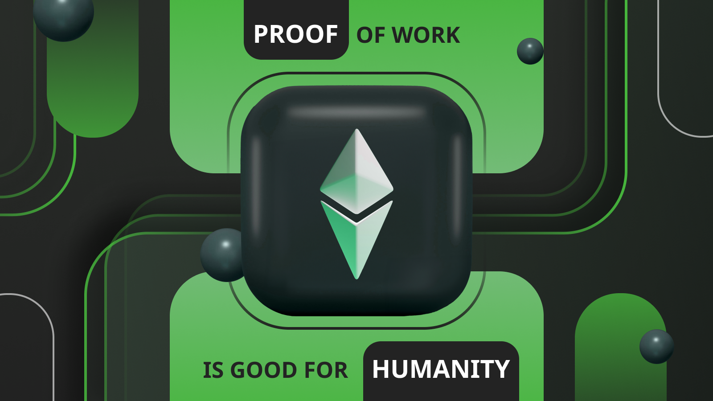

---
**由此收听或观看本期访谈:**

<iframe width="560" height="315" src="https://www.youtube.com/embed/4SxRr3IFDZo?si=-X-Icy-ecgqZLKoh" title="YouTube video player" frameborder="0" allow="accelerometer; autoplay; clipboard-write; encrypted-media; gyroscope; picture-in-picture; web-share" allowfullscreen></iframe>

---

每个人都在谈论区块链和加密货币，但很少有人了解分散化。

区块链行业真正的发明不是“货币”或“比特币”或“区块链”。

革命性的发明是基于工作证明（POW）的中本聪共识。

中本聪共识将POW作为所有连接到网络的机器的焦点，使它们每隔10分钟（比特币的情况）或每隔13秒（以太坊经典的情况）都保持在同一个页面上。存在这一焦点的事实是分散化的关键，因为系统中的每个节点都可以在任何时候自由加入、退出和再次加入，而无需与除了工作证明本身的信息之外的任何人或任何其他东西进行核实。

这对人类有巨大的好处。

## 工作证明的作用是什么？

但在解释POW的好处之前，值得了解它是如何工作的。

POW区块链，如ETC，不断接收新的交易。当网络中的任何一台机器收到新交易时，它们会立即将其转发给网络中的其他机器以进行完全复制。这意味着系统中的所有计算机都有每个交易的副本。

网络中的一组机器，称为矿工，获取了这些交易的批次，并使用称为哈希的密码戳封存它们。这个哈希是消耗大量工作和电力来创建的，因此称为“工作证明”。

当矿工中的任何一台首先创建密码哈希时，它将新的交易块，其中包括该戳，发送到网络的其他部分进行全面复制。当网络的其他部分验证交易和块的哈希后，它们将其添加为链中的最后一个块，并为矿工的工作支付一定数量的硬币。

## 工作证明的优势是什么？

上述描述的方法具有保持网络分散化的几个优势。分散化很重要，因为它减少了可以篡改区块链的受信任第三方的影响。

第一个优势是创建块时投入了大量工作，因此，当网络中的其他节点接收它时，它们通过验证戳就知道它是正确的。如果冒充者或攻击者向他们发送替代块，它们将丢弃它们，因为只有经过工作的块才会被接受。

第二个优势是，当新节点想要加入网络时，非常容易通过验证自从创世以来链上的所有工作来检查哪个是合法的区块链。通过这样做，任何机器都可以自由加入、离开或再次加入，甚至无需与任何第三方进行咨询。这是无需许可和抵制审查的关键！

POW的另一个优势是，要创建硬币，必须完成大量的工作。这类似于黄金在现实世界中的运作方式，从而使硬币变得稀缺。

## 工作证明对气候有益！

POW挖矿现在是全球可持续供电的最大产业。超过56%的能源来自可再生能源。

出于相同的原因，POW的碳排放正在逐渐降低。

此外，由于甲烷气体的温室效应是二氧化碳的84倍，而且由于POW挖矿非常便携，可以根据市场情况随时启动和关闭，POW矿工正在利用从油井中滞留的甲烷来为其计算机供电，从而将甲烷转化为二氧化碳，实际上使其成为碳负数！

## 工作证明为贫困地区提供动力

如上所述，由于POW挖矿非常便携，可以根据市场情况随时启动和关闭，因此通常会寻找价格便宜的偏远和滞留的能源来源。

这为这些能源来源提供了资金，使它们在贫困地区蓬勃发展。

例如，在非洲，遥远地区正在出现小型水电发电机，为这些地区首次提供电力，因为POW矿工首先使用这些能源，提供了大部分需求，从而使它们在当地分发给其他消费者变得经济可行。

## 工作证明是全球范围内的财产权

财产和所有权在世界各地都非常薄弱，即使在发达经济体中也是如此。然而，承认ETC等区块链作为财产登记将是一场革命。

ETC代币本身是使用以太坊经典POW区块链拥有、持有和控制的第一资产。它也被广泛法律承认为财产，这意味着承认底

层账本作为财产登记。

ETC的账户系统、ERC-20和ERC-721标准，结合POW，将使全球范围内的财产权得以实现，无缝跨越所有边界，从而提高财产权。

一些可登记的对象包括NFT、可替代代币、房地产、车辆、公司、非营利组织、证券和信托等。

## 工作量证明是数字黄金

正如前面所说，因为在POW区块链中，只有在矿工投入大量资本和电力来构建区块后，这些加密货币才会被创建，所以这些加密货币被认为是数字黄金。

术语“数字黄金”表示货币的硬度。这意味着货币是稀缺的，不会随着时间的推移贬值，相反，它会保持或增值。

这在今天的法定货币世界中是违背直觉的，因为所有的法定货币都是通货膨胀的。但是，如果POW加密货币被采用为全球储备，这将显著影响全球的经济后果和财富的重新平衡。这很可能会发生。

## 工作证明在计算机科学中具有前所未有的安全性

比特币等加密货币之前不存在的原因是因为计算机科学中的网络设计在容错能力上有着1/3的参与节点。这意味着如果网络中的33%的机器攻击系统，他们可以成功。

正如本文开头所说，POW的杰出发明将容错阈值提高到了50%的节点。不仅如此，由于其强大的密码学和能源保护墙，这些攻击可能做的唯一的事情就是双重花费硬币，这是一种狭义的攻击，可以通过在这些区块链上等待更多的确认来避免。

## 工作证明有益于人类

因此，POW是清洁的，它为网络中的所有节点提供了加入和离开的焦点，而无需与第三方进行核实。它提供了硬通货，并使所有机器在全球范围内每轮都保持完全相同的状态，从而实现了信任最小化、无需许可和抵制审查，使其成为人类已知的最安全的计算机网络。

这些事物对世界有巨大的好处，它们有益于气候，为世界偏远地区的贫困人口提供了电力，有益于全球范围内的财产和其他权利，为全球范围内的人们提供了坚实的货币以储蓄，并为计算机系统带来了前所未有的安全性。

工作证明确实有益于人类！

---

**感谢您阅读本期文章!**

了解更多有关ETC，欢迎访问: https://ethereumclassic.org
