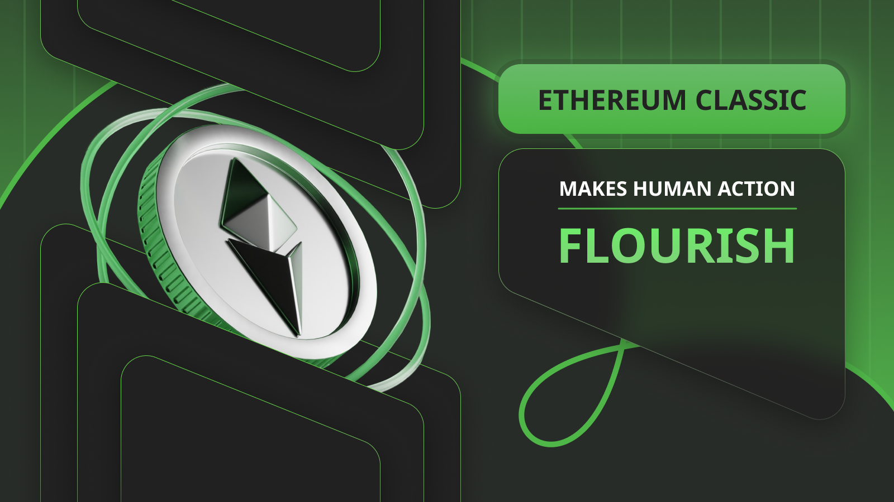

---
**You can listen to or watch this interview here:**

<iframe width="560" height="315" src="https://www.youtube.com/embed/ZBCEZaM1mKw?si=1tsGN90Kw-4bozWJ" title="YouTube video player" frameborder="0" allow="accelerometer; autoplay; clipboard-write; encrypted-media; gyroscope; picture-in-picture; web-share" allowfullscreen></iframe>

---

## Purpose of Man

From a biological perspective it may be argued that the purpose of man is to seek food, shelter, and to reproduce.

From a Biblical perspective the mandate is very similar: “Be fruitful and multiply, and fill the earth”.

Therefore, there should be little controversy in the opinion that people spend most of their lives seeking economic goods to satisfy their needs, and that these goods range from housing, to food, transportation, and clothing, etc.

However, man has historically done these things in one of two ways: By means of violence (the primitive way) or by means of commerce (the modern way).

## Incentives

The choice between using violence or commerce is constantly weighed in people’s minds. Our minds are like advanced economic calculators that continuously measure our potential costs, potential rewards, and the probabilities of these things.

When in environments that are underdeveloped, or in the jungle, the most likely method of choice to achieve our purpose will be violence. When there are no rules, and no coordinating institutions, then we will run more risks and incur in higher costs to ensure our survival and that of our descendants.

When environments are more structured, developed, and effective, then our choices will usually be to comply with the system.

By “effective” we mean that our basic goals are met.

## Human Action

Societies and economies are about human action, not about things, and rules act like funnels that direct human action in more constructive social behavior.

Rules model our incentives to change our primitive violent method, of breaking and killing things, to that of complying with the system. And, to comply has more rewards and less costs.

“Constructive social behavior” means a human action that has incentives to conduct itself peacefully, such as through commerce, political institutions, justice systems, etc.

One of the most useful tools to accomplish these things has been technology, and Ethereum Classic (ETC) is a new paradigm in this trend.

## Property

As we wrote in a [previous post](https://ethereumclassic.org/blog/2023-10-25-ethereum-classic-is-property-rights-on-a-global-scale), ETC is property rights on a global scale.

Because property is fundamental for the survival of man; as it is not possible for humans to have shelter, food, and reproduce safely without the exclusive control and possession of things and space; then systems and technologies that protect property rights are essential for non-violent human action.

However, historically, both the law and technological tools have always been somewhat biased and corrupted because they have depended on trusted third parties to run them. These agents have a history of abusing their positions of trust.

Ethereum Classic is a global decentralized, permissionless, and censorship resistant network with very strong rules that guarantee property rights  through its account systems and smart contracts.

## Labour

People may spend their time procuring and producing things for themselves and their families, or they can focus on working and making a specific good they may specialize at and exchange it for others.

Labour is the human action that is dedicated to the activities necessary to produce these goods.

When the environment is underdeveloped and hostile, then human action, manifested as labor, is directed to self preservation, thus directed at producing various goods for personal survival.

When the environment has developed systems and technologies that enable commerce sustainably, then labor is directed at satisfying other people’s needs in exchange for their specialized products.

ETC enables the interaction of individuals everywhere to do commerce through smart contracts, dapps and agreements, and its sound monetary system.

## Capital and Consumption

When man can satisfy his purpose because his incentives are channeled through developed systems and technologies; and therefore his human action is constructive, because his property is protected by the system and his labor rewarded; then the result of these things is capital formation.

Capital are goods that are not used for consumption, but for creating other goods, which will ultimately be exchanged for consumer goods through commerce.

People make choices between immediate consumption and capital investment (savings) constantly, and the more developed the system is, the more capital formation there will be in a society. Therefore, the more collective prosperity.

ETC is a technology that fosters capital formation through its account system, which protects property, and smart contracts and dapps, which enable peaceful human action worldwide. And, the fruits of people’s labor may be saved in its cryptocurrency that guarantees long term value preservation through its fixed supply.

## Markets

We have mentioned the terms “commerce” and “exchange” several times in this post, but how do people conduct this commerce and exchange we speak of?

For people to see others’ products, compare prices, and buy and sell them, they need a meeting point, whether physical or digital, have the information about the objects they wish to trade, and a set of ethical rules to conduct their transactions, and, ultimately, settle their deliveries and payments.

These meeting points or places are what are called markets. Markets have existed for millenia in human societies and have been responsible for the gradual reduction in violence in human action and its replacement for peaceful commerce.

Ethereum Classic is a platform that supports the creation of financial markets and markets for physical or digital objects through NFTs. These markets will range from tokens to securities markets, and from vehicle to real estate markets.

## Civilization

When man can direct more of his time to capital formation in a peaceful manner due to systems and technologies that protect his property, labor, and guarantee commerce, then the cost of capital in the economy tends to decrease.

As the cost of capital decreases, there is more demand for it, which increases the supply of consumer goods, which reduces their prices, which creates more prosperity and capital formation in society. As Saifedean Ammous explained in [his book](https://saifedean.com/poe) “Principles of Economics” this may be referred to as the process of civilization.

Civilization is peaceful human action that increases general prosperity. Technologies such as ETC, that enhance property rights, make labor and exchange more efficient and secure, and trust minimize all related processes, guaranteeing premissionlessness and censorship resistance, make positive human action flourish.

---

**Thank you for reading this article!**

To learn more about ETC please go to: https://ethereumclassic.org
