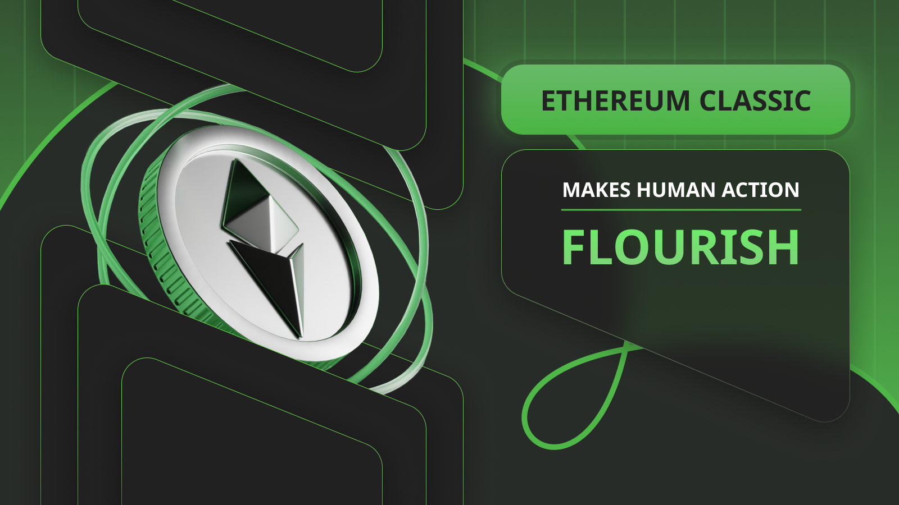

---
**由此收听此次访谈:**

<iframe width="560" height="315" src="https://www.youtube.com/embed/ZBCEZaM1mKw?si=1tsGN90Kw-4bozWJ" title="YouTube video player" frameborder="0" allow="accelerometer; autoplay; clipboard-write; encrypted-media; gyroscope; picture-in-picture; web-share" allowfullscreen></iframe>

---

## 人的目的

从生物学的角度来看，可以认为人的目的是寻找食物、住所和繁衍后代。

从圣经的角度来看，任务非常相似：“生养众多，遍满大地”。

因此，人们花费大部分时间寻找经济物质以满足他们的需求，这些物质包括住房、食物、交通和衣物等。

然而，人类历史上以两种方式来实现这些目标：通过暴力（原始方式）或通过商业（现代方式）。

## 激励

在人们的思维中，不断权衡使用暴力还是商业的选择。我们的思维就像先进的经济计算器，不断衡量潜在成本、潜在回报以及这些事情的概率。

在不发达或丛林环境中，实现我们的目标最有可能的方法是暴力。当没有规则，没有协调机构时，为了确保我们自己和后代的生存，我们将承担更大的风险和更高的成本。

当环境更加有结构、发达和高效时，我们通常会选择与体系保持一致。

所谓“高效”是指我们的基本目标得以实现。

## 人的行动

社会和经济关乎人的行动，而不是物品，规则起到引导人类行动走向更有建设性社会行为的作用。

规则塑造了我们改变原始暴力方式，即破坏和杀害物品，以遵守体系的激励。遵守体系的好处更多，成本更少。

“建设性社会行为”意味着具有和平进行的激励，如通过商业、政治机构、司法系统等。

实现这些事情的最有用工具之一是技术，以太坊经典（ETC）是这一趋势中的新范例。

## 财产

正如我们在[之前的帖子](https://ethereumclassic.org/blog/2023-10-25-ethereum-classic-is-property-rights-on-a-global-scale)中所写的，ETC是全球范围内的财产权。

因为财产对于人类的生存至关重要，人类无法在没有对物品和空间的独占控制和占有权的情况下安全地获得住所、食物和繁衍后代；因此，保护财产权的系统和技术对于非暴力人类行动至关重要。

然而，从历史上看，法律和技术工具始终有些偏见和腐化，因为它们一直依赖于可信赖的第三方来运行。这些代理人有滥用其信任地位的历史。

以太坊经典是一个全球分散、无需许可和抗审查的网络，通过其帐户系统和智能合约，它有很强的规则，保证财产权。

## 劳动

人们可以花时间为自己和家人采购和生产物品，也可以专注于工作，制作他们可能擅长的特定商品，并以其它物品交换。

劳动是致力于生产这些商品所必需的人的行动。

当环境不发达和充满敌意时，人的行动表现为劳动，用于自我保护，因此用于生产各种物品以维持个人生存。

当环境具有可持续进行商业的系统和技术时，劳动则致力于满足他人的需求，以交换他们的专业产品。

ETC通过其帐户系统、智能合约、分布式应用程序和其坚固的货币系统，使世界各地的个体能够通过智能合约、分布式应用程序和协议进行商业。

## 资本和消费

当人能够通过保护其财产、劳动和保证商业的系统和技术以和平的方式投入更多时间进行资本形成时，经济中的资本成本往往降低。

随着资本成本的降低，对资本的需求增加，这增加了消费品的供应，降低了其价格，从而创造了更多的繁荣和资本形成。正如Saifedean Ammous在[他的书中](https://saifedean.com/poe)所解释的那样，这可以被称为文明化过程。

文明化是增加普遍繁荣的和平人类行动。诸如ETC这样增强财产权、使劳动和交换更加高效和安全、最小化信任所有相关流程的技术，使积极人类行动蓬勃发展。

## 市场

在本文中，我们已经多次提到“商业”和“交换”这些术语，但人们是如何进行这种商业和交换的呢？

要看到他人的产品、比较价格、购买和出售它们，人们需要一个会面的地方，无论是实际的还是数字的，拥有他们希望交易的物品的信息，以及一组用于进行交易的道

德规则，最终解决他们的交付和支付问题。

这些会面点或地点被称为市场。市场在人类社会中已经存在了几千年，它们为人类行动中暴力逐渐减少，被和平商业所取代，发挥了作用。

以太坊经典是一个支持金融市场和物理或数字物品市场的平台，通过NFT支持这些市场。这些市场将涵盖从代币到证券市场，从交通工具到房地产市场等各个领域。

## 文明

当人能够由于保护其财产、劳动和保证商业的系统和技术而以和平的方式投入更多时间进行资本形成时，经济中的资本成本往往降低。

随着资本成本的降低，对资本的需求增加，这增加了消费品的供应，降低了其价格，从而创造了更多的繁荣和资本形成。正如Saifedean Ammous在[他的书中](https://saifedean.com/poe)所解释的那样，这可以被称为文明化过程。

文明化是增加普遍繁荣的和平人类行动。诸如ETC这样增强财产权、使劳动和交换更加高效和安全、最小化信任所有相关流程，使积极人类行动蓬勃发展。

---

**感谢您阅读本期文章!**

了解更多有关ETC，欢迎访问: https://ethereumclassic.org
