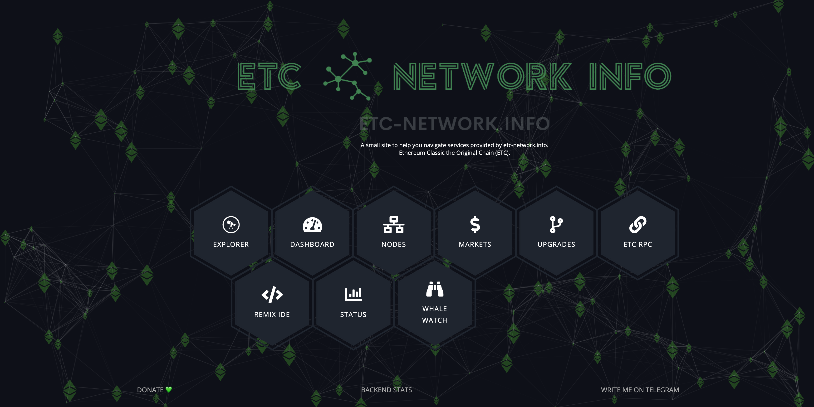

---
**由此收听或观看本次访谈:**

<iframe width="560" height="315" src="https://www.youtube.com/embed/8K9UVv8RdOw?si=4DJmuXr835gWlKSY" title="YouTube video player" frameborder="0" allow="accelerometer; autoplay; clipboard-write; encrypted-media; gyroscope; picture-in-picture; web-share" allowfullscreen></iframe>

---

在这期ETC焦点采访中，我们采访了[ETC-Network.Info](https://etc-network.info/)的创始人Mario Michel，了解他为以太坊经典网络提供的各种服务。

我们谈到了以下主题：

- Mario为什么创建了这些服务
- Mario的背景
- ETC-Network.Info提供的不同区块浏览器
- 展示所有RPC和WebSockets（ETC端点）
- 展示ETC统计仪表板
- Remix集成开发环境
- 新服务Whale Watch
- 未公开发布的Fork Monitor的新版本
- 提供的其他服务：节点、市场、升级页面和ETC状态

---

**感谢您阅读本期文章!**

了解更多有关ETC，欢迎访问: https://ethereumclassic.org
