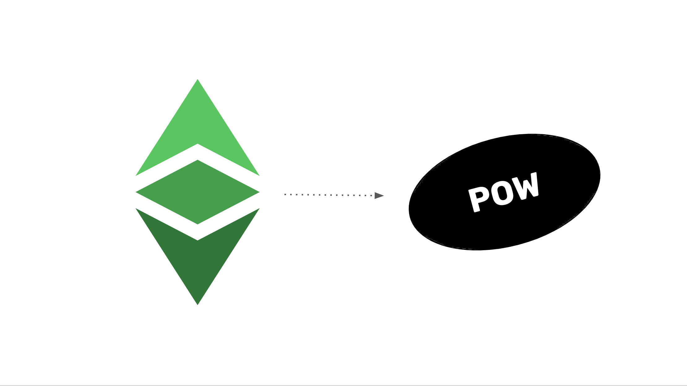

---
**You can listen to or watch this interview here:**

<iframe width="560" height="315" src="https://www.youtube.com/embed/Spawx6JQrsU?si=NUjznIN5AYYX5gOu" title="YouTube video player" frameborder="0" allow="accelerometer; autoplay; clipboard-write; encrypted-media; gyroscope; picture-in-picture; web-share" allowfullscreen></iframe>

---

As we explained in the “Ethereum Classic Course” introduction, Ethereum Classic (ETC) is one of the most valuable blockchains in the world because it is the largest proof of work smart contracts blockchain and the most secure system to host and operate decentralized applications (dapps).

At the core of its value proposition is the technology of Proof of Work (POW). POW provides true decentralization, sound money, and the most trust minimized dapps. 

In this course, that we named the “ETC Proof of Work Course”, we will explain why POW is so revolutionary and how ETC benefits from it.

This course is divided in 8 sections that we list below. Each of sections 2 through 8 start with a post that describes the advantages of POW to ETC.

## Part 1: Describing POW

1. All the Components of Bitcoin Already Existed
2. What Didn’t Exist Was a Secure Consensus Mechanism
3. How Does Proof of Work Work?
4. Why POW Based Nakamoto Consensus Is Secure and Complete
5. The POW Mining Difficulty Adjustment Explained

## Part 2: Benefits of POW

6. ETC Is BTC Philosophy With ETH Technology
7. The Revolutionary Benefits of Proof of Work
8. POW Promotes Basic Rights
9. The Meaning of Immutability in POW
10. The POW Permissionless Paradox

## Part 3: Positioning of POW

11. A Model for Ethereum Classic and Ethereum Complementation
12. How Ethereum Proved that the POW Fee Model Will Work
13. There Will Only Be 3 or 4 POW Blockchains in the Future
14. POW Winners Compared to Global Reserve Currencies
15. POW Will Be the Base Layer of the Blockchain Industry

## Part 4: Security of POW

16. The Three Pillars of Ethereum Classic
17. POW Has Division of Power, POS Does Not
18. POW Blockchains Will Always Be Under Constant Social Attack
19. POW Is Digital Gold, POS Is Community Fiat Money

## Part 5: POS Fallacies and POW Ungovernance

20. Integrating Bit Gold in Ethereum Classic
21. If It's Not Proof of Work, Then It's Not a Blockchain
22. Why POS Is Less Secure Than POW
23. POW Security Model and Ungovernance Explained
24. Proof of Work Is Not Voting

## Part 6: POW Philosophy

25. The Innovation of ETC Is Unstoppability
26. POS Social Consensus vs POW Code Is Law
27. What Does “Security” Mean in POW Blockchains?
28. POW Is Censorship Resistant, PoS Is Not
29. POW Is a Commodity, PoS Is a Security

## Part 7: Explaining the Value of POW

30. Why Does ETC Have Value?
31. POW’s Focus on Trust Minimization
32. The Enormous Value of POW During Banking Crises
33. The Meaning of Finality in POW

## Part 8: Debunking the POW Naysayers

34. Mining ETC
35. POW Must Be Attackable to be Secure
36. POW Is Not What Makes a Blockchain Unscalable
37. POW Is Not Inefficient nor Wastes Energy

As seen above, the 8 sections of the ETC Proof of Work Course promise to cover all important aspects of the technology and, when you put all the parts together, how it represents a powerful change in paradigm in computer science and for the world.

Following this introduction, we will publish 37 text articles and their corresponding videos developing all the topics laid out here.

We hope you find this course as valuable as the Ethereum Classic Course!

---

**Thank you for reading this article!**

To learn more about ETC please go to: https://ethereumclassic.org
