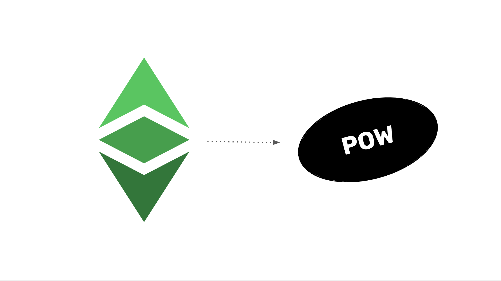

---
**您可以由此收听此次访谈:**

<iframe width="560" height="315" src="https://www.youtube.com/embed/Spawx6JQrsU?si=NUjznIN5AYYX5gOu" title="YouTube video player" frameborder="0" allow="accelerometer; autoplay; clipboard-write; encrypted-media; gyroscope; picture-in-picture; web-share" allowfullscreen></iframe>

---

正如我们在“以太坊经典课程”的介绍中所解释的，以太坊经典（ETC）是世界上最有价值的区块链之一，因为它是最大的工作量证明智能合约区块链，也是托管和运行分布式应用程序（dapps）最安全的系统。

其价值主张的核心是工作量证明（POW）技术。POW提供了真正的去中心化、可靠的货币和最小信任的dapps。

在这门课程中，我们称之为“ETC工作量证明课程”，我们将解释为什么POW如此革命性，以及ETC如何从中受益。

这门课程分为8个部分，我们以下面列出的每个部分2到8开始，其中有一篇文章描述POW对ETC的优势。

## 第一部分：描述POW

1. 比特币的所有组成部分已经存在
2. 不存在的是安全的共识机制
3. POW是如何工作的？
4. 为什么基于POW的中本聪共识是安全和完整的？
5. 解释POW挖矿难度调整

## 第二部分：POW的好处

6. ETC是比特币哲学与以太坊技术
7. POW的革命性好处？
8. POW促进基本权利
9. POW中不可变性的含义
10. POW的无权限悖论

## 第三部分：POW的定位

11. 以太坊经典和以太坊相辅相成的模型
12. 以太坊如何证明POW费用模型将奏效
13. 未来只会有3或4个POW区块链
14. POW胜者与全球储备货币的比较
15. POW将成为区块链行业的基础层

## 第四部分：POW的安全性

16. 以太坊经典的三大支柱
17. POW有权力的分割，而POS没有
18. POW区块链将一直面临持续的社会攻击
19. POW是数字黄金，POS是社区法定货币

## 第五部分：POS的谬误和POW的无治理

20. 在以太坊经典中集成比特黄金
21. 如果不是工作量证明，那就不是区块链
22. 为什么POS不如POW安全
23. 解释POW安全模型和无治理
24. 工作量证明不是投票

## 第六部分：POW哲学

25. 以太坊经典的创新是不可阻挡的
26. POS社会共识与POW法典是法律
27. 在POW区块链中，“安全”是什么意思？
28. POW具有抵抗审查制度，而POS没有
29. POW是一种商品，POS是一种证券

## 第七部分：解释POW的价值

30. 为什么ETC有价值？
31. POW关注信任的最小化
32. 在银行危机期间POW的巨大价值
33. POW中最终性的含义

## 第八部分：驳斥POW的反对者

34. 挖掘ETC
35. POW必须可攻击才能安全
36. POW不是使区块链不可扩展的原因
37. POW既不低效也不浪费能源

如上所述，ETC工作量证明课程的8个部分承诺覆盖技术的所有重要方面，当您将所有部分综合考虑在一起时，它代表了计算机科学和世界的一种强大的范式变革。

在此介绍之后，我们将发布37篇文字文章和相应的视频，详细讨论此处列出的所有主题。希望您会像以太坊经典课程一样觉得这门课程具有价值！

---

**感谢您阅读本期文章!**

了解更多有关ETC，欢迎访问: https://ethereumclassic.org
