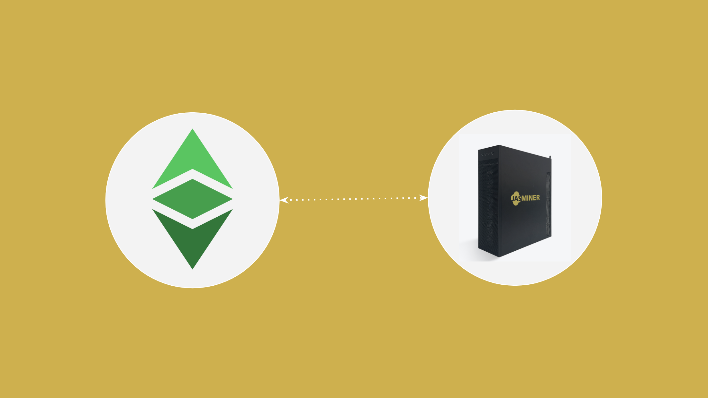
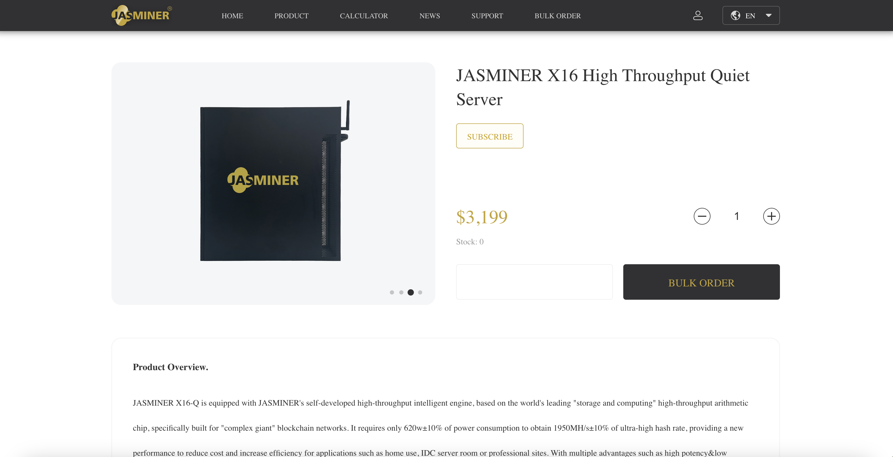
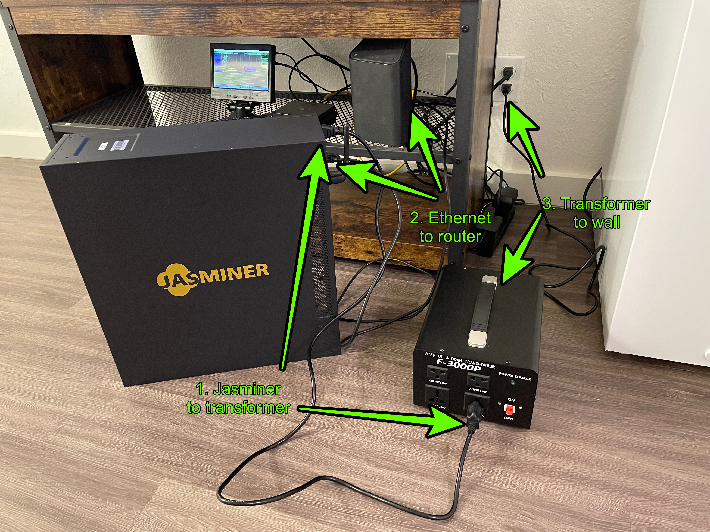
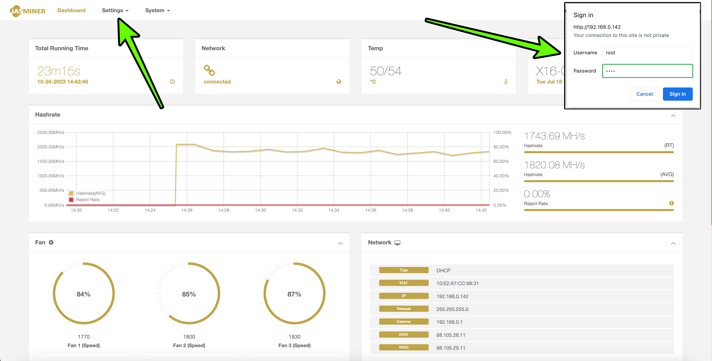
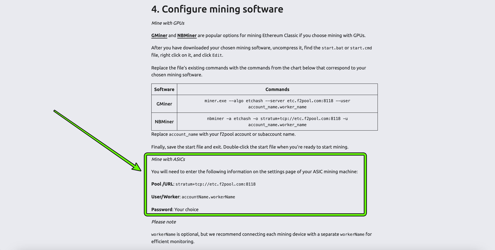
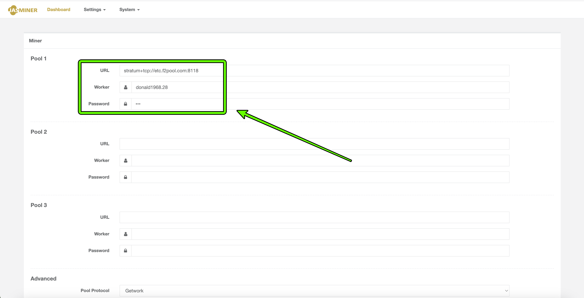
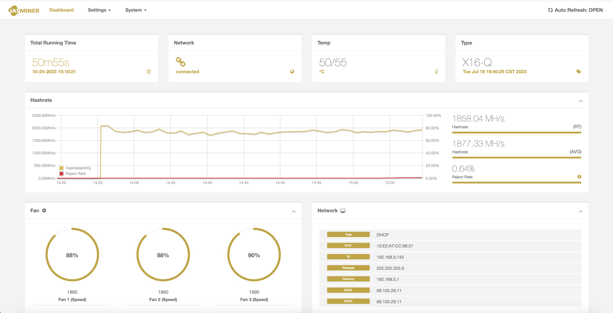
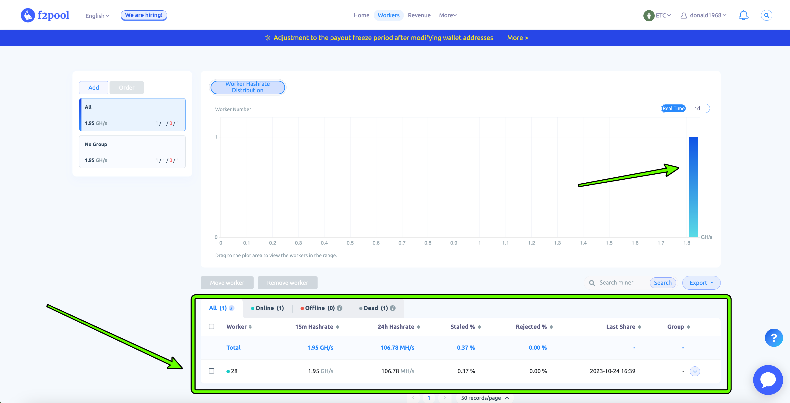
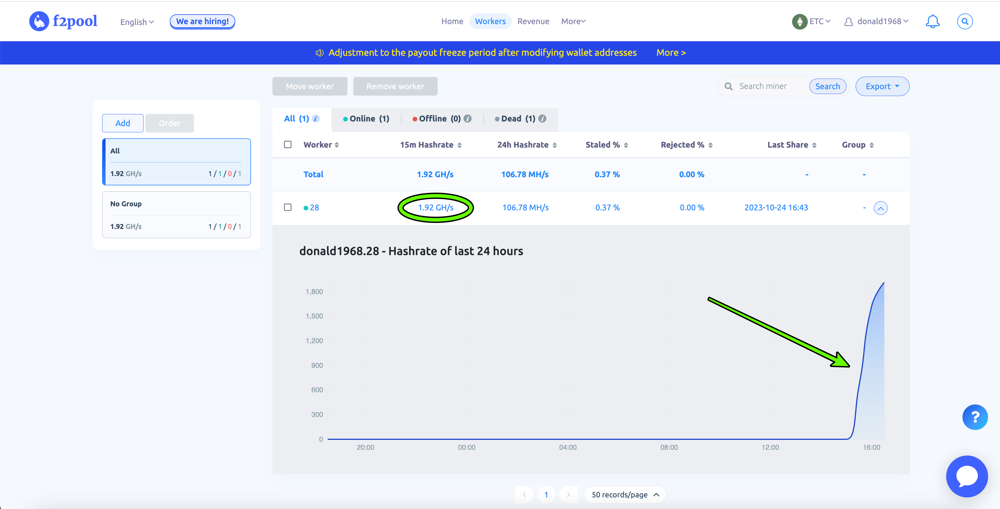
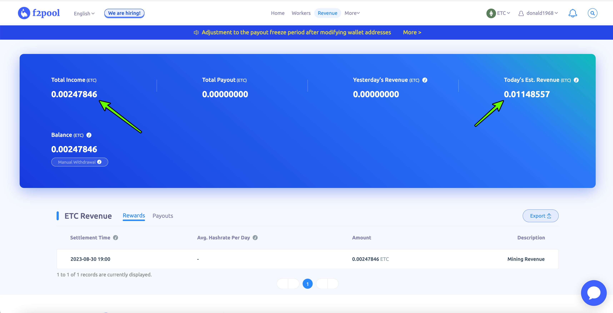

---
**由此收听本期视频:**

<iframe width="560" height="315" src="https://www.youtube.com/embed/U0htDxAIkJw?si=vGxHcXxf0_e8w4IK" title="YouTube video player" frameborder="0" allow="accelerometer; autoplay; clipboard-write; encrypted-media; gyroscope; picture-in-picture; web-share" allowfullscreen></iframe>

---

作为工作证明区块链，挖矿是以太经典（ETC）中的一个重要功能。

矿工的工作是不断收集交易，将它们分组成批次，并进行大量工作，消耗大量电力，以创建用于封存区块的加密印记。

然后，他们将区块发送给网络的其余部分，网络验证交易和加密印记，然后用新创建的ETC代币支付矿工。

这个过程对于ETC的无许可性和抗审查性至关重要，因为工作证明本身是保持全球范围内网络去中心化的关键点。

在本文中，我们将解释如何通过使用Jasminer X16-Q高通量静音服务器来参与挖矿，赚取ETC代币。

## 1. 购买Jasminer X16-Q

第一步是购买Jasminer X16-Q。我们找到了三个可能的购买地点：Jasminer制造商、亚马逊和矿工兄弟。

在Jasminer网站上，可能会显示“缺货”，但管理层在POW峰会上告诉我们他们有现货可供购买。

您可以在以下链接购买Jasminer X16-Q：

- Jasminer.com：https://www.jasminer.com/#/productDetail/908ad3781bff473ba9155276caa84456

- 亚马逊：https://www.amazon.com/Jasminer-Ethereum-throughput-Compatible-100V-240V/dp/B0CJBJJXC

- 矿工兄弟：https://www.cryptominerbros.com/product/jasminer-x16-q-ethereum-classic-miner

我们对在本文中提到的任何品牌都没有协议，也不收取任何收入、费用或佣金。

## 2. Jasminer X16-Q拆箱

当您收到Jasminer X16-Q时，您将获得一个服务器电源线、一个以太网电缆，以及一个天线（如果您希望使用WiFi进行连接）。

在我们的情况下，我们将使用以太网电缆通过本地WiFi路由器连接它。

此外，我们需要一个电源升压变压器，因为在美国俄克拉荷马州的我们所在地，电压为110伏特，但Jasminer使用的是200至240伏特的输入电压。

正如图像所示，我们有我们的Jasminer ASIC、以太网电缆、电源线、变压器（带电源线）以及用于连接和设置的互联网路由器。

## 3. Jasminer X16-Q链接

以下是使用Jasminer X16-Q开始挖掘ETC的下一步，连接所有部件并打开它。

如图所示，您需要连接以下3个部分：

1. 如果您使用变压器，将Jasminer ASIC连接到变压器（如果不使用变压器，则直接连接到墙上）。

2. 将变压器连接到墙上的电源插座。

3. 使用以太网电缆将Jasminer ASIC连接到您的路由器。

一旦您连接好所有部件，请打开Jasminer背面的电源按钮。

## 4. 感受Jasminer X16-Q的静音程度

品牌的承诺之一是，当您连接并开始运行Jasminer时，它非常安静！

在本节的短视频中，我们展示了ASIC有多安静：
<iframe width="560" height="315" src="https://www.youtube.com/embed/tG_jkCD2JC0?si=qTxjVekhkqs07Bqq" title="YouTube video player" frameborder="0" allow="accelerometer; autoplay; clipboard-write; encrypted-media; gyroscope; picture-in-picture; web-share" allowfullscreen></iframe>

## 5. 查找并登录到Jasminer X16-Q用户界面

当您已连接并运行所有部件后，您需要前往您的电脑并登录到Jasminer X16-Q的用户界面。

为了能够这样做，您的Jasminer和电脑必须连接到同一个路由器。

登录到Jasminer UI的IP地址是：

https://192.168.0.142

默认的ID和密码为：

**ID：** root

**密码：** root

登录后，您必须在“设置”选项卡中更改您的密码。

## 6. 获取矿池配置信息

## 一旦您已经设置好Jasminer，并准备开始挖矿，您需要前往您的矿池以获取配置信息，以将您的Jasminer X16-Q指向该矿池。

在我们的情况下，我们将使用F2Pool，ETC生态系统中最大的矿池，来配置和指向我们的Jasminer。

找到配置数据的链接是：

https://f2pool.io/mining/guides/how-to-mine-ethereum-classic/

从那里，您将看到、复制并输入以下数据点到您的Jasminer：

**矿池URL：** stratum+tcp://etc.f2pool.com:8118

**用户/矿工：** 帐户名.矿工名

**密码：** 您的选择

在接下来的部分，我们将解释如何操作。

## 7. 使用矿池数据配置Jasminer X16-Q

要将您的矿工指向矿池，请再次前往“设置”选项卡，然后单击“矿工”链接。

在下一个屏幕上，您将看到表格，其中有多个矿池的数据输入字段。这是为了备份，以防一个矿池宕机，这样您的矿工可以切换到另一个矿池。

由于F2pool只提供了一个ETC矿池URL供使用，我们将其添加到“矿池1”部分。

复制并粘贴矿池URL到相应的字段中。然后，矿工名称必须是您在F2pool上的用户ID，后面跟着一个点，然后是您为您的矿工指定的编号或名称。

在我们的情况下，我们使用了我们的F2pool用户名和“28”作为我们Jasminer的名称：

**donald1968.28**

密码可以是您希望的任何内容，我们使用了“123”。

要保存您的数据，请按页面底部的“提交”按钮。

## 8. 在Jasminer X16-Q上检查挖矿统计数据

一旦您在前一步中按下“提交”，那么您就开始挖ETC了！

要在Jasminer的用户界面上查看您的矿工的统计信息，您需要等待几分钟，直到仪表板填充数据。

如本部分的图像所示，我们已经挖矿超过50分钟，因此Jasminer的仪表板具有该时段的所有统计数据。

主要图表显示了每分钟的算力。它一直保持在大约1900 MH/s，这是这台机器的容量。

其他显示的数据包括挖矿时间、风扇速度和网络数据。

## 9. 在您的矿池上检查挖矿统计数据

一旦您的矿工设置好并经过本地统计数据的确认，您可以前往您的矿池统计页面，从矿池的角度查看您的Jasminer的情况。

在您的帐户中，您必须选择“ETC”作为您要查看的网络，然后前往“矿工”链接以查看您的Jasminer的统计信息。

在下一个屏幕上，您将看到您的矿工的算力，以及下方有您的矿工名称和其统计信息的部分。

如果您向下滚动，您将看到一个随着时间推移的总算力图表。

## 10. 祝贺！

所以，现在您已经准备好并运行您的Jasminer X16-Q高通量静音服务器，我们恭喜您成为了一个ETC矿工！

如果您前往F2pool帐户的“收益”部分，您将看到您在ETC中累积的奖励，以及用于管理您的资金的工具。

愿您挖矿愉快！

---

**感谢您阅读本期文章!**

了解更多有关茉莉矿机: https://jasminer.com

了解更多有关F2pool: https://www.f2pool.com/

了解更多有关ETC: https://ethereumclassic.org
