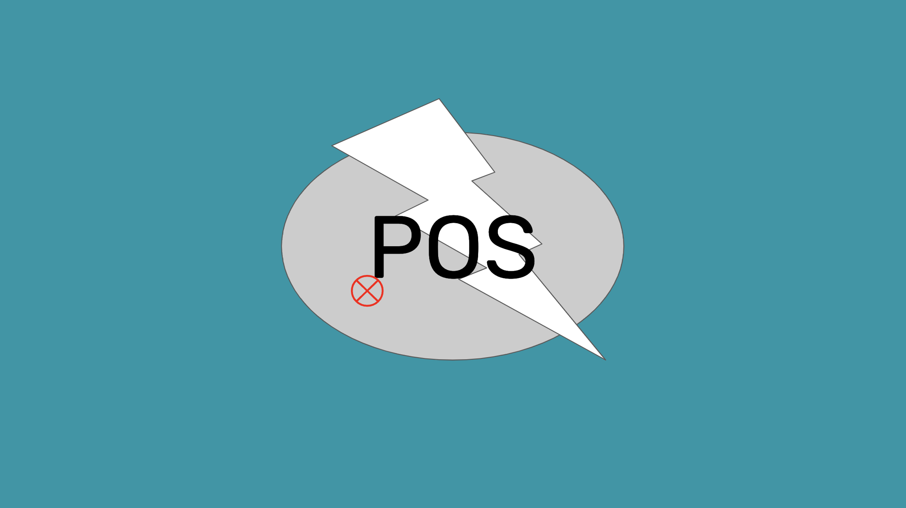

---
**You can listen to or watch this video here:**

<iframe width="560" height="315" src="https://www.youtube.com/embed/wyZUxolbTuY?si=MyGPxtTk8UyNvRwP" title="YouTube video player" frameborder="0" allow="accelerometer; autoplay; clipboard-write; encrypted-media; gyroscope; picture-in-picture; web-share" allowfullscreen></iframe>

---

We have produced many articles and videos explaining the benefits of proof of work (POW) and why it is a truly decentralized technology.

It is worth noting that Bitcoin (BTC) and Ethereum Classic (ETC) have been working with a 99% plus uptime since 2009 and 2015 respectively in a totally decentralized way.

However, in proof of stake (POS) the same cannot be said. Since Ethereum migrated to that consensus mechanism, it has [been censored](https://www.coindesk.com/tech/2022/10/14/censored-ethereum-blocks-hit-the-51-threshold-over-the-past-24-hours) and has had problems with [staking pool centralization](https://www.coindesk.com/consensus-magazine/2023/09/29/opposing-centralization-in-ethereum-staking).

In this post we will explain the main design flaws of POS and why it it is broken, in other words, centralized.

## No Economic Friction

In any industry there is always a tendency for concentration. What level of concentration usually depends on frictional costs that impede economic scale of single players.

For example, in the legal industry there are hundreds of thousands of law firms because humans are not scalable. Individual lawyers only have a set number of hours to work and that is the number they can sell. Therefore, to increase supply, more lawyers are needed, increasing the number of law firms.

On the other hand, in banking there are usually three or four banks that dominate the industry with huge market shares because that business is largely powered by technology, which reduces friction, and the larger the banks get the more secure and appealing they are to the public.

Proof of stake has a similar concentration pattern as in banking, but its frictional costs are even lower.

In POS, stakers worldwide have their deposits inside a single network, and having money in a staking pool or not is trivial cost wise. People can stake any amount in staking pools such as Lido, Coinbase, or RocketPool, and immediately get a liquid token that represents the ETH they staked. 

This increased efficiency, and the fact that the larger the staking pools are they appear more secure and appealing, has created mega staking pools like Lido, that regularly control more than 33% of staked coins, crossing the fault tolerance threshold in POS chains, meaning that they can disrupt the operation of the system.

The above means that anyone anywhere in the world can stake, staking is frictionless, they can stake in any pool they wish, but they all wish to stake in the big and secure ones, and, therefore, the bias to centralization is accentuated.

In proof of work, there are economies of scale as well, but because there are much higher frictional costs, then mining has always been concentrated but nevertheless decentralized.

POW demands that miners sink capital into machines, then they have to spend enormous amounts of electricity in creating blocks, and only then they perceive a return in coins.

Additionally, the distribution of electricity sources is dispersed all around the world, making it difficult to centralize operations.

On top of this all, the fault tolerance threshold in POW networks is 51% making it even more difficult to reach a disrupting share in those systems.

## Staking Penalties Induce Bad behavior

Proof of work has a positive incentive system of participation: If a miner produces a block that conforms to the rules, then it is accepted and rewarded, if it does not conform, then it is rejected and nothing else happens.

Proof of stake has a negative incentive system: If stakers produce blocks that conform to the rules, then they are rewarded, but if they don’t, or even have unstable behavior like being offline, then they get penalized.

The penalization system in proof of stake creates perverse incentives that we explain below.

### It Leads to Staking Pool Centralization

Because there are several types of penalties in POS, and to avoid them largely depends on that validators must be working persistently and with nor errors, then the public prefers to delegate the technical operation of this type of data infrastructure to more sophisticated players.

This means that there are millions of ETH staked, but most of them are in the largest staking pools such as Lido, Coinbase, RocketPool, Binance, and Kraken.

In POW mining, miners may have failures in their operations, interruption due to unstable flows of electricity, down internet connection, or they may even be banned like in the case of China in 2021, but they won’t suffer any penalties, and they can regroup and start mining again whenever they wish.

### It Leads to Litigation

In such a complex set of rules as in POS, with arbitrary definitions of "bad behavior" and subsequent high penalties, this opens the door for legal interpretations of what is "good" or "bad" similar to traditional legal systems.

A such, this leads POS to be a litigious system where disgruntled stakers, validators, and pools may start lawsuits against developers, the Ethereum Foundation, and early investors to recover past penalties. 

A system with rewards, performance clauses, and monetary penalties is more suitable for a traditional kind of contract rather than "Code Is Law" systems as blockchains should be. 

Additionally, there is the possibility that the designers have not thought of all the “good” and “bad” behavior scenarios, as they have clearly failed for the economic behaviors, and this may create unforeseen legal conflicts.

### It Induces the Stockholm Syndrome

This has not been detected in POS yet, but we pose the following rhetorical question:

In such a strict, complex set of rules as proof of stake, where validators need to be part of the majority 2/3s of the system in order not to get penalized, wouldn't many of them start to validate epochs (groups of blocks) and voting for individual blocks regardless of validity, out of fear of the penalty rather than because the transactions and blocks are true and verified?

This is something that could already be happening now, and the system clearly induces validators to just go with the flow as sheep do even if they may be going in the wrong direction.

## The Rich Get Richer (And Control Everything)

Finally, there is an economic effect that proof of stake has that has been made worse by EIP-1559 and is particularly perverse in Ethereum. 

EIP-1559 is a set of rules introduced in the network that has no use other than creating a convoluted burning mechanism so that ETH coin supply would plateau and then start decreasing. Basically it burns more or less half of the fees each time a transaction is executed. The other half is earned by the miners.

This in itself is a gimmick just to make individual coins more valuable, which is ethically dubious.

But it is perverse in a broader economic and social way as it introduces the [Cantillon effect](https://en.wikipedia.org/wiki/Richard_Cantillon) in Ethereum, which is that the rich get richer and the poor get poorer.

We explain this system bias mechanism as follows:

1. Stakers (read "rich people" and "staking elites") have their surplus and savings parked in staking pools and earn a constant income, increasing their nominal amounts with the rewards and their wealth overtime as the coins gain value due to the reduction in supply.

2. The general economy, composed of people who save very little or live paycheck to paycheck, use the currency for daily expenses but every time they transact, a fraction is burned.

At a macro level, this scheme produces a transfer of wealth from the poor to the rich. The stock used by the poor is diminishing as the stock used by the rich is increasing. 

Another effect is that the large coin holders will eventually be very few and will have even more control over the system than what they already have in the present.

---

**Thank you for reading this article!**

To learn more about ETC please go to: https://ethereumclassic.org
