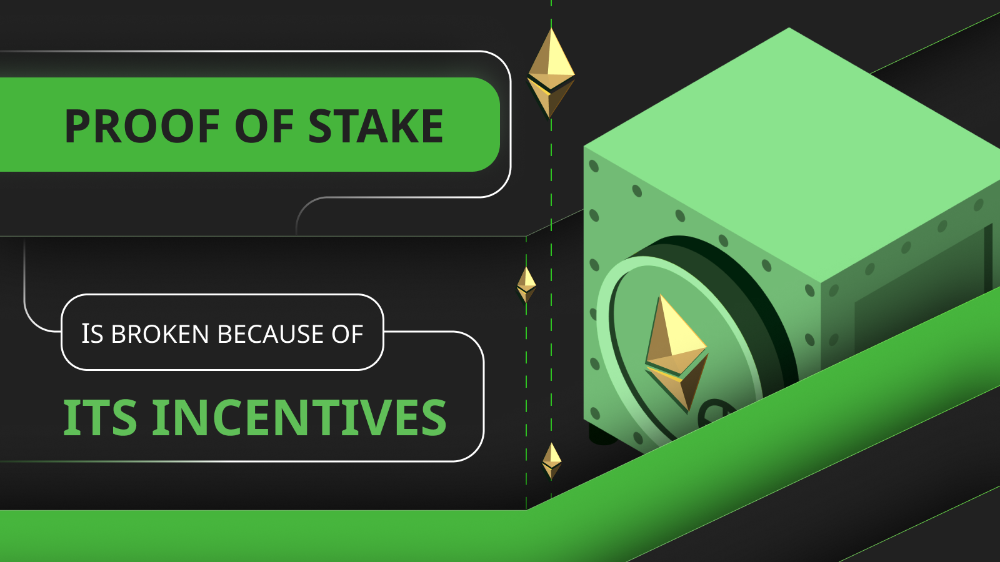

---
**由此收听本期访谈:**

<iframe width="560" height="315" src="https://www.youtube.com/embed/wyZUxolbTuY?si=MyGPxtTk8UyNvRwP" title="YouTube video player" frameborder="0" allow="accelerometer; autoplay; clipboard-write; encrypted-media; gyroscope; picture-in-picture; web-share" allowfullscreen></iframe>

---

我们已经制作了许多文章和视频，解释了工作证明（POW）的好处，以及为什么它是一种真正去中心化的技术。

值得注意的是，比特币（BTC）和以太坊经典（ETC）自2009年和2015年以来一直以99%以上的正常运行时间在完全去中心化的方式下运行。

然而，在权益证明（POS）方面，情况并非如此。自以太坊迁移到这种共识机制以来，它已经[受到审查](https://www.coindesk.com/tech/2022/10/14/censored-ethereum-blocks-hit-the-51-threshold-over-the-past-24-hours)，并且存在[权益池集中问题](https://www.coindesk.com/consensus-magazine/2023/09/29/opposing-centralization-in-ethereum-staking)。

在这篇文章中，我们将解释POS的主要设计缺陷以及为什么它已经破裂，换句话说，变得中心化。

## 没有经济摩擦

在任何行业中，总会存在一种集中趋势。集中程度通常取决于妨碍单个参与者经济规模的摩擦成本。

例如，在法律行业，有数以千计的律所，因为人类不具备可扩展性。个体律师只有固定数量的工作小时，这就是他们可以出售的数量。因此，为了增加供应，需要更多的律师，从而增加了律所的数量。

另一方面，在银行业通常有三家或四家主导业界的银行，因为这个业务主要由技术驱动，减少了摩擦，而且银行规模越大，对公众越安全和吸引人。

权益证明具有与银行业类似的集中模式，但其摩擦成本更低。

在POS中，全球的权益持有者将其存款放在一个网络中，而将资金放入权益池或不放入在成本方面都不重要。人们可以将任何数量的资金放入权益池，如Lido、Coinbase或RocketPool，立刻获得代表其权益的ETH的流动代币。

这种提高的效率以及权益池规模越大，看起来越安全和吸引人，已经创造了像Lido这样的超大权益池，经常控制超过33%的权益币，超越了POS链的容错阈值，这意味着他们可以干扰系统的运行。

上述情况意味着世界各地的任何人都可以进行权益投票，权益投票是无摩擦的，他们可以选择在任何池中进行权益投票，但他们都愿意在大型和安全的池中进行权益投票，因此，中心化的偏见被加重。

在工作证明中，也存在规模经济，但由于摩擦成本更高，因此采矿一直是集中的但仍然是去中心化的。

POW要求矿工将资本投入机器，然后在创建区块时花费大量电力，然后才能获得硬币回报。

此外，电力来源的分散分布在世界各地，使中心化运营变得更加困难。

此外，POW网络中的容错阈值为51%，这使得更难达到这些系统的干扰份额。

## 权益惩罚引发不良行为

工作证明具有积极的参与激励系统：如果矿工产生符合规则的区块，那么它会被接受并获得奖励，如果不符合规则，则会被拒绝，不会发生其他事情。

权益证明具有负激励系统：如果权益持有者产生符合规则的区块，他们会得到奖励，但如果不符合规则，或者甚至有不稳定的行为，比如离线，那么他们将受到惩罚。

权益证明中的惩罚系统创造了我们下面解释的恶劣激励。

### 它导致了权益池的集中

因为POS中存在各种类型的惩罚，而避免这些惩罚在很大程度上取决于验证者必须持续工作，没有错误，所以公众更愿意将这种数据基础设施的技术运营委托给更有经验的参与者。

这意味着有数百万ETH被抵押，但其中大部分都在像Lido、Coinbase、RocketPool、Binance和Kraken这样的最大权益池中。

在POW挖矿中，矿工可能会在运营中出现故障，电力不稳定流、互联网连接中断，甚至可能被像2021年中国那样禁止，但他们不会受到任何惩罚，他们可以随时重新组织并开始挖矿。

### 它导致了诉讼

在POS中存在如此复杂的规则，存在

对“恶劣行为”的武断定义以及随后的高额惩罚，这打开了解释何为“好”或“坏”的法律解释的大门，类似于传统的法律体系。

因此，POS成为一个容易引发诉讼的系统，不满的权益持有者、验证者和权益池可能会起诉开发者、以太坊基金会和早期投资者以恢复以前的惩罚。

一个具有奖励、绩效条款和经济处罚的系统更适合于传统的合同，而不适合于区块链应该是“法律即代码”的系统。

此外，设计者可能尚未考虑到所有的“好”和“坏”行为情景，正如他们明显在经济行为方面失败一样，这可能会导致意想不到的法律冲突。

### 它诱发了斯德哥尔摩综合症

尽管在POS中尚未发现这一问题，但我们提出以下反问：

在如此严格、复杂的权益证明规则下，验证者需要成为系统的大多数2/3，以免受到惩罚，那么他们中的许多人是否会开始验证区块（区块组）并投票支持个别区块，而不考虑其有效性，只是出于对惩罚的恐惧而这么做，而不是因为交易和区块是真实和经过验证的？

这是可能已经在发生的事情，而且这个系统明显鼓励验证者像绵羊一样随波逐流，即使他们可能正在走错方向。

## 富者愈富（并控制一切）

最后，权益证明有一个经济效应，由于EIP-1559而变得更糟，特别是在以太坊。

EIP-1559是引入到网络中的一组规则，除了创建一个复杂的销毁机制以使ETH的货币供应稳定并开始减少以外没有其他用途。基本上，每次执行交易时会燃烧大约一半的手续费。另一半由矿工获得。

这本身只是为了使个别硬币更有价值而采取的噱头，这在道义上是可疑的。

但从更广泛的经济和社会角度来看，它引入了以太坊中的[坎蒂隆效应](https://en.wikipedia.org/wiki/Richard_Cantillon)，即富者愈富，穷者愈贫。

我们解释这一系统偏向机制如下：

1. 权益持有者（即“富人”和“权益精英”）将其剩余和储蓄存放在权益池中，获得持续的收入，随着奖励和硬币因供应减少而增值，他们的名义金额也在增加。

2. 一般经济由那些几乎不储蓄或靠工资度日的人组成，他们用货币进行日常支出，但每次进行交易时都会燃烧一部分。

在宏观层面，这一方案导致贫富之间的财富转移。穷人使用的货币减少，而富人使用的货币增加。

另一个效果是，大的硬币持有者最终将非常少，并且将对系统拥有更多的控制权，比目前已经拥有的控制权更多。

---

**感谢您阅读本期文章!**

了解更多有关ETC，欢迎访问: https://ethereumclassic.org
