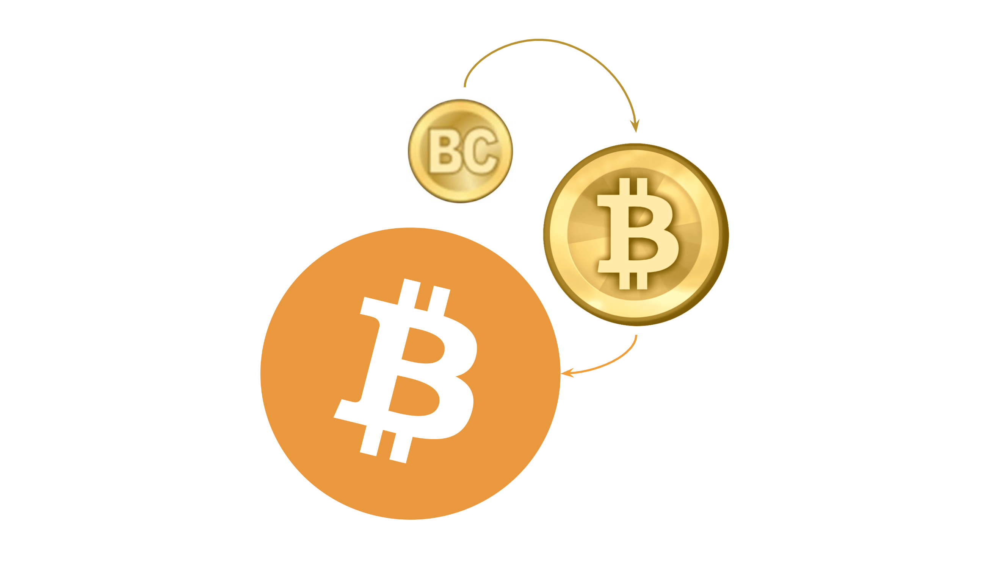

---
**欢迎由此收听或观看本期视频:**

<iframe width="560" height="315" src="https://www.youtube.com/embed/e4e9CjvEUlE?si=rRGqoSJIjNMWRgPc" title="YouTube video player" frameborder="0" allow="accelerometer; autoplay; clipboard-write; encrypted-media; gyroscope; picture-in-picture; web-share" allowfullscreen></iframe>

---

14年来，比特币（BTC）的存在仍然令人惊叹，这是一项不可思议的发明。它是互联网上的去中心化货币系统，实现了货币与国家的分离。它就像黄金，但存在于互联网中。这是一项某些人一直在寻求但却没有实现的壮举，只有中本聪（Satoshi Nakamoto）实现了。

然而，比特币是一系列已经广泛知晓的组成部分的集合，而且在2009年1月比特币发布之前，研究这一主题的人们已经了解了这些组成部分。

比特币的各部分没有创新，事实上，它们的大部分概念和思想都已经存在数年甚至数个世纪！

在本篇文章中，我们将讨论比特币的主要组成部分，解释它们的存在，为解释比特币的真正革命性发明做好准备。

## 对等网络已经存在

可以说互联网本身就是一个对等网络。它是在1960年代开发的，由一系列计算机组成，它们共享相同的协议来相互发送消息。

然后，1999年，对等网络中文件共享的概念由Napster普及，使人们能够通过互联网共享音乐文件。

比特币是一种全球性的对等计算机网络，这些计算机都拥有区块链的完全相同副本，这是包含加密货币的财产所有权的数据库。

将财产所有权放在对等网络中的想法早在1998年就已经被了解并写出。

## 基本货币已经存在

黄金之所以成为货币，是因为它具有可分割性、可携带性和耐久性，但最重要的是因为它是稀缺的。

稀缺性是货币硬度的来源。货币越稀缺，它就越硬，而它越硬，它就越能保持其价值。

这一教训是人类几千年来已经了解的。当罗马皇帝开始通过将黄金与低价值金属混合来贬值他们的货币时，他们知道他们在做什么以及它的通货膨胀后果。

当16世纪和17世纪的欧洲因来自新大陆的大规模银币涌入而经历高通货膨胀时，他们知道问题的根源和原因。

如果要创建一种新的数字货币，它必须是硬货币。

## 三重记账已经存在

当我们在制定预算或跟踪资金流动时，我们可能会写一个只有贷方和借方的单列。这被称为“单一记账”，因为每个交易都只是我们列中的一个输入。

几百年前，为了解决更复杂的组织的会计问题，开发了“双重记账”系统。这包括在两个不同的分类账中制定同一交易的两个记录，通常一个是借记，另一个是贷记。这是一项重大进步，因为当账户平衡时，它们具有更高的准确性保证。

比特币使用的是所谓的“三重记账”，即在同一交易中放置初始的贷方和借方，并为它们添加一个加密签名以密封它们。这进一步提高了系统的

安全性和准确性。

然而，三重记账，也就是比特币的“UTXO”系统的特点，早在2005年由Ian Grig提出。

## 完全复制账本已经存在

比特币安全的核心是区块链必须在系统的所有参与节点中完全复制。

拥有完全复制账本的节点越多，分布在不同大陆、地区、文化和国家，系统就越安全，因为几乎不可能通过人为或自然的方式篡改或损害它。

自20世纪80年代以来，计算机网络系统中存在冗余信息副本的概念一直是一种标准。

这些网络所面临的问题是，如果系统中的不到1/3的节点出现故障，整个系统将失败。这就是所谓的“拜占庭将军问题”。

## 比特黄金已经存在

可以理论上创建一个在互联网内部具有与黄金相同特性的物品的概念是由Nick Szabo于1998年初开发的。

他称之为“Bit Gold”，并受到Adam Back创建的名为“HashCash”的工作证明系统的启发。

HashCash通过让计算机执行大量计算工作来创建加密标志，也称为“工作证明”，然后将其附加到电子邮件上。因为每封电子邮件都必须加盖标志，所以它可以防止垃圾邮件，因为任何想要通过互联网发送大量电子邮件的人都必须花费大量的计算周期和电力。

Nick Szabo的杰出想法是，工作证明的加密标志可以类似于互联网中的黄金。如果一盎司黄金需要黄金矿工付出大量努力来生产，这使其变得稀缺，那么如果加密标志需要计算机付出大量努力来生产，那么这也使它稀缺，因此称为“数字黄金”或“Bit Gold”。

比特币货币系统的核心是这个Bit Gold。

## B-money已经存在

基于Nick Szabo创建Bit Gold的想法，Wei Dai想出了一种在对等网络中创建以Bit Gold支持的硬币的系统。

他称他的想法为“B-money”，它的工作方式如下：

1. 对等网络中的一些计算机通过使用大量计算能力和电力来生成加密标志

2. 然后，他们将标志发送给网络的其余部分，以验证工作是否已完成

3. 当系统中的其余节点验证标志是合法的时，他们会向标志的制作者支付系统内新创建的一定数量的硬币

正如你可能已经意识到的，上述就是比特币的运作方式！然而，Wei Dai于1998年末发表了关于B-money的[论文](http://www.weidai.com/bmoney.txt)！

## 信任最小化已经存在

整个区块链行业的目标是减少对第三方的信任，因为可信赖的第三方往往滥用其权力。

事实上，Satoshi Nakamoto在比特币白皮书中提到了信任最小化[14次](https://etherplan.com/2020/02/29/satoshi-nakamoto-mentioned-trust-minimization-14-times-in-the-bitcoin-white-paper/10210/)！

其想法是，货币的属性，即账户和余额的分类账，不应该由受信任的机构保管，而加密货币的供应或货币政策也不应该由一组人或政府来决定。

比特币区块链在全球数千台计算机中的完全复制以及网络的完全去中心化使其信任最小化，因为没有任何一方可以篡改分类账或更改其货币政策。

然而，这一信任最小化的概念和目标已经在2001年由Nick Szabo开发和[撰写](https://nakamotoinstitute.org/trusted-third-parties/)！

那么，比特币的真正发明是什么？

这是一个很好的问题，许多人在[早期曾问过自己](https://unenumerated.blogspot.com/2011/05/bitcoin-what-took-ye-so-long.html)！

Satoshi Nakamoto的不可思议的发明不是硬货币、对等网络、三重记账、信任最小化、数字黄金、加密货币或完全复制账本。他的发明是所谓的“中本聪共识”，即所有这些部分如何协同工作。

我们将在下一课中解释中本聪共识，也称为“工作证明”，是如何工作的！

---

**感谢您阅读本期文章!**

了解更多有关ETC，欢迎访问: https://ethereumclassic.org
