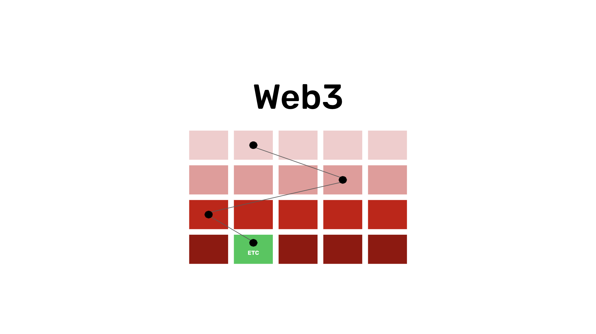
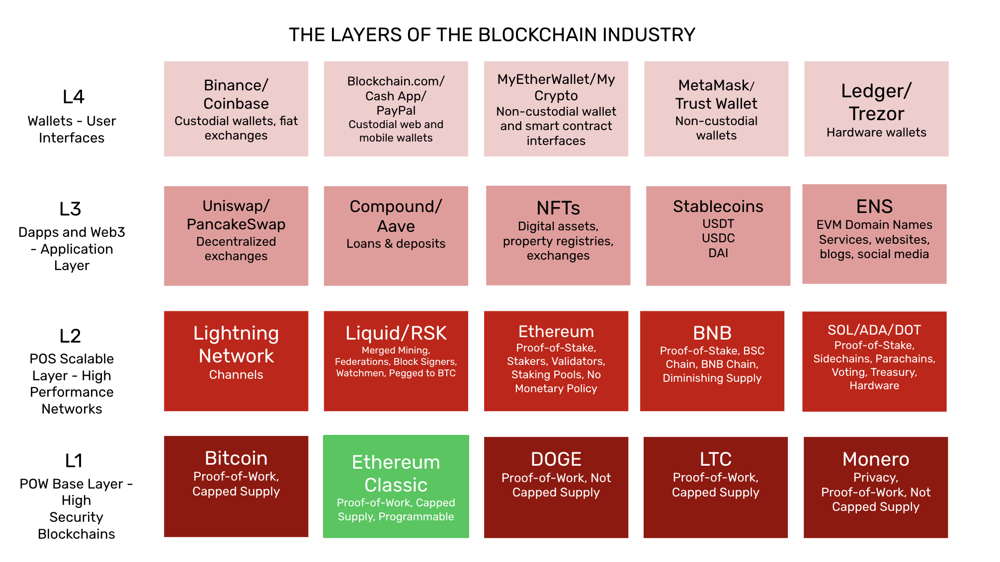

---
**You can listen to or watch this video here:**

<iframe width="560" height="315" src="https://www.youtube.com/embed/aVcb8XfaODY?si=jK7WjtUGmauvahEf" title="YouTube video player" frameborder="0" allow="accelerometer; autoplay; clipboard-write; encrypted-media; gyroscope; picture-in-picture; web-share" allowfullscreen></iframe>

---

The promise of the blockchain industry is decentralization of technological systems and networks so that people and businesses may continue conducting their affairs while depending less on trusted third parties.

Trusted third parties; such as governments, corporations, and special interests; manage nearly all systems in the world through data centers and cloud services and are security holes because they tend to abuse the trust that has been deposited in them.

The Web3 is a vision of a decentralized web and software applications using the capabilities of the blockchain industry.

In the next sections we will explain what is the Web3, what is Ethereum Classic (ETC), how the Web3 will work on ETC and the blockchain sector in general, and why apps on ETC will be the most secure in the world.

## What Is the Web3?

Websites and apps today use front end software code to deliver the user experience, back end code to perform the core operations and services of the applications, images, document files, and databases to store the information of users and system states.

All these components are usually hosted and executed in centralized data centers or cloud services with servers controlled by few people.

Using the blockchain industry paradigm of decentralization, the future of websites and apps is that they will store and execute these components in decentralized systems.

For example, the images and files will be stored in file storage blockchains, the databases will be stored in database storage blockchains, the front end will be stored in distributed code networks, and the back end code will be stored and executed in smart contract blockchains such as ETC.

## What Is ETC?

To give a glimpse of how these systems will work, an explanation of how ETC works will be illustrative.

Ethereum Classic is a blockchain that holds accounts, balances, and software programs. Both the ledger, with the accounts and balances, and the software programs are copied in all participating nodes in the network. This means that where in centralized systems everything is under the control of one entity in their servers, in ETC the ledger and the software programs are really replicated in many computers around the world, which are owned by many people of different regions, cultures, nations, and languages. 

A blockchain is a system that operates as described above, and when the software programs are stored in it, they become decentralized. These decentralized programs are what are called “smart contracts”.

This level of decentralization guarantees that no one entity or group may tamper or arbitrarily change or censor the accounts, balances, and software programs in ETC.

## How Will the Web3 Work With ETC?

So, the way the Web3 will use ETC is that the Ethereum Classic blockchain will host the backend critical security components of website and applications. 

ETC will not really be used for file storage, heavy databases, or front end code.

As ETC is a highly secure smart contracts blockchain, because it uses proof of work as its consensus mechanism, the most appropriate use of its capabilities by websites and apps will be for such use cases as storage of treasuries and the rules to manage those treasuries.

Web3 will also use ETC for other highly secure back end functions such as for decentralized autonomous organizations (DAOs), property registries, and storing high value NFTs that may represent digital or real world objects, such as real estate or vehicles.

## How Will the Web3 Work With the Blockchain Industry in General?

If the Web3 will use ETC for backend code only, then what will it use to store and manage the rest of the components? 

The blockchain industry is a collection of systems that, at their core, replicate all the information in as many nodes as possible to achieve decentralization, which has the benefits of trust minimization.

In the image below you may see how the industry will be layered. People will use their wallets to connect to Web3 and apps, then those apps will use the best blockchains and networks to run their components for their specific use cases.

However, today, the majority of websites used are centralized and the decentralized applications’ backends are stored exclusively in one blockchain such as Ethereum.

What will happen in the future is that websites and applications will use multiple blockchains and industry systems to provide the complete experience to users and to have ALL their components decentralized.

This means that, as said before, the front end code will be hosted in a specialized network, the files and images in another, the databases in another, and the backend code in ETC.

## Why Applications in ETC Will Be the Most Secure Apps in the World

For the very high security use cases, the decentralized web and apps will not be so distributed, though.

There will be applications that will need very high security standards and those will only be provided by large proof of work networks such as ETC.

Ethereum Classic is the environment where the most secure applications in the world will exist.

This is because it is a proof of work blockchain, it has a fixed monetary policy, and it is programmable with smart contracts. These three components combined in the same system, and the fact that it is the largest blockchain in the world with this design, provide the highest level of decentralization, thus trust minimization, thus security for the Web3.

For this kind of function, users will use their hardware wallets to interact with high security apps, and the apps will be simple user interfaces, probably locally hosted apps in personal computers or mobile devices, and will interact directly with ETC only.

---

**Thank you for reading this article!**

To learn more about ETC please go to: https://ethereumclassic.org
