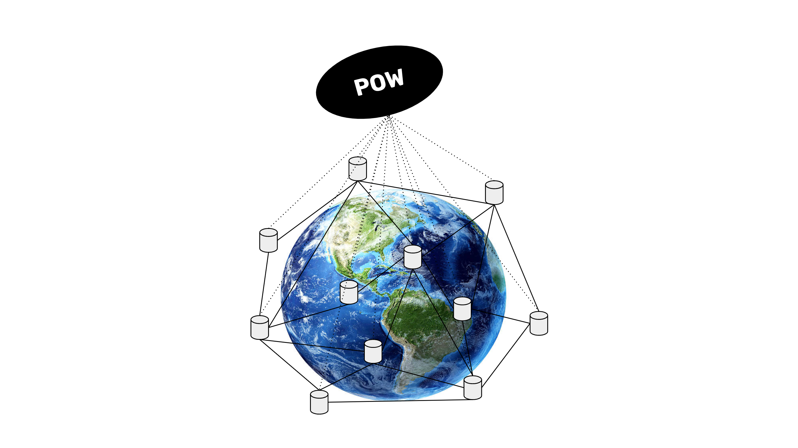

---
**You can listen to or watch this video here:**

<iframe width="560" height="315" src="https://www.youtube.com/embed/PukOAOwaCac?si=DpO9FpEQZ8RlN59S" title="YouTube video player" frameborder="0" allow="accelerometer; autoplay; clipboard-write; encrypted-media; gyroscope; picture-in-picture; web-share" allowfullscreen></iframe>

---

In the previous class, 1, we explained that all the components of Bitcoin already exited. So, what was Bitcoin’s invention?

As we wrote, the amazing invention by Satoshi Nakamoto was not hard money, peer-to-peer networking, triple entry accounting, trust minimization, digital gold, a cryptocurrency, or a fully replicated ledger. 

His invention was what is called “Nakamoto Consensus” which is HOW all these parts WORKED TOGETHER.

The brilliant idea was that the proof of work (POW) cryptographic stamp not only could be used to create the analogy of gold on the internet, called “Bit Gold”, but that the information of the POW itself could be a focal point for all the nodes of the network globally to be on the same exact state of the database, all at the same time, in their complete isolation, without the need to consult with any other source or authority. This was the key to decentralization and the magnitude of proof of work!

## What Is a Consensus Mechanism?

The idea of blockchains is to replicate the same information on all nodes of the system. The problem was how machines which were controlled by different people in different continents, regions, and cultures could agree on which is the correct information to replicate and store locally.

This was because just by sending the information was not enough security because if only 1/3 of the participating machines in the system cheated, then the communication would fail.

A consensus mechanism is a way for computers in a peer-to-peer network to distribute information to each other and to reach a consensus on the same exact state of the data every set amount of time, which is 10 minutes in the case of Bitcoin or 13 seconds in the case of Ethereum Classic (ETC).

Satoshi’s invention of “Nakamoto Consensus”, which will be explained in detail in classes 3, 4, and 5, was a new consensus mechanism that had a higher security level than what was available at the time.

## POW As an Analogy of Gold

So, the way the discovery progressed was that HashCash was invented in 1997 to prevent spam, and it used proof of work to make machines work every time they sent an email.

Then, as we explained in the last class, Nick Szabo’s idea was that the proof of work cryptographic stamp itself could be analogous to gold but in the internet. 

If an ounce of gold requires a lot of work by gold miners to produce, and this makes it scarce and valuable, then if a cryptographic stamp requires a lot of work by computers to produce, this should make it scarce and valuable as well, hence “digital gold” or “Bit Gold”, as Szabo called it.

The heart of Bitcoin’s monetary system is this Bit Gold, and the work to create Bit Gold would be the key to consensus.

## Bit Gold As the Focal Point

The way that Bit Gold, or the proof of work cryptographic stamp, works as a consensus mechanism is by contrast.

If you were to receive several bars of gold, and all were of the same size and looked the same, but all except one were made of gold painted wood, then it would be very easy for you to know which is the real gold bar. Just by feeling the weight it would be enough of a hint to differentiate the dishonest vs the honest gold bars.

In the same way, all computers in a proof of work blockchain such as Bitcoin may constantly receive blocks from several sources of which the majority may be imposters trying to trick them, but they always know which is the correct block every round just by checking the proof of work cryptographic hash. This is how Bit Gold becomes the focal point of consensus in the system.

## What Is to Be on the Same Exact State?

As we explained in a previous section, the idea of blockchains is to replicate the same information on all nodes of the system to reach a consensus on the same exact state of the data every set amount of time.

By “data” it is meant the ledger with the accounts and balances of the cryptocurrency. This means that all the machines that work on the Bitcoin blockchain hold the same exact copy of the accounts and balances of all users.

To be on the same exact state means that every 10 minutes in Bitcoin, all the nodes in the system have their databases updated with the same exact new block, therefore they all have the same exact number of blocks, with the same exact copy of all the account and balance history.

## Why Is POW Secure?

The full replication of the data explained in the previous section is the central security strategy of Bitcoin as it guarantees a level of redundancy of the information that is very difficult to tamper with or destroy by man or nature.

The key contribution of proof of work, which was the key to the creation of Bitcoin and the whole blockchain industry, was that it enabled consensus between all machines with a higher threshold for attackers to be able to interfere with the integrity of the data. 

To disrupt Bitcoin, more than 50% of the existing computing base or the same or larger computing base would have to be built to create attacking blocks to trick the rest of the network into accepting them.

The other feature was that all the nodes, in their complete isolation, without the need to consult with any other source or authority, could reach this consensus on the same copy of the data. This is the key to decentralization.

In the next few classes we will explain how all of this works!

---

**Thank you for reading this article!**

To learn more about ETC please go to: https://ethereumclassic.org
