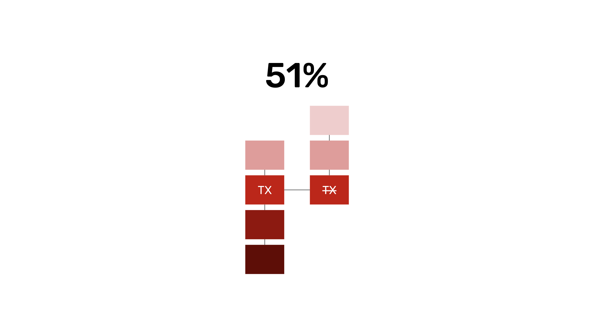
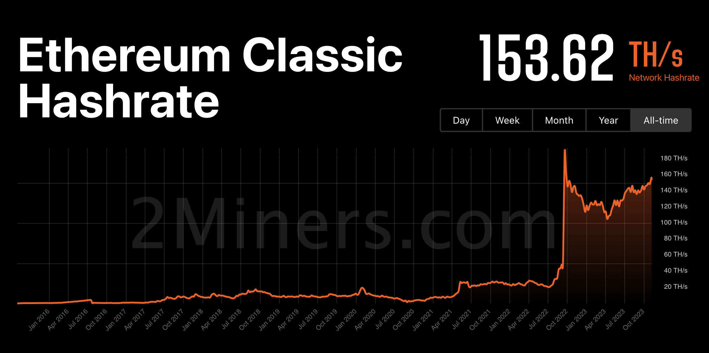

---
**You can listen to or watch this video here:**

<iframe width="560" height="315" src="https://www.youtube.com/embed/9z5emMxIeo4?si=4afKKIi1rqjC7nV1" title="YouTube video player" frameborder="0" allow="accelerometer; autoplay; clipboard-write; encrypted-media; gyroscope; picture-in-picture; web-share" allowfullscreen></iframe>

---

As there seems to be many who still ask what are 51% attacks, what happened to Ethereum Classic (ETC) in the past, and have confusion about these things, we decided to write this post to answer all the doubts and correct all confusions.

Indeed, ETC was attacked in two opportunities when it was a smaller, secondary blockchain in the past.

These attacks are not “hacks”, are narrow, and non-systemic, meaning that ETC never “broke”, the attacks only affect the victims but not all users, nor do they affect the whole network functionality.

In the following sections we will explain the history of these kinds of networks, what are 51% attacks, and why ETC is now stronger than ever, thus it is extremely unlikely that there will be these kinds of attacks again.

## Before it Was 33% Attacks

Before the invention of Bitcoin and the use of what is called Nakamoto Consensus, which uses proof of work as its consensus method, peer-to-peer networks to manage digital currency were not possible because they were very easy to attack.

In a [computer science paper](https://lamport.azurewebsites.net/pubs/byz.pdf) in 1982 it was proven that the threshold to attack these networks was only 33% of the nodes.

This means that if only 1 in 3 of participating machines were to corrupt the information transmitted in the system, then the whole system could be compromised. 

This problem was called the “Byzantine Generals Problem”.

## Now it Is 51% Attacks

The brilliant discovery by Satoshi Nakamoto, who invented Bitcoin, was that, using proof of work, the cryptographic stamps or hashes that seal each block of data in the network were in themselves a new form of consensus mechanism that would enable all nodes in the system to be synchronized in lockstep in a decentralized way.

By using this signaling system, that requires enormous amounts of computational work and consumption of electricity, then the threshold to attack the network was raised from 33% of the participating machines to 51%.

This higher level of security is what enabled Bitcoin to exist unchallenged to this day since its inception.

The method created by Satoshi is what is called “Nakamoto Consensus”.

## What Happened in Ethereum Classic?

However, that the threshold was raised from 33% to 51% in proof of work blockchains such as Bitcoin and ETC still means that this incredibly powerful system can still be attacked if anyone achieves 51% of the computing power.

This is what happened in ETC when it was a minor secondary blockchain.

In January 5th and 7th of 2019 there were two 51% attacks on the ETC network, and then, in August of 2020, there were three 51% attacks. 

In all cases crypto exchanges were targeted and they lost millions of dollars in what are called “double spends” which is the only kind of attack that can be perpetrated using 51% of the computing power in these kinds of blockchains.

## What Is a Double Spend?

As the name describes it, a double spend is to spend the same coins twice. However, this is just a simplistic term. 

Double spends are really that a thief may have coins in an address in a blockchain, and that they may transfer them to a victim, but then they can make them appear back again in their own address, thus tricking the victim while stealing from them something of value.

The way they do this is by sending coins in a normal transaction which will be included in a block in the chain, and then reorganizing the the blocks in the network with new blocks that do not include the original transaction, therefore making the coins disappear from the victim’s account.

How this can be achieved will be explained in the next three sections.

## How ETC Nodes Reach Consensus

To learn how a 51% or double spend attack (both are the same) may be achieved, it is important to know how nodes in a blockchain reach consensus of the same exact state of the chain every 13 seconds in the case of ETC.

A blockchain constantly receives new transactions, and these transactions are re-transmitted to all nodes in the system. When a subgroup of the nodes, called miners, receive the transactions, they accumulate them in batches and then seal them with a cryptographic stamp that requires an enormous amount of computational work to create, thus the name “proof of work”. When the miners create the stamp, they get the sealed block and send it to the rest of the network for verification. When the rest of the network verifies that the transactions are correct and that the cryptographic stamp is legitimate, then they include the block as the latest block in the chain of blocks, or “blockchain”.

The fact that the enormous amount of work was done is actually the information that all nodes need to know that that is the correct block. This is because it is very difficult for attackers to build blocks without such a large computing base.

## The Rule of the Chain With the Most Work Done

The interesting thing is that the same information of the proof of work for each block is what keeps the blockchain unified at all times and permits nodes worldwide to join, leave, and join again whenever they want without censorship or the need of any permission.

They can do this by simply checking the accumulated work done in the whole chain of blocks. If there are attacking alternative blockchains, then they can add the total work done in each and just follow the one with the most accumulated work. Because the attacker chains would have a difficult time to build such a large computing base as in Bitcoin or ETC, then the network would always converge on the correct and honest chain.

So, the work done in each block keeps the network synchronized every round, and the addition of the accumulated work in the whole chain history keeps the system unified behind one single blockchain.

## Description of a 51% Attack

The problem arises when attackers can temporarily garner 51% of the mining computing power. When this happens, then they do have the ability to build an alternative chain to perpetrate a 51% attack or double spend.

The way they do this is by selecting a victim, say a crypto exchange, then they send them a large amount of ETC worth several million dollars, and then they  exchange it for another coin, say Monero (XMR). When they have millions of dollars in XRM in their account in the exchange, then they withdraw all the XMR to their own address on the Monero blockchain.

When they complete the withdrawal process of the XMR, then they start building, with their large computing base in ETC, which must be 51% or more of the total miner computing power in the network, an alternative blockchain starting from the block where their original transaction to the exchange is.

In this alternative chain, that will have more accumulated work than the main chain, they will actually delete their original transaction of ETC to the exchange. 

When they build the alternative chain that has more accumulated work than the main chain, then they will send it to the rest of the nodes of the network.

Because of “the rule of the chain with the most work done” explained above, then all nodes in the ETC network will abandon the main chain they were working on and immediately adopt the new alternative chain built by the attacker.

Once the whole network migrates to the attacker’s blockchain, the original transaction to the exchange would have disappeared. This means that the exchange, that received the original deposit of millions of dollars in ETC, now does not have that money in their address any more. They have just disappeared.

However, the thieves of the attacker chain, will now have two large amounts of coins worth millions of dollars: the original ETC that they recovered by deleting their original transaction to the exchange and the XMR in the Monero blockchain that they stole from the exchange.

This is how 51% attacks or double spends steal money from their victims.

## How Can 51% Attacks Be Avoided?

Even though they are unlikely, in all proof of work blockchains, including the largest one, Bitcoin, there are several strategies to avoid 51% attacks:

**Network size:** The most obvious one, and the reason why 51% attacks are sporadic and unlikely, is to have the largest computing base as possible. The more attractive a coins is, the more the price rises, the more the price rises, the more rewards the miners will receive, the more the rewards the miners receive, the more hash power, and the more hash power, the less likely an attacker will be able to perpetrate double spends. This is how size protects proof of work blockchains.

**Leading in a specific mining algorithm:** Aside from sheer size, to be the leading chain in a specific mining algorithm is also a good form of protection. When a chain is second or third in a mining algorithm, then the miners of the bigger chains could point their machines to the smaller chain and attack it as it would be more or less trivial for them to achieve a 51% share of computing power. This is the reason why ETC was attacked before, because it was the second largest chain in its segment after Ethereum when it was a proof of work network.

**Waiting for more confirmations:** At the user level, waiting for more confirmations before considering a transaction final is the main way to protect themselves from double spends. This is because the more blocks are created on top of the block in which a transaction is entered, the more secure that transaction gets. For example, if I received 100 ETC in the last block, that transaction is easier to reverse than a transaction that I received 100,000 blocks ago. This is because the attackers would have to re-do the whole 100,000 blocks, spending all that electricity and computing power again, before they could perpetrate the double spend.

## Why Is ETC Unlikely to be Attacked Again

If having more hash power brings more protection and security to a blockchain, then ETC has become much more secure in the last 14 months.

This is because Ethereum has migrated from proof of work to proof of stake in September of 2022 and this made many miners, who were left stranded, to start mining ETC.

As seen in the chart in this section, ETC’s computing base, as measured by hashrate, increased from around 24 TH/s to more than 150 TH/s since Ethereum’s migration.

Not only did ETC gain in its mining computing base but also has become the leading blockchain in its hashing algorithm (ETCHash/ETHash) and the largest proof of work blockchain in the world.

This provides yet another protection layer and makes it very unlikely that ETC will be attacked with double spends again.

---

**Thank you for reading this article!**

To learn more about ETC please go to: https://ethereumclassic.org
