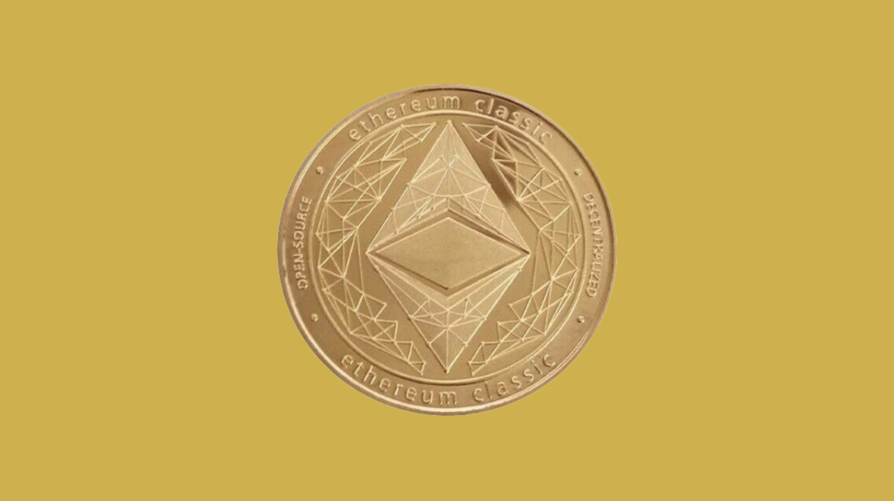

---
**You can listen to or watch this video here:**

<iframe width="560" height="315" src="https://www.youtube.com/embed/jYqxC9X_0Ac?si=HLjYPqJ2lvXc5LSN" title="YouTube video player" frameborder="0" allow="accelerometer; autoplay; clipboard-write; encrypted-media; gyroscope; picture-in-picture; web-share" allowfullscreen></iframe>

---

Proof of work (POW) coins are digital gold because they are built on top of an objective proof of work base.

Proof of stake and proof of authority coins are pure fiat community money because they have no objective base, so they depend exclusively on their communities for their hardness, which is weak or weaker than trusting governments for the monetary policy.

In this post, we will focus on why proof of work coins are digital gold, why Ethereum Classic (ETC) in particular is programmable digital gold, and why this makes ETC the most trust minimized blockchain in the world.

## What Is Bit Gold?

It is very likely that Satoshi Nakamoto actually wanted to build Bit Gold when he created Bitcoin. The prefix “Bit” is a big hint, I would say!

In proof of work blockchains such as Bitcoin (BTC) and ETC there is actually Bit Gold hidden in their databases. This Bit Gold are the cryptographic stamps or hashes that seal each block. 

This is what was envisioned was going to be the money on the internet originally.

However, because of problems in its design that couldn’t be solved at the time, Satoshi used the model proposed by Wei Dai to build the first proof of work blockchain. 

## What Is a Fiat Community Token?

Wei Dai’s model was to use Bit Gold as a backup and then create a fiat currency to pay for the work done by the computers in the network.

It is very important to understand that BTC and ETC are fiat community tokens that are issued after a lot of work was done by miners in a proof of work network. But they are not the Bit Gold themselves.

These tokens are fiat community tokens because they are just a parameter in the software of the networks, they are not the direct product of computational work as the cryptographic hashes are.

## Why Is Bitcoin Digital Gold?

Nevertheless, to create the coins in Bitcoin, miners have to do a lot of computational work and invest a lot of capital in operations and electricity. This means that the BTC tokens are not issued unless this enormous cost has been incurred. This is what makes BTC valuable and scarce, just as gold in the real world is valuable and scarce due to the cost of extracting it from nature.

So the first reason why BTC is digital gold is because the work to create the blocks is the same work that is required to issue the coins.

The second reason is that it has a fixed monetary policy. Bitcoins are not only costly to create, but they are being created at a decreasing rate (50% less per block every 4 years) and this establishes a total supply of 21,000,000 that will ever exist.

## Why Is Ethereum Classic Programmable Digital Gold?

In exactly the same way as Bitcoin, to create the coins in ETC, miners have to do a lot of computational work and invest a lot of capital in operations and electricity. The ETC tokens are not issued unless this enormous cost has been incurred, thus making ETC digital gold just like BTC.

And, as Bitcoin, ETC has a fixed monetary policy. ETC is being created at a decreasing rate (20% less per block every 2 years) and this also establishes a total fixed supply, but in the case of ETC it will be 210,700,000.

However, the additional feature that ETC has is that it supports smart contracts. Smart contracts are software programs that when they are sent to the ETC network, they become decentralized because they get replicated across all nodes of the system globally just like the ledger with accounts and balances.

This means that ETC coins are digital gold, but they can also be managed by these software programs or “Dapps” inside ETC, which means that ETC is programmable, and therefore programmable digital gold. 

## Why Is Ethereum Classic More Trust Minimized?

Indeed, arguably, ETC is the most trust minimized blockchain in the world as its decentralized applications are hosted inside the largest proof of work smart contracts blockchain in the world.

If to manage digital gold, users need to use external applications that are not hosted inside the POW blockchain, then those applications are not as secure, thus not as trust minimized.

But in ETC, because the dapps are inside the highly secure environment of its POW system, then not only the digital gold is trust minimized but also its applications.

This is what makes ETC more trust minimized, and why programmable digital gold is so unique and valuable.

---

**Thank you for reading this article!**

To learn more about ETC please go to: https://ethereumclassic.org
