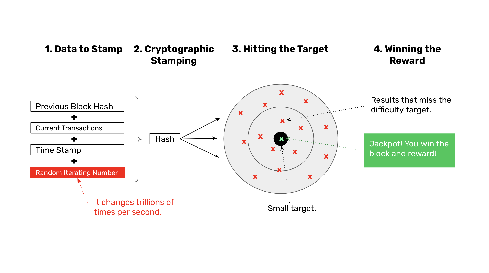
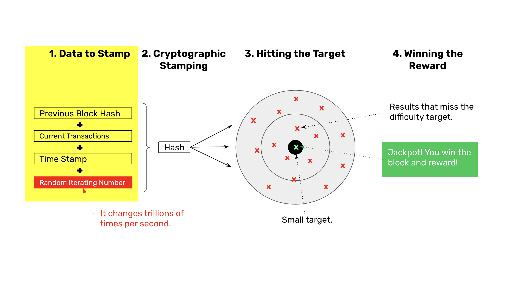
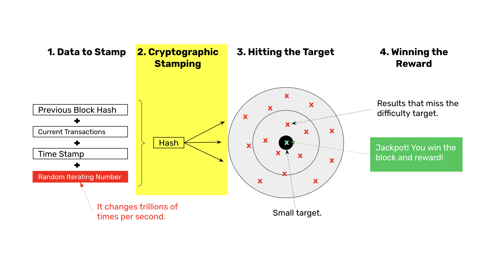
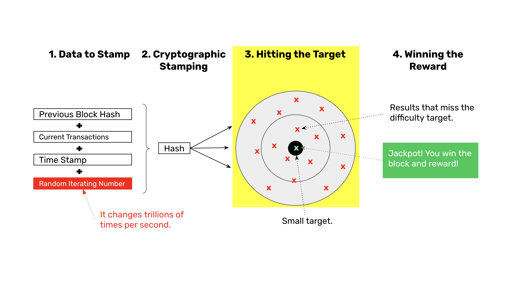
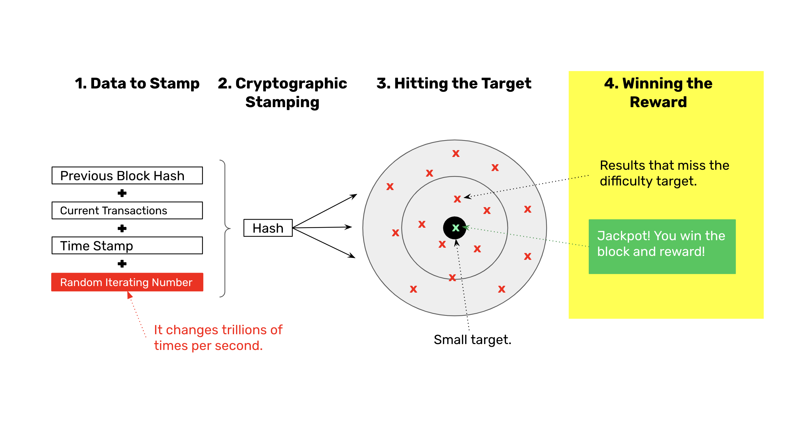

---
**You can listen to or watch this video here:**

<iframe width="560" height="315" src="https://www.youtube.com/embed/1INZgAex-50?si=GAn3l0K6Hg81C540" title="YouTube video player" frameborder="0" allow="accelerometer; autoplay; clipboard-write; encrypted-media; gyroscope; picture-in-picture; web-share" allowfullscreen></iframe>

---

In the previous class, 2, we explained that the brilliant idea of Satoshi Nakamoto when he invented Bitcoin was that the proof of work cryptographic stamp not only could be used to create the analogy of gold on the internet, called “Bit Gold”, but that the information of the POW itself could be a focal point for all the nodes of the network globally to be on the same exact state of the database, all at the same time, in their complete isolation, without the need to consult with any other source or authority. 

This was the key to decentralization and the magnitude of proof of work. 

In this class we will explain how POW actually works in the next sections where we will show a diagram with the four steps of the POW process and explain each one.

## The Four Steps of the Proof of Work Process

Above is the full diagram of the POW process. The first step is the data to stamp or hash cryptographically, the second the hashing in itself, the third is hitting the target established by the protocol, and the fourth is the winning of the reward.

## 1. Data to Stamp

As blockchains are chains of blocks of data, the blocks are related to each other by including the stamp or hash of the previous block in the next. Then, the current transactions are added to the data to hash, plus a timestamp, and finally a random iterating number which we will explain in step 3.

## 2. Cryptographic Stamping

The second step of the process is to pass the data described in the previous step through a cryptographic hashing algorithm. When this is done, a new stamp or hash is generated for this particular block. These hashes are very large hexadecimal numbers that look like this: 

`
686f746a95b6f836d7d70567c302c3f9ebb5ee0def3d1220ee9d4e9f34f5e131
`

## 3. Hitting the Target

The third step is to check if the hash number hit a target that the network algorithm imposed. If it didn’t hit it, then the miners go back to the previous step, change the random iterating number, and then generate a new hash and try again, they do this trillions of times per second per round!

## 4. Winning the Reward

The fourth step of the POW method is hitting the target. When any of the miners hits the target, then they win the reward for that block!

## What Is the Result of This Miner Competition?

So, in summary, miners group transactions in batches, add to them a time stamp, the previous block cryptographic stamp or hash, and a random iterating number. Once they do this, they create a new cryptographic stamp for this new block specifically and immediately check if it hit a specific target that the protocol determined. 

If it didn’t hit the target, then the miners go back, change the random iterating number as soon as possible and try again. If they didn’t hit the target again, then they try again, and again, and again, until one of the miners hits the target. 

They may do this trillions of times per second, and this is what uses up so much energy and is referred to as “proof of work” because only by working in trying so many times, using so much computing power and electricity, is that, statistically, one of the miners will hit the target within the range of the standard block time, which is 10 minutes in the case of Bitcoin, and 13 seconds for Ethereum Classic.

The result is a competition between miners to see who hits the target first. This is what motivates them to constantly increase their computing power.

The more and more miners enter to compete, the more agregarte computing power the blockchain will have., and the growing hash rate increases the security of the system.

Brilliant! Isn’t it?

A cryptographic stamp that is created using a lot of work and electricity is more secure because the focal point on which all nodes of the system converge to decide which is the next block becomes extremely difficult to forge by attacks.

Also, the accumulated work of all the blocks in the chain serves as the method of decentralization.

We will explain how this security, consensus, and decentralization is achieved in the next few classes

## POW Is Only a Part of Nakamoto Consensus

However, POW is only one component of the four components of the whole consensus mechanism.

In the next class we will explain the general mechanism of Nakamoto Consensus!

---

**Thank you for reading this article!**

To learn more about ETC please go to: https://ethereumclassic.org
