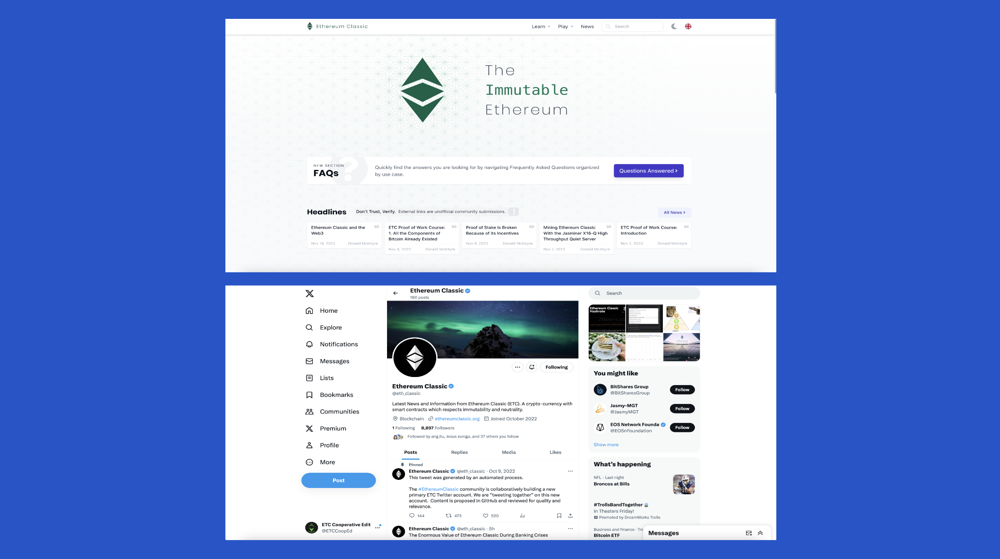
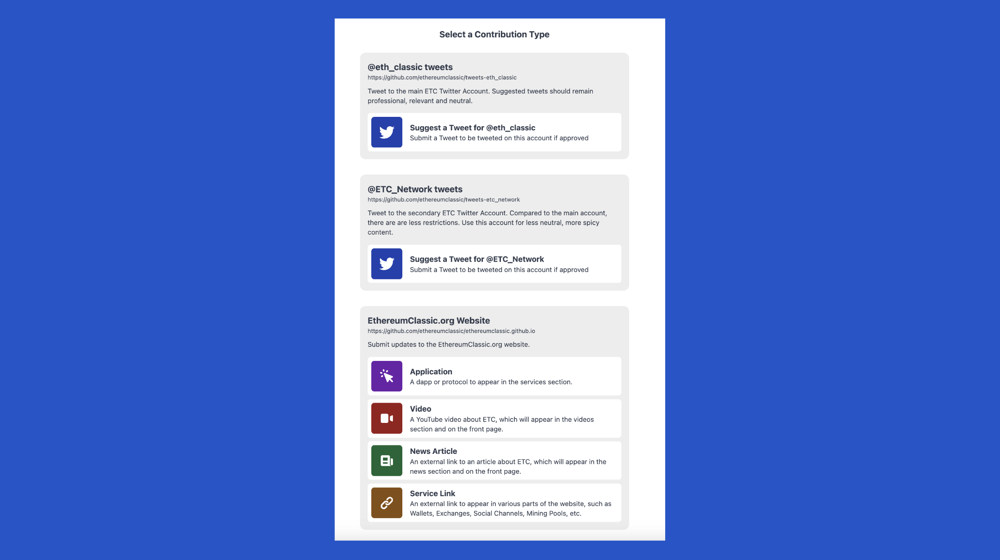
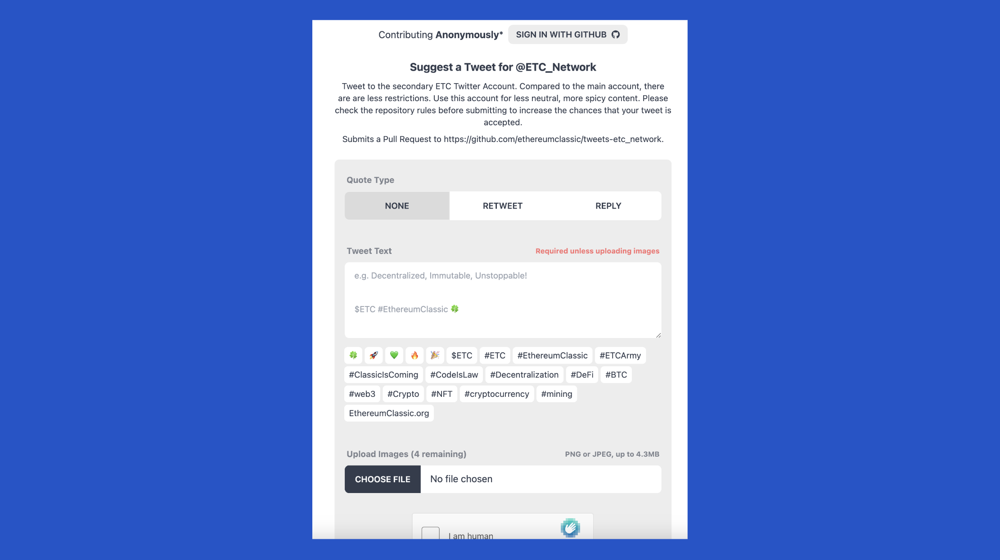
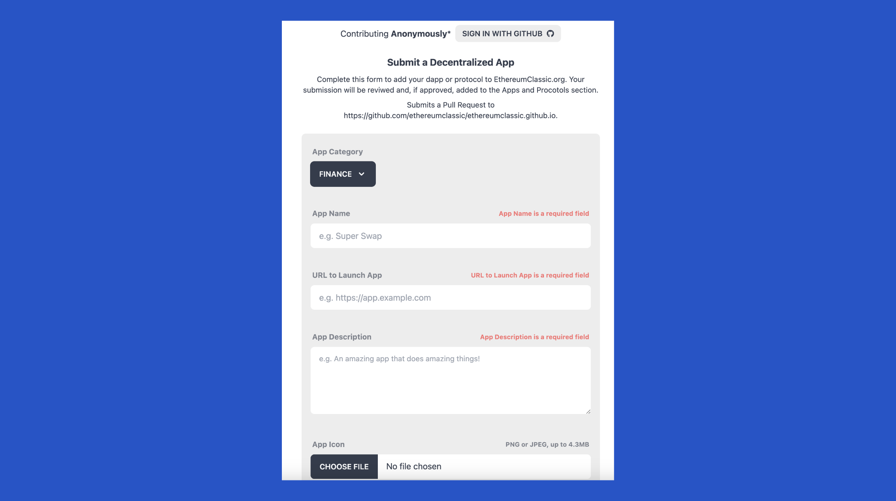
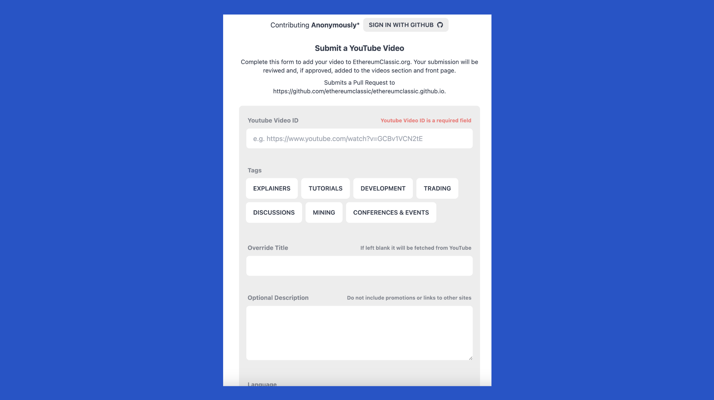

---
**You can listen to or watch this video here:**

<iframe width="560" height="315" src="https://www.youtube.com/embed/mjvTWzWpaBc?si=TbzZUNDJcZ_yt0TU" title="YouTube video player" frameborder="0" allow="accelerometer; autoplay; clipboard-write; encrypted-media; gyroscope; picture-in-picture; web-share" allowfullscreen></iframe>

---

[Istora Mandiri](https://github.com/IstoraMandiri) is one of the most important volunteer contributors to Ethereum Classic (ETC). He has built the [ethereumclassic.org](https://ethereumclassic.org/) website, wrote most or all of the static content (and some important posts as well), he wrote the [seminal essay](https://www.ethereumclassicclassic.org/) that finally defeated the Treasury attempt in ETC, he conducted the [ETC community calls](https://www.youtube.com/channel/UCp07VPnC1ejyAp5gMvvA4dw), he is building an application called [NourishMint](https://youtu.be/1nPnG8YHEFA?si=L28OHfzh7rHpyJyz) to incentivize other community members to contribute to ETC, and he built the app that is the subject of this post: the Ethereum Classic [Contributions](https://etc.contributions.app/) app!

Many people wish to contribute to the ETC assets mentioned above, but the problem is that it would require knowledge of how to use a platform for developers called GitHub.

Therefore, a tool was needed to help this segment of the community so they could help keep the information about various aspects of Ethereum Classic up to date.

## What Is the ETC Contributions App?

This is why Istora decided to build the Ethereum Classic Contributions web application to make it very easy for any user globally to add content to the different ETC community assets without having to learn how to use GitHub.

By going to the link [etc.contributions.app](https://etc.contributions.app/) anyone may contribute various types of content to ETC.

One of the great benefits of this system is that it not only opens the door for the general community to contribute, but it does it in a more decentralized manner and democratically, enabling anyone in the world to propose content.

The security of the system is a team of administrators who curate the content before publication.

## Contributing Anonymously

Another of the benefits is that users of the app may add their suggestions anonymously by just pressing on the CONTRIBUTE button and adding their proposals.

As long as the content is relevant and positive for Ethereum Classic, it will be posted.

## Contributing Credited

However, if contributors wish to be credited with their additions, then they can create an account on GitHub and login to the app by pressing the button SIGN IN WITH GITHUB.

In this case the contributions will be identified with the contributor’s user ID on GitHub.

In any case, users still don’t have to learn how to use GitHub to get credit. 

The option for accreditation is voluntary and only to identify the user who wishes so and is submitting the proposal.

## Contribution Types

Regardless of anonymity or accreditation, all users may contribute any of these six types of content:

- ETH_Classic tweets
- ETC_Network tweets
- App submissions
- Video submissions
- News article submissions
- Links to services submissions

The first two are tweets that are published on the Ethereum Classic X accounts which are [@eth_classic](https://twitter.com/eth_classic) and [@etc_network](https://x.com/etc_network).

The last four are submissions that are published on the [ethereumclassic.org](https://ethereumclassic.org/) website, in their corresponding sections.

## Contributing ETH_Classic Tweets

To contribute to the [@eth_classic](https://twitter.com/eth_classic) X account of the ETC community, users need to press on the CONTRIBUTE button on the home of the app, and then on the “@eth_classic tweets” section in the next screen.

In the next step, the contributions app will show users the form to fill so they can propose a tweet to the ETC admins.

The options are to create a new tweet from scratch, to do a retweet, or to reply to a tweet.

Then, there is a field to add the text which may include links, hashtags, and emojis.

Finally, the app lets users add images to tweets as well. 

## Contributing ETC_Network Tweets

To contribute to the [@etc_network](https://x.com/etc_network) X account of the ETC community, the process is the same as with the [@eth_classic](https://twitter.com/eth_classic) account.  Users have to press on the CONTRIBUTE button on the home of the app, and then select the “@etc_network tweets” section in the next screen.

In the next step, the contributions app will show users the form to fill so they can propose a tweet to the ETC admins.

The options are to create a new tweet from scratch, to do a retweet, or to reply to a tweet.

Then, there is a field to add the text which may include links, hashtags, and emojis.

At the bottom, the app lets users add images to tweets as well. 

## Submitting an App

To submit a new decentralized application, or dapp, to the ETC community website, users need to press on the CONTRIBUTE button and then select “Application” in the menu.

Once in the form, users must fill the following fields and items:

- App category
- App name
- URL to launch the app
- App description
- Upload an app icon
- Author name
- Author link

Then there are other optional fields that dapp developers may use to enhance their listing and trust in their application. 

## Submitting a Video

To submit a new video link to the ETC community website, users need to press on the CONTRIBUTE button and then select “Video” in the menu.

Once in the form, users must fill the following fields and items:

- YouTube video ID or link
- Tags to mark what type it is
- Override title in case the user does not want to use the original title of the video
- An optional description of the video
- The language in which the video is featured

## Submitting a News Article

To submit a news article link to the ETC community website, users need to press on the CONTRIBUTE button and then select “News Article” in the menu.

Once in the form, users must fill the following fields and items:

- Article title
- Article URL
- Author name
- Source name
- Published date
- Tags

Both in videos and articles submissions, it is important for users to propose content that is truly referred to ETC rather than tangential topics.

## Submitting a Service Link

There are many services that support ETC in the market and many are listed on the Ethereum Classic community website.

Any ETC service provider who wishes to submit a link to their product needs to press on the CONTRIBUTE button and then select “Service Link” in the menu.

Once in the form, providers must fill the following fields and items:

- Category
- Service name
- Service homepage or URL

---

**Thank you for reading this article!**

To learn more about ETC please go to: https://ethereumclassic.org
