---
**由此收听或观看本期内容:**

<iframe width="560" height="315" src="https://www.youtube.com/embed/owicpaMmutg?si=BfdV1tk7bf4bvuMF" title="YouTube video player" frameborder="0" allow="accelerometer; autoplay; clipboard-write; encrypted-media; gyroscope; picture-in-picture; web-share" allowfullscreen></iframe>

---

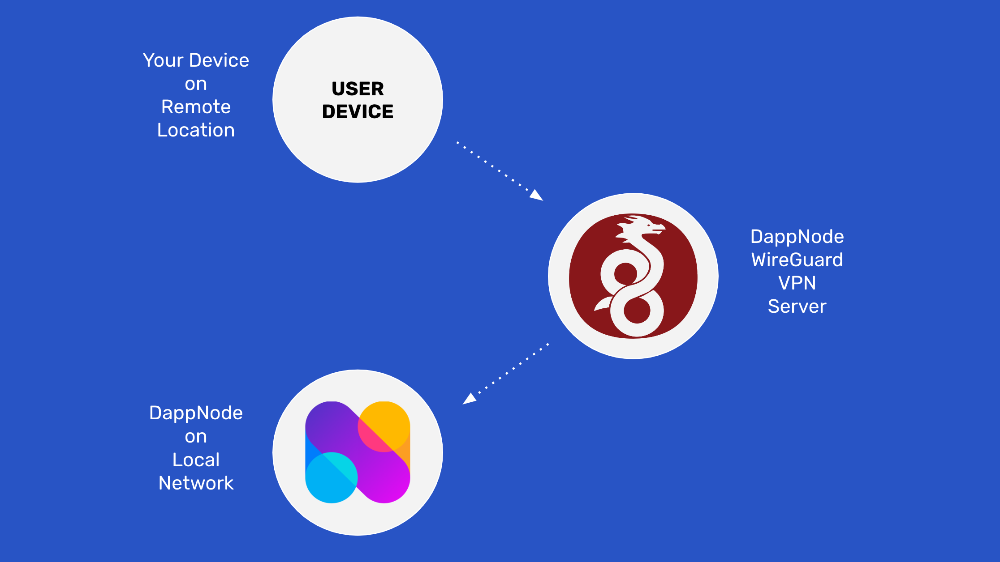

DappNode 硬件节点是一种设备，允许用户在他们的家或办公室运行节点。

以太经典（ETC）核心开发团队在 DappNode DappStore 中维护 ETC 客户端包，用户可以激活以运行 ETC 主网和测试网节点。

DappNode 产品的一个特点是它允许用户使用 VPN 连接从全球任何地方远程访问他们的 ETC 节点。

在本文中，我们将解释如何使用 WireGuard VPN 协议从远程位置连接到您的 DappNode 实例。

如果您还没有 DappNode 并希望获取一个来运行 ETC 节点，请按照我们关于此主题的文章中的说明操作：

如何使用 DappNode 运行以太经典节点

在接下来的部分中，我们将解释如何使用 DappNode VPN 服务连接到您的 DappNode。

## 1. 在本地 WiFi 网络中连接到您的 DappNode

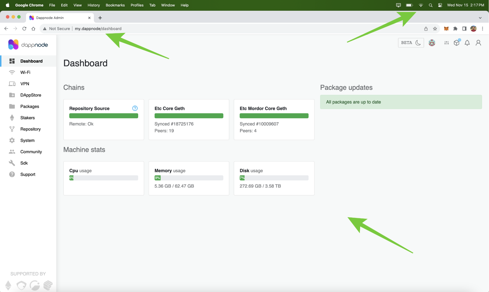

如果您已经获得并设置了 DappNode 以运行您的 ETC 节点，请再次连接到其 WiFi 网络，然后在浏览器中输入“my.dappnode”。当 DappNode 用户界面（UI）打开时，您将看到带有正在运行的 ETC 节点的 DappNode 仪表板。

## 2. 转到菜单中的 VPN 选项卡并选择 WireGuard 选项

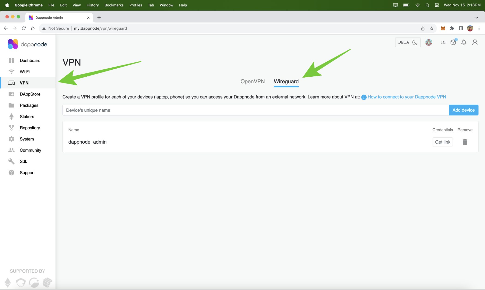

要能够从世界各地的任何地方远程连接到您的 DappNode，请转到 VPN 选项卡，然后选择“WireGuard”选项。这是 DappNode 推荐的协议。DappNode 团队实际上运行 VPN 服务器，以便用户可以连接到他们的本地节点。

## 3. 转到 WireGuard 连接文档

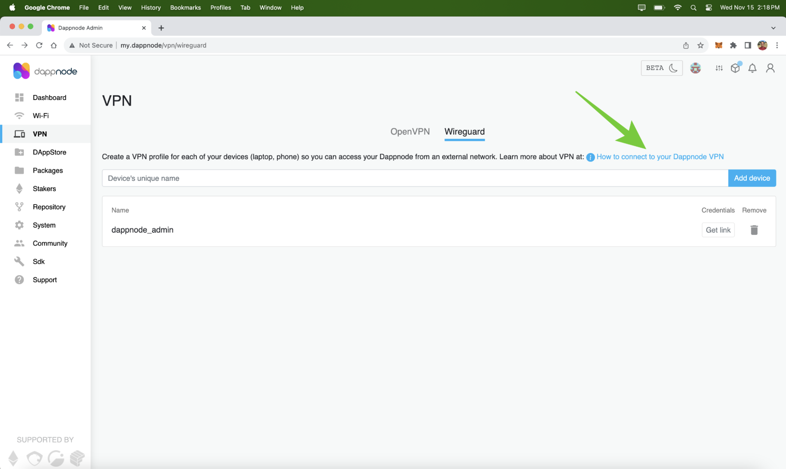

在您的 DappNode UI 上的 WireGuard VPN 屏幕上，点击“如何连接到您的 DappNode VPN”链接。在那里，您将看到有关 DappNode WireGuard VPN 服务的所有文档。

## 4. 点击 WireGuard 网站链接

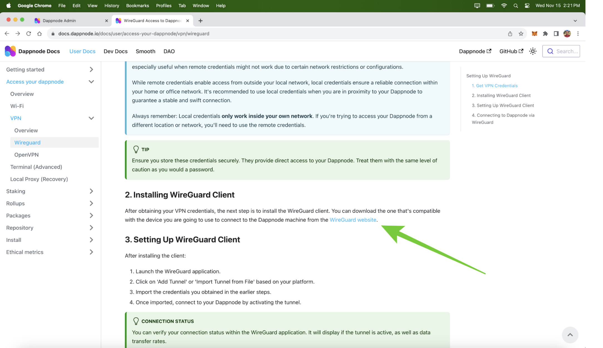

一旦进入文档，滚动到第 2 节，然后点击链接到 WireGuard 网站的链接。

## 5. 选择适用于您操作系统的 WireGuard 客户端

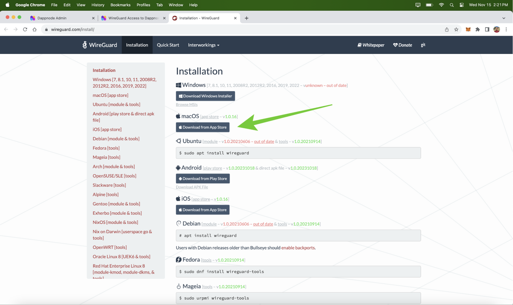

在 WireGuard 网站上，您将看到不同操作系统的所有客户端下载选项。点击适用于您操作系统的选项，以在计算机上安装 WireGuard 客户端。在我们的情况下，我们使用了 macOS 安装选项。

## 6. 下载 WireGuard 客户端

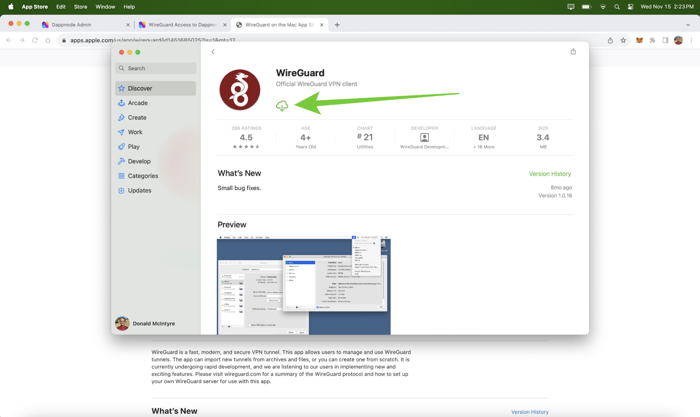

如果在您的操作系统中需要使用 App Store、Google Play 或其他仓库，则从那里将 WireGuard 客户端安装到您的计算机。在我们的情况下，我们从 Apple App Store 下载并安装了 WireGuard。

## 7. 打开您计算机上的 WireGuard 客户端

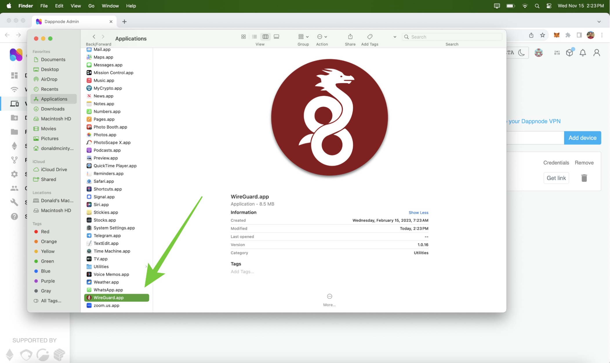

下载并安装后，在您的计算机上打开 WireGuard 应用程序。

## 8. 在 WireGuard 客户端上添加新的隧道

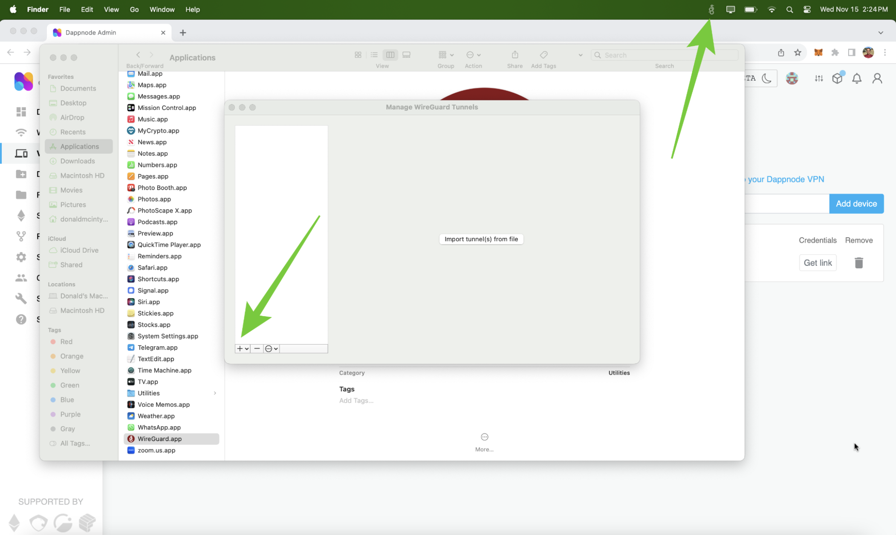

一旦打开，您将在桌面屏幕上看到 WireGuard 图标，位置取决于您的操作系统是在上方还是在下方。点击它并选择“管理隧道”。接下来，您将看到管理隧道的 WireGuard 窗口。点击窗口上的“+”按钮，或者选择允许您添加隧道的选项，但不要点击“从文件导入隧道”按钮。

## 9. 查看 WireGuard 新隧道表单

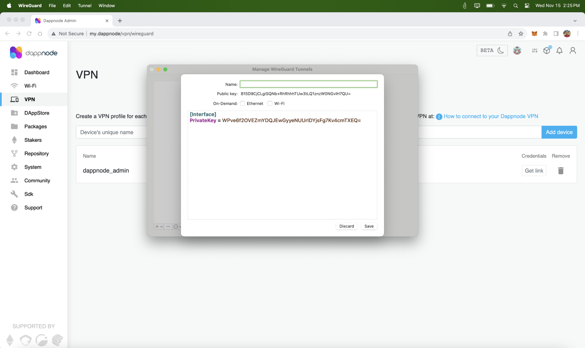

在下一步中，您将看到新的隧道表单。在其中，您将输入您的本地 DappNode 的 WireGuard 凭据以及此隧道的名称，但首先我们需要在下一节中从我们的 DappNode 获取凭据。

## 10. 从您的 DappNode 获取 WireGuard 链接凭据

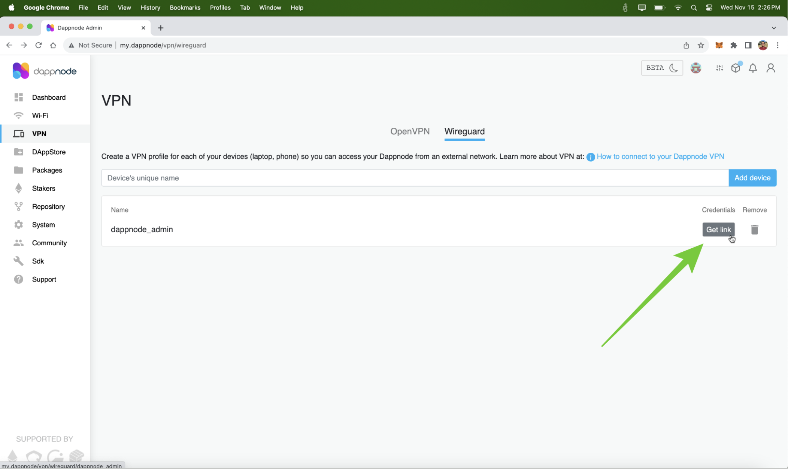

要获取 VPN 凭据，请返回到您的 DappNode UI，再次转到 VPN 选项卡，到 WireGuard 子页面，并点击“获取链接”按钮。

## 11. 复制您的 DappNode 的 VPN 凭据

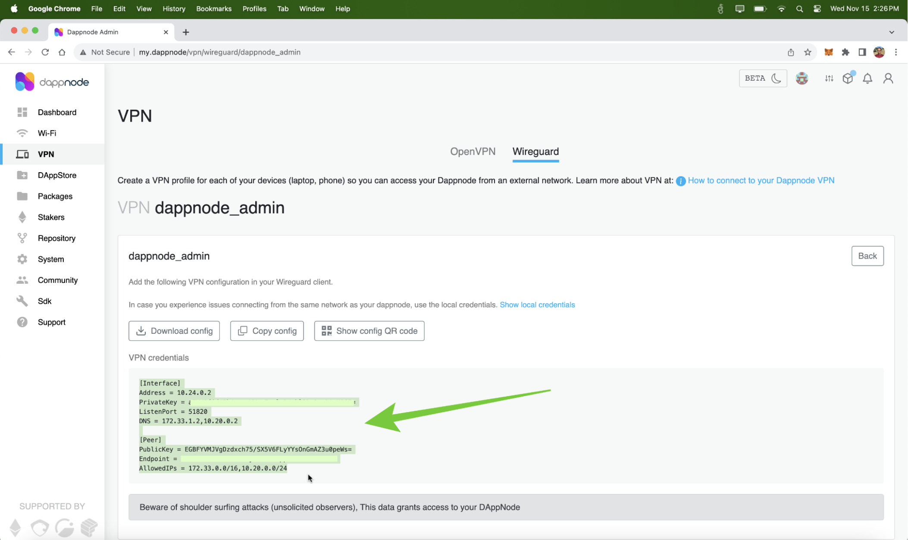

当凭据部分打开时，复制该文本，然后返回到 WireGuard 新通道表单。

## 12. 在 WireGuard 上粘贴凭据并为您的通道命名

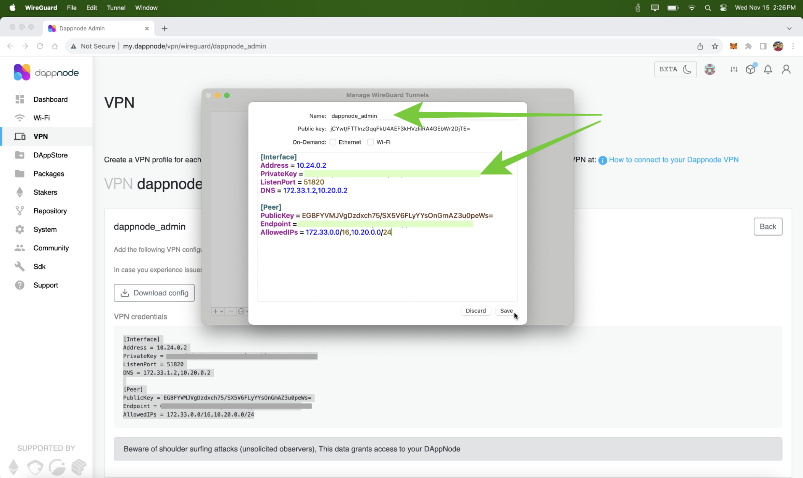

在 WireGuard 表单上，删除之前存在的任何文本并粘贴您的 DappNode 的新凭据。此外，在表单上方的字段中为此通道命名，然后按“保存”。在我们的情况下，我们将通道命名为“dappnode_admin”并粘贴了我们的凭据，但出于安全原因，对于这个示例，我们对通道数据进行了模糊处理。

## 13. 激活您的通道

在下一步中，您的 WireGuard 客户端将显示您已经创建的新通道。现在，您需要按下“激活”按钮以启动您的新 VPN 连接。

## 14. 从远程位置连接到您的 DappNode ETC 节点

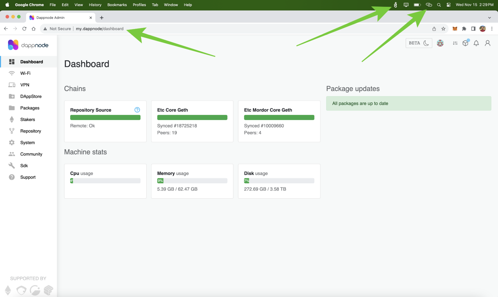

一旦在计算机上激活了新通道，您需要等待几分钟，以便信息传播到相应的服务器和客户端。然后，您可以远程连接到您的 DappNode！！例如，在本节的图像中，您将看到我们的显示屏上的 WireGuard 客户端图标现在是明亮的白色，我们已从远程位置连接到我们的本地网络（我手机的热点）。从现在开始，您可以通过打开计算机上的 WireGuard 客户端并激活 DappNode 隧道，从世界任何地方的任何 WiFi 连接连接到您的 DappNode！

---

**感谢您阅读本期文章!**

了解更多有关ETC，欢迎访问: https://ethereumclassic.org
