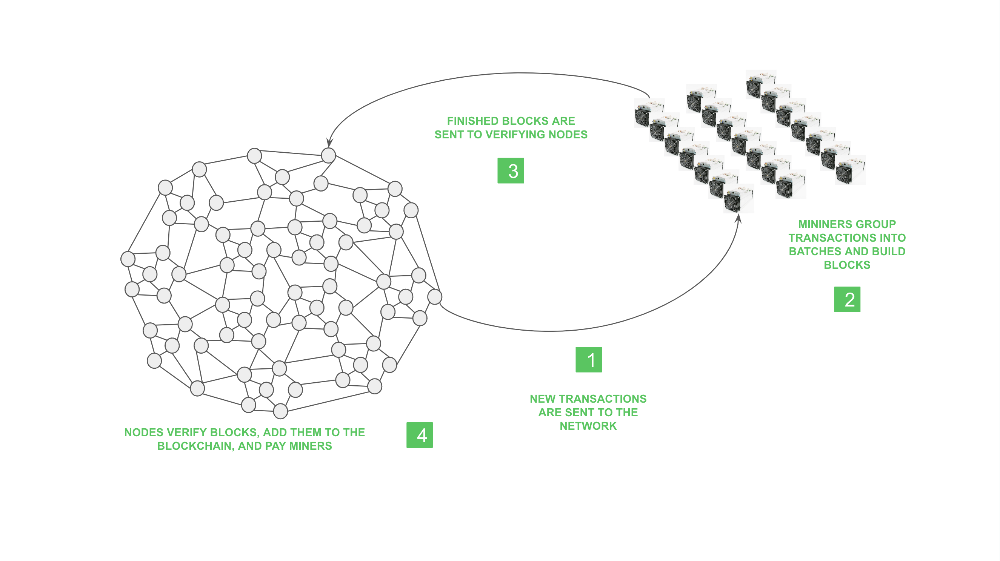
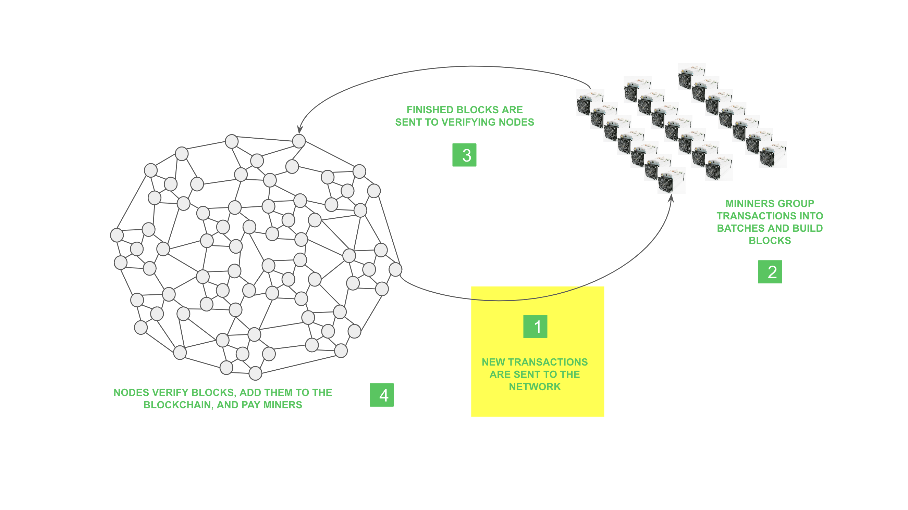
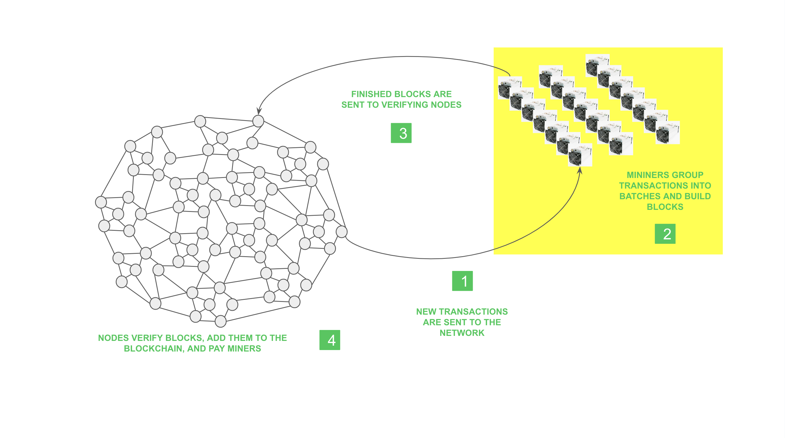
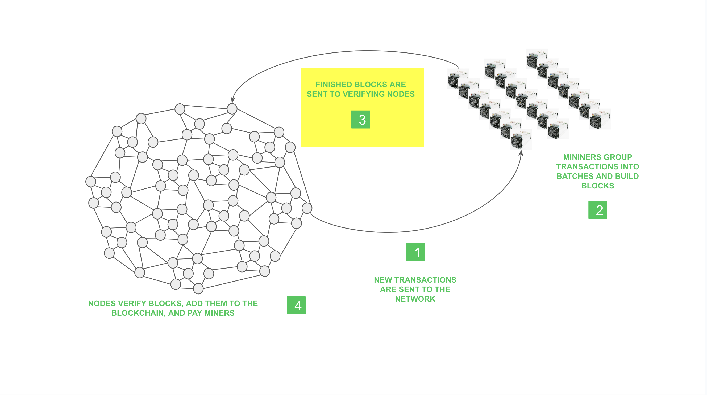
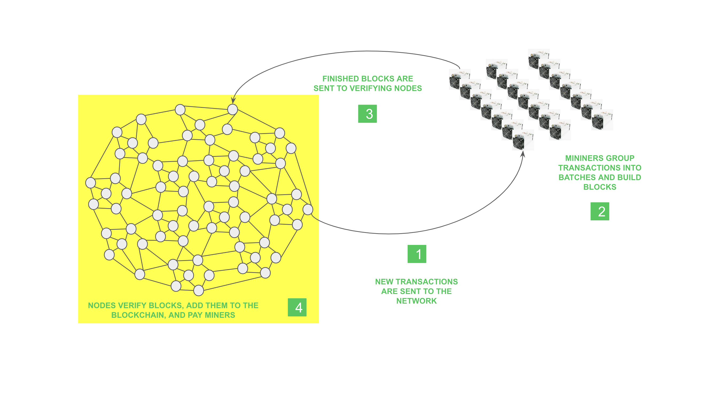

---
**You can listen to or watch this video here:**

[video]

---

In the previous class, 3, we explained how Proof of Work (POW) works, but that it is only a component of the general consensus mechanism technology that POW blockchains such as Bitcoin (BTC) and Ethereum Classic (ETC) use.

We described the four steps of the POW process and explained that the competition between miners is what increases the computer power of the network, and that this growth in computing power is what makes the system more secure and valuable.

In this class, we will explain the broader Nakamoto Consensus design, describe each step (which are also four), and then write about its features and benefits.

## The Four Steps of Nakamoto Consensus

The four steps of the Nakamoto Consensus mechanism are the reception of new transactions, block building by miners, transmission of the blocks to the rest of the network, and block verification by node operators.

## 1. Reception of New Transactions

A proof of work blockchain constantly receives transactions from users worldwide. When nodes in the network receive these transactions, they immediately turn around and re-send them to the rest of the nodes so they are fully replicated across the whole network.

## 2. Miners Group Transactions Into Batches and Build Blocks

A subgroup of the participating machines in the system are what are called miners. When miners receive new transactions, they group them into batches and build the blocks doing a lot of work (hence “proof of work”) spending a lot of capital in infrastructure and electricity. (To learn how POW works, please see class 3.)

## 3. Finished Blocks Are Sent to Verifying Nodes

When miners produce blocks, they immediately send them to the rest of the network for verification. As miners are competing with each other, it is imperative for them for the rest of the network to acknowledge their newly created blocks as soon as possible in case competing blocks are propagating across the network.

## 4. Nodes Verify Blocks, Add Them to the Blockchain, And Pay Miners

When the rest of the network receives the blocks, they verify them, including all transactions and that the cryptographic stamp was correct, and then they add the block as the latest one in the chain. As blocks are verified, they pay the winning miner the reward for that specific round.

## What Are the Features And Benefits of Nakamoto Consensus?

The economic model described above has been working with 99%+ uptime in Bitcoin since 2009 and in ETC since 2014. It is a perfect, balanced, decentralized method that has worked for years.

The benefits of proof of work based Nakamoto Consensus are decentralization, permissionlessness, and censorship resistance.

Other benefits we have identified are:

**Survivability:** Because of the POW based security in ETC, accounts, balances, and smart contracts will survive in the long term.

**Unstoppability:** In ETC, currency transfers and decentralized applications are unstoppable.

**Uncompromisable:** Accounts, balances, and decentralized applications cannot be compromised as in traditional systems.

**Uncapturable:** ETC cannot be captured by government, corporations, or special interests.

We will explain how all this is accomplished in class 7!

## How Does Nakamoto Consensus Manage Hashrate Growth?

As hashrate grows in a proof of work blockchain, blocks get faster, if blocks get faster then the money is printed faster and the database gets bloated quickly, compromising security.

There had to be a method to regulate the timing of block creation not only when hashrate increased, but also when it decreased due to market conditions.

The method created by Satoshi Nakamoto to accomplish this stabilization is something called the “difficulty adjustment” which we will explain in the next class, 5!

---

**Thank you for reading this article!**

To learn more about ETC please go to: https://ethereumclassic.org
