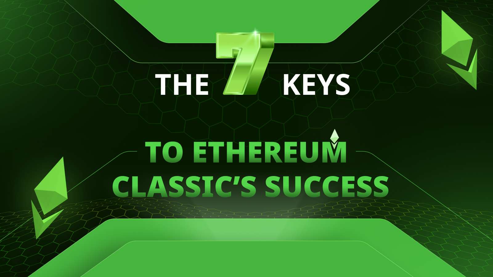

---
**您可以由此收听或观看本期内容:**

<iframe width="560" height="315" src="https://www.youtube.com/embed/VwO3AEabErg?si=tezYq_dAhrA4UQl1" title="YouTube video player" frameborder="0" allow="accelerometer; autoplay; clipboard-write; encrypted-media; gyroscope; picture-in-picture; web-share" allowfullscreen></iframe>

---

宏观上，区块链行业可以分为两大类：真正分散的区块链和试图模仿分散区块链属性但改变设计的中心化系统，以符合某些错误的观念。

然而，这些错误的变化本身正是移除真正区块链的主要属性，即信任最小化的原因。

另一种分类是那些更为多功能和用途较窄的网络之间的区别。

在本文中，我们将解释以太坊经典（ETC）在这些分类方面处于最有价值位置的7个关键原因。

## 1. ETC 是工作量证明区块链

ETC是一种工作量证明（POW）区块链，这使其属于真正分散系统的范畴，因为POW是人类已知的唯一确保分散和任何节点自由参与点对点网络的方式。

所谓的“自由参与”是指世界上任何人都可以在没有任何许可或审查的情况下操作节点或挖掘ETC。

这也意味着世界上任何人都可以发送交易并拥有ETC余额的地址，并保证它们不会被任何特殊利益没收或篡改。

此外，POW还意味着存在一个几乎不可能违反的加密墙，用于保护系统中交易历史。

## 2. ETC 是硬货币

ETC是硬货币，因为它是POW区块链，因此创建区块的成本就是创建硬币的成本，从而创造了类似黄金在现实世界中的稀缺性、不可伪造的昂贵性和价值。

ETC在其货币政策中还设有固定的货币供应计划，意味着将来只会有210,700,000个ETC存在。

这个库存是作为奖励按每个区块支付给矿工，并通过每两年减少20％的方式管理。

根据其当前发行情况，ETC的通货膨胀率为3.91％；到2032年将低于2％；到2036年将低于1％。这一趋势将在随后的几年趋近于零。

作为硬货币，ETC在长期内保护用户储蓄和投资的价值。

## 3. ETC 是可编程的

以太坊经典通过其高度安全的环境内的智能合约在基础层面是可编程的。

智能合约是软件程序，当它们被发送到网络时，在系统的所有节点中都会被复制，因此变得完全分散。

其他竞争的POW链，如比特币、莱特币、狗狗币、门罗币或卡斯帕，都不可编程，因此是简单且功能有限的系统，只能保持帐户、余额并能够在帐户之间转移资金，但无法执行其他操作。

ETC在多方面的可变性使其与20世纪80年代计算机与口袋计算器相比具有相似的可变性。

## 4. ETC 是完全复制的

ETC的区块链，或者说数据库，包括帐户、余额和智能合约，是完全复制的，这意味着100%的节点保留了所有信息的相同副本。节点越多，系统越安全。

这是区块链的最初目标；在尽可能多的参与对等方中实现数据的完全复制，以确保最大的冗余性。

POW是通过分散的方式实现这种复制的关键，实际上是技术的第二个最重要的安全保障。

完全复制是第一个安全保障，它提供了一种冗余性，使系统能够抵抗人为篡改或自然破坏。ETC甚至可以在核战争中生存下来！

## 5. ETC 是可组合的

以太坊经典是可组合的，这是一个非常重要的特性。

可组合性是可能的，因为所有帐户、余额和去中心化软件程序都在同一个系统中，因此可以在单个事务执行中执行复杂的多应用程序事务。

当系统分开时；比如在比特币中，其中资金在区块链内，但应用程序在其他外部平台上，因为BTC不可编程；则复杂的多应用程序事务是不可能的，因为区块链无法确定外部系统的状态，而外部系统也无法确定区块链的状态。

可组合性非常重要，因为它实现了即时交易、较短的结算时间，减少了摩擦，并降低了交易成本。

## 6. ETC 是世界上最大的POW智能合约区块链

自以太坊于2022年9月迁移到权益证明后，以太坊经典已成为世界上最大的工作量证明智能合约区块链。

拥有这个地位使ETC非常有吸引力，因为当市场开始意识到权益证明和权威证明共识是中心化和脆弱的时候，开发者、投资者、用户、

矿工和节点运营者将开始转向ETC。

在区块链行业，只有通过工作量证明才能实现安全性，而只有在区块链是其POW算法中最大的情况下，工作量证明才是安全的。

ETC现在是ETHash/ETCHash算法中最大的区块链，这也使其在这方面是最安全的。

## 7. ETC上的应用是世界上最安全的应用

在以太坊经典（ETC）上的应用之所以是世界上最安全的，是因为工作量证明、硬货币、可编程性、完全复制、可组合性以及它是其类别中最大的这些因素的结合，使其成为运行和执行应用程序最安全的环境。

在整个宇宙中，没有其他地方可以比ETC更安全地运行应用程序。

无论是在军事数据中心、企业数据中心、云服务中，还是在任何不是最大的工作量证明可编程区块链的网络中，都找不到比ETC更安全的应用环境。

---

**感谢您阅读本期文章!**

了解更多有关ETC，欢迎访问: https://ethereumclassic.org
