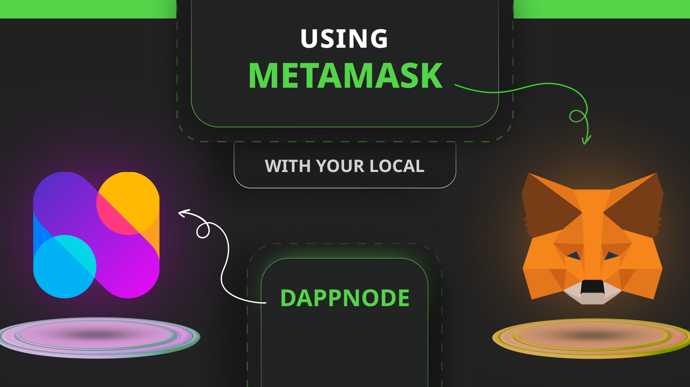
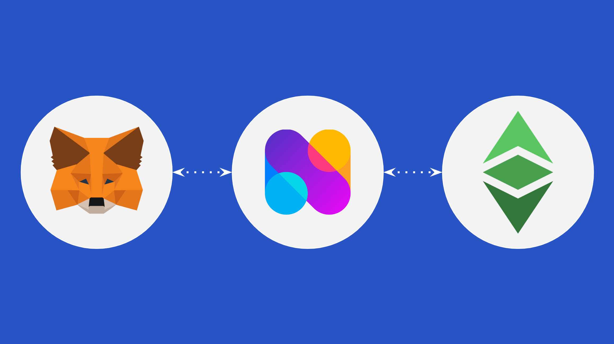
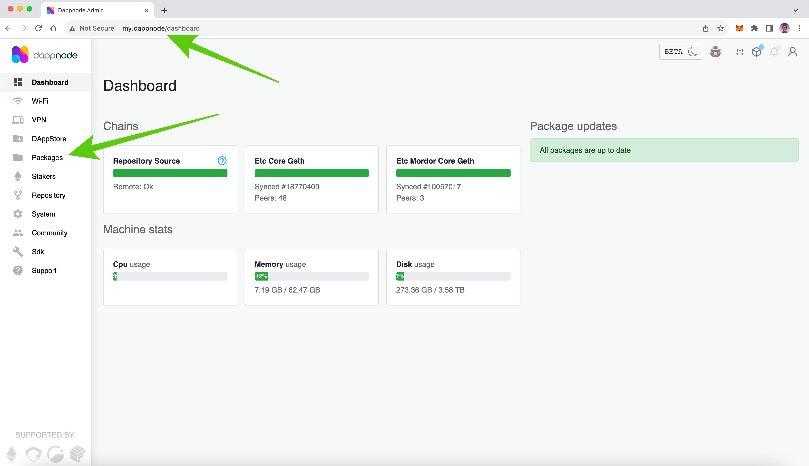
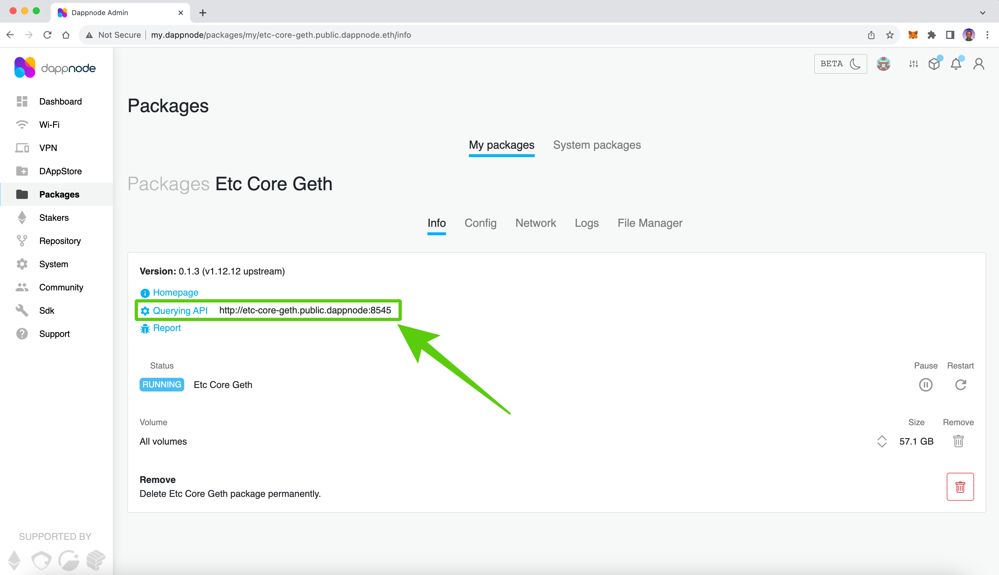
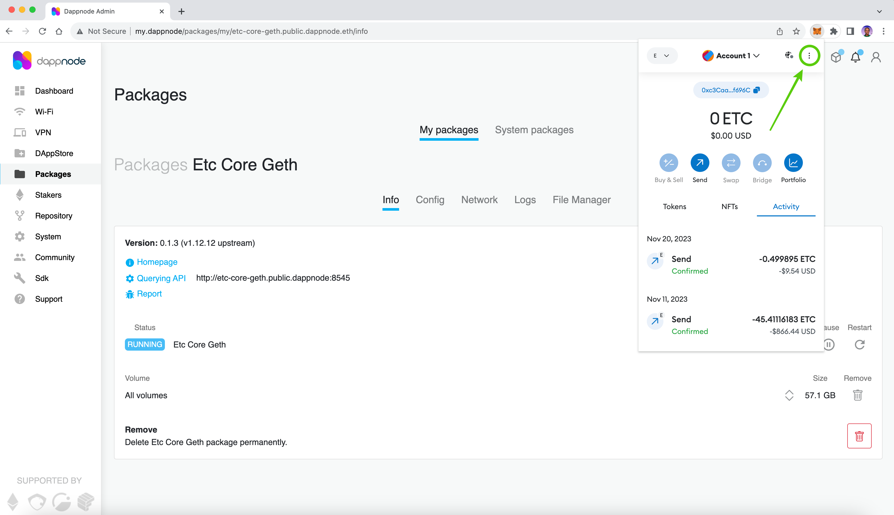
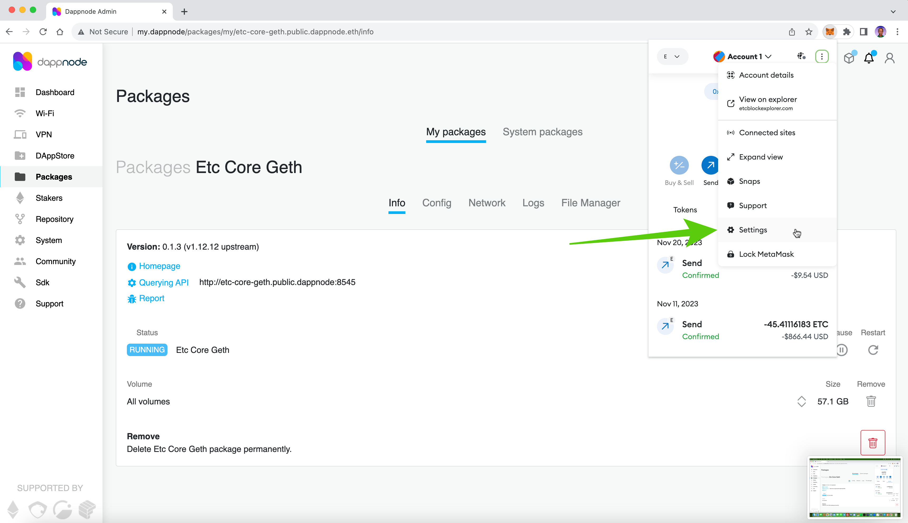
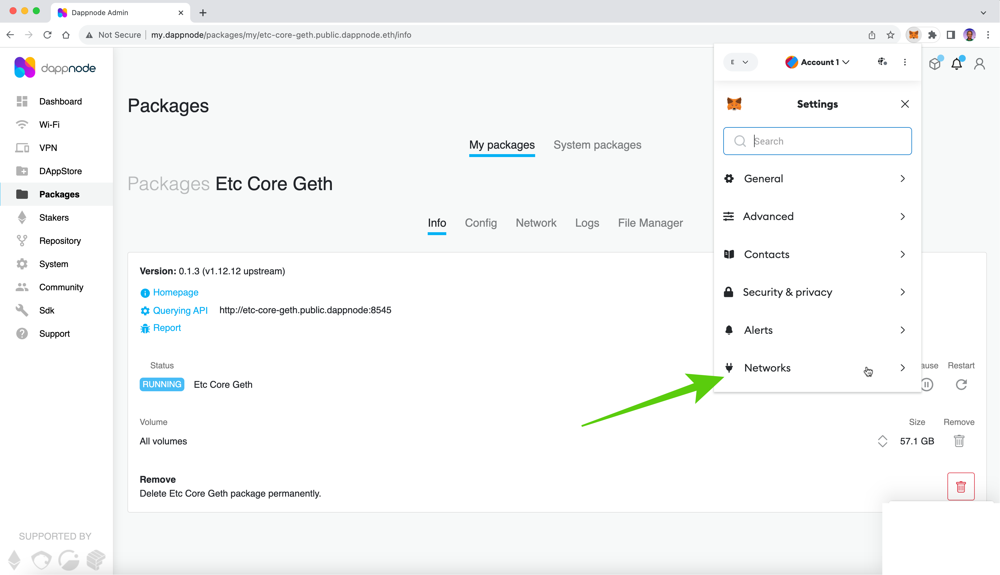
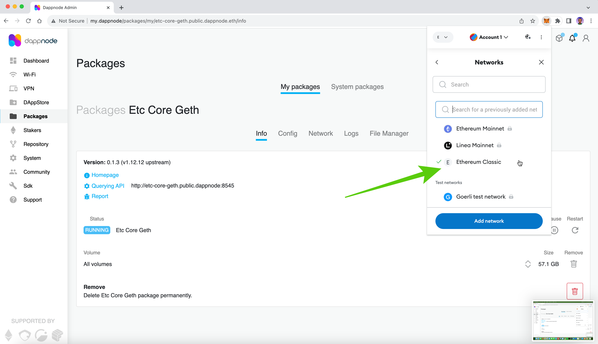
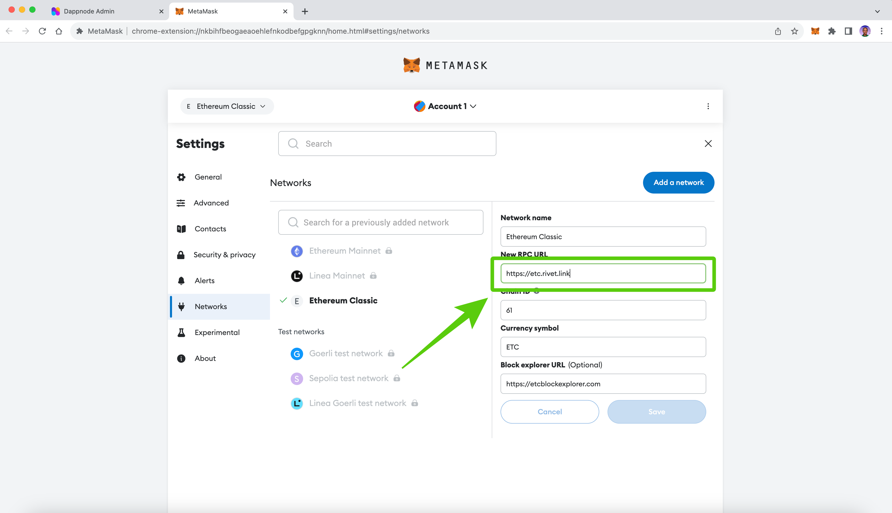
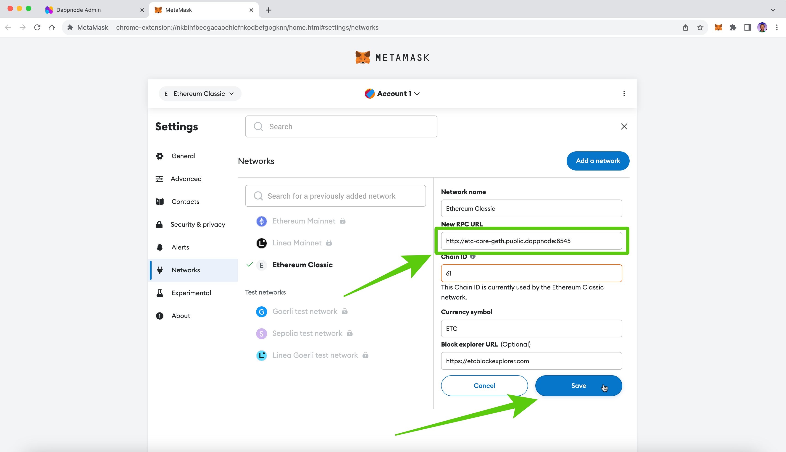

---
**由此观看本期视频:**

<iframe width="560" height="315" src="https://www.youtube.com/embed/4df8281L6F0?si=6yakdKeu3ROAS0Bf" title="YouTube video player" frameborder="0" allow="accelerometer; autoplay; clipboard-write; encrypted-media; gyroscope; picture-in-picture; web-share" allowfullscreen></iframe>

---

区块链如以太坊经典（ETC）有两种参与者：矿工和节点。

矿工生成区块，根据每个区块的工作获得以太坊经典（ETC）硬币的奖励。

节点接收来自用户的新交易，向用户提供有关其账户和余额的信息，并验证矿工生成的区块。

诸如 MetaMask、Trust Wallet、Emerald、Ledger 和 Trezor 之类的钱包，在您发送交易到 ETC 或检查您的账户时，每次都需要连接到节点。

然而，使用不同类型的连接和与节点建立的设置的安全性保证是不同的。

在本文中，我们将解释这些差异以及如何使用 DappNode 将 MetaMask 钱包连接到本地 ETC 节点。

## 什么是 DappNode？

由于运行节点相对昂贵，因为区块链的规模很大（ETC 完整节点大小目前约为 57 GB），在常规计算机上运行它们是困难的，更不用说用于日常使用的机器了。

为解决这个问题，有一些公司开发了非常实用的专门设备，专门用于运行区块链节点。

DappNode 是这样一家公司，其产品 [DappNode Home](https://dappnode.com/en-us/collections/all) 是一种连接到家庭或办公室本地 WiFi 网络的设备，用户可以从中设置不同的区块链节点，包括 ETC 主网。

DappNode 提供的另一项服务是可以成为您钱包的本地 RPC 终端。

## 什么是 RPC 终端？

每当钱包、挖矿池、独立矿工、DApps、开发团队或其他终端用户需要将交易或智能合约发送到 ETC 时，它们需要将它们发送到接收数据然后重新传输到网络其余部分的网络节点。

节点还用于查询区块链以检查帐户和余额。

当节点用作输入交易和数据到 ETC 或提供有关帐户和余额的信息的窗口时，它们被称为终端或 RPC 终端。

“RPC” 代表 “远程过程调用”，通常是一种机器之间进行通信以协同操作的协议。

## 什么是 RPC 终端提供者？

一些人或组织运行自己的节点，因此他们使用这些节点，这是最安全的设置，因为它们位于本地，因此受信任。

然而，其他人更喜欢专注于他们自己的业务，并由第三方提供节点操作服务。

为此，有 [公共节点服务](https://ethereumclassic.org/network/endpoints)（类似云服务的服务），运行 ETC 节点并提供 RPC 终端，这些终端作为接受公共交易或查询的 URL 地址。

终端用户使用这些服务发送交易和智能合约或查询区块链，而不是运行自己的 ETC 节点。这是一种较不安全的设置。

## 钱包也提供终端服务

使用 Trust Wallet、Ledger 或 Trezor 等钱包时，它们在其软件中嵌入了这些公司使用的终端。

许多钱包提供商使用 [Rivet](https://rivet.cloud/) 等公共终端服务用于 ETC 或 [Infura](https://www.infura.io/) 用于以太坊。

其他钱包更加开放，允许用户更改其终端并将其应用程序指向他们喜欢的任何终端。

MetaMask 就是这种提供商之一。

## 使用 DappNode 使用您自己的终端

MetaMask 用户不仅可以使用他们希望的 RPC 终端（本地或第三方），而且可以向他们的钱包添加和删除不同的区块链网络。

大多数使用 ETC 的 MetaMask 用户已将 Ethereum Classic 添加到其钱包中，我们在 [这里](https://ethereumclassic.org/blog/2022-12-21-using-ethereum-classic-with-metamask) 解释了如何操作。

然而，大多数用户已将其钱包配置为连接到一个名为 Rivet（上面提到的）的公共提供程序作为其 RPC 终端。

为了更安全，用户可以购买 DappNode，运行 ETC 节点，我们在 [这里](https://ethereumclassic.org/blog/2023-04-26-how-run-an-ethereum-classic-node-using-dappnode) 解释了如何操作，并将其用作连接到 ETC 网络的本地和更安全的访问。

在以下各节中，我们将解释如何将您的 MetaMask 连接到您的本地 DappNode 作为 RPC 终端。

### 1. 进入您的本地 DappNode 界面

一旦您设置并在本地 WiFi 网络上运行 ETC 主网节点的 DappNode，您必须通过在浏览器中输入 URL “my.dappnode” 来连接到 DappNode 用户界面。一旦进入，点击左侧垂直菜单中的“Packages”链接。

### 2. 选择 ETC Core Geth

在接下来的屏幕上，您将看到您运行的所有包和节点。在 DappNode 上，您可以运行 ETC 主网 Core Geth 节点、ETC 测试网节点，甚至是比特币节点或其他区块链。要访问 ETC，请点击“ETC Core Geth”包。

### 3

. 查找并复制您的本地 RPC 终端

在接下来的屏幕上，您将看到有关您的 ETC Core Geth 节点的信息，包括一个名为“Querying API”的行。该行中的 URL 是运行在 DappNode 硬件上的本地 ETC 节点的 RPC 终端。在我们的情况下，它是：http://etc-core-geth.public.dappnode:8545。复制 RPC 终端 URL。

### 4. 进入您的 MetaMask 并打开主菜单

接下来，您需要将 RPC 终端粘贴到 MetaMask 中，以便它连接到您的本地 DappNode。为此，请打开您的 MetaMask，输入密码，并在右上角打开主菜单。

### 5. 进入设置菜单

当菜单打开时，点击“Settings”链接。

### 6. 进入网络菜单

在设置菜单中，点击“Networks”链接。

### 7. 打开 Ethereum Classic 网络

在接下来的屏幕上，您将看到 MetaMask 中的所有网络。其中一个网络将是 “Ethereum Classic”，因为您很有可能在之前已经配置过。点击它。

### 8. 查找并替换当前的 RPC 终端 URL

在接下来的屏幕上，您将看到与 ETC 网络相关的所有数据的表单。第二行是 “New RPC URL” 字段。在那里，您可能已经有 Rivet 或其他公共终端。要使用您的本地 DappNode，您需要粘贴您的 DappNode RPC 终端 URL。在我们的情况下，我们将粘贴这个：http://etc-core-geth.public.dappnode:8545

### 9. 点击保存

一旦您将本地 DappNode ETC Core Geth 节点的 RPC 终端粘贴到 “New RPC URL” 字段中，然后点击“Save”。

恭喜！现在您可以使用您的 MetaMask 与您的本地 DappNode ETC 节点一起使用！

---

**感谢您阅读本期文章!**

了解更多有关ETC，欢迎访问: https://ethereumclassic.org
